# TensorFlow 入门

> 原文：<https://medium.com/analytics-vidhya/getting-started-with-tensorflow-7bf021cce0b4?source=collection_archive---------18----------------------->

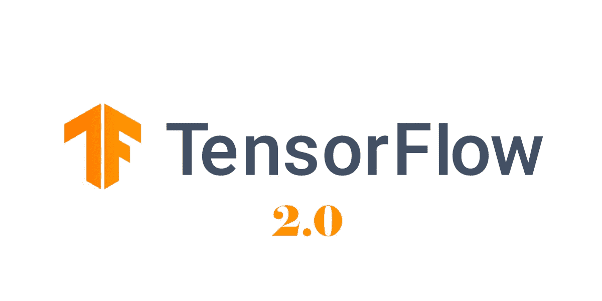

自从 1 版升级到 2 版后，我决定在 TensorFlow 上大量写作。本文使用 TensorFlow 库的第二版，通过 TensorFlow 进行深度学习。

> ***环境设置***

```
***Runtime:*** *Python 3.7.4 amd64
Tensorflow == 2.0.0*
```

> ***选择你的空闲***

运行 Tensorflow 推荐使用 **Jupyter notebook** 、 **Zeppelin notebook** 、 **Colab notebook** 等笔记本或任何合适的笔记本。

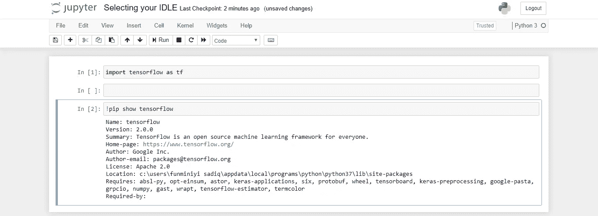

Jupyter 笔记本

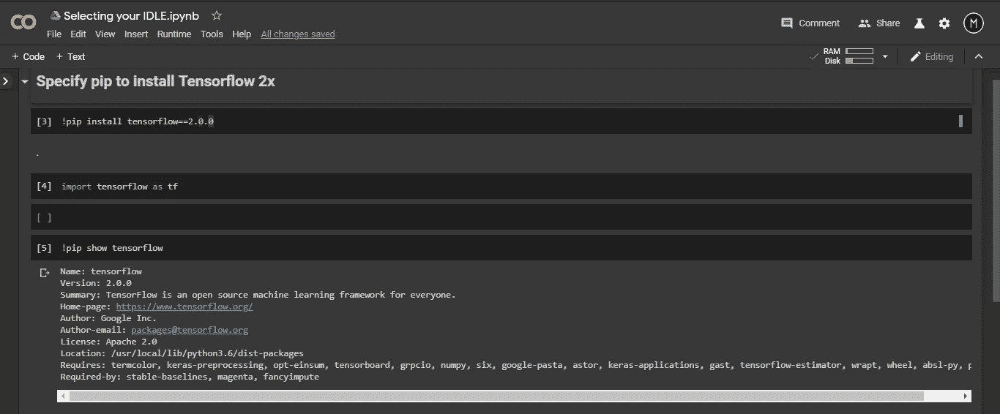

Colab 笔记本

您也可以决定从您的 **Python 控制台**或 **Ipython shell** 运行 Tensorflow。也许你可以决定从 **PyCharm** 或者其他你认为合适的闲置设备上运行它，前提是你已经正确安装了所有的东西。

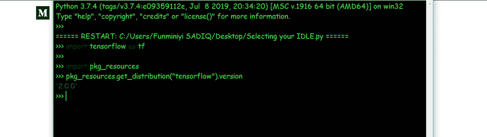

Python 控制台

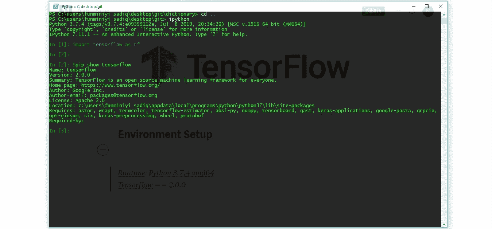

Ipython Shell

# ***01。TensorFlow 入门***

[](https://github.com/Adminixtrator/Deep_Learning) [## 管理员/深度学习

### ❍这些笔记本将基于你已经看过之前的笔记本的假设，❍指南将基于…

github.com](https://github.com/Adminixtrator/Deep_Learning) 

建议您遵循上面的资源库，因为所有代码示例都可以在那里找到。

ensorFlow 将计算定义为图形，因此，它与将一系列操作定义为图形是一样的，图形被启动到会话中，然后会话将图形中的操作翻译并传递到您想要在其上执行它们的设备，可以是 **CPU** 或 **GPU** 。

要创建一个图，调用 TensorFlow 的`graph()` 属性。
***例子*** *:*


创建图表

现在让我们在我们的图形中运行一个简单的操作，并用`session()` 属性执行它。要知道 TensorFlow 1x(版本 1)中使用的约定在 TensorFlow 2x 中不起作用，所以最好将 TensorFlow 2x 声明为`tf.compat.v1` ，以便能够使用 TensorFlow 1x 中的属性。

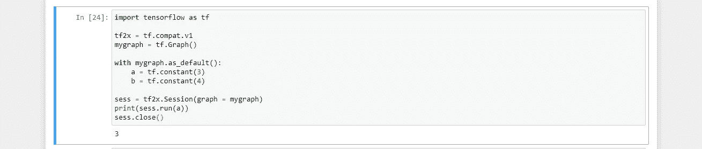

会话被关闭以释放资源

*参考上面的知识库，更深入地理解介绍性概念。*

> **1.1。张量**

为了便于理解，我首先将*张量*分为三种，即:
**0-张量**
**1-张量**
**2-张量**

将**0-张量**视为标量，**1-张量**视为向量，**2-张量**视为矩阵。标量被称为零张量，因为它们被假定为*单个数字，*因此我们不需要任何东西来确定它们，因为它们很简单。另一方面，vectors 被假定为一个列表，其中需要一个索引来选择成员，因此得名 *1-tensors* 。
从矩阵中选择一个成员，需要两个索引元素——*行*和*列*因此得名*2-张量。*

> **什么是张量？**

上面的插图给出了一个三维张量的视觉效果，它是由多个形状(N，N，N)组成的矩形棱柱。
简单一句话，张量就是 ***多维数组。***

# ***02。张量流*** 中的基本计算

张量流概念在直接实验后最容易理解。当我们用张量流做实验时，我们使用`InteractiveSession()` *。*

为了启动`InteractiveSession()` *，*我们使用`tf.InteractiveSession()`——它在 **2x** 中不起作用，因此，我们使用 `tf.compat.v1.InteractiveSession(*)*`。

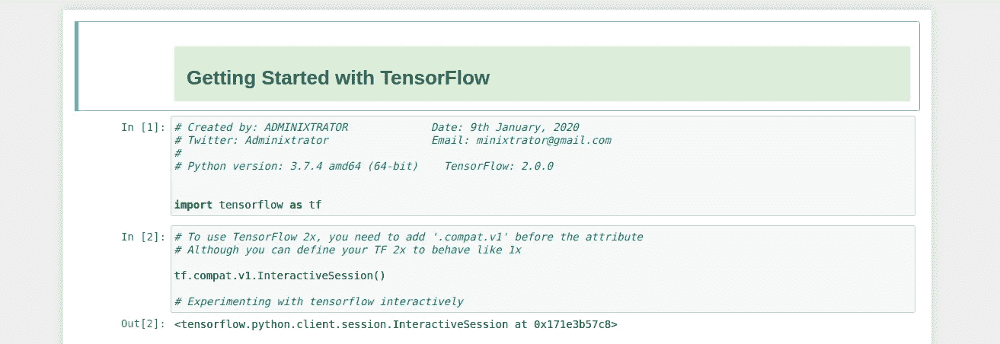

这里它被声明为 Tf2x

> **2.1。张量运算和缩放**

TensorFlow 使用 python 的运算符重载，通过标准 python 运算符使基本张量运算变得简单明了。
张量可以直接添加，也可以使用`tf.add()`属性添加。

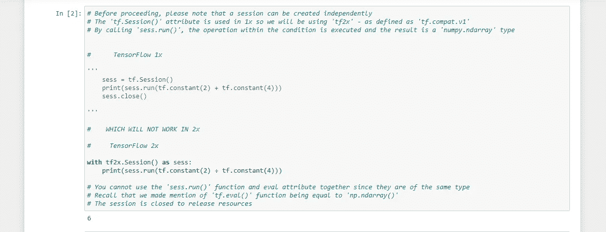

添加张量


在交互式会话中添加张量


tf.add()

张量也可以直接减去或者使用`tf.subtract()` 属性减去。

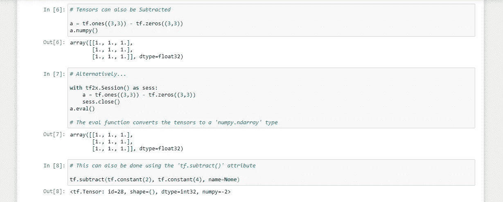

减去张量

同样，张量也可以直接相乘或者使用`tf.multiply()` 属性相乘。

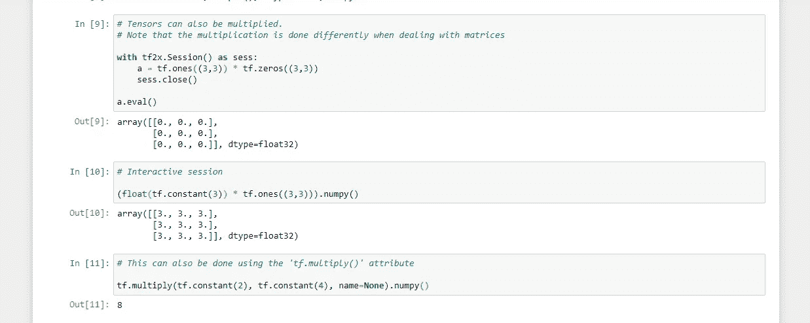

张量乘法

张量也可以直接分割，或者使用`tf.divide()` 属性分割。`tensor.div()` 属性使用 Python2 运算符约定。

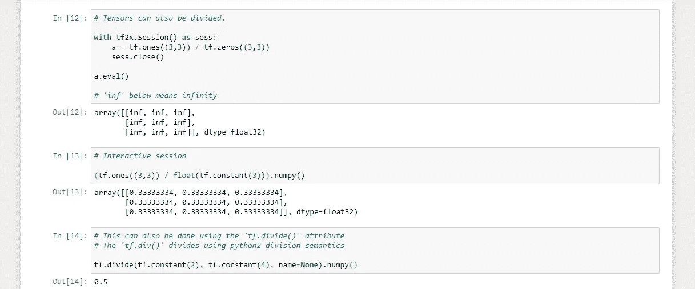

张量除法

> 结束注释

与我们刚刚看到的相比，TensorFlow 库有更多的功能，从计算机视觉到人工智能。下一篇文章将讨论使用 TensorFlow 的**矩阵运算。**
本文针对 TensorFlow 进行深度学习。感谢您的时间，下一篇文章再见。

[](/@minixtrator/matrix-operations-using-tensorflow-61a6666ded8f) [## 使用张量流的矩阵运算

### 在前一篇文章《TensorFlow 入门》的基础上更进一步，将提供一个额外的指南…

medium.com](/@minixtrator/matrix-operations-using-tensorflow-61a6666ded8f)