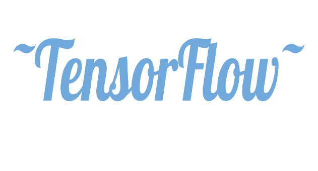
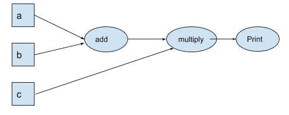
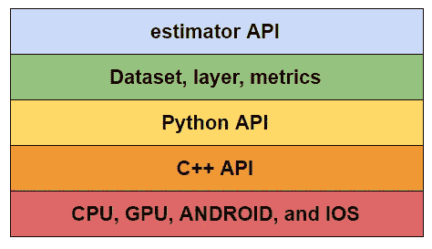

# TensorFlow 入门

> 原文：<https://medium.com/analytics-vidhya/getting-started-with-tensorflow-9b06d5382004?source=collection_archive---------31----------------------->

张量流对某些人来说可能听起来有些吓人。在我开始学习 TensorFlow 之前，我是在同一群人里，在同样的误解下。我以为会很难进入。我还没有资格了解它。或者即使我知道，也太复杂而无法理解。

但在过去的两个月里，我一直在不断学习，我觉得我已经准备好应对一些新的东西了。我已经完成了两个谷歌云课程，并准备参加 TensorFlow。

*注意:本文不是对 TensorFlow 的逐步指导，而是对 TensorFlow 及其组件的简单、全面的解释。*

在我们开始之前，我想提一下张量流需要的一些先决条件。

1.  熟悉编程，最好是 Python。
2.  具备机器学习的基础知识——最大似然算法、模型构建、交叉评估等等。
3.  调试技巧。

如果您熟悉以上内容，我们可以开始使用 TensorFlow。

## **那么张量流到底是什么？**

TensorFlow 是一个开源软件库，用于数值计算以及实现机器学习算法。它附带了许多样板代码来启动您的机器学习模型，从而让您避免从头创建代码的麻烦。

## 为什么是 TensorFlow？

1.  分布式计算—也就是说，它将工作负载或计算分布在不同的平台和不同的设备上。分布式计算是它如此受欢迎的原因。
2.  在云上执行计算并在您喜欢的设备上的任何地方使用计算的能力——便携性为灵活性铺平了道路。你可以在线训练你的模型，然后在装有 TensorFlow 的 Android 手机上使用这个模型。就这么简单。为了更好地理解，可以将这个功能与 Java JVM 进行比较。
3.  我提到过它是开源的吗？
4.  像密集神经网络这样的复杂机器学习算法可以快速执行。
5.  TensorFlow 提供 TensorBoard，这是一个用于查看模型指标、培训与评估图表等的仪表板。

## 张量流的分量

TensorFlow 中的所有计算都基于有向无环图。这些图由节点和边组成，这些边称为张量。张量不过是 n 维数据。它可以是标量数据、一维数据、二维数据等等。节点是要对数据执行的操作。DAG 是 TensorFlow 的重要组成部分——每当我们编写一些代码、初始化数据(张量)并执行计算时，就会创建一个图。此图还包含一个新的张量节点，它是对之前的张量执行操作的结果。

张量流中的有向无环图

## 懒惰评估模式 vs 热切评估模式

惰性求值模式是 TensorFlow 中计算和建模的首选模式。在惰性求值中，首先创建一个有向图，然后在一个会话中求值。没错——即使我们写了一个简单的代码——加上两个张量，也不会产生任何值。

注意:你可以开始在 jupyter 笔记本上写代码。

上面代码中的 c 只是一个附加在 DAG 上的张量节点。现在，我们在一个会话中运行 DAG 以从张量中获取值。

*eval()* 和 *run()* 函数可以用来执行 DAG。惰性评估模式的一个好处是，我们可以将 DAG 移植到任何平台，然后在 TensorFlow 中执行它，而不考虑平台和使用的编程语言。

急切评估模式通常是开发环境的首选。它立即执行 DAG 并产生结果。

## TensorFlow APIs

TensorFlow 有四层 API，允许您进行不同类型的计算。它们如下:

TensorFlow APIs

简而言之，我们只需要知道估计器 API。正如你所看到的，我们有几个层次的抽象，但是我们将只简要讨论 Python API 和它上面的 API 层，而详细讨论 estimator。

Python API 用于计算。如果你愿意的话，你可以用它来编写你自己的代码，并使用这个 API。在 Python API 之上，我们有另一个抽象层，它允许开发者定制他们的模型。例如， *tf.layer* 可以用来定制密集神经网络。 *tf.dataset* 可用于从多个来源输入大型数据集。

## 估计器 API

estimator API 允许您训练机器学习模型，根据交叉验证数据评估这些模型，并预测新数据。Estimator API 附带了许多样板代码，允许您使用配置和编译复杂的机器学习算法。我们可以通过几个简单的步骤开始构建和训练机器学习模型:

输入功能—第一步是收集数据并将其导入我们的笔记本。将它存储在张量中。这可以通过创建自定义输入函数来实现。这些方法的主要功能是分离特征字典和标签数据。

[*更详细的教程可以在 TensorFlow 网站上找到*](https://www.tensorflow.org/guide/estimator)

要素列-数据集有一组列，用于训练我们选择的模型。这些特征列可以是任何类型——数字、浮点、日期/时间、分类等等。TensorFlow 允许识别这些色谱柱及其类型，并在需要时提供转换。例如，分类数据在训练之前被一次性编码。

估计器或算法初始化——估计器 API 允许过多的预估计器可供选择。只需一行代码，您就可以开始了。

training-estimator . train()函数接受步骤 1 中的输入函数和其他参数(如步骤、检查点路径、挂钩)来训练数据集。

该模型现在已经训练完毕，可以进行验证了。经过交叉验证和评估后，该模型可用于预测测试集数据。

## 张量板

因此，您已经训练了您的模型，并对交叉验证数据执行了该模型。现在怎么办？你如何检查模型是否有效？有没有办法查看性能指标和评估图？

TensorFlow 通过提供仅用于评估目的的广泛仪表板，使生活变得更加轻松。TensorBoard 可以在本地或云中运行，它提供了对培训与验证图、指标性能、学习曲线等的访问。它还可以让您可视化非循环有向图。它的一个独特功能是它对音频和视频数据的处理非常出色，您可以可视化模型在数据集上的工作。

现在你知道张量流是怎么回事了。您已经尝试了 TensorFlow 提供的各种可能性。下一步将是亲自实践 estimator API，并探索不同的 API。你可以按照[这个指南](https://www.tensorflow.org/guide)开始。

感谢阅读！

参考链接:【https://www.tensorflow.org/guide/estimator 