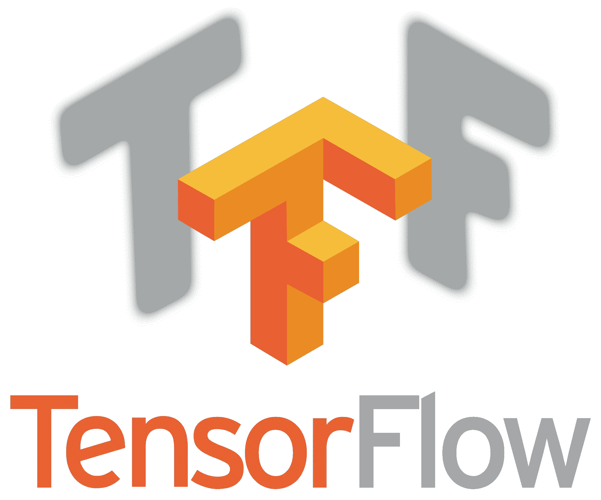
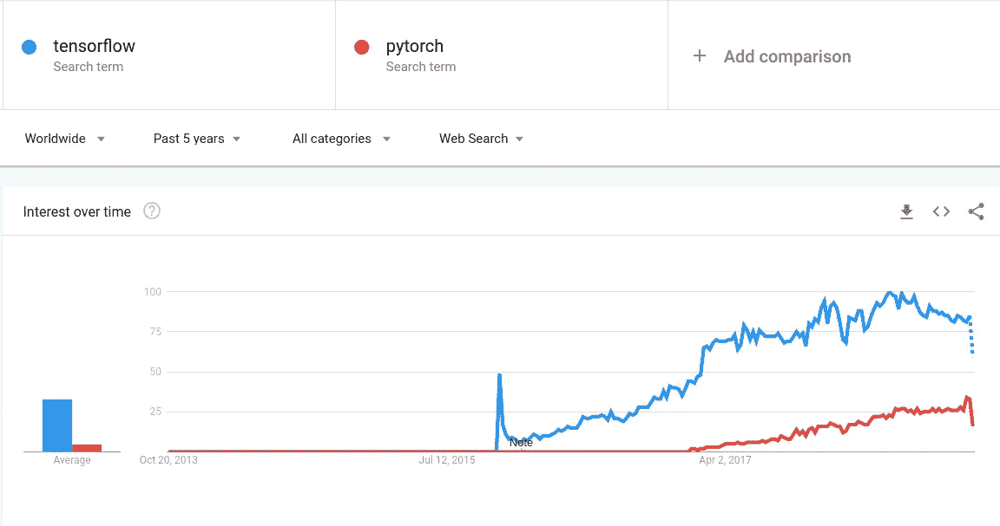

# 以最简单的方式开始使用 TensorFlow(第 2 部分)

> 原文：<https://medium.com/analytics-vidhya/getting-started-with-tensorflow-the-easy-way-part-2-30e83830bd25?source=collection_archive---------0----------------------->

*这是关于如何开始使用 TensorFlow 的系列文章的第 2 部分——“tensor flow 中的变量和占位符”。*



随着深度学习框架到处涌现，大多数数据科学家和研究人员都面临着不可避免的困境——哪个框架最适合他们的项目？

TensorFlow 可以说是最受欢迎的生产深度学习库，拥有巨大的社区支持，GitHub 知识库中有 112，180 颗星星，所有这些都发生在 3 年内。

以下是过去 5 年 TensorFlow 与 Pytorch 的 Google 趋势:



然而，由于 TensorFlow 的学习曲线很陡，数据科学社区对它的早期采用率往往很低。这一系列文章的目的是让你更容易学习和使用 TensorFlow。

在本文(系列文章的第 2 部分)*，*中，我们将涵盖变量和占位符的重要概念，它们是模型构建的基础。到本文结束时，您将能够使用变量和占位符来声明和运行 TensorFlow 会话。

在我们真正开始讨论这些术语之前，让我们快速回顾一下我们在上一篇文章中所涉及的内容:

1.  TensorFlow 在计算图形上工作，计算图形是一组节点
2.  这些节点共同构成了图形的操作流程
3.  每个节点都是具有一些输入的操作，在执行后提供一个输出

我鼓励您参考 [*第 1 部分:Tensorflow 安装和设置、语法和图表*](/analytics-vidhya/series-learning-tensorflow-the-easy-way-dcc5be834d74) 以获得详细的解释。

# 变量

当我们训练一个模型时，通常使用 scikit-learn，当我们调用`model.fit()`时，权重和偏差得到优化。但是在 TensorFlow 中，你需要为自己建立整个机器学习模型。

这就是**变量**发挥作用的地方。

它们用于保存在模型训练过程中优化的权重和偏差的值。但是，这个过程不同于传统的变量声明。

在 TensorFlow 中，在会话中使用变量之前，必须初始化所有变量。

让我们实现一个例子来更好地理解这一点。首先导入 TensorFlow 库，然后声明两个变量:

```
import tensorflow as tffirst_var = tf.random_uniform((4,4),0,1)
second_var = tf.ones((4,4))
print(first_var)Out []: Tensor("random_uniform:0", shape=(4, 4), dtype=float32)
```

变量`first_var`仍然是一个张量对象，而不是形状`(4,4)`的统一阵列。

```
# Always initialize before running a session
init = tf.global_variables_initializer()
```

请记住，这个代码块非常重要，但在 TensorFlow 中设计网络时也很容易忘记。

```
with tf.Session() as sess:
    init.run()
    print(first_var.eval())Out []: [[0.6423092  0.5614004  0.53549814 0.5330738 ]
        [0.3521489  0.07537675 0.3189149  0.38606727]
        [0.29591668 0.30730367 0.1751138  0.741724  ]
        [0.48258722 0.33091295 0.5782666  0.7447115 ]]
```

耶！你的第一个变量刚刚被赋值。

# 占位符

顾名思义，它们是用来固定东西的。在我们的例子中，它们最初是空的，用于向模型提供训练样本。您需要在声明它们时设置数据类型。

```
integer_placeholder = tf.placeholder(tf.int32)
float_placeholder = tf.placeholder(tf.float64)
```

通常占位符的形状是`(None, no_of_features)`。如果你第一次看到它，可能会感到困惑。但是`None`实际上是有意义的，因为它是我们传递给模型的训练实例数量的维度值。我们的模型应该采用任意数量的实例进行训练，这不是一个固定的值。

另一方面,`no_of_features`是一个已知的值，因此应该相应地表示您的模型。

```
train_data = tf.placeholder(tf.float32, shape=(None,5))
```

注意，train_data 的占位符形状也应该与`test_data`相同。

```
test_data = tf.placeholder(tf.float32, shape=(None,5))
```

## 选择什么数据类型？

决定数据类型至关重要。它会影响训练时间和模型的准确性。通常，`float32`对于性能和准确性来说都是一种安全的数据类型。当准确度和精确度至关重要时，我更喜欢`float64`。

# 实现图形和占位符

让我们通过整合图形和占位符的概念来实现一个虚拟网络。我们将在本系列的下一部分看到变量是如何发挥重要作用的。

```
import tensorflow as tf
import numpy as np
np.random.seed(13)
tf.set_random_seed(13)
```

如果您想要重现相同的输出，那么请将 TensorFlow 和 numpy 的随机种子都设置为`13`。

让我们制作两个 numpy 变量，作为我们的示例案例的虚拟数据和权重:

```
random_data = np.random.uniform(0,100,(5,5))
random_weights = np.random.uniform(0,100,(5,1))print(random_data)[[77.77024106 23.754122   82.42785327 96.5749198  97.26011139]
 [45.34492474 60.90424628 77.55265146 64.16133448 72.20182295]
 [ 3.50365241 29.84494709  5.85124919 85.70609426 37.28540279]
 [67.98479516 25.62799493 34.75812152  0.94127701 35.83337827]
 [94.90941817 21.78990091 31.93913664 91.7772386   3.19036664]]print(random_weights)[[ 6.5084537 ]
 [62.98289991]
 [87.38134433]
 [ 0.87157323]
 [74.6577237 ]]
```

注意`print`起作用了，因为它们是 numpy 而不是张量对象类型。在传统的机器学习情况下，权重是随机分配的，并通过优化器进行优化，同时最小化关于成本函数的误差。我们将在下一篇文章中讨论这个问题。

现在，让我们编写占位符和操作代码，以便在运行会话时保存数据。

```
a = tf.placeholder(tf.float32)
b = tf.placeholder(tf.float32)add_operation = a + b 
multiply_operation = a * b 
```

幸运的是，TensorFlow 只用+、-、*和/运算符就能处理复杂的数组运算。

```
with tf.Session() as sess:
    add_result = sess.run(add_operation,
                          feed_dict= {a:random_data,
                                      b:random_weights})
    mult_result = sess.run(multiply_operation,
                           feed_dict= {a:random_data,
                                       b:random_weights}) print(add_result)
    print('\n')    
    print(mult_result.round())[[ 84.278694   30.262575   88.93631   103.083374  103.76856  ]
 [108.32782   123.887146  140.53555   127.144226  135.18472  ]
 [ 90.885     117.226295   93.2326    173.08743   124.66675  ]
 [ 68.85637    26.499567   35.629696    1.8128502  36.704952 ]
 [169.56714    96.447624  106.59686   166.43497    77.84809  ]]

[[5.060e+02 1.550e+02 5.360e+02 6.290e+02 6.330e+02]
 [2.856e+03 3.836e+03 4.884e+03 4.041e+03 4.547e+03]
 [3.060e+02 2.608e+03 5.110e+02 7.489e+03 3.258e+03]
 [5.900e+01 2.200e+01 3.000e+01 1.000e+00 3.100e+01]
 [7.086e+03 1.627e+03 2.385e+03 6.852e+03 2.380e+02]]
```

正如您在上面看到的，加法和乘法操作已经成功执行。在这个实现中，没有使用变量，因为我们没有实现任何成本函数和优化。

在下一篇文章中，我们将介绍如何在 vanilla TensorFlow 中编写完整的线性回归示例。

如果您对 TensorFlow 中的上述代码有任何疑问，请随时联系我。确保您关注 [Analytics Vidhya](https://medium.com/analytics-vidhya) 并关注本系列的后续部分。

第 1 部分: [Tensorflow 安装和设置、语法和图形](/analytics-vidhya/series-learning-tensorflow-the-easy-way-dcc5be834d74)

*第二部分:*[*tensor flow 中的变量和占位符*](/analytics-vidhya/getting-started-with-tensorflow-the-easy-way-part-2-30e83830bd25)

*第 3 部分:在 Tensorflow 中实现回归示例(下一步)*

*第 4 部分:在 Tensorflow 中实现分类(即将推出..)*