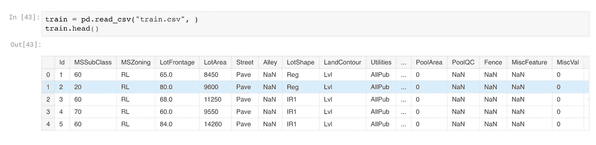
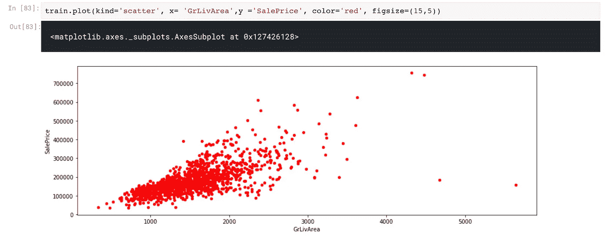
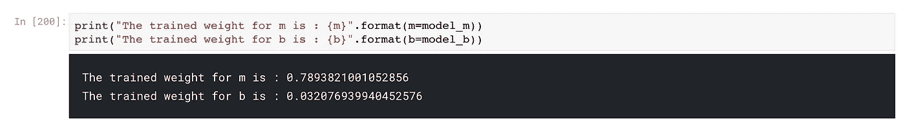
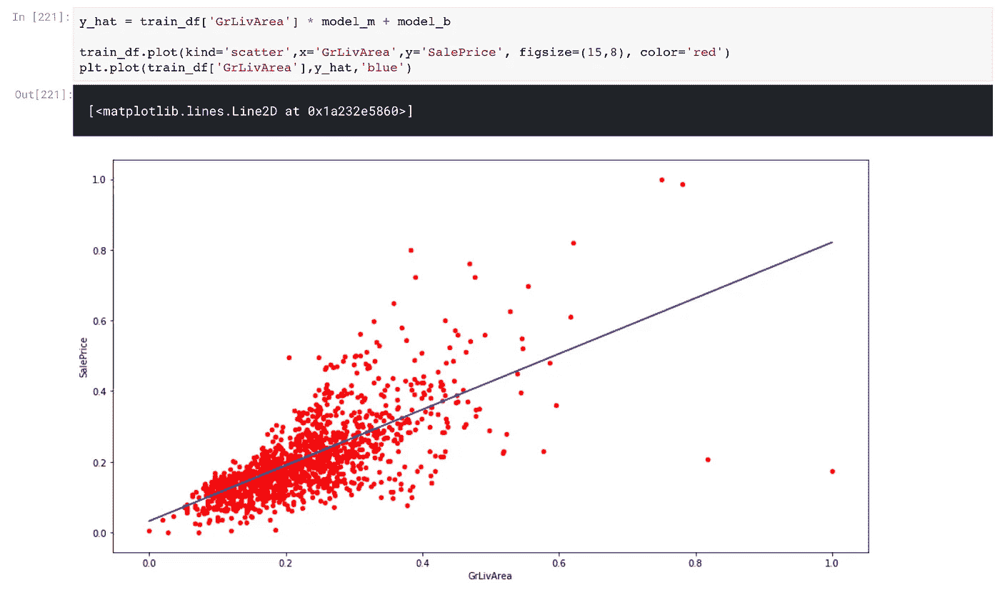

# 以最简单的方式开始使用 TensorFlow(第 3 部分)

> 原文：<https://medium.com/analytics-vidhya/getting-started-with-tensorflow-the-easy-way-part-3-9714a09af723?source=collection_archive---------0----------------------->

*这是关于如何开始使用 Tensorflow 的系列文章的第 3 部分——“在 TensorFlow 中实现回归示例”。*


线性回归通常总是我们学习的第一个算法。好像是进入数据科学的标杆！虽然其他更有效的算法已经占据了优先地位，但线性回归仍然占据着它的一席之地。

线性模型被广泛采用的主要原因之一是因为它们容易拟合并且计算量不大。

在本文(第 3 部分)中，我们将使用图形、变量和占位符来实现一个线性回归算法，我们在前两篇文章中已经讨论过了。让我们快速回顾一下:

1.  TensorFlow 在计算图形上工作，计算图形是一组节点
2.  这些节点共同构成了图形的操作流程
3.  每个节点都是具有一些输入的操作，在执行后提供一个输出
4.  变量用于存储训练模型的权重和偏差，而占位符用于存储数据样本

如果以上任何内容听起来陌生，我鼓励您阅读本系列之前的文章:

第 1 部分: [Tensorflow 安装和设置、语法和图形](/analytics-vidhya/series-learning-tensorflow-the-easy-way-dcc5be834d74)

第 2 部分:[tensor flow 中的变量和占位符](/analytics-vidhya/getting-started-with-tensorflow-the-easy-way-part-2-30e83830bd25)

对于本文的上下文，我们将采用著名的[房价:高级回归技术](https://www.kaggle.com/c/house-prices-advanced-regression-techniques)数据集。

## 问题陈述:

> 有 79 个解释变量描述了(几乎)爱荷华州埃姆斯住宅的每个方面，这个比赛挑战你预测每个家庭的最终价格。

现在，让我们从导入数据开始，深入研究编码部分:

```
import pandas as pd
import numpy as np
import matplotlib as plt
%matplotlib inline
import tensorflow as tf
print("Tensorflow version: {}".format(tf.__version__))train = pd.read_csv("train.csv")
train.head()
```



因为我们的目标是预测房子的销售价格，所以最可靠的变量是实际面积。让我们看看 *GrLivArea* 和 *SalePrice 之间的散点图。*

```
train.plot(kind='scatter', x= 'GrLivArea',y ='SalePrice', color='red', figsize=(15,5))
```



我们可以清楚地看到这两者之间的线性关系。现在，让我们写下线性模型方程；`y = mx + b`，其中`m`为斜率，`b`为截距。

在这里，我们试图使用`GrLivArea`信息来预测`y_true`。我们的模型方程应该是这样的:

`y_true = (m * GrLivArea) + b`

在我们继续构建模型之前，让我们缩放目标和特征。

```
from sklearn.preprocessing import MinMaxScalerscaler = MinMaxScaler()train_df['GrLivArea'] = scaler.fit_transform(train_df['GrLivArea'].reshape(-1, 1))
train_df['SalePrice'] = scaler.fit_transform(train_df['SalePrice'].reshape(-1, 1))
```

终于到了在 TensorFlow 中编码模型的时候了！正如我们之前讨论的，权重`m`和偏差`b`存储在变量中。

```
# Declaring Variablesm = tf.Variable(0.0)
b = tf.Variable(0.0)# Declaring placeholders to place the training dataxph = tf.placeholder(tf.float32,[batch_size])
yph = tf.placeholder(tf.float32,[batch_size])# Linear Regression Equationy_model = m*xph + b
error = tf.reduce_sum(tf.square(yph-y_model))# Gradient Descent Optimizeroptimizer = tf.train.GradientDescentOptimizer(learning_rate=0.001)
train = optimizer.minimize(error)
```

我们已经对模型的框架进行了编码。让我们讨论一下如何实现[梯度下降](https://www.analyticsvidhya.com/blog/2017/03/introduction-to-gradient-descent-algorithm-along-its-variants/)。在 TensorFlow 中，我们有一个内置的 GradientDescentOptimizer，它可以优化我们的误差。在这种情况下，我们减少残差平方和:

```
error = tf.reduce_sum(tf.square(yph-y_model))
train = optimizer.minimize(error)
```

现在，让我们编码重要的训练部分:

```
# Important! Always initialize the variablesinit = tf.global_variables_initializer()batch_size = 300with tf.Session() as sess:
    sess.run(init)
    epochs = 1000
    for i in range(epochs):
        rand_ind = np.random.randint(len(train_df),size=batch_size)
        feed = {xph:train_df['GrLivArea'][rand_ind].values, 
                yph:train_df['SalePrice'][rand_ind].values}
        sess.run(train,feed_dict=feed)
    model_m, model_b = sess.run([m,b])
```

`batch_size`是进入一个时期的数据样本数。参数`batch_size`和`learning_rate`可以根据问题而变化。

现在让我们打印训练好的重量和偏差:

```
print("The trained weight for m is : {m}".format(m=model_m))
print("The trained weight for b is : {b}".format(b=model_b))
```



是时候看看结果了！让我们拟合这些值，看看预测的`y_hat`是什么样子。

```
y_hat = train_df['GrLivArea'] * model_m + model_btrain_df.plot(kind='scatter',x='GrLivArea',y='SalePrice')
plt.plot(train_df['GrLivArea'],y_hat,'r')
```



耶！我们使用一个特征的模型在预测`SalePrice`和`GrLivArea`之间的线性关系方面做得很好。让我们通过检查 RMSE 值来确认这一点。

```
from sklearn.metrics import mean_squared_errorrmse = mean_squared_error(train_df['SalePrice'], y_hat) ** 0.5print("Root Mean Sqaured Error:",rmse )
```

我得到的 RMSE 值是:

```
Out[]: Root Mean Squared Error: 0.07797508645667454
```

请注意，你的误差可能与我的不同，但它不应该是一个白天和夜晚的差异。

本文到此为止！恭喜你用 TensorFlow 构建了你的第一个模型！

在下一篇文章中，我们将介绍如何用 vanilla TensorFlow 编写一个完整的分类模型。如果您对实现上述代码有任何疑问，请随时联系我。和往常一样，请确保您关注 [Analytics Vidhya](https://medium.com/analytics-vidhya) 并关注本系列的后续部分。

第 1 部分: [Tensorflow 安装和设置、语法和图形](/analytics-vidhya/series-learning-tensorflow-the-easy-way-dcc5be834d74)

第 2 部分:[tensor flow 中的变量和占位符](/analytics-vidhya/getting-started-with-tensorflow-the-easy-way-part-2-30e83830bd25)

第 3 部分:[在 Tensorflow 中实现回归示例](/@shaz13/getting-started-with-tensorflow-the-easy-way-part-3-9714a09af723)

*第 4 部分:在 Tensorflow 中实现分类(下一步)*