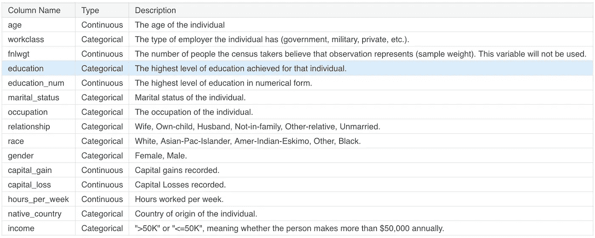
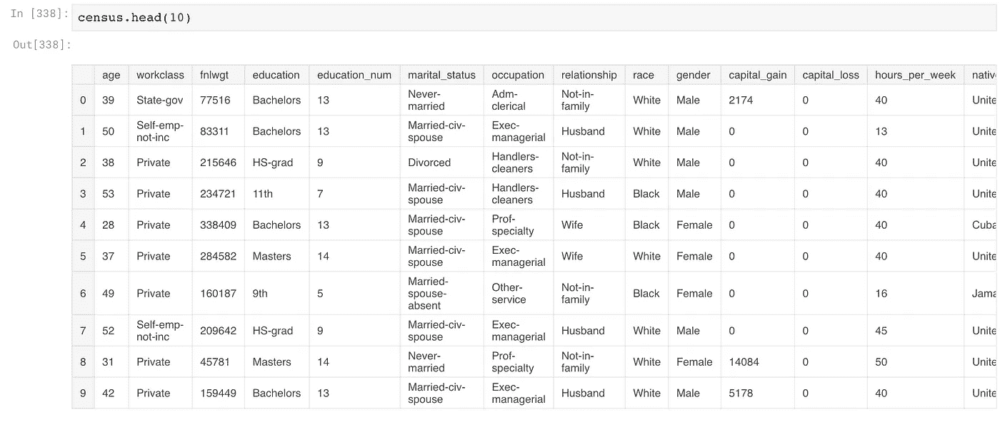
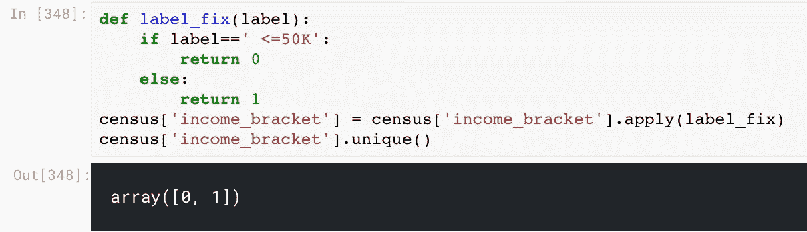
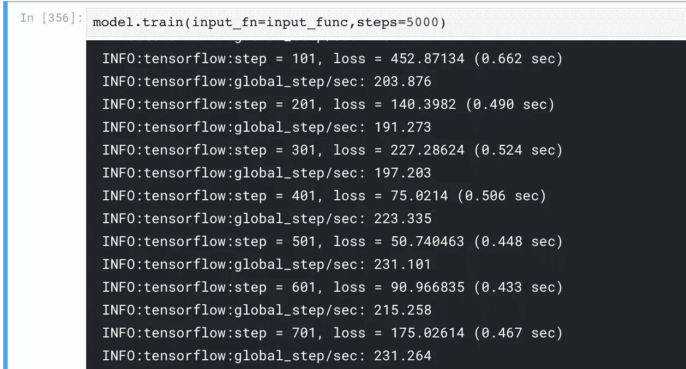
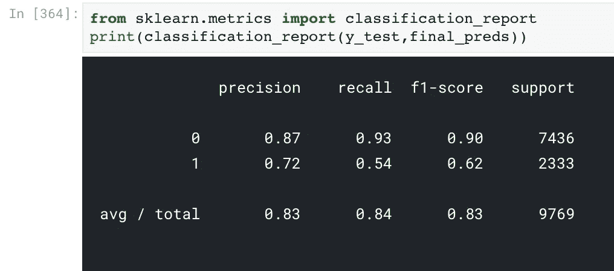
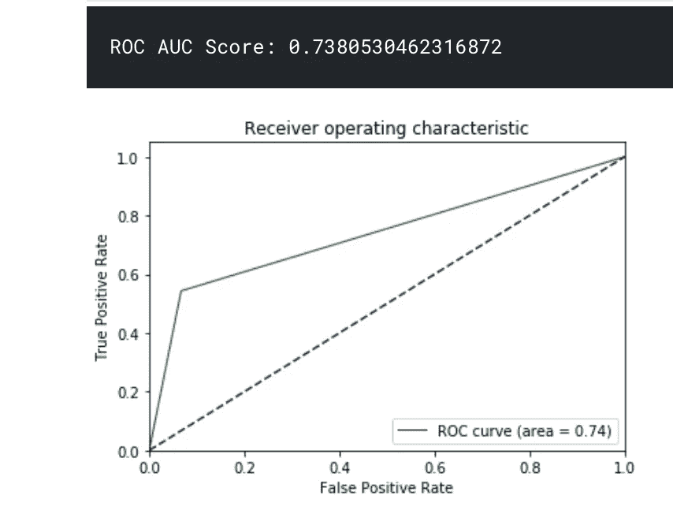

# 以最简单的方式开始使用 TensorFlow(第 4 部分)

> 原文：<https://medium.com/analytics-vidhya/getting-started-with-tensorflow-the-easy-way-part-4-b468d99b06?source=collection_archive---------0----------------------->

*这是关于如何开始使用 Tensorflow 的系列文章的第 4 部分——“在 TensorFlow 中实现分类示例”。*


来源:[https://towards data science . com/machine-learning-classifiers-a 5c C4 E1 b 0623](https://towardsdatascience.com/machine-learning-classifiers-a5cc4e1b0623)

用机器学习和深度学习技术来解决分类挑战是非常令人兴奋的。分类算法有各种业务用例，从流失预测到调节垃圾邮件/火腿的文本评论。

在这一部分中，我们将编写一个 Tensorflow 线性分类示例，分析我们的预测并验证我们的模型在未知数据上的表现。所有常规的张量流函数在这一部分都将被跳过，因为我们已经在之前的文章中讨论过了。如果您觉得缺少 tensorflow 中的概念和变量，请随意查看本系列的前几部分。

第 1 部分: [Tensorflow 安装和设置、语法和图形](/analytics-vidhya/series-learning-tensorflow-the-easy-way-dcc5be834d74)

第 2 部分:[tensor flow 中的变量和占位符](/analytics-vidhya/getting-started-with-tensorflow-the-easy-way-part-2-30e83830bd25)

第 3 部分:[在 Tensorflow 中实现回归示例](/@shaz13/getting-started-with-tensorflow-the-easy-way-part-3-9714a09af723)

## **问题陈述**

*给出个人的各种特征，预测其属于哪个收入阶层(> 50k 或< =50k)。数据集可以从* [*这里*](https://archive.ics.uci.edu/ml/datasets/census+income) 下载

下面是数据列的概述



让我们开始使用 pandas 加载数据集

```
import pandas as pd
import tensorflow as tf
```

来自 UCI 的数据集通常没有标准的 csv 格式。因此，让我们根据数据页面上提供的信息来重命名这些列。

```
census = pd.read_csv("adult.csv", header=None)
census.columns = ['age', 'workclass','fnlwgt', 'education', 'education_num', 'marital_status',
       'occupation', 'relationship', 'race', 'gender', 'capital_gain',
       'capital_loss', 'hours_per_week', 'native_country', 'income_bracket']
```

检查标题，看看我们的表格数据框架。



在这种情况下，我们的目标变量是一个字符串，即> 50K，<=50K. Unfortunately, TensorFlow won’t be able to understand strings as labels, we need to use pandas .apply() method to apply a custom function that converts them to 0s and 1s.

```
def label_fix(label):
    if label==' <=50K':
        return 0
    else:
        return 1
census['income_bracket'] = census['income_bracket'].apply(label_fix)
census['income_bracket'].unique()
```



The output should be either 0 or 1\. Now, we are set to code out the tensorflow pipeline followed by splitting our data into train and test sets.

```
from sklearn.model_selection import train_test_splitx_data = census.drop('income_bracket',axis=1)
y_labels = census['income_bracket']X_train, X_test, y_train, y_test = train_test_split(x_data,y_labels,test_size=0.3,random_state=101)
```

If you have followed through the previous parts you must have noticed that we didn’t use any sort of strings as features before. How do you think we can pass categorical features into a tensorflow model? There are actually two methods

1.  Vocabulary List
2.  Hash Bucket

# **词汇表**

在词汇表方法中，我们必须传递列名和该列的所有惟一标签。这对于用 2–4 个唯一值对列进行编码是可行的。

# 哈希桶

在这种方法中，计算所有唯一值的散列并用标签替换。当您有高基数的列，无法传递所有唯一值的列表时，这很方便。

对于性别让我们，使用词汇列表法

```
gender = tf.feature_column.categorical_column_with_vocabulary_list("gender", ["Female", "Male"])
```

对于基数较高的列，使用哈希桶；

```
occupation = tf.feature_column.categorical_column_with_hash_bucket("occupation", hash_bucket_size=1000)
marital_status = tf.feature_column.categorical_column_with_hash_bucket("marital_status", hash_bucket_size=1000)
relationship = tf.feature_column.categorical_column_with_hash_bucket("relationship", hash_bucket_size=1000)
education = tf.feature_column.categorical_column_with_hash_bucket("education", hash_bucket_size=1000)
workclass = tf.feature_column.categorical_column_with_hash_bucket("workclass", hash_bucket_size=1000)
native_country = tf.feature_column.categorical_column_with_hash_bucket("native_country", hash_bucket_size=1000)
```

连续数字列很简单，类似于上面的`tf.feature_columns.numeric_column`

```
age = tf.feature_column.numeric_column("age")
education_num = tf.feature_column.numeric_column("education_num")
capital_gain = tf.feature_column.numeric_column("capital_gain")
capital_loss = tf.feature_column.numeric_column("capital_loss")
hours_per_week = tf.feature_column.numeric_column("hours_per_week")
```

我们都准备好了。现在，使用下面一行代码将所有这些特性包装在一个列表对象中

```
feat_cols = [gender,occupation,marital_status,relationship,education,workclass,native_country, age,education_num,capital_gain,capital_loss,hours_per_week]input_func=tf.estimator.inputs.pandas_input_fn(x=X_train,y=y_train,batch_size=100,num_epochs=None,shuffle=True)
```

现在，我们已经准备好数据拆分和要使用的功能，让我们来训练模型。

```
input_func=tf.estimator.inputs.pandas_input_fn(x=X_train,y=y_train,batch_size=100,num_epochs=None,shuffle=True)model = tf.estimator.LinearClassifier(feature_columns=feat_cols)
model.train(input_fn=input_func,steps=5000)
```

在成功的训练中，你应该得到每个步骤/时期的损失和训练分数



让我们制作`pred_fn`来保存我们的测试数据集，以便用`shuffle=False`进行预测

*重要提示:在训练模型时，您可以使用* `*shuffle=True*` *。通常使用 shuffle 来训练模型是有好处的。但是，在进行预测时，要确保你有* `*shuffle=False*` *，因为随机预测顺序你永远无法验证或衡量你的结果。*

```
pred_fn = tf.estimator.inputs.pandas_input_fn(x=X_test,batch_size=len(X_test),shuffle=False)predictions = list(model.predict(input_fn=pred_fn))
final_preds = []
for pred in predictions:
    final_preds.append(pred['class_ids'][0])
```

预言已经准备好了。下一步是找出我们的张量流模型表现如何。

```
from sklearn.metrics import classification_report
print(classification_report(y_test,final_preds))
```



哇哦。对于一个普通的基线模型来说，这是一个很好的 F1 分数。现在，让我们看看我们模型的 AUC 指标。

```
from sklearn.metrics import roc_curve, auc
fpr, tpr, thresholds = roc_curve(y_test,final_preds)
roc_auc = auc(fpr, tpr)
print("ROC AUC Score: {}".format(roc_auc))
plt.figure()
plt.plot(fpr, tpr, color='green', lw=1, label='ROC curve (area = %0.2f)' % roc_auc)
plt.plot([0, 1], [0, 1], color='navy', linestyle='--')
plt.xlim([0.0, 1.0])
plt.ylim([0.0, 1.05])
plt.xlabel('False Positive Rate')
plt.ylabel('True Positive Rate')
plt.title('Receiver operating characteristic')
plt.legend(loc="lower right")
plt.show()
```



我们也获得了可接受的 AUC 分数 0.738。为了调整分数，我们可以增加纪元或者进行特征工程，比如:

1.  使用年龄栏创建类别
2.  计算平均工作时间
3.  教育的平均资本收益..等等

我把剩下的调整留给你。这个系列就说到这里。恭喜你用 vanilla TensorFlow 构建了你的第一个分类模型。干得好！

请在下面的评论中鼓掌、评论并分享你的想法。跟随 [Analytics Vidhya](https://medium.com/analytics-vidhya) 并关注即将到来的激动人心的系列文章