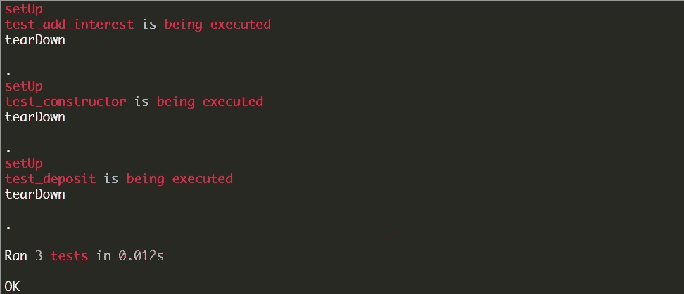

# Python 单元测试入门

> 原文：<https://medium.com/analytics-vidhya/getting-started-with-unit-testing-in-python-cac981ab6318?source=collection_archive---------16----------------------->

来源:https://www.360logica.com/blog/use-unit-testing/

**背景**

> ***“测试导致失败，失败导致理解”***
> 
> *——伯特·鲁坦*

“Smalltalk 因为缺乏测试文化而遭受损失。是 Kent Beck 在他的论文的引言部分的第一句话— [**简单的闲聊测试:使用模式**](http://swing.fit.cvut.cz/projects/stx/doc/online/english/tools/misc/testfram.htm) 。在这篇文章中，他解释了一个测试策略和一个支持该策略的框架。肯特还区分了失败和错误。当我们测试时，重要的是能够区分正在检查的错误(**失败**)，比如二加三得到六，以及没有预料到的错误(**错误**)，比如下标越界或者消息不被理解。

当我们编写测试时，我们只检查预期的结果，如果我们得到不同的答案，那就是失败。该框架使得对预期案例的测试变得简单。对于意料之外的错误，我们无能为力。如果你对他们做些什么，他们就不再是意料之外的了，是吗？。 [**单元测试模块**](https://docs.python.org/3/library/unittest.html) ，是 Python 中的标准单元测试框架，标准库自带，就是基于这个测试框架。

为什么要编写好的测试？

在讨论测试框架的一些主要概念之前，我们需要知道为什么我们需要编写测试。第一次听说，我觉得写测试是浪费时间。我觉得这些测试对我的项目来说只是一个不必要的补充。使用 **print** 语句进行调试对我来说感觉真好。我一直保持这种心态，直到我参与了一个大项目，使用打印语句变得非常乏味。这时我意识到了编写测试的重要性。

现在我很清楚，好的测试给了我信心，对我的程序的更新和调整不会以任何方式对我的整个程序产生任何意想不到的后果。也就是说，它使得检查在我的程序中添加一行或多行代码是否没有中断我的程序变得容易。

因此，这节省了调试的时间和麻烦。用 **print** 语句进行测试是一种不好的做法，因为这不是自动化的，并且很难维护。该框架有助于解决其中的一些问题。该框架支持测试自动化、测试的设置和关闭代码的共享、测试集合的聚合以及测试与报告框架的独立性。我们将很快编写代码来实现这一点。

**你如何开始编写测试？**

当我们开始编写自己的测试时，我们可能不知道从哪里开始。我们希望绝对完整，这样我们就可以确保该软件将工作。然而，如果这是我们的方法，我们将永远不会开始。Kent 建议最好从行为可预测的单一配置开始。这种配置被称为**夹具**。他提到，通过选择夹具，您可以说明您愿意测试什么，不愿意测试什么。

同样，当灾难性错误发生时，框架停止运行测试用例**(一个单独的测试单元)**，记录错误并运行下一个测试用例。由于每个测试用例都有自己的夹具，前一个用例中的错误不会影响下一个。因此，支持了关于测试独立性的观点。一旦你有两个测试用例在运行，你会想要一个接一个地运行它们，而不必执行两个 do it。测试框架提供了一个对象来表示“**一堆测试**”、**测试套件**。TestSuite 通过运行一组测试用例并一次报告所有结果来利用多态性。测试套件还可以包含其他测试套件。

**是时候用 Python 编码了！让我们创建将要测试的内容**

首先，为了实现这些功能，我们需要有我们想要测试的东西。因此，让我们定义一个简单的类。

上面，我们定义了一个类 **CreateAccount** ，用新客户的**名字**、**姓氏**和**初始存款**初始化。构造函数使用实例变量(**名字**和**姓氏**)来创建一个**帐户名称。**这也确保了初始存款必须至少为 **1000。**如果初始存款少于 1000 英镑，则会引发异常。最后，构造器通过从初始存款中减去 **100** 来设置账户中的余额，其中 **100** 是新账户的费用。同样，**创建账户**也有两个额外的方法——**存款**和**加利息**。

**存款**方法接受一个**金额**参数，该参数必须大于 **0。**如果金额小于或等于 0，则会引发异常。如果金额大于 **0** ，该金额被添加到**余额**中，新的**余额**被返回。 **add_interest** 方法还用获得的**利率**更新**余额**，并返回新的**余额**。

**来测试一下吧！！！**

接下来，让我们为上面的类编写测试。提醒一下，我们为预期的结果编写测试，如果我们得到不同的答案，那就是失败。因此，我们将编写检查预期结果的测试。为了创建一个**测试用例**，我们首先需要创建一个从 **unittest 继承的类。测试用例**。从**单元测试继承而来。TestCase** 让我们能够访问与上述框架相关的不同测试功能，包括访问 assert 方法。要编写一个测试，我们在类中定义一个方法，该方法需要以 **test_** 开始。我们需要命名约定来确保当我们运行它时，它确实知道哪些方法代表了测试用例。同样，**设置**和**拆卸**方法包含应该分别在每个测试用例之前和之后实现的指令。

首先，我们从 Python 标准库中导入了 **unittest** 模块，从 **createaccount** 模块中导入了 **CreateAccount** 类(注意:这些文件在同一个目录下)。接下来，我们创建了 **TestCreateAccount** 类(一个 **TestSuite** )并从 **unittest 继承了测试功能。测试用例**。然后，我们定义了**设置**和**拆卸**方法。这里， **setUp** 和 **tearDown** 方法包含一个 **print** 语句，只是为了展示这是如何工作的，当我们看到输出时就会显示出来。另外， **setUp** 方法为我们的每个测试用例创建一个新的客户端。这些方法有更多的实际应用。在这里，我只是试图展示他们做什么，我希望这是清楚的。最后，我们定义了我们的测试用例，它们都遵循从 **test_** 开始的命名惯例。

*   第一个测试案例

第一个**测试用例**检查**帐户名**是否如预期。它还检查添加到新**账户**费用的**余额**是否等于**初始 _ 存款**。最后，当我们创建一个少于 **1000 的**账户**时，**测试用例确保一个异常被引发。

*   第二个测试案例

第二个测试用例测试**存款**方法。它断言**余额**用存入的**金额**更新。然后，如果我们尝试存入任何小于或等于**零**的金额，它会断言抛出异常。可以注意到， **assertRaises** 的编写方式与 **test_constructor** 方法(使用了上下文管理器)完全不同。这里在 **test_deposit** 方法中，应该传递给 **deposit** 方法的参数没有直接放入 **deposit** 方法中。因此，我们在测试用例中展示了两种编写这种**断言**的方法。

*   第三个测试案例

最后，我们有最后一个测试用例 **test_add_interest** 方法，这意味着我们在**测试套件** ( **TestCreateAccount** )中有三个测试用例。当添加**利率**时，测试用例断言**余额**被更新。3 个测试用例包含**打印**语句。这显示了它们何时被执行。

**奖金**

**__name__** 是 Python 中的一个特殊变量，值为 **'__main__'** 。 **if __name__ == '__main__'** 条件语句通常在我们的模块中使用，因为当我们在 Python 中导入一个模块时，模块中的所有代码都会被执行，即使我们只从模块中导入了一个函数。所以，这个条件语句用于确保当我们导入模块时，一些代码(我们不想执行的)不会真正被执行。因此，条件块 **if __name__ == '__main__'** 中的代码只有在我们直接运行模块时才会被执行。此外，这有助于我们使用以下代码运行测试模块:

**>>python 3<module _ name>**

而不是:

**>>python 3-m unittest<module _ name>**

**输出**

这是运行我们代码的输出:

首先，我们观察到这三个测试用例已经用“**在 0.012 秒**内运行了 3 个测试”，并且它们都成功地通过了 **OK** 。如果我们的一个测试用例失败了，这将显示**失败(失败= <失败次数> )** 。为每个测试用例执行**设置**和**拆卸**方法。因此，输出显示安装和拆卸 3 次。

**点**也表明测试用例是成功的。失败的测试用例将显示 **F** 而不是点。很明显，我们的测试已经自动化，因为我们可以随时重新运行测试，以确保我们的代码仍然正常工作。此外，我们已经证实了测试的设置和关闭代码的共享以及测试集合的聚合和测试的独立性。

我们已经走到了尽头！在我们走之前，拿着这个:

> *没有测试的代码按设计被破坏。*

感谢您的阅读！