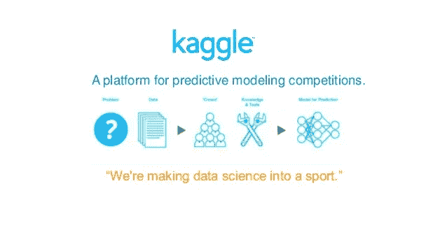
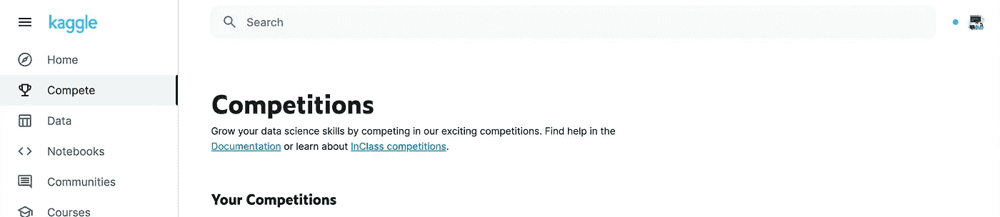
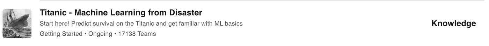
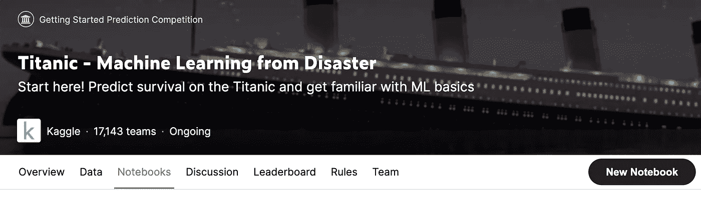
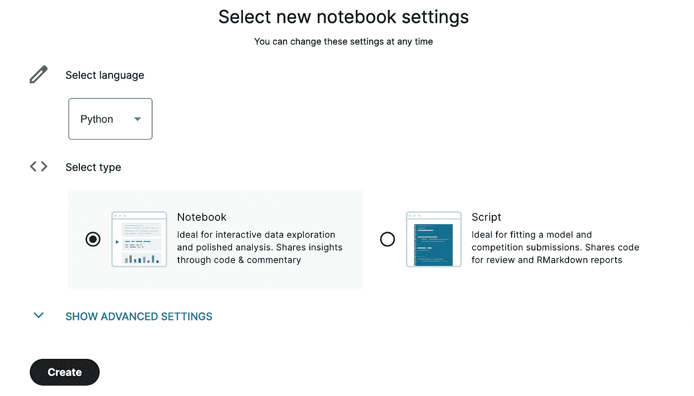
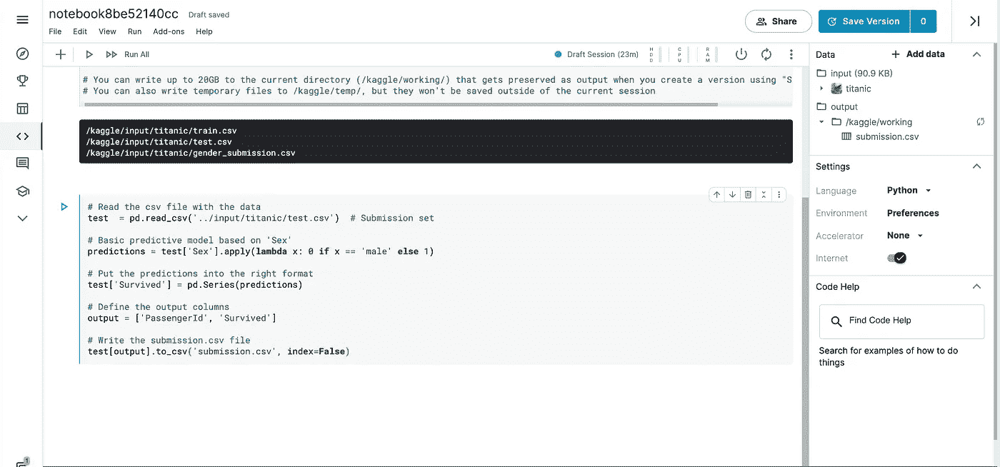
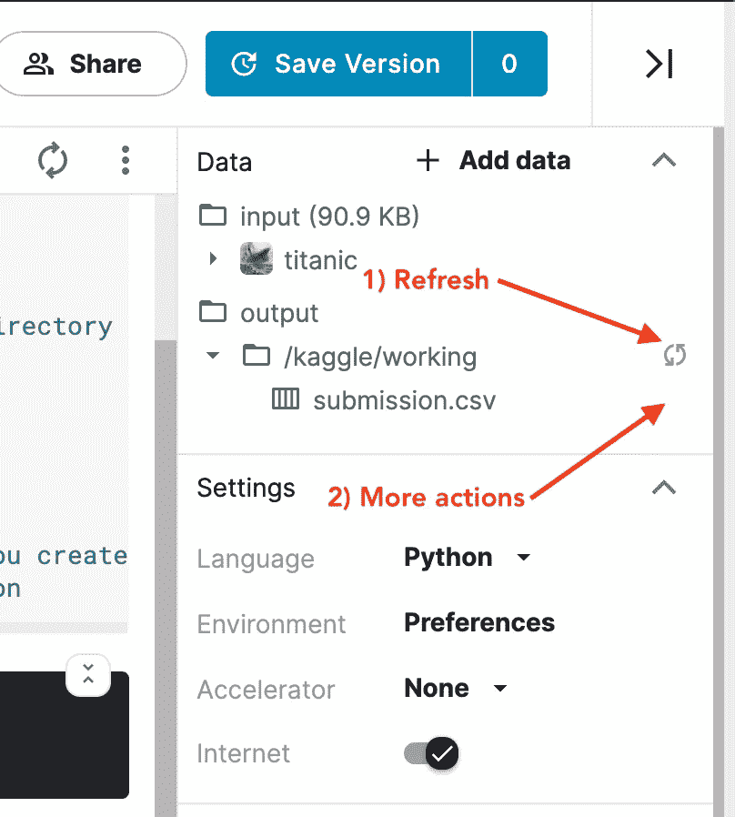
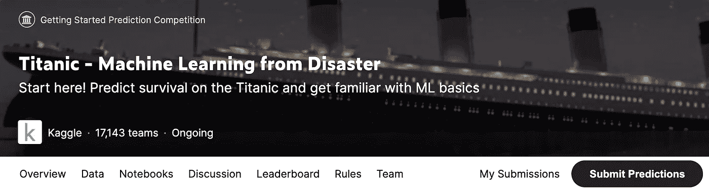
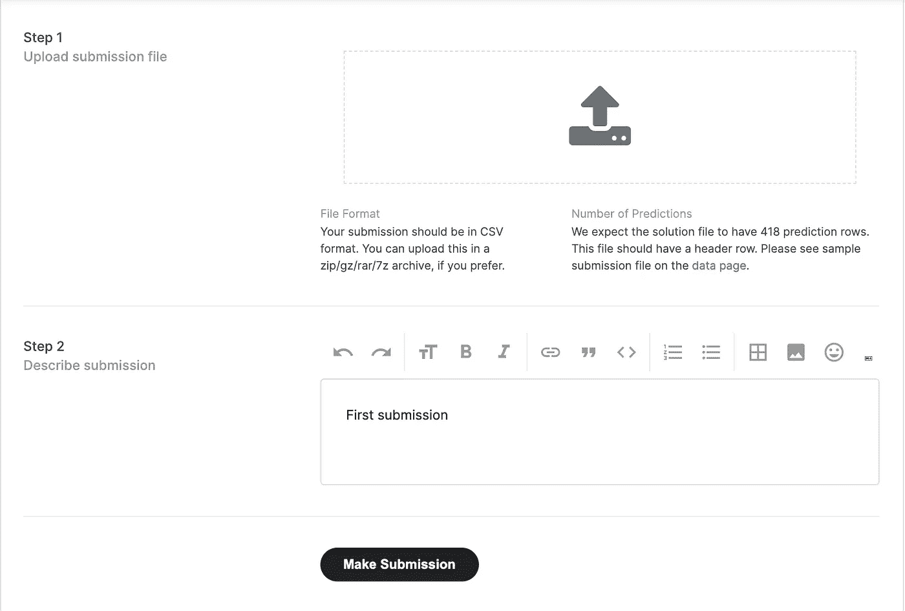
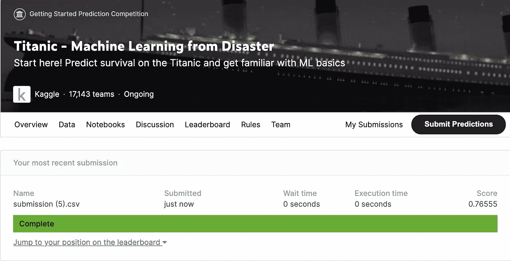

# Kaggle 入门

> 原文：<https://medium.com/analytics-vidhya/getting-started-withkaggle-cde3f59814e6?source=collection_archive---------21----------------------->

# 目录

*   什么是 **Kaggle** ？
*   为什么**会摇摇晃晃**？
*   你在 **Kaggle** 上的第一个 ML 模型

## 什么是 Kaggle？

> **Kaggle** 是世界上最大的数据科学社区，拥有强大的工具和资源来帮助您实现数据科学目标。—www.kaggle.com

基本上 Kaggle 是一个致力于数据科学的平台，在这里你可以学习、分享和发现很多资源。该平台提供:

*   **数据**:用户可以在平台上共享和使用数据，这些数据集有时会提供描述和一些其他细节，以便于理解。
*   **笔记本**:如果你不熟悉这个术语，笔记本是一个可以包含有组织的文本(比注释更好)和运行代码行的文档。用户可以共享和访问其他用户提供的笔记本，这就是知识共享！
*   **竞赛**:平台允许其用户参与数据科学竞赛，并以金钱作为奖品(大多最低几万美元)。
*   **课程** & **社区**:平台允许用户通过使用**课程**资源学习数据科学或机器学习之类的东西，用户也可以在平台上与**社区**分享/交流。

## 为什么是 Kaggle？

Kaggle 是免费的，它的大部分资源是由该领域的专业人士或学生用户提供的。所以你不必害怕学习错误的东西，因为社区足够大，可以互相帮助。

## 你在 Kaggle 上的第一个 ML 模型

在开始之前，您需要一些工具:

*   大脑
*   一台电脑

开个玩笑！所以让我们开始吧。

1.  进入**比赛**页面

完整页面

2.点击本次比赛:**泰坦尼克号——机器从灾难中学习**

**泰坦尼克号——机器从灾难中学习**知识竞赛

3.点击**笔记本** / **新建笔记本**

Kaggle — **笔记本**

Kaggle — **新笔记本**

只保留那些设置。

4.写一些代码

Kaggle — **笔记本** |基于“性别”栏的预测

5.按下**运行所有**

6.**刷新**目录，按下**更多动作**按钮和**下载**

Kaggle — **刷新|更多操作/下载**

然后 submission.csv 文件将被下载到您的计算机上。

7.进入竞赛页面，点击**提交预测/提交**

Kaggle — **比赛页面**

卡格尔— **屈服**

在**第一步**上传你的 submission.csv 文件，并为你的提交写一个简短的描述，以防你会做很多其他的。

8.查看您的分数/排行榜

Kaggle — **分数**

在这里，我对泰坦尼克号幸存者的预测是 76.5%。现在，作为一名数据科学家，你必须修改这个模型，为更好的预测建立一个更好的模型。

希望你能学到一些东西，如果你想看我的作品，这是我的简介。