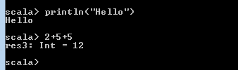

# 开始在 Scala 中编写代码第 2 部分..

> 原文：<https://medium.com/analytics-vidhya/getting-started-writing-code-in-scala-part-2-3db81e1ed37e?source=collection_archive---------31----------------------->

在我的第一篇博客中，我们已经看到了 Scala 的基础知识。所以在去之前，请阅读这一部分。为了更好地理解，你可以看看我关于 Scala 的第一部分。[https://medium . com/@ duke . lav lesh/complete-package-of-scala-from-many-book-5a 1 FDD 6 e 9 DBC](/@duke.lavlesh/complete-package-of-scala-from-many-book-5a1fdd6e9dbc)
在这篇博客中我们将看到如何开始用 Scala 编写代码。
在 Scala 中，人们喜欢的工作方式主要有两种:
*使用 IDE。
*使用命令行。

在下面给定的操作系统中，你可以使用这两种方式编写代码。
Mac
Windows
Linux

今天我们将学习如何下载 Scala，然后在 Mac、Linux 和 Windows 操作系统上安装 Scala。Scala 运行在 JVM 之上，所以您应该已经安装了 JDK 1.6 或更高版本，才能继续安装 Scala。既然你是来学习 Scala 的，我假设你知道如何在你的系统上安装 Java。

首先我们将在 window 机器上安装 Scala。所以你需要在按下 **window+R** 按钮后打开你的 cmd 提示符，下面会弹出一个窗口，点击 OK 进入黑屏。

然后，您必须在键入“**java-version”**后验证 java 安装，以检查 java 是否已安装在您的系统中，如果有，您将获得 Java 版本的详细信息。

从我们需要的 Scala 官方页面下载 Scala 二进制文件[https://www.scala-lang.org/download/](https://www.scala-lang.org/download/)在撰写本文时，Scala 2 . 13 . 3 版是 Scala 在市场上的最新版本。

要在 window 中安装，您需要下载选定的(。msi)文件如下

选择为 Windows 定制的 MSI 安装程序。一旦
下载完毕，双击生成的文件执行，然后
按照说明操作。
注意:如果你运行的是 Windows 8，你可能会看到一条消息
说“Windows SmartScreen 阻止了一个无法识别的应用程序
启动。运行此应用可能会给你的电脑带来风险。”选择“更多
信息”,然后选择“继续运行”
当你在默认的安装目录(C:\ Program Files
(x86)\ Scala 或者 C:\Program Files\scala)中查找时，应该包含:
bin doc lib api

我用的是 WINDOW 7，所以 Scala 为我安装在了下面的位置。

在 window 7 中安装 Scala 后，您必须为 Scala 的 Path 设置环境系统变量，否则您将无法在 cmd 提示符下找到 Scala。

要设置变量，您必须遵循以下步骤。

1-点击鼠标右键，进入我的电脑，选择属性。

2-进入高级系统设置，点击环境变量，设置 Scala 在 **C** 驱动器中的安装路径。点击编辑按钮，粘贴完整路径“C:\Program Files (x86)\scala\bin”并点击 Ok 从 cmd 启动您的 scala。

再次从窗口打开 cmd 提示符，检查 Scala 是否安装正确。你必须输入“scala -version”来检查 scala 版本。

或者你可以在输入‘scala’并按回车键后启动 Scala 提示符。

恭喜你！！现在你的 REPL 已经开始了。

现在你可以开始在 REPL 写 scala 代码了。

> **注:-** 它的名字来自首字母缩略词 **REPL** ，代表“读取-评估-打印循环”。…在**回复**处有一个“**回复**”。这是一个交互式编程环境。您可以用最流行的编程语言创建一个工作区，在这里，您可以在虚拟机上获得一个容器，您的代码可以在其中运行。

我们将在以后的博客中看到 Scala 在 Linux 上的安装..

[*https://medium . com/@ duke . lav lesh/installing-Scala-SBT-on-Ubuntu-part-3-FD 08 FEC 70946*](/@duke.lavlesh/installing-scala-sbt-on-ubuntu-part-3-fd08fec70946)