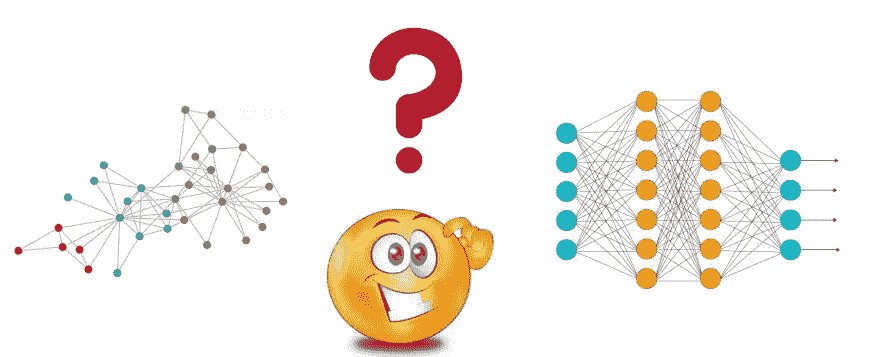

# 获得图形神经网络的直觉

> 原文：<https://medium.com/analytics-vidhya/getting-the-intuition-of-graph-neural-networks-a30a2c34280d?source=collection_archive---------0----------------------->

最近，图形神经网络(GNN)引起了我的注意。我遇到了几个机器学习/深度学习的问题，这些问题让我看到了关于 GNNs 的论文和文章。在尝试使用 Keras 实现 GNNs 时，我遇到了由 [Daniele Grattarola](https://github.com/danielegrattarola/spektral) 开发的基于 [Keras 和 Tensorflow 2](https://www.tensorflow.org/guide/keras) 的图形神经网络 Python 库 [Spektral](https://spektral.graphneural.network/) 。