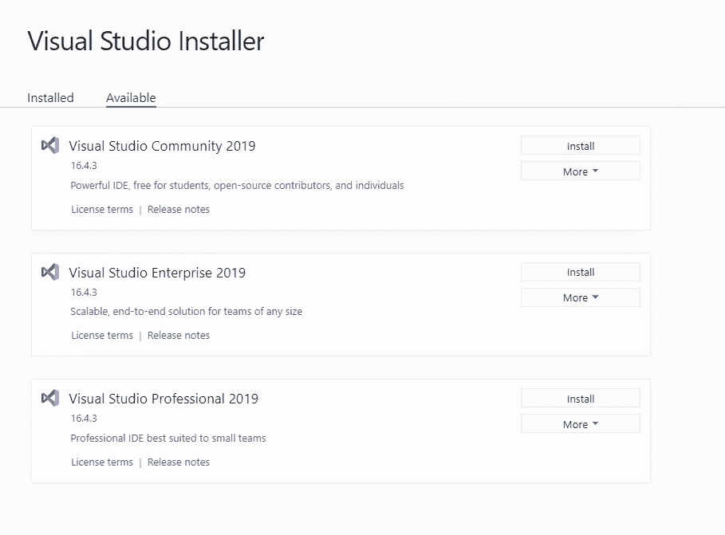
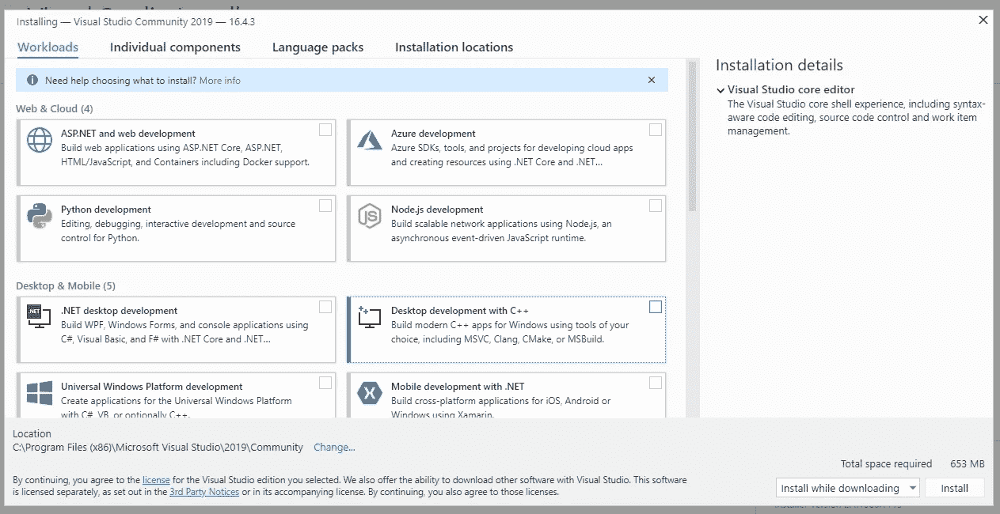

# 使用 Tensorflow 设置您的 Windows 游戏装备 ML 培训

> 原文：<https://medium.com/analytics-vidhya/getting-your-windows-gaming-rig-ml-training-ready-with-tensorflow-42f47abd3828?source=collection_archive---------13----------------------->

我已经在数据科学领域工作了两年，但从未费心在家里设置我的游戏 PC 来进行 GPU 培训。这主要是因为我在工作中使用 Linux / MacOS 环境，并不真的想在 Windows 中设置环境。随着我开始承担更多的个人项目，我意识到在我的小 CPU 上进行神经网络训练是不够的，我可能应该把我的 GTX 1080 用在我的 windows 机器上(它当然可以不只是玩 Overwatch)。文档对于 windows 的设置来说不是很好，所以这篇文章对你的帮助不亚于帮助我自己记住我是如何做到这一点的。


# 配合得很好的版本

在撰写本文时，所有这些的最新版本都不能很好地协同工作。以下是对我来说配合得很好的版本。这一点很重要，因为版本不匹配会导致错误/缺少 GPU:

*   Python 3.7
*   Visual Studio 社区 2019 v16.4
*   VS c++ 2015、2017 和 2019 年的可再发行版本
*   CUDA v10.1
*   适用于 CUDA v10.1 的 cuDNN v7.6.5
*   张量流 2.1

# 下载

如果您尚未下载和安装，请下载并安装以下内容:

*   蟒蛇 3([https://www.anaconda.com/distribution/](https://www.anaconda.com/distribution/)
*   Visual Studio 社区 2019(【https://visualstudio.microsoft.com/downloads/】T2)
*   Visual Studio C++可再发行软件([https://support . Microsoft . com/en-us/help/2977003/the-latest-supported-visual-C-downloads](https://support.microsoft.com/en-us/help/2977003/the-latest-supported-visual-c-downloads))
*   CUDA([https://developer . NVIDIA . com/CUDA-10.1-下载-存档-更新 2？target _ OS = Windows&target _ arch = x86 _ 64&target _ version = 10&target _ type = exe local](https://developer.nvidia.com/cuda-10.1-download-archive-update2?target_os=Windows&target_arch=x86_64&target_version=10&target_type=exelocal)
*   cud nn([https://developer.nvidia.com/rdp/cudnn-download](https://developer.nvidia.com/rdp/cudnn-download))

# 蟒蛇装置

Anaconda3 的安装非常简单。只需按照可视安装程序中的提示，在您的计算机上安装即可。请注意，如果您为所有用户安装，您必须养成以管理员身份运行一些与 Anaconda 相关的东西的习惯。

# Visual Studio 安装

接下来，如果您的计算机上没有 Visual Studio Community，请安装它。首先，您将在 Visual Studio 安装程序中安装 Visual Studio 社区。



单击 install 后，您将看到一个页面，提示您安装工作负载或组件。这里不需要安装任何东西。只需点击右下角的安装。



它会再次询问您是否要安装工作负载。回答左边的继续。


现在是时候安装 C++再发行版了。只需下载。与您的 CPU (64 位或 32 位，用 x86 表示)匹配的. exe 文件。当你点击可执行文件时，你会看到这个屏幕:


只需点击修复，让它做它的事情。此时此刻。系统会提示您重新启动。去做吧。

# CUDA 安装

现在是时候安装 CUDA 了。CUDA 是你发布进程给你的 GPU 来处理的方式。继续操作，并使用给定的默认设置点击完成安装。这应该相当简单。

安装完成后，你的电脑中应该会有几个新文件夹`C:\Program Files\NVIDIA Corporation`和`C:\Program Files\NVIDIA GPU Computing Toolkit`。

# cuDNN 装置

现在是时候安装 cuDNN 了。cuDNN 实际上只是一个你下载的 zip 文件。我把我的放在我创建的名为 C:\tools 的新文件夹中。然后，我将 zip 文件解压到这个文件夹中。


你需要从 cuDNN 复制几个文件到 CUDA。以下是详细情况:

```
C:\tools\cuda\bin\cudnn64_7.dll → C:\Program Files\NVIDIA GPU Computing Toolkit\CUDA\v10.1\binC:\tools\cuda\include\cudnn.h → C:\Program Files\NVIDIA GPU Computing Toolkit\CUDA\v10.1\includeC:\tools\cuda\lib\x64\cudnn.lib → C:\Program Files\NVIDIA GPU Computing Toolkit\CUDA\v10.1\extras\CUPTI\lib64
```

# 环境变量

最后，确保您已经为新安装的 CUDA 软件更新了环境变量和路径。要查看您的路径，打开开始菜单并搜索`env`。您将看到这个控制面板链接出现:


这将打开系统属性。在右下角的“高级”标签里，你会看到一个环境变量的按钮。点击:


确保在系统变量下设置了`CUDA_PATH`和`CUDA_PATH_V10_1`,指向 CUDA 安装位置内的`v10.1`文件夹。对我来说就是这里:


接下来，让我们确保我们的`Path`变量包含所有需要的 lib 和 bin 目录。点击系统变量窗口下的`Path`并点击编辑进行检查。它会弹出一个窗口，如下图所示。


如果你还没有我的路径中显示的前 5 个目录，你会想要把它们添加到你的路径中。具体而言，它们如下:

```
C:\Program Files\NVIDIA GPU Computing Toolkit\CUDA\v10.1\binC:\Program Files\NVIDIA GPU Computing Toolkit\CUDA\v10.1\libnvvpC:\tools\cuda\binC:\Program Files\NVIDIA GPU Computing Toolkit\CUDA\v10.1\includeC:\Program Files\NVIDIA GPU Computing Toolkit\CUDA\v10.1\extras\CUPTI\lib64
```

# 张量流装置

此时，您已经为基础设施做好了准备。让我们给你的蟒蛇装上 tensorflow。如果你想的话，可以随意制作一个虚拟环境。继续从开始菜单打开 Anaconda 提示符并运行

```
$ pip install tensorflow==2.1
```

这将安装 tensorflow 2.1(在撰写本文期间的最新版本)，它具有对 CPU 和 GPU 处理的原生支持。

# 测试一下

安装完成后，我们可以通过在 Anaconda 提示符下运行以下命令来检查 tensorflow 是否能看到您的 GPU。

```
$ python
$ >>>import tensorflow as tf
$ >>>tf.config.list_physical_devices()
```

如果这返回一个 GPU 设备作为您的列表的一部分，这意味着 tensorflow 知道您的 GPU 存在，并且它已准备好用于训练。以下是我的输出:


注意，返回列表的第二个元素的 device_type='GPU '

# 全部完成！

此时，您的 PC 已经为您的 GPU 设置了 tensorflow 来执行所有这些反向投影计算。不再计算你的谷歌协作时间！！

# 一些其他有用的链接

[](https://www.tensorflow.org/install/gpu) [## GPU 支持| TensorFlow

### 注意:GPU 支持适用于带有 CUDA 卡的 Ubuntu 和 Windows。TensorFlow GPU 支持需要…

www.tensorflow.org](https://www.tensorflow.org/install/gpu)  [## 安装指南 Windows :: CUDA 工具包文档

### MS-Windows 系统上 CUDA 工具包的安装说明。CUDA 是一个并行计算平台，并且…

docs.nvidia.com](https://docs.nvidia.com/cuda/cuda-installation-guide-microsoft-windows/)  [## cuDNN 安装指南::NVIDIA 深度学习 SDK 文档

### 本 cuDNN 7.6.5 安装指南提供了如何安装和检查是否正确的分步说明…

docs.nvidia.com](https://docs.nvidia.com/deeplearning/sdk/cudnn-install/index.html#install-windows)