# 发布就绪地块的 ggplot2 主题；包括黑暗主题

> 原文：<https://medium.com/analytics-vidhya/ggplot2-themes-for-publication-ready-plots-including-dark-themes-9cd65cc5a7e3?source=collection_archive---------6----------------------->

Hadley 的 ggplot2 是一个非常好的 r 中数据可视化的包。然而，该包制作的默认绘图需要一些格式，然后我们才能发送它们进行发布。这个包 [ggthemes，](https://github.com/jrnold/ggthemes)是由 [Jeffrey](https://github.com/jrnold) 为此编写的，提供了一些不错的主题。但我想试试自己，即兴发挥一下。所以，我写了一些我自己的主题(当然是在感谢 Jeffrey 的 ggthemes 内置函数的帮助下)。所有这些主题都可以在这个 [GitHub 资源库中找到。在本帖中，我将讨论我的主题背后的动机，并展示它们。您可以遵循这些简单的步骤，并在自己的项目中使用这些主题。](https://github.com/koundy/ggplot_theme_Publication)

我对 ggplot 默认美学的问题是

*   情节背景
*   标题和轴标签字体和大小
*   斧头本身
*   坐标轴刻度
*   颜色；色彩；色调
*   图例位置
*   默认调色板

所以，在这里，我试图解决他们中的每一个，并创建我自己的主题和调色板。总共有 3 个主题。第一个主题`theme_Publication`，是一个明亮的主题，重点是直接从 ggplot2 制作发布就绪的数字。另外两个主题，`theme_dark_bue`和`theme_dark_grey`，都是跟随各地黑暗主题潮流的黑暗主题:)。随着大多数设备的屏幕越来越好，颜色越来越准确，所有操作系统、应用程序和代码编辑器中都出现了深色主题。这些主题是为了在你的*黑暗*主题 ide(比如 Rstudio)中进行可视化。深色主题也非常适合演示，尤其是当你使用深色背景的幻灯片时。

所有这些主题都会产生

*   带有粗体轴和轴标签的绘图。
*   图例放在底部，为绘图区域留出额外的空间。
*   在[颜色调配器](http://colorbrewer2.org/)的帮助下设计的具有醒目和对比色的调色板，可轻松区分任意两种颜色。

## 使用`theme_Publication`的绘图示例

```
library(tidyverse)
library(gridExtra)
source('~/ggplot_theme_Publication-2.R')Scatter <- ggplot(mtcars, aes(mpg,disp,color=factor(carb))) + geom_point(size=3) + labs(title="Scatter Plot")

grid.arrange(Scatter,(Scatter +scale_colour_Publication()+ theme_Publication()),nrow=1)
```

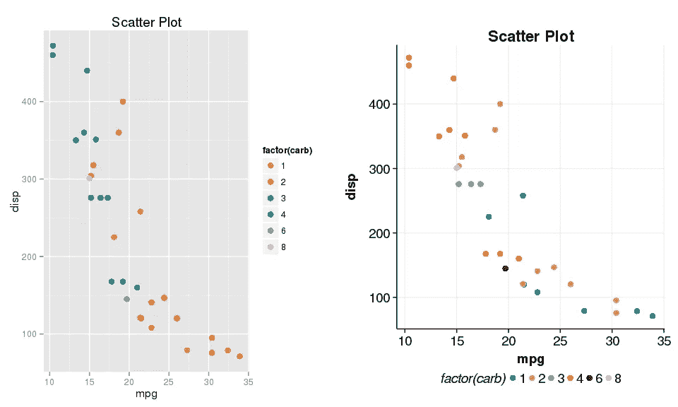

```
Bar <- ggplot(mtcars, aes(factor(carb),fill=factor(carb))) + geom_bar(alpha=0.7) + labs(title="Bar Plot")

grid.arrange(Bar,(Bar + scale_fill_Publication() +theme_Publication()),nrow=1)
```

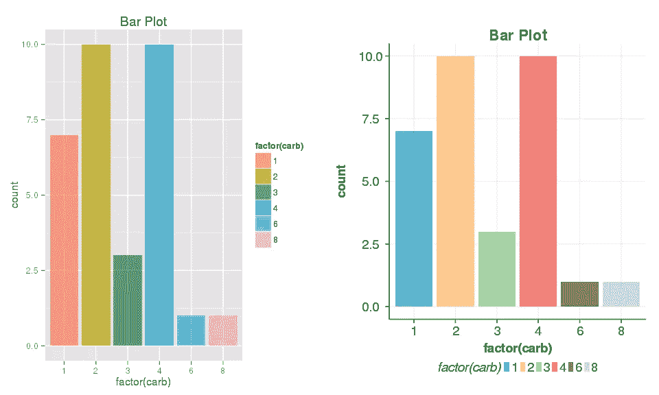

```
Bubble <- ggplot(mtcars, aes(mpg,disp,color=factor(carb),size=hp)) + geom_point(alpha=0.7) + labs(title="Bubble Plot") + scale_size_continuous(range = c(3,10))

grid.arrange(Bubble,(Bubble +scale_colour_Publication()+ theme_Publication()),nrow=1)
```

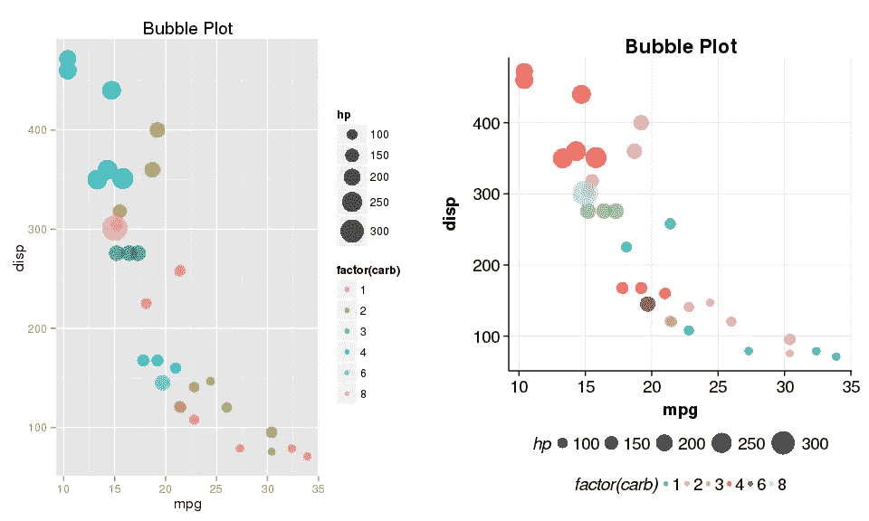

```
library(reshape2)
mtcars$Index <- 1:nrow(mtcars)
dat <- melt(mtcars,id.vars = c("Index"),measure.vars = c("drat","wt"))
Line <- ggplot(dat,aes(Index,value,colour=variable))+geom_line(size=1.3) + labs(title="Line Plot") 
grid.arrange(Line,(Line +scale_colour_Publication()+ theme_Publication()),nrow=1)
```

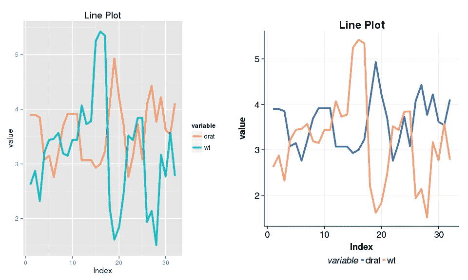

```
P <- ggplot(data = mpg,aes(cty, hwy,color=class))+geom_point(size=3) + facet_wrap(~ manufacturer,scales="free")+
      labs(title="Plot With Facets")
P
```

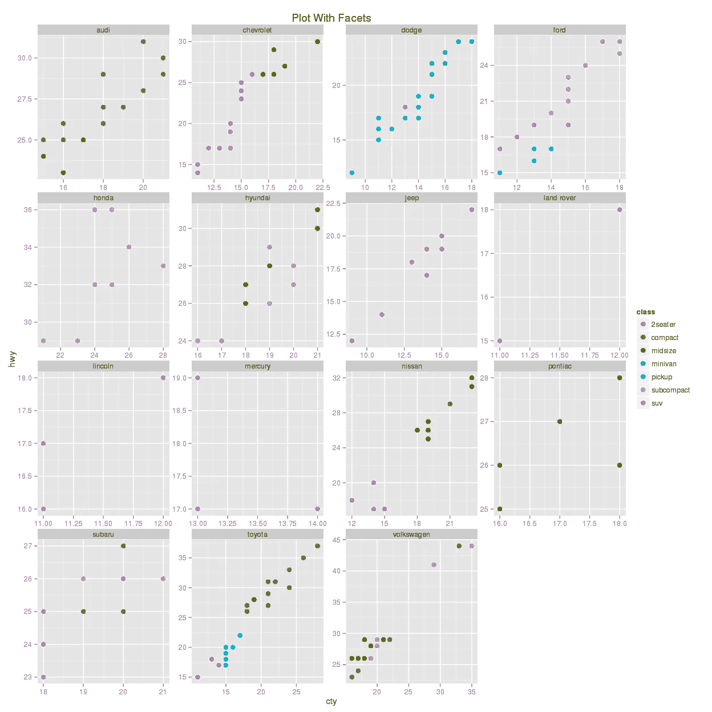

```
P +scale_colour_Publication()+ theme_Publication()
```

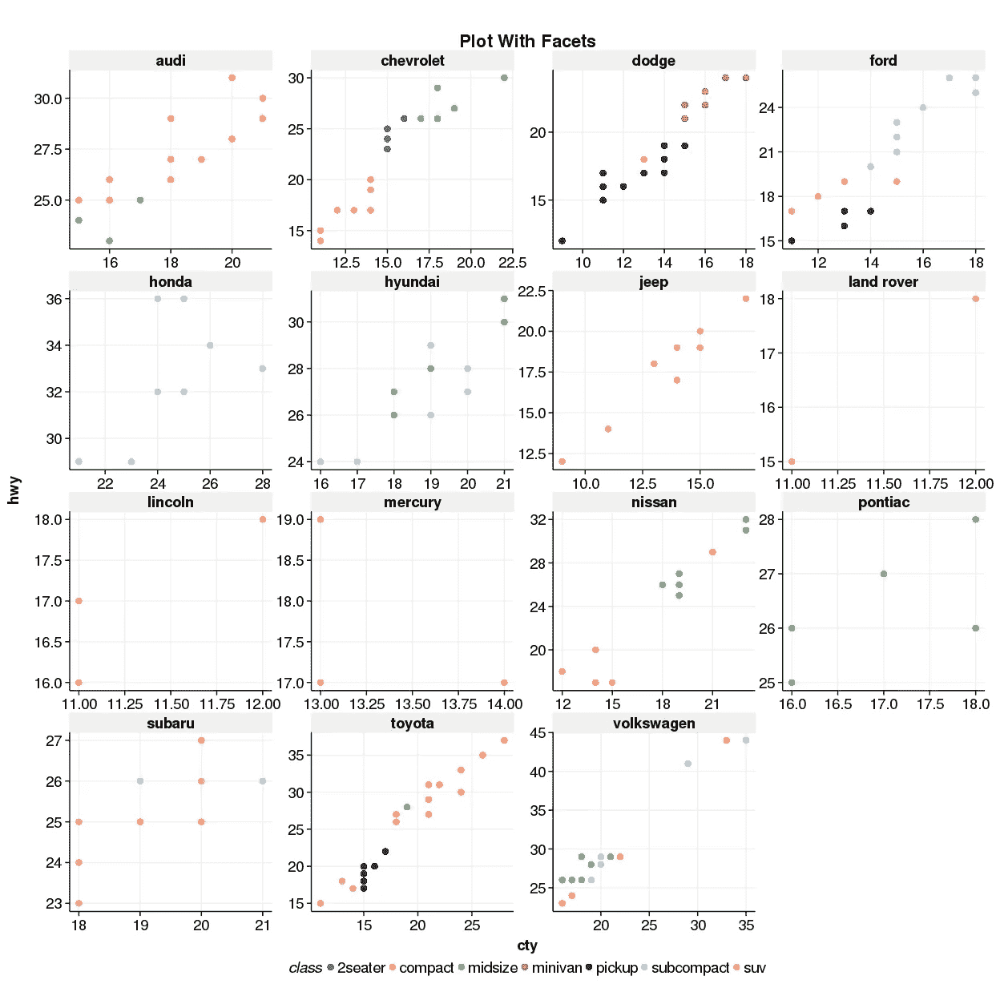

## 带`theme_dark_blue`和`theme_dark_grey`的图示例

```
grid.arrange((Scatter + scale_colour_Publication() + theme_dark_blue()),
             (Scatter + scale_colour_Publication() + theme_dark_grey()),nrow=1)
```

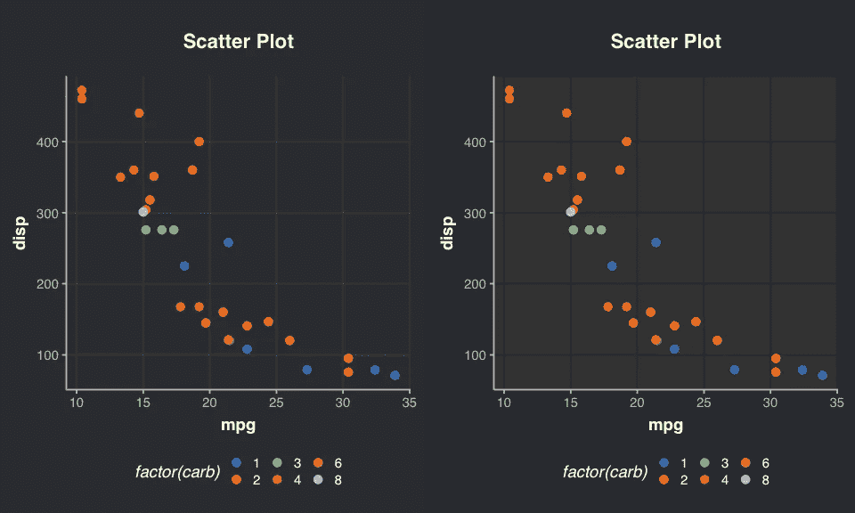

```
grid.arrange((Bar + scale_fill_Publication() + theme_dark_blue()),
             (Bar + scale_fill_Publication() + theme_dark_grey()),nrow=1)
```

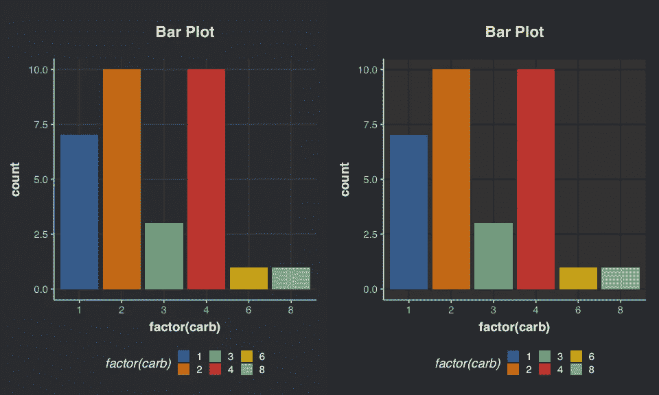

```
grid.arrange((Bubble + scale_colour_Publication() + theme_dark_blue()),
             (Bubble + scale_colour_Publication() + theme_dark_grey()),nrow=1)
```

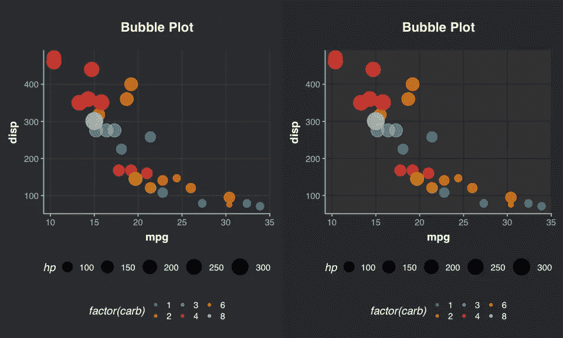

```
grid.arrange((Line + scale_colour_Publication() + theme_dark_blue()),
             (Line + scale_colour_Publication() + theme_dark_grey()),nrow=1)
```

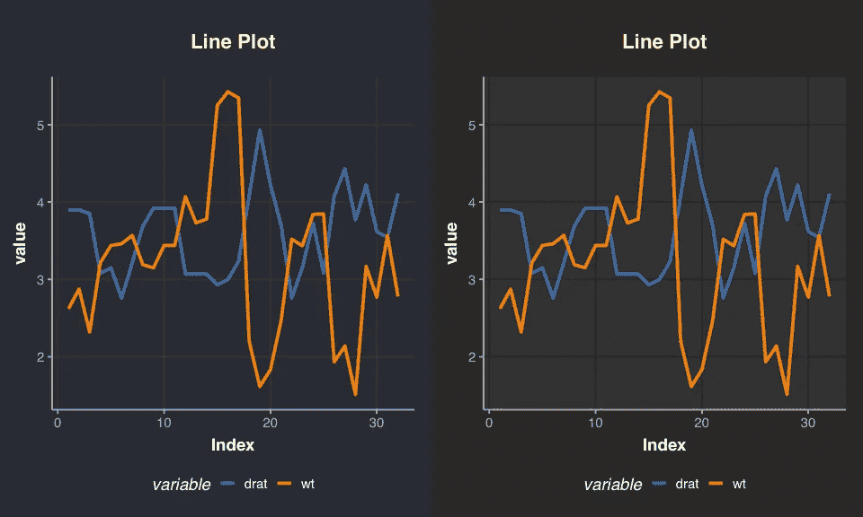

```
P +scale_colour_Publication()+ theme_dark_grey()
```

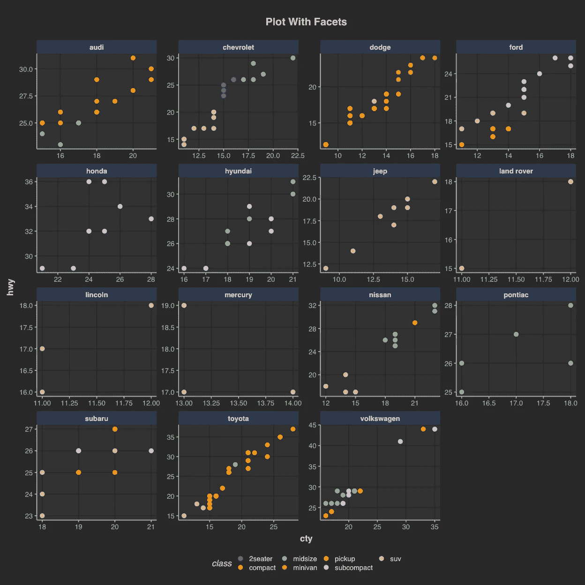

```
P +scale_colour_Publication()+ theme_dark_blue()
```

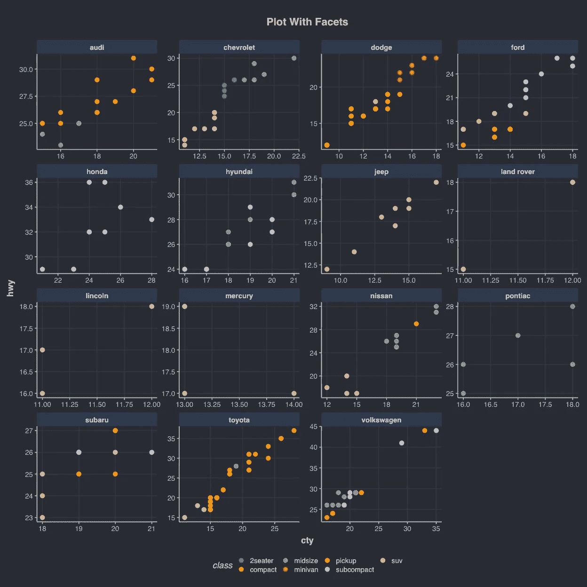