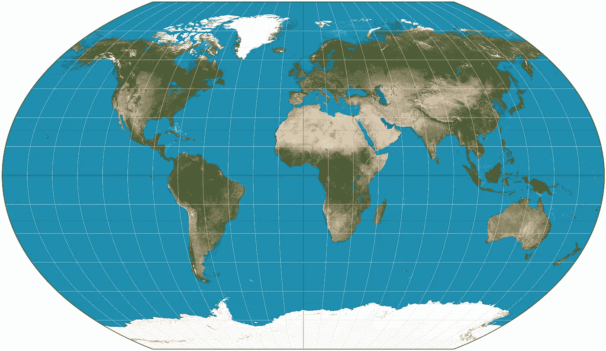

# 地理信息系统:建筑概述

> 原文：<https://medium.com/analytics-vidhya/gis-an-archgdal-overview-cf8d073ce232?source=collection_archive---------11----------------------->



我也在这里以 Jupyter 笔记本[的形式发布了这个文档。](https://gist.github.com/soumitradev/23781d2ff99568ad01eb13bc1a09691e)

# 1.1 什么是 GIS 数据库？

GIS 代表地理信息系统。GIS 数据库是包含地理数据的数据库。例如，GIS 数据库可以包含犯罪的位置信息，并且可以帮助分析以前的犯罪并在将来防止犯罪。另一个例子可以是可视化疾病的爆发，识别数据中的模式，并防止或限制疾病的传播。

GIS 数据库还包含图层，可通过访问这些图层来收集给定地点的不同类型的信息。例如，我们可以可视化一个地方的降雨量分布、风速和平均温度，这可能会产生重要的气象结果。所有这些不同的参数将存在于不同的层中，因为它们代表不同类型的数据。

GIS 可以让我们更深入地了解挑战世界的问题，预测未来事件，帮助我们了解趋势等等。它确实是一种多用途的数据形式，具有很大的潜力。

# 1.2 更深入的观察

GIS 数据库有两种类型:矢量和栅格。矢量数据库包含关于离散对象的信息，如线、点、面、标签等。另一方面，栅格数据库包含连续的信息，如热图、分布图、图像等。

矢量数据库通常用于绘制和标注具有固定边界的事物，并且可以离散绘制。这包括街道、州、建筑等。

栅格数据库通常用于可视化分布、卫星图像、高程、天气数据等。

# 1.3 archg dal 从何而来？

GDAL 代表地理空间数据抽象库，是一个可以处理 GIS 数据的开源库。目前，该项目由 OSGeo 维护，并经常更新。它是在 X/MIT 许可下发布的，主要用 C 和 C++编写。

然而，有许多翻译库可以在给定的编程语言和 GDAL 之间接口。一个例子是 ArchGDAL.jl，它是 GDAL 和 Julia 之间的接口。事实上，它是 GDAL 的高级 API，建立在 GDAL.jl 之上。

# 1.4 拱形原则

ArchGDAL 在开发和维护他们的图书馆时也遵循 Arch 原则。这些原则是:

*   **简单**:没有不必要的添加或修改。(I)保存 GDAL 数据模型，并使 GDAL/OGR 方法可用，而不试图对用户隐藏它们。㈡最低限度的依赖性
*   **现代性**:只要能够合理地避免系统包破损，ArchGDAL 会努力维护 GDAL 的最新稳定发布版本。
*   实用主义:这里的原则只是有用的指导方针。最终，设计决策是通过开发人员的一致意见在个案的基础上做出的。重要的是基于证据的技术分析和辩论，而不是政治或大众观点。
*   以用户为中心:尽管其他图书馆试图更加用户友好，ArchGDAL 应该以用户为中心。它旨在满足贡献者的需求，而不是试图吸引尽可能多的用户。
*   **多功能性** : ArchGDAL 将努力保持其对用户需求范围的假设较小，并使用户易于构建自己的扩展/便利。

这些原则改编自最初的 Arch Linux 原则，可以在[这里](https://wiki.archlinux.org/index.php/Arch_Linux#Principles)找到。

# 1.5 安装

要安装 ArchGDAL，只需输入

```
*import* PkgPkg.add(“ArchGDAL”)
```

要测试您的安装，请键入

```
Pkg.test(“ArchGDAL”)
```

# 1.6 入门

让我们开始使用 ArchGDAL 中的数据库。

我们需要首先导入 ArchGDAL 来使用它:

```
*using* ArchGDAL
```

要初始化 ArchGDAL，我们必须注册我们的驱动程序。为此，只需键入:

```
ArchGDAL.registerdrivers() *do
    # your code here
end*
```

或者，您可以用两行代码来完成:

```
GDAL.allregister()
*# your code here* GDAL.destroydrivermanager()
```

然而，我更喜欢前者，并将在本文中使用这种方法。

# 1.7 使用 GIS 数据库

要开始使用数据库，我们必须先将它读入我们的脚本。

所以，在我们添加了`read()`函数之后，我们的代码将会是:

```
ArchGDAL.registerdrivers() *do
*    ArchGDAL.read(filepath) *do* dataset
        print(dataset)
 *end
end*
```

其中`filepath`是我们数据库文件的路径。

现在，需要注意的是矢量数据库属于`.geojson`类型，而栅格数据库属于`.tif`类型。还需要注意的是，除了 geojson 和 tif 之外，还有许多类型的文件类型可以与 ArchGDAL 一起使用，例如`.shp`、`.shx`，但是 ArchGDAL 的示例 repo 上的示例文件只有 geojson 和 tif 文件。

现在，让我们导入一个矢量数据集。在 ArchGDAL.jl repo 上，已经存在一个示例数据集。这里可以找到[这里](https://github.com/yeesian/ArchGDALDatasets/blob/307f8f0e584a39a050c042849004e6a2bd674f99/data/point.geojson)。我已经将示例数据集放在与我的 Jupyter 笔记本相同的文件夹中。为了指向数据集，我在 do 块上方键入了以下内容:

```
filepath = “point.geojson”
```

现在，让我们打印一些关于数据库的基本信息:

```
*using* ArchGDAL
filepath = “point.geojson”ArchGDAL.registerdrivers() *do* ArchGDAL.read(filepath) *do* dataset
        print(dataset)
    *end
end*
```

我们得到:

```
GDAL Dataset (Driver: GeoJSON/GeoJSON)File(s):
 point.geojsonNumber of feature layers: 1
 Layer 0: point (wkbPoint)
```

我们看到，我们获得了数据库的类型、数据库中的文件、数据库中的层数以及关于每一层的信息。在[文档](http://yeesian.com/ArchGDAL.jl/latest/datasets.html#Vector-Datasets-1)中可以找到访问该信息的编程方式。

类似地，当我们从这里的[导入示例栅格数据库](https://github.com/yeesian/ArchGDALDatasets/blob/307f8f0e584a39a050c042849004e6a2bd674f99/gdalworkshop/world.tif)并在其上运行相同的脚本时，我们得到以下输出:

```
GDAL Dataset (Driver: GTiff/GeoTIFF)File(s):
 world.tifDataset (width x height): 2048 x 1024 (pixels)Number of raster bands: 3
 [GA_ReadOnly] Band 1 (Red): 2048 x 1024 (UInt8)
 [GA_ReadOnly] Band 2 (Green): 2048 x 1024 (UInt8)
 [GA_ReadOnly] Band 3 (Blue): 2048 x 1024 (UInt8)
```

我们获得了文件类型、数据库中的文件、数据库的分辨率以及数据库的栅格波段或图层。

同样，您可以通过编程访问这些数据，这样做的指令是[这里的](http://yeesian.com/ArchGDAL.jl/latest/datasets.html#Raster-Datasets-1)。

# 1.8 使用文件

ArchGDAL 允许以下函数处理文件:

*   `createcopy()`
*   `update()`
*   `create()`
*   `read()`

`createcopy()`:创建作为参数传递的数据库副本。

`update()`:打开具有写权限的数据库。

`create()`:创建一个新的空数据库。

> **注意:**顺序写入格式(如 PNG 和 JPEG)不支持`*create()*`，但可以实现`*createcopy()*`。
> 
> 还有，有的驱动只实现`*create()*`，不实现`*createcopy()*`。在这种情况下，`*createcopy()*` 将被用作调用`*create()*`的机制。

`read()`:以只读模式打开数据库。

# 1.9 从数据库访问数据

访问单个字段和特征(如线、点、标签等)。)在向量数据库中，我们有一些方法:

`ArchGDAL.getgeomfield(feature, i)`:获取索引`i`处特征的几何字段。

`ArchGDAL.getfield(feature, i)`:获取特征中索引`i`处的字段。

`ArchGDAL.ngeomfield(feature)`:获取`feature`中几何字段的个数。

`ArchGDAL.nfield(feature)`:获取`feature`中字段的个数。

在栅格数据库中，我们有许多方法来获取数据库的属性。回顾所有这些方法超出了本介绍的范围，这些方法的文档可以在[这里](http://yeesian.com/ArchGDAL.jl/latest/rasters.html)找到。

总之，ArchGDAL 是一个非常强大的工具，可以用于各种应用程序。这只是对该工具的一个简短探索，该工具的内容远不止这些。在这里查看回购[，在这里](https://github.com/yeesian/ArchGDAL.jl)查看该工具的文档[。](http://yeesian.com/ArchGDAL.jl/latest/)

# 1.10 参考文献

封面图片属于来自维基共享资源的 Strebe，在 [CC-BY-SA 3.0 许可](https://creativecommons.org/licenses/by-sa/3.0/)下发布。链接在这里:[https://commons . wikimedia . org/wiki/File:Kavraiskiy _ VII _ projection _ SW . jpg](https://commons.wikimedia.org/wiki/File:Kavraiskiy_VII_projection_SW.jpg)

GIS 信息介绍来自 https://www.esri.com/en-us/what-is-gis/overview ESRI: