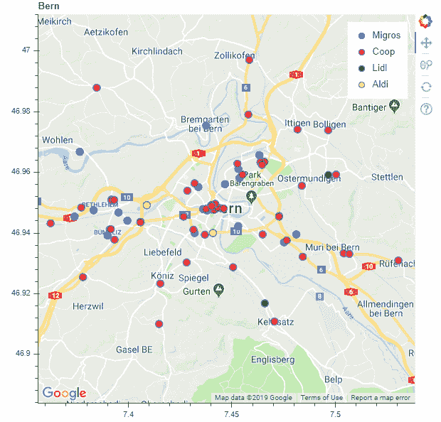
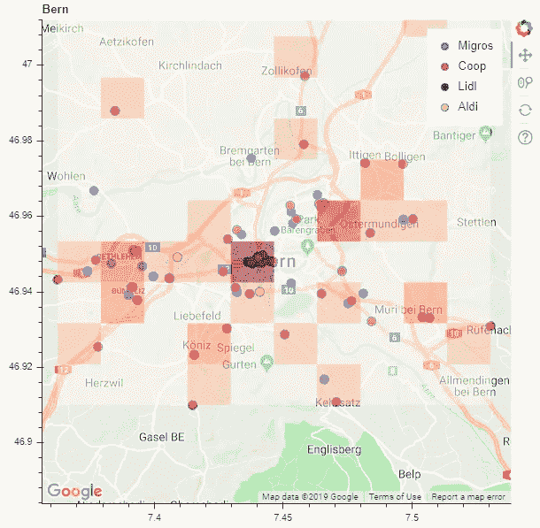
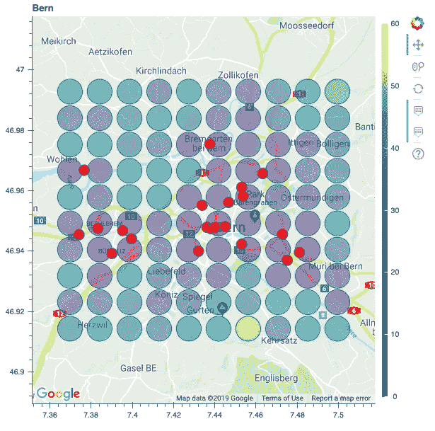

# Python 中的地理信息系统工具

> 原文：<https://medium.com/analytics-vidhya/gis-tools-in-python-bf9dc614fd2?source=collection_archive---------13----------------------->

# 介绍

在苏黎世推进学院数据科学训练营的第二周，我们接到了第一个为期两天的小组项目。本文讨论了我们在项目期间学到的 Python 中的 GIS 工具。

## 项目:在谷歌地图上确定位置，以建立一个新的 Migros 超市

我们的目标是确定 Migros 超市及其竞争对手在瑞士伯尔尼的位置，以便找到潜在的有趣地点来建设新的 Migros 超市。我们将问题分解为 3 个步骤:

1.  通过谷歌地图 API 检索超市位置。
2.  在谷歌地图上标出它们。
3.  为不同的扩展策略创建热图。

## 通过谷歌地图 API 检索位置

为了访问谷歌地图 API，需要一个[谷歌 API 密钥](https://developers.google.com/maps/documentation/javascript/get-api-key)，并且*地点 API* 和*地图 Javascript API* 都应该在[谷歌云平台控制台](https://console.cloud.google.com/google/maps-apis)中激活。一旦 API 密钥可用，我们就为 Google Maps 服务安装了 [Python 客户端](https://github.com/googlemaps/google-maps-services-python)，并建立了与 API 的连接:

然后，我们设置了一些搜索查询来检索和存储 Migros 及其主要竞争对手 Coop、Lidl 和 Aldi 的超市位置。不幸的是，每个请求的位置数量被限制在 20 个，所以后续的请求需要获得每个竞争者的所有超市位置。但是，即使运行单独的请求，每次搜索的结果总数也限制在 60 个。可以通过运行附近坐标的搜索来解决这个限制，但是在我们的例子中，每个竞争者有 60 个超市就足够了。

## 使用散景在谷歌地图上绘制位置

一旦超市的位置在. csv 文件中可用，那么使用散景在地图上加载和绘制它们就相当简单了:

散景允许交互式绘图，这意味着地图可以导航和缩放。点击图例可以显示和隐藏竞争对手。

## 热图覆盖，以确定建立新的 Migros 超市的位置

调查了为 Migros 市场选择潜在新地点的两种方法:相对密度法和行程时间法。

**相对密度法:**

这种方法显示了 Migros 超市相对于其主要竞争对手的相对密度。

**行程时间方法:**

第二种方法是基于乘坐公共交通工具到最近的 Migros 的旅行时间。google directions API 用于请求从每个单元的每个中心到达 Migros 所需的时间。我们选择关注公共交通出行时间，但步行时间也很容易获得。

以分钟为单位的持续时间被可视化为散景中的交互式热图。

互动版:[https://davidfurrer.github.io/bokehmap/](https://davidfurrer.github.io/bokehmap/)

如果有更多的时间，一个明显的下一步将是考虑人口密度。

**进一步阅读 GIS 工具的关键词:**

1.  地质公园
2.  形状文件
3.  [坐标参考系统](https://automating-gis-processes.github.io/CSC18/lessons/L2/projections.html#coordinate-reference-system-crs)
4.  打开街道地图数据
5.  多边形和形状

参考:

 [## 欢迎来到 Python GIS 入门-课程 2018！Python GIS 文档简介

### 本课程的大部分时间将在电脑前学习用 Python 语言编程和工作…

自动化-gis-processes.github.io](https://automating-gis-processes.github.io/CSC18/index.html) 

作者:

大卫·富尔

 [## davidfurrer -概述

### 在 GitHub 上注册您自己的个人资料，这是托管代码、管理项目和与 40…

github.com](https://github.com/davidfurrer) 

阿德里安·伊姆菲尔德

 [## aimfeld -概述

### 在 GitHub 上注册您自己的个人资料，这是托管代码、管理项目和与 40…

github.com](https://github.com/aimfeld)