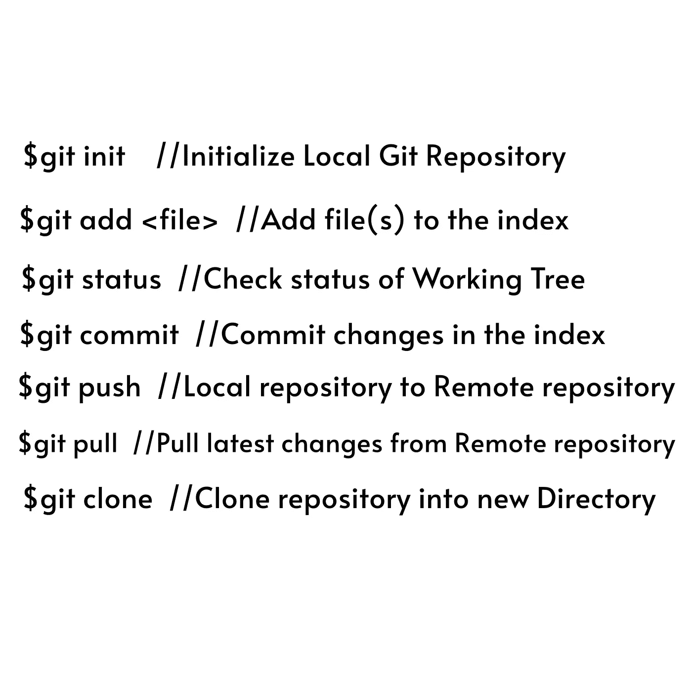

# GIT 101:基本命令行

> 原文：<https://medium.com/analytics-vidhya/git-101-basic-command-lines-48c1b931135a?source=collection_archive---------20----------------------->

在上一篇教程文章中，我说过我将讨论 Git 的基本命令行。这些命令行有助于将文件从本地存储库(本地计算机/机器)添加到远程存储库的简单操作。

然而，如果不下载 Git Bash，就很难使用命令行，Git Bash 是 **Bourne Again Shell** 的缩写。Git Bash 是一个用于 Microsoft Windows 环境的应用程序，它为 Git 体验提供了一个仿真层。

需要补充的是， **Bash 是一个 UNIX shell** 和**命令语言，**和是 **Linux 上的默认 shell——UBUNTU**和 **OS X.** 换句话说，运行在终端上的 git 被称为 **GIT BASH。**

随着 Git Bash 知识的增加，让我们直接进入命令行的使用。

**基本 Git 命令**

为了使用 Git，开发人员使用特定的命令来复制、创建、更改和组合代码。这些命令可以直接从命令行执行，也可以通过 Git 北海巨妖这样的应用程序来执行。以下是一些使用 Git 的常用命令:

**git init** 初始化一个全新的 git 存储库，并开始跟踪一个现有的目录。它在现有目录中添加了一个隐藏的子文件夹，该目录包含版本控制所需的内部数据结构。

**git**添加阶段变化。Git 跟踪开发人员代码库的变更，但是有必要对变更进行暂存和快照，以便将它们包含在项目的历史中。此命令执行转移，这是该两步过程的第一部分。任何暂存的变更都将成为下一个快照的一部分和项目历史的一部分。分开进行和提交使开发人员能够完全控制他们项目的历史，而不需要改变他们的编码和工作方式。

**git**

git **commit** 将快照保存到项目历史中，并完成变更跟踪过程。简而言之，提交的功能类似于拍照。使用 git add 暂存的任何内容都将成为使用 git commit 的快照的一部分。

**git push** 用本地提交到分支的任何提交更新远程存储库。

**git pull** 用来自远程对应方的更新来更新本地开发线。如果团队成员提交了远程上的分支，并且他们希望在本地环境中反映这些更改，那么开发人员可以使用这个命令。

**git** **clone** 创建一个已经远程存在的项目的本地副本。克隆包括项目的所有文件、历史和分支。

**git** **branch** 显示本地正在处理的分支。

git 合并将开发路线合并在一起。该命令通常用于合并两个不同分支上的更改。例如，当开发人员想要将功能分支中的变更合并到主分支中进行部署时，他们会进行合并。

为了更好地理解 Git 命令行，请查看

 [## 参考

### 快速参考指南:GitHub 备忘单|可视化 Git 备忘单

git-scm.com](https://git-scm.com/docs)