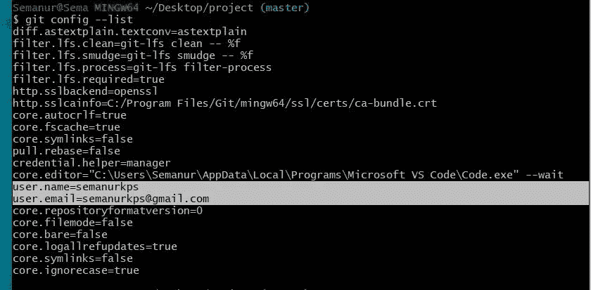

# Git-101

> 原文：<https://medium.com/analytics-vidhya/git-101-cdf8d18b895e?source=collection_archive---------11----------------------->

了解更多关于 Git 的知识并开始使用！。


来源:https://bit.ly/36PxMAC

“Git”是**最好的朋友**和**开发者的生命救星**。作为数据科学爱好者，它也应该是我们最好的朋友吗？肯定是的！在这篇文章中，我将解释什么是 Git，为什么我们应该使用它，以及如何开始使用它。在接下来的文章中，我们将学习如何使用这项技术有效地管理我们的项目

最近，我发起了一项挑战，承诺自己每天都要学习一些关于数据科学的新知识(#66daysofdata challenge，你可以查看这篇文章了解更多信息:[https://bit.ly/3fdOKwd](https://bit.ly/3fdOKwd)

这就是我们和 Git 的交集。这是一个分布式版本控制系统。因此，如果你“提交”你所做的改变，它基本上会记录你的工作。在 Git 的帮助下，你甚至可以回到你工作的早期版本。因为它以分布式的方式存储文件，所以你不会丢失数据。它很快，从世界各地都可以到达。您可以从本地存储库或远程存储库工作。不要担心，我会弹出一些定义，以防你不熟悉这些。

**Git 和 GitHub 一样吗？**

编号 ***GitHub*** *是一个用于版本控制和协作的代码托管平台*【1】。当我们说**“版本控制”**时，Git 就开始发挥作用了。

> **版本:**单据最新保存的形式。
> 
> **版本控制:**管理文件、程序、网站的变更。

让我们多谈谈版本控制系统。有两种方法:集中或分散。

**集中式版本控制系统**

每个人都连接到一个在线知识库。当他们在项目中工作时，他们都提交变更并从中获得更新。如果他们失去互联网连接，他们将无法做任何事情，在这种情况下，更改会在提交前丢失。


来源:[https://bit.ly/3fdVAld](https://bit.ly/3fdVAld)

> 软件仓库，简称“repo”，是软件包的存储位置。它可以是本地的也可以是远程的。Local 表示设备中的存储库，remote 表示存储在 GitHub 中的存储库。
> 
> **工作副本:**您当前正在处理的版本。
> 
> **提交:**将更改保存到存储库。
> 
> **更新:**获取存储库的最新版本。

**分散(或分布式)版本控制系统**

每个用户都独立于他们设备上的存储库工作。他们提交变更并将工作保存到他们的“本地存储库”。如果他们想更新主要回购协议，他们基本上是“推动”这些变化。


来源:https://bit.ly/35IJ6yR

> **推送:**将您已经执行的 Git 提交上传到一个远程存储库中，例如上传到您的 GitHub 帐户。
> 
> **Pull:** 从远程存储库中下载变更，例如，您正在和朋友一起做一个项目。他/她将最新的变更“推”到您正在项目中使用的 GitHub 存储库中。您将需要提取这些更改，以便您的本地存储库保持最新。

## **为什么分散的 VCS 比集中的更好？**

*   分散式 VCS(简称版本控制系统)速度更快。
*   它不需要互联网连接。
*   可以接受/拒绝更改。
*   不需要一直联系主服务器(远程存储库)。

## *数据爱好者为什么要用 Git？*

既然我们对版本控制系统以及 Git 属于哪一类有了更多的了解，我们就可以讨论为什么我们应该使用它了。

Git 的优势:

*   更有组织的团队合作:在大型团队和项目中，有时许多人在做同一件事，这会导致混乱的问题。有了 Git，我们可以创建*【分支】*，在分支上工作，并且在我们认为已经准备好之后*【合并】*。这使得一起工作更安全。
*   随着时间的推移，更容易跟踪变更:
    这个版本的项目中有什么变更？谁提交了变更？
*   节省空间并确保备份。
*   灵活，免费，快速，允许我们回到旧版本，易于使用，完全分布式，并可以支持大规模的项目。

> 分支*: 有不同类型的分支和相关操作，我们将在后面讨论。但是为了简单地理解这个概念，我们可以使用下面的照片。


> 让我们回到之前的例子。Master branch 是我们和朋友一起做的主要项目。我们一直致力于这个项目，并随着时间的推移不断增加变化。然后，我们突然意识到我们忘记了在前面的章节中做一个步骤，或者我们想添加一些其他功能，我们基本上回到那个版本，并创建一个单独的分支来处理这些变化。当我们对工作满意后，我们可以将修改后的内容与母版结合起来。
> 
> **合并*:** 将一个分支与另一个分支或主分支合并
> 
> *如前所述，我们将在后续章节中详细讨论分支和合并操作，如果这些概念现在看起来很复杂，请不要担心。

作为数据爱好者，我们应该熟悉 Git，因为许多公司运行的大项目是由团队运行的。而且我们很有可能参加那些团队。每个人都有特定的任务分配给他们，我们应该能够跟踪这些变化。舒舒服服地做我们的文案，当我们觉得已经准备好了的时候，再进行修改。

**如何入门？**

现在，我们将安装并初始化 Git。Github 的网页建议我们遵循以下安装步骤:

1.  导航到最新的[*Git for Windows installer*](https://gitforwindows.org/)并下载最新版本[2]。
2.  安装程序启动后，按照 Git 安装向导屏幕中提供的说明进行操作，直到安装完成。(不要忘记选择“Git Bash”和“Git GUI”。
3.  打开 windows 命令提示符(如果您选择在 Git 安装期间不使用标准的 Git Windows 命令提示符，则打开 Git Bash)。
4.  键入 git 版本以验证 Git 安装成功。

> Git Bash: 类似终端命令行的平台，允许我们通过使用一系列不同的命令来管理项目中的变更(这将在下一篇文章中讨论)。
> 
> **Git GUI:**Git 的图形用户界面。

```
$ git --version
```


右键单击桌面，您应该会看到“Git Bash”。点击它，执行上面写的代码。

**为您的项目初始化 Git**

如果我们想使用 Git，安装是不够的。我们还应该初始化它，并做一些配置。我们只需要做一次配置设置，Git 会存储它并在需要时使用它。要在我们的文件夹中初始化 Git，我们将使用以下命令:

```
$ git init
```


第一个命令(make directory)用于创建一个名为“project”的目录。第二个(更改目录)用于从桌面移动到另一个目录，在我们的例子中是“项目”。

是啊，就这么简单！现在我们已经初始化了，让我们继续进行配置。

```
$ git config --global user.name "your_GitHub_username"
$ git config --global user.email "your_GitHub_email"
```


这将把您的项目文件连接到您的 GitHub 帐户。但是不要担心，只要您不“推送”更改，它们就不会出现在 GitHub 存储库中。你的工作将保留在本地。

注意变化，现在在上面的酒吧(主人)出现了。这意味着我们已经成功初始化了 Git。

通过使用以下命令，我们可以确保 Git 保存了我们的配置设置。

```
$ git config --list
```



通过输入下面的命令，我们可以看到我们的“状态”,这将在下面的帖子中解释。

> **状态**:上一次保存的版本与您当前正在处理的副本之间的差异。

```
$ git status
```


因为我们没有添加任何东西或提交任何更改，所以它什么也没有显示。典型的数据科学项目包括数据集、代码等。我们将在下一篇文章中看到如何添加文件以便 Git 跟踪它们。

现在，我们将在这里停下来，让这些下沉。在下一篇文章中，我们将学习:

*   如何打开项目和添加文件，
*   上演变革，
*   承诺，
*   回到旧版本，
*   分支和合并，
*   向我们的存储库推/拉变更，
*   克隆其他存储库
*   一些常见的惯例/良好做法。

习惯 Git 并舒适地工作可能需要时间。但是一旦你这么做了，你的生活肯定会轻松很多。在做进一步的申请之前，这里有一些参考资料。敬请关注下一篇帖子，我们在那里见！

**在我们深入研究之前，查看一些有用的资源:**

*   Git 文档:【https://bit.ly/2KouYmr 
*   肯·吉在 youtube 上的视频:[https://bit.ly/36O58zH](https://bit.ly/36O58zH)
*   [梅尔特·科巴诺夫](https://medium.com/u/3660a597b35?source=post_page-----cdf8d18b895e--------------------------------)的 Git 视频【TR】:[https://bit.ly/3kRDHdu](https://bit.ly/3kRDHdu)，[https://bit.ly/2IJ0GdI](https://bit.ly/2IJ0GdI)
*   科里·谢弗在 youtube 上的 Git 教程:[https://youtu.be/HVsySz-h9r4](https://youtu.be/HVsySz-h9r4)
*   Emre Altunbilek 在 Udemy 上的 Git 课程[TR]:[https://www . Udemy . com/course/source tree-ile-Git-ve-github-kullanimi/](https://www.udemy.com/course/sourcetree-ile-git-ve-github-kullanimi/)

**参考文献**

[1][https://bit.ly/2UDbRqF](https://bit.ly/2UDbRqF)

[https://gitforwindows.org](https://gitforwindows.org)