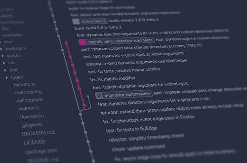
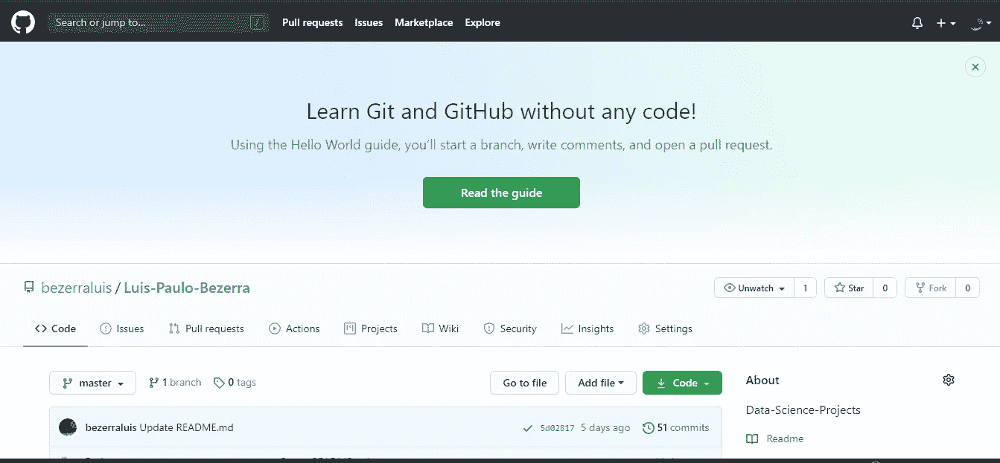

# Git 和 GitHub 的第一步

> 原文：<https://medium.com/analytics-vidhya/git-and-github-first-steps-a82329add8ce?source=collection_archive---------25----------------------->

大家好，这是我在 medium 上的第二篇帖子。我正在 awari.com.br 参加一个数据科学训练营课程，我打算写下我将要学习的主题。首先，因为我想分享一点我的知识，这也是一种很好的学习方式。

今天我将写关于 git 和 Github 的文章，解释它们是什么，并描述一些关于 Git 的基本命令。

# 什么是 Git？

Git 是一个免费的开源分布式版本控制系统，旨在快速高效地处理从小型到超大型的所有项目。

换句话说，git 是一种远程控制项目的方式(在您的计算机上)。您可以保存项目的每个更新，并在您的机器上创建一个存储库来管理所有项目。

现在你知道什么是 git 了，让我们列出一些在项目中可以帮助你的命令。

## git 配置

用法:git config-global user . name "[name]"

用法:git config-global user . email "[电子邮件地址]"

此命令分别设置提交时使用的作者姓名和电子邮件地址。

## git init

用法:git init[存储库名称]

此命令用于启动新的存储库。

## git 提交

用法:git commit -m "[键入提交消息]"

该命令在版本历史中永久记录或快照该文件。

## git 状态

用法:git 状态

此命令列出必须提交的所有文件。

## git 节目

用法:git show [commit]

此命令显示指定提交的元数据和内容更改。

# 什么是 GitHub？

为了完成这篇文章，我想谈谈 GitHub。这是一个基于 git 的平台，如果你是一个开发人员或者数据专家，你可以在这里创建一个在线文件夹，即使你不知道 git，这个页面也是用户友好的。您只需要一个电子邮件帐户就可以开始保存您的项目。

今天到此为止，我希望你创建一个 GitHub 帐户来托管你未来的项目，这样你也将有一个在线文件夹来展示给每个对你的能力感兴趣的人。