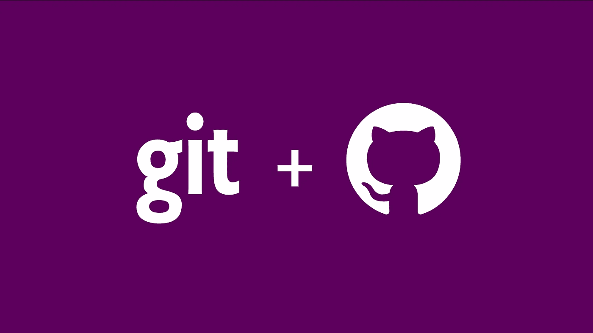
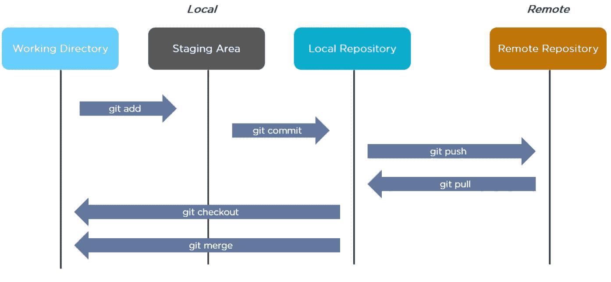

# Git —基础知识

> 原文：<https://medium.com/analytics-vidhya/git-basics-f949c8109094?source=collection_archive---------25----------------------->

Git 是一个强大的工具，但是它有着迷惑新手的名声。有了正确的知识，任何人都可以掌握 git。一旦你开始理解它，术语会变得更有意义，你会(最终)学会爱上它。

## Git 是什么？

Git 是一种版本控制系统(VCS ),可以更容易地跟踪文件的变更。例如，当你编辑一个文件时，git 可以帮助你准确地确定*修改了什么、*谁*修改了它，以及*为什么*。*

它有助于协调多人在一个项目中的工作，并通过保存“检查点”来跟踪进度。你可以在写文章的时候使用它，或者跟踪对艺术作品和设计文件的修改。

Git 不是唯一的版本控制系统，但它是目前最流行的。许多软件开发人员每天都在使用 git，了解如何使用它可以大大提升你的简历。

## GIT 中的环境

**工作目录**:系统中克隆文件的目录。

**暂存区**:在执行提交之前暂存文件的临时位置。此区域帮助您仅提交所需的文件并跳过剩余的文件。

**本地存储库**:远程存储库的副本，它将承载您的提交。

远程存储库:一个公共存储库，每个人都可以使用它来交换他们的变更。它通常位于远程服务器上。

**拉**:一旦您在远程存储库中创建了您的分支，您必须执行`git pull`，这将使您的本地存储库与远程服务器同步。在您执行“拉”之后，新创建的分支将在您的本地存储库中可用。

**Checkout** :在您执行一个 pull 之后，您将在您的本地存储库中拥有您的新分支。现在您需要执行`git checkout branchname`来将您的工作目录指向新的分支。

**添加:**当您在本地机器上完成更改后，您可以执行一个`git add`来将更改添加到暂存区。add 命令的一些不同功能包括

*   `git add *`将所有已更改的文件添加到暂存区
*   `git add filename`向暂存区专门添加一个文件
*   `git add -p`查看每个文件中的单独更改，然后将其添加到暂存区

**提交**:一旦你已经准备好了需要的文件，你可以做`git commit -m "message"`来提交你的变更到你的分支。提交是在您执行 git 推送时将被推送到远程存储库的提交。

**推送:**直到你做了推送，你所有的更改都还在你的本地机器上，你不能和任何人交换。将您所有的本地提交推送到远程存储库。现在，任何人都可以通过访问您的分支来访问您的更改。

如果你喜欢这篇文章，请点击👏所以其他人会在媒体上看到它。