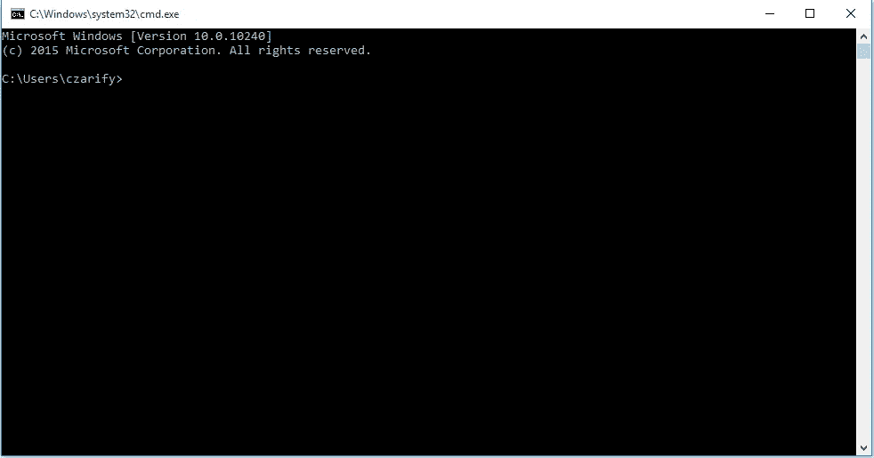
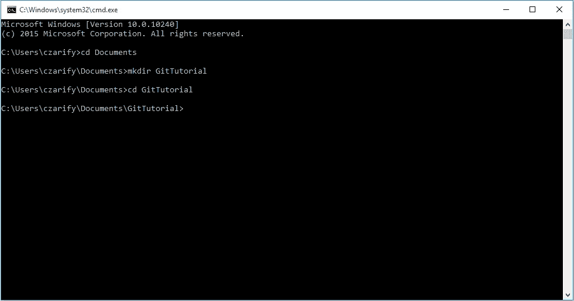
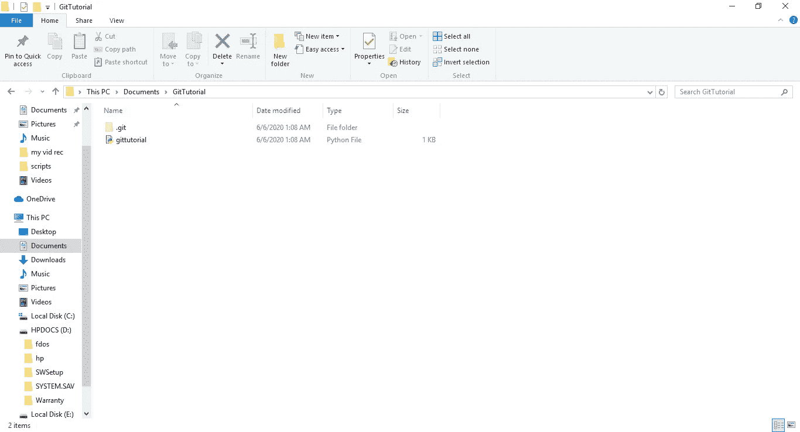
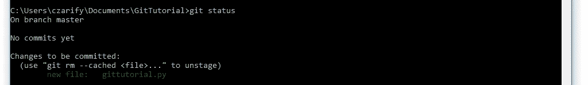
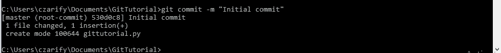
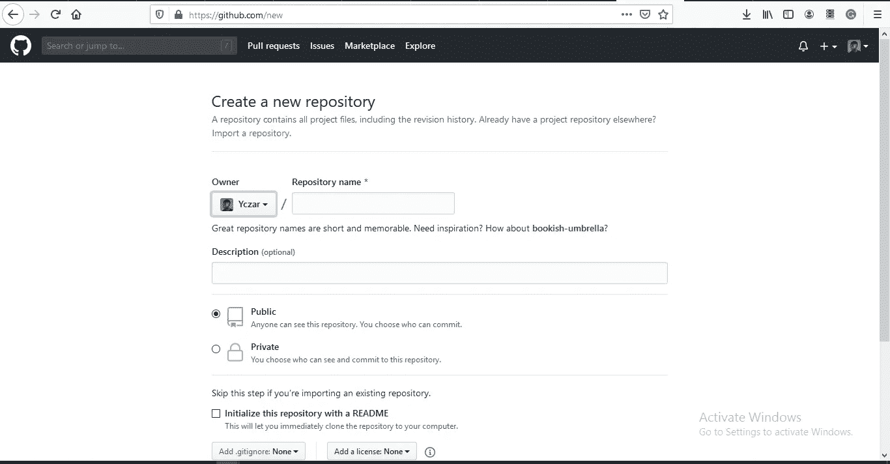
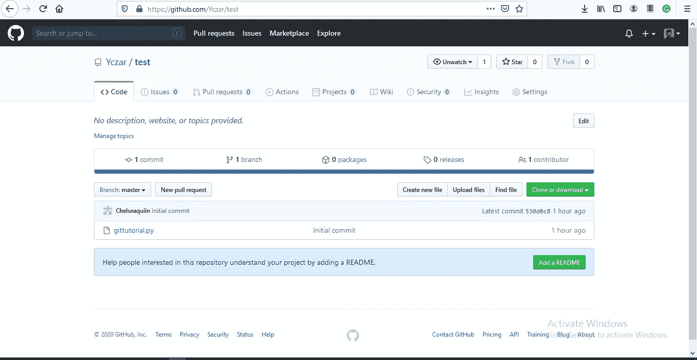

# 给初学者的 Git

> 原文：<https://medium.com/analytics-vidhya/git-for-beginners-9520abfd004a?source=collection_archive---------8----------------------->

Git 是一个版本控制软件，允许你跟踪文件中的变化。所以你首先想到的问题是，版本控制到底是什么，为什么我需要跟踪我的文件中所做的更改。抿一口咖啡，跟着读。

为什么你需要跟踪你的文件？

有些情况下，当你编写或编程时，你会做一些会导致错误的更改，然后你需要一种方法来恢复到你的文件以前的状态，你想到的下一件事就是控制 z 命令，对吗？。但是如果你在一个项目中使用不同数量的文件，或者你做了成千上万的修改，我 100%确定控制 z 或者命令 z 有它的限制，当你关闭你的文件时，你不能返回恢复你的修改。所以你可能会对更好的方法感兴趣，不用再担心了，因为我已经有了你的解决方案，你所要做的就是轻轻一弹，我很确定你会发现这非常有趣。

**什么是版本控制？**

顾名思义，版本控制是一种记录对一个文件或一组文件的更改的系统，以便您可以在以后调用特定的版本。人们日常使用的版本控制软件有很多，但其中最流行和最有趣的是 git。

现在，您已经知道了什么是文件跟踪和版本控制，现在回到本文的开头，在那里消化 git 定义，并确保在消化之后再喝一口咖啡。但是在我继续之前，你不觉得 git 除了版本控制之外还有其他功能吗，或者你可能一直在思考这个问题。你猜怎么着！！确实如此，git 有更多令人难以置信的功能，比如协调不同人之间的工作，还支持本地和远程存储库，有一个叫 Github 的服务。

嗯。你在想什么？

哈哈，不要绞尽脑汁，我知道你想知道什么是资源库和 Github，对吗？。Repository 就像一个蓝图，或者一个存储项目的地方，而 Github 是一个在互联网上存储 git 存储库的网站。Lol，不要让定义来定义你的恐惧。再喝一口咖啡，坐下来跟着读，确保你一个字一个字、一句一句地跟着读，还有什么？哦，对了，字母归字母，数字归数字。好了，我们该回去工作了，让我们继续安装本教程所需的工具。

**工具**

让我们继续下载并安装下面的软件

**Git**

https://git-scm.com/download/mac

https://git-scm.com/download/win

吉特(Linux):[https://git-scm.com/download/linux](https://git-scm.com/download/linux)

Github 桌面:【https://desktop.github.com/ 

你知道吗，下载这些软件后，你已经有 60%接近成为使用 git 的专家了。好吧，让我们来看看要点，进入正题。

在我们开始之前，imma 给你一个我们将在本教程中使用的命令的简要描述。哎呀，很抱歉我忘了告诉你这个，git 的另一个有趣的地方是我们可以从终端做任何需要做的事情，这让你可以完全控制你的计算机。想象一下，不需要通过学习一堆步骤来使用 GUI，而只需要写一行命令就可以完成的事情。好的，让我给你介绍一下命令，不要担心，反正很短。

-$ **git init** :这个命令在本地初始化 git 存储库。

-$ **git add < file >** :这个特殊的命令允许您添加想要跟踪的文件。

-$ **git commit** :我想我是 x 战警电影中的 Xavier，我读了很多 mind，所以你已经在问自己，meeehn，commit 到底是什么？Commit 只是告诉 git，获取这个存储库的当前快照并保存。提交总是伴随着一条消息。给出该快照不同于其他快照的原因。

-$ **git 状态**:这允许您检查当前的 git 状态。为了避免事情复杂化，我还不打算深入探讨这个问题。

-$ **git push** :这允许您将您的存储库从本地服务器复制到一个在线服务器，在我们的例子中是 github。

-$ **git pull** :当与其他人在线工作时，这个命令允许我们将本地文件更新为那些人在线所做的更改。

-$ **git clone** :这个命令将一个远程或在线存储库复制到您的计算机中。

有了这些基本命令，我们就可以开始了。奖励自己再喝一口咖啡，深呼吸，让我们进入正题。

哈哈哈

**我们要做的第一件事是打开我们的命令提示符**

这可以通过使用 windows + R 并在弹出的提示符中键入“cmd”来完成。这样做之后，你应该会看到一个黑色的有趣的窗口打开，如下图所示，这是我们所有的命令进入的地方。

基本上，接下来我们要做的是导航到我们首选的工作目录，在我自己的例子中是 documents。

因此，让我们继续使用 cd 命令更改目录，如下所示:

> 光盘文件

现在，让我们继续使用 mkdir 命令为我们的项目创建一个文件夹，如下所示:

> mkdir GitTutorial

好了，让我们继续，再次使用 cd 命令导航到文件夹或目录

> cd GitTutorial

现在，我们的命令提示符将如下所示:

让我们用记事本命令创建一个我们希望用 git 跟踪的文件，如下所示:

> 记事本 gittutorial.py

这将向您显示一个提示，询问您是否要创建一个名为的新文件，只需单击 yes，现在只需输入

> 什么是 Lorem Ipsum Lorem Ipsum 就是印刷和排版行业的虚拟文本自 16 世纪以来，Lorem Ipsum 一直是该行业的标准虚拟文本，当时一位不知名的印刷商拿走了一排铅字，并将其打乱，制成了一本铅字样本书。

然后保存。

所以我们的文件夹还不是 git 文件夹，所以我们需要一种方法来邀请 git 进入我们的文件夹，以便它能够跟踪我们的文件。这就是 git init 的用武之地。

因此，让我们使用 git init 命令初始化我们的文件夹，如下所示

> $ git init

因此，一旦我们创建了它，它将在您的目录中创建一个. git 文件夹，如下所示:

所以。git 文件包含 git 跟踪我们的文件所需的所有设备。

完成之后，我们需要添加想要跟踪的文件，在我们的例子中，只有 gittutorial.py 是可用的。

> $ git 添加 gittutorial.py

做了那件事之后，什么也没发生，对吗？不，实际上发生了一些事情，让我们继续打字

> $ git 状态

因此，它所做的是向我们显示我们的存储库的状态，告诉我们还没有提交和添加了一个新文件。

我们删除该文件，您只需键入“git rm — cached gittutorial.py”，但我们现在不会这么做。

因此，接下来我们要做的是提交我们的文件，这意味着我们要用一条独特的消息来保存项目的这一特定状态。

让我们提交，回到您的 cmd 并键入

> git commit -m“这是将您的提交与其他提交区分开来的唯一消息”

我们接下来要看的是如何推送至 github

所以要去参观 https://github.com/

在屏幕的右上角，您会看到一个添加图标，点击它，然后新建存储库。

它将显示一个像我下面这样的屏幕

输入您的存储库名称，在我们的例子中是 gittutorial，然后点击 create repository。

创建后，你会得到一个你的网址，你可以添加到您的本地目录，只是继续复制

然后回到命令行，添加远程链接，就像这样

> $ git remote 添加“您复制的 URL”

现在，让我们使用 github 推送到我们的远程存储库。为此，我们还必须将设置为我们的主分支。

所以继续打吧

> $ git push set —上游 gittutorial master

去你的 github 刷新一下，你应该会看到这样一个屏幕

哇，你现在可以一饮而尽了，因为我们刚刚对我们的文件进行了“版本控制”，所以你可以继续删除和添加文件，用不同的消息创建提交等等..现在，请继续与您的文件一起流动…

其他命令:

在接下来的教程中，我们将使用下面的命令，所以请跟我来获取更新。

$ git pull

$ git add。

$ git add *。

gitignore

$ git 结帐

请随时关注我

github:[https://github.com/Yczar](https://github.com/Yczar)

推特:【https://twitter.com/czarify 