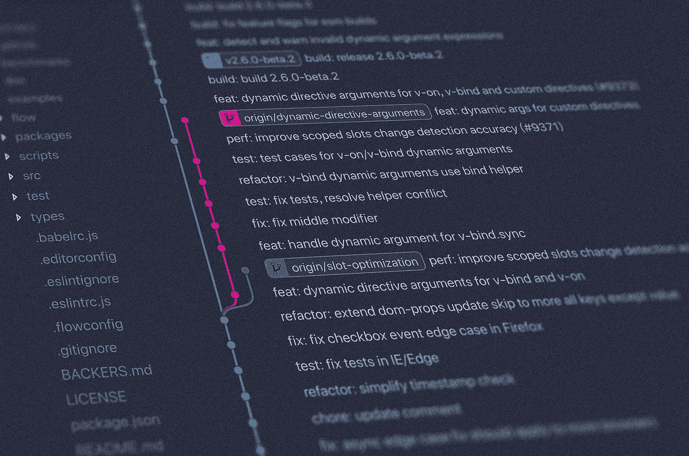
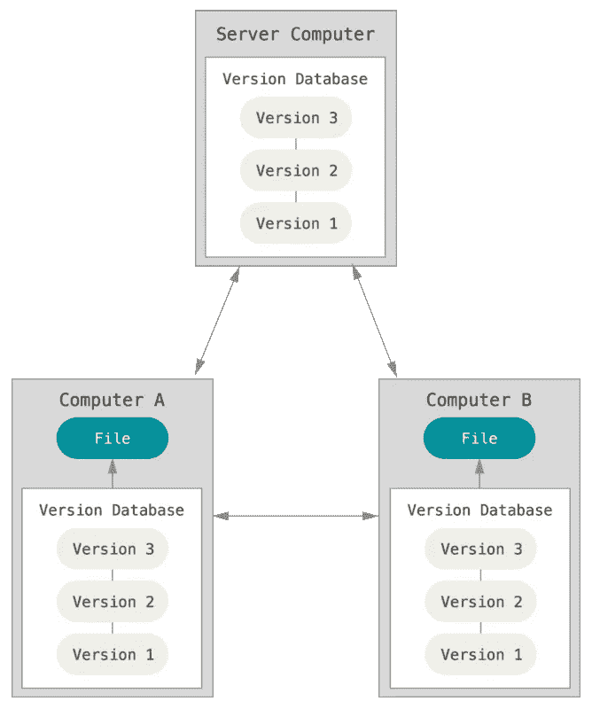
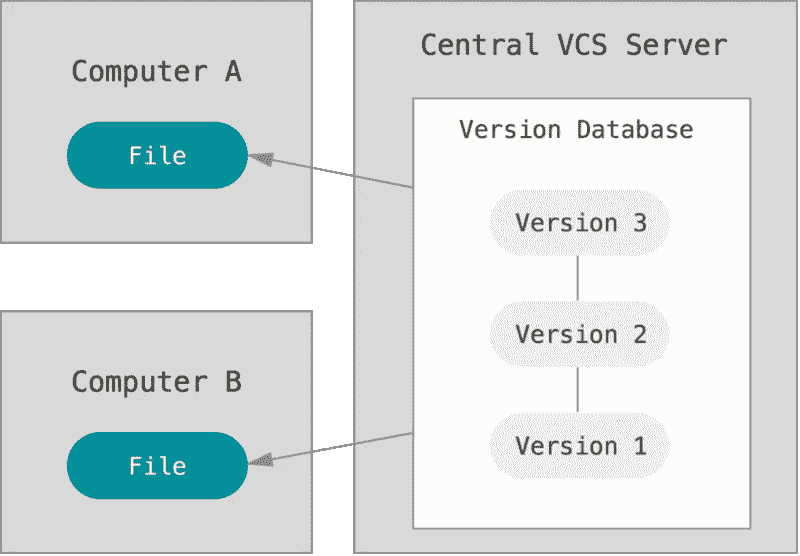

# Git 第 1 部分:基础知识

> 原文：<https://medium.com/analytics-vidhya/git-fundamentals-5d9c29c3e448?source=collection_archive---------23----------------------->

你是 git 新手还是想刷新一下知识？是的，我完全可以向你推荐这个系列。

照片由[扬西·敏](https://unsplash.com/@yancymin?utm_source=unsplash&utm_medium=referral&utm_content=creditCopyText)在 [Unsplash](https://unsplash.com/s/photos/git?utm_source=unsplash&utm_medium=referral&utm_content=creditCopyText) 上拍摄

今天，git 是最流行的版本控制系统之一。原因之一是 git 提供了一个简单的入口点。如果你是初学者，你会很快学会什么是分支以及如何创建它。你不需要先完全理解 git，这在开始的时候很好。但是，随着您对 git 的深入研究，您将能够更高效地工作、处理问题和使用强大的新功能。在本文中，您将对 git 的能力有一个基本的了解，稍后，我们将深入探讨更高级的东西。

# 议程

*   Git 是什么？
*   为什么我们应该使用 Git？
*   关键术语
*   Github/Bitbucket/Gogs…
*   结论

# Git 是什么？

如果我们查看 Git 官方网站，我们能读到的第一句话是:

> *Git 是一个免费的开源分布式版本控制系统[…]*
> 
> *-*-[https://git-scm.com/](https://git-scm.com/)

这句话可能听起来令人困惑，但是不要担心，让我们简化它。我相信“Git 是一个自由和开源的”这一部分应该是不言自明的。所以我们将直接继续“…分布式版本控制系统”

先从版本控制系统的含义说起。版本控制系统的主要任务是存储对文件的更改。因此，我们有所有已经发生的变化的记录，我们可以非常容易地回到历史上的任何一点。但是我们进一步了解到 git 是一个**分布式**版本控制系统。在这种情况下，基础服务器/计算机和每个用户都有完整的历史记录。下面你可以看到它的样子。

[https://git-scm.com/book/en/v2/images/distributed.png](https://git-scm.com/book/en/v2/images/distributed.png)

几年前，该标准由一个集中的版本控制系统组成。但是它不得不与许多不利条件作斗争。最大的问题之一是单点故障。在集中式版本控制系统中，基本服务器/计算机是唯一包含整个历史的服务器/计算机。如果它是不可及的，我们就不可能得到我们的全部历史。为了更好的理解，请看下图。

[https://git-scm.com/book/en/v2/images/centralized.png](https://git-scm.com/book/en/v2/images/centralized.png)

# 为什么我们应该使用 Git？

> 首先，这只是我的想法。你可能不同意我的观点。所以再查一遍所有的点，形成自己的看法。

现在我们知道 git 的意思了，但是我为什么要用它呢？以下是我使用 git 的七个主要原因。

1.  访问整个历史。
2.  不同功能的同时工作。
3.  提供的临时区域功能强大，非常有用。
4.  Git 应用广泛。你在职业生涯中需要它的可能性很高。
5.  许多流行的存储库管理服务都使用 git，比如 Github 或 Bitbucket。
6.  Git 提供了许多工具。你可以用，但不一定要用。
7.  最后，开始非常简单。

# 关键术语

在第三部分，我会让你了解基本的术语。我们将看看远程和 git 存储库，看看什么是分支，什么是提交。敬请关注，我们开始吧。

照片由[莫里茨·施米特](https://unsplash.com/@moroo?utm_source=unsplash&utm_medium=referral&utm_content=creditCopyText)在 [Unsplash](https://unsplash.com/s/photos/key-terminology?utm_source=unsplash&utm_medium=referral&utm_content=creditCopyText) 上拍摄

*   **git 库** 一个 Git 库包含了你的整个项目以及自从你创建了你的 Git 库以来你所做的所有修改。所有这些信息都存储在。git 目录。这是在您创建本地 git 存储库时生成的。您通常可以在项目文件夹中找到它。的。git 文件夹包含所有元信息和整个历史。
*   **远程资源库(在 Github、Gogs 上…)** Github、Gogs 等很多平台都为你提供远程资源库。远程存储库是本地 git 存储库的克隆，通常代表中央存储位置。今天，他们中的大多数都有更多的功能来帮助你和你的团队处理日常工作。
*   **分支** 简而言之，分支只是一个指向提交的指针。我们将在后面的文章中找到为什么这个句子有意义。现在，您需要知道的是，一个分支指的是项目的一个特定状态。
*   **提交** 提交包含配置细节，通常是对您上次提交和 blob 树的引用，而 blob 树又包含对 blob 的引用。Git 使用提交来收集所有的更改并将它们保存在快照中。在我们提交任何东西之前，我们需要添加一个描述。
*   **合并** 假设你已经在你的特征分支中完成了一个特征，并且想把它放到你的主分支上。在这种情况下，git 提供了合并功能。这意味着我们可以非常容易地将来自我们的特征分支的变更与我们的主分支合并。简而言之，合并意味着将一个分支的变更应用到另一个分支。
*   **拉取请求** 拉取请求是用另一个分支的状态更新您的分支的请求。您可以将其分配给其他人，并进行进一步的设置。

# Github/Bitbucket/Gogs…

最后，我将讨论使用 git 的存储库管理服务。今天有许多这样的人。存储库管理服务在 git 的流行中扮演了重要的角色。我们用它们来分享我们的代码，在团队中工作，构建我们的项目。但是，这很重要，这些平台使用 git。他们不等于饭桶。

[escueladevrock.com/](https://escueladevrock.com/)

# 结论

在本文中，我解释了 Git 的基础知识。最后，您应该知道 Git 是什么，为什么以及何时应该使用它，关键术语以及 Git 和存储库管理服务之间的区别。我希望这篇文章有助于入门或更新你的知识。如果你有任何问题或反馈，请在评论中告诉我。回头见。

在我的下一篇文章中，我们将看看'[Git Part 2:The Three world System](https://henrysteinhauer.medium.com/git-part-2-the-three-worlds-system-af756af2bf72)'。