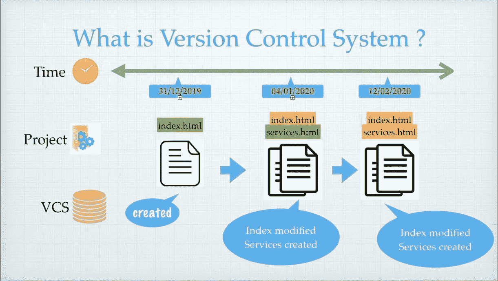
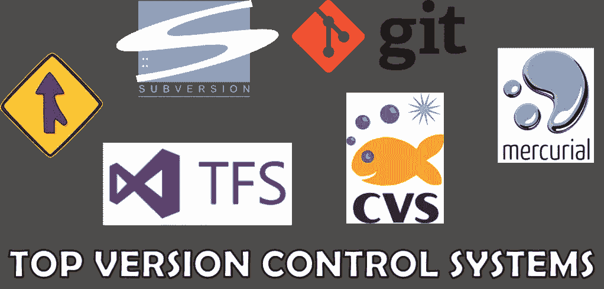

# Git 基础

> 原文：<https://medium.com/analytics-vidhya/git-fundamentals-e88f27a094e7?source=collection_archive---------22----------------------->

## Git 是什么？​

*   Git 是分布式版本控制系统(DVCS)
*   由 Linus Torvalds 创建，他也创建了 Linux
*   始于 2005 年
*   用 Perl 和 C 写的
*   在 Linux、OS X、Windows 和许多其他操作系统上运行

## 设计目标:

*   速度
*   简单
*   强大的分支/合并支持
*   非常适合大型项目

## 版本控制系统

*   版本控制系统是管理系统，它管理您在项目中所做的更改，直到项目结束。​
*   变化可能是添加一些新的功能或文件。这些变化被称为不同的“版本”。​
*   版本控制系统总是将您的旧版本整齐地打包在其中。只是因为有时如果我们想回滚，我们可以这样做。​

## **为什么要版本控制？**

*   合作

*   存储版本:所有版本的快照都被正确地记录和存储。版本命名也很准确。

## 版本控制工具

## **Git & GitHub:**

*   Git 是一个版本控制工具，允许我们执行各种操作，如拉、推、签出、获取、重置、删除。

*   GitHub 是版本控制协作的核心托管平台。

## **Git 的特点:**

分布式:这个特性允许用户同时在同一个项目上工作，而不会干扰其他人的工作。

兼容:Git 兼容目前使用的所有操作系统。Git 库也可以访问其他版本控制系统的库，如 SVN、CVK 等。

**非线性开发** : Git 允许世界各地的用户远程执行项目操作。

**分支:**Git 中的分支提供了在不影响原始版本的情况下对项目进行修改的特性。

**轻量级:** Git 遵循无损压缩标准，压缩数据并将其存储在本地存储库中，占用非常少的空间。

**速度:**相比其他版本控制系统，Git 非常快，可伸缩性也很强。从本地存储库获取数据的速度比远程服务器快 100 倍。

**开源:** Git 是一个免费开源的分布式版本控制系统。它被称为开放源代码，因为它提供了根据用户需求修改其源代码的灵活性。

**可靠&安全:** Git 使用 SHA1 将所有记录以对象的形式存储在 Hash 中。SHA1 是一种将提交对象转换为 14 位十六进制代码的加密算法。

经济性: Git 是在通用公共许可证(GPL)下发布的，因此是免费的。

## Git **操作**命令&命令:

## 参考资料:

*   [https://confluence . atlassian . com/bitbucketserver/basic-git-commands-776639767 . html](https://confluence.atlassian.com/bitbucketserver/basic-git-commands-776639767.html)
*   https://stackoverflow.com/search?q=git+commands
*   【https://www.edureka.co/blog/git-commands-with-example/ 

感谢您的阅读。请尝试一下，玩得开心，并让我知道你的反馈！