# Git & Github 新手完全指南

> 原文：<https://medium.com/analytics-vidhya/git-github-full-guide-for-newbies-d882122354f2?source=collection_archive---------19----------------------->

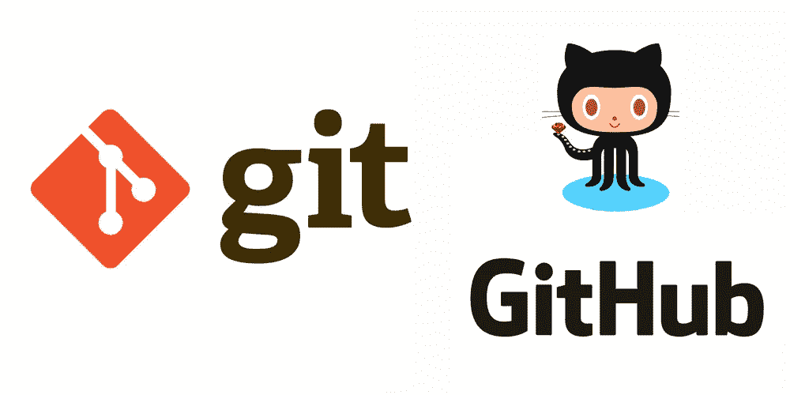

# **什么是 Github？**

它是一个平台，通过与其他开发人员合作，提供诸如代码托管、版本控制、代码审查、管理从开源到商业的项目等设施。

**Github 要领**

*   **Git**
*   ***储存库***
*   ***分支***
*   ***提交***
*   ***拉请求***

## **什么是 Git？**

***Git*** 是 Github 所构建的分布式版本控制系统，它用于跟踪任何一组文件中的变化。最初，它是为了在软件开发过程中协调开发源代码的开发人员之间的工作而设计的。

## 什么是存储库？

在 Github 中，你创建 ***库*** 来存储/托管你的代码。在这个库里面，你可以存储文件夹和任何类型的文件，比如 HTML，CSS，Javascript，PHP，Python，Java，文档，数据，图片等等。您也可以在 ***资源库*** 中包含一个关于您项目的许可文件和自述文件。 ***储存库*** 也可以用来储存想法或者任何你想要分享的资源。

## **有哪些分支？**

您可以在存储库内创建 ***分支*** 来同时处理不同版本的代码/项目。默认情况下，一个存储库有一个主 ***分支*** 。您在存储库中创建的任何其他 ***分支*** 称为 ***主*** ***分支*** 的副本。

大多数时候，新的 ***分支*** 都是为了 bug 修复和特性工作(例如:登录/注册特性)而创建的，与 ***主分支*** 分开。更改完成后，您可以将其他 ***分支*** 合并到 ***主分支*** 中。如果有人在您处理另一个 ***分支*** 时对 ***主分支*** 进行了更改，您可以将这些更新拉入您当前的 ***分支*** 。

## 什么是提交？

当你在使用一个存储库的时候，你必须 ***提交*** 你在已有存储库上所做的变更，使它们永久化。每个 ***提交*** (变更)都有一个说明，解释为什么做出变更。

## **什么是拉取请求？**

***拉*** 请求是 Github 协作中最重要的部分。使用 ***拉*** 请求，您可以提议您的变更应该与主分支合并( ***拉*** )。 ***拉*** 要求用颜色(绿色和红色)显示内容的差异、变化、增减。一旦有了 commit，你就可以打开一个 ***pull*** 请求并开始讨论，甚至在代码完成之前。

# 如何开始？

1.  创建一个 Github 账户([点击这里](https://github.com/join))
2.  下载并安装 Git ( [点击这里](https://git-scm.com/downloads))

# 需要初学者实践指导？

## 1.创建一个文件夹，打开里面的 ***Git Bash*** 。

## 2.创建文件

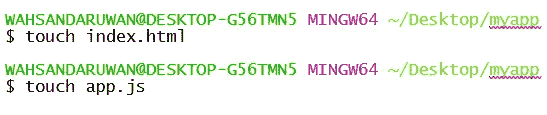

## 3.初始化这个文件夹内的 ***Git 库***

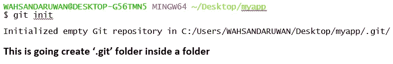

## 4.添加您的用户名和电子邮件

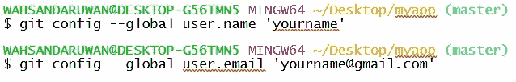

## 5.重置您的用户名和电子邮件

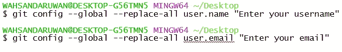

## 6.将'***' index.html***'文件添加到**暂存区( **git repo** )**

**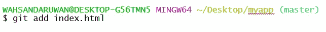**

## **7.查看 ***暂存*** 区有哪些**

**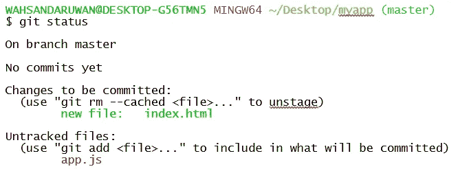**

## **8.从*区域中删除'*'文件****

***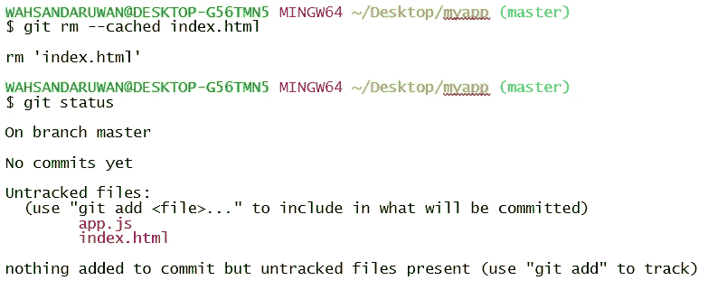***

## ***9.添加所有' ***。html*** 文件进入 ***暂存*** 区***

**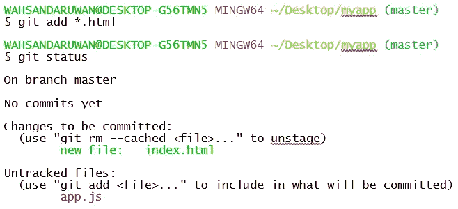**

## **10.将所有 ***文件*** 添加到 ***暂存*** 区**

**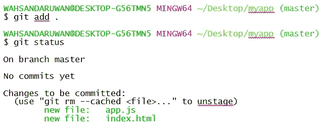**

## **11.如果我们做一个 ***改变*** 而我们在 ***暂存*** 区域**

**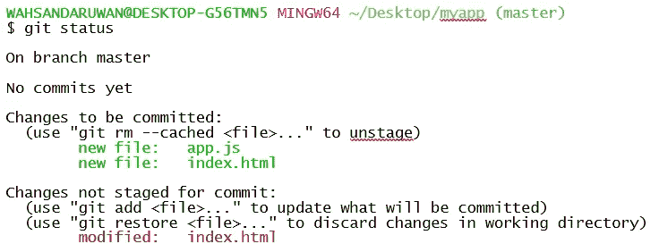**

## **12.默认 ***提交*****

**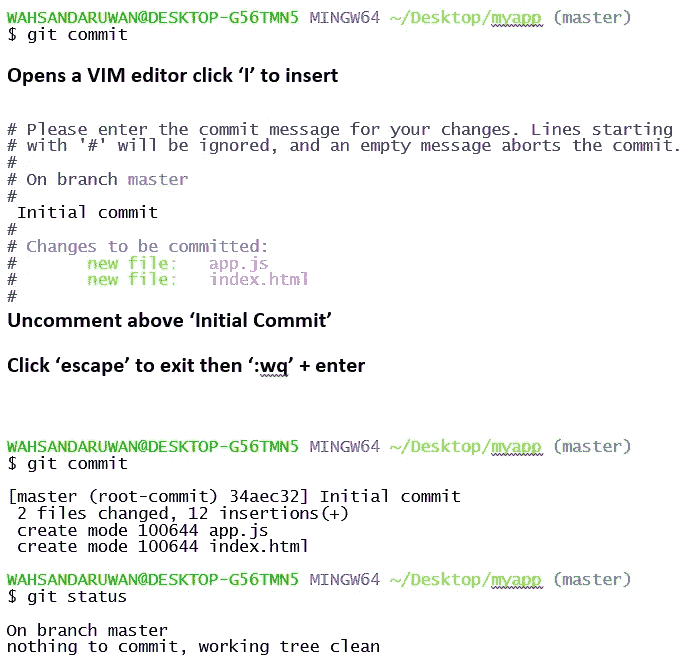**

## **13.在' ***app.js*** '文件中做一个 ***修改*** 并添加它**

**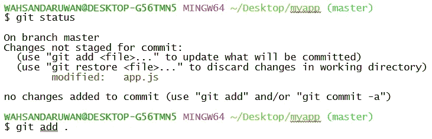**

## **14. ***跳过 ***VIM*** 编辑部分，提交*****

*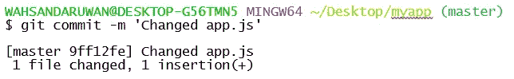*

## *15.创建并使用' ***。gitignore'****

***里面的*。gitignore*** 文件，我们将不想包含的文件和文件夹名称添加到我们的 ***git*** repo 中。*

**

## *16.创建一个名为' ***log.txt*** 的示例文件*

*我们不打算将该文件包含在 ***git*** repo 中。*

**

## *17.将此文件名添加到' ***。gitignore'*** 文件然后，*

*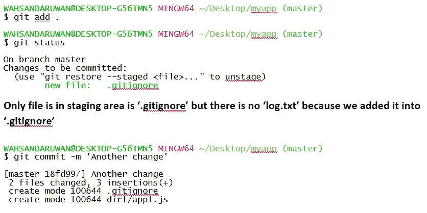*

## *18.将文件夹添加到 ***。gitignore'*** 文件*

*创建两个文件夹，分别名为: ***目录 1*** 和 ***目录 2*** 。在每个文件夹内创建一个样本 ***js*** 文件。然后将' ***/dir2*** '加入 ***。gitignore*** 文件。*

*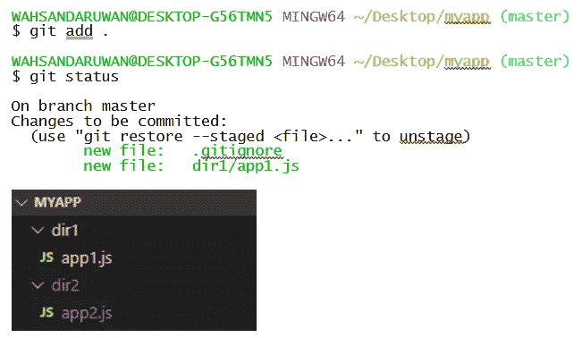*

## *19.创建一个 ***分支*** 为‘登录*特征**

**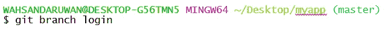**

## **20.切换到' ***登录'分支*** ，创建'***index.html***文件**

**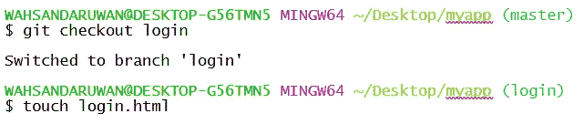****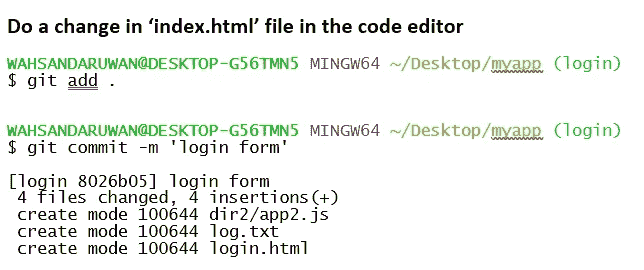**

## **21.再将 ***切换到******主‘分支*****

**当我们将 ***再次切换*** 到 ***主分支*** 时，在代码编辑器中所有的修改和文件都将消失，因为那是在 ***中登录*** 分支。**

****

## **22.将' ***'登录*** '分支并入' ***'主控'分支*****

**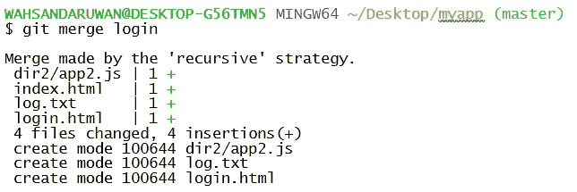**

## **23.使用 ***远程*** 存储库**

**登录 ***GitHub*** 创建一个资源库，然后他们会显示一些步骤。我们已经做了其中的一些，只是从这一步开始。**

******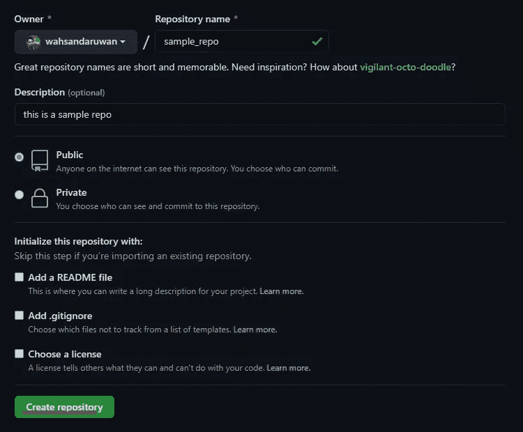****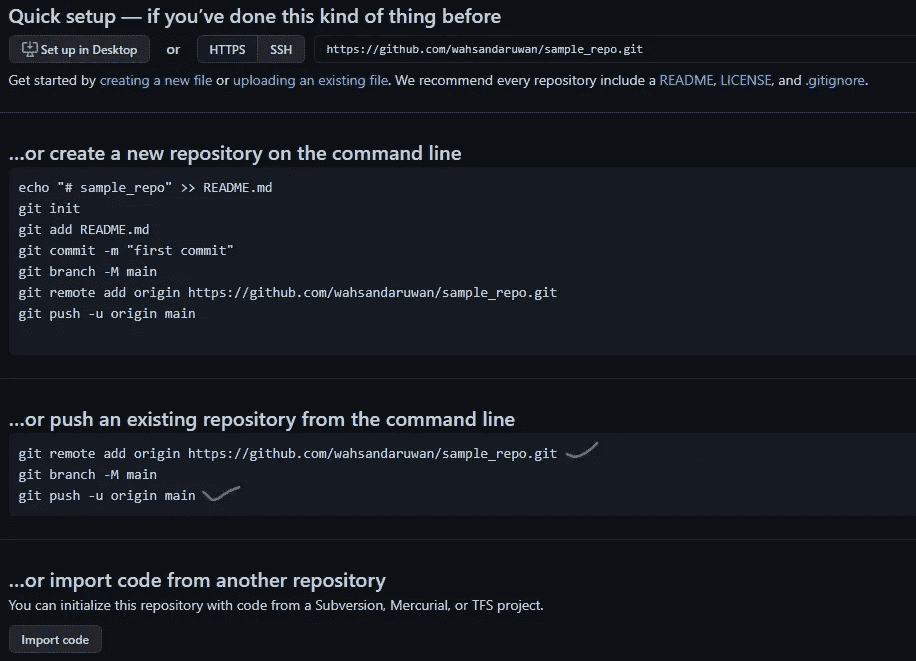****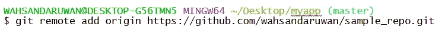**

## **24.将 ***本地*** 仓库推入到那个 ***远程*** 仓库中**

**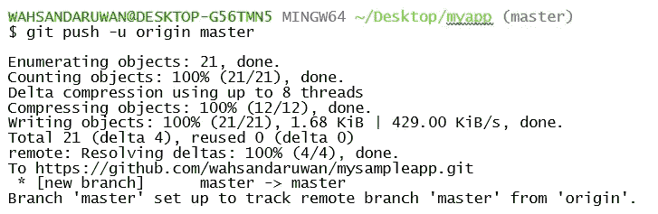****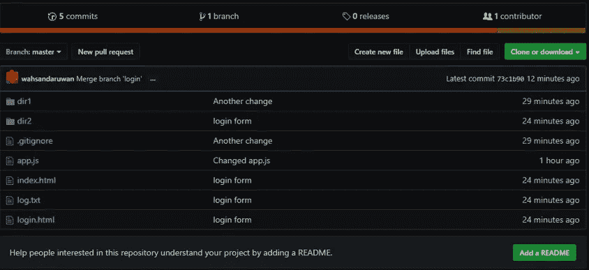**

## **25.更改远程存储库**

**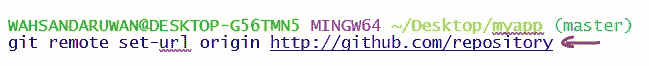**

## **26.添加“自述”文件**

**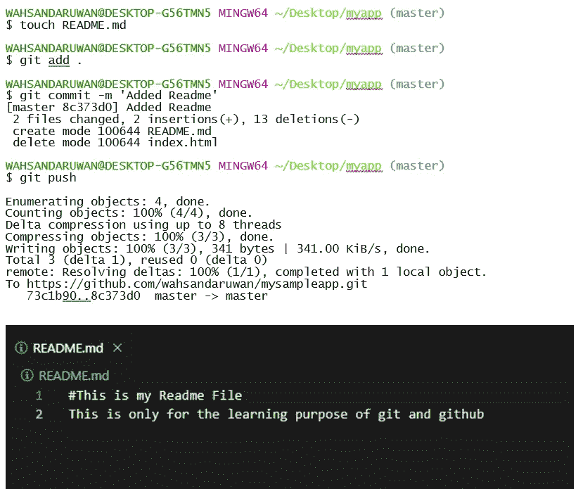**

## **27.克隆项目**

**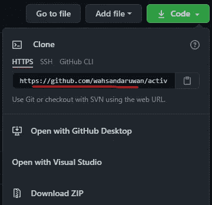****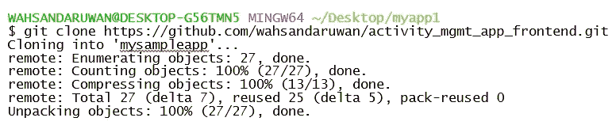**

## **28.拉取请求**

**从远程存储库获取和下载内容，并立即更新本地存储库以匹配该内容**

****

## **参考**

** [## GitHub 介绍| GitHub 学习实验室

### 人们使用 GitHub 来构建一些世界上最先进的技术。无论您是可视化数据还是…

lab.github.com](https://lab.github.com/githubtraining/introduction-to-github)**