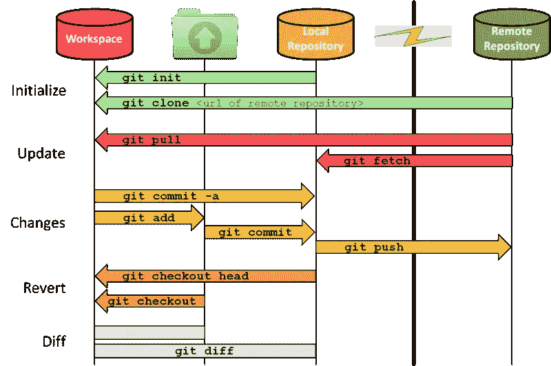

# Git —最常用的命令

> 原文：<https://medium.com/analytics-vidhya/git-most-frequently-used-commands-9df9f200c235?source=collection_archive---------14----------------------->

```
**Git:** Version control system to track changes in your projects.
It is also used to push and pull changes from remote repositories like GitHub, GitLab, BitBucket, etc.**GitLab, GitHub, BitBucket:** Services that allow to host your project as a remote repository and serve as repository managers that also have additional features to help SDLC(Software Development Life Cycle) and CI(Continuous Integration), CD(Continuous Deployment).
```

# 工作流程



**工作区↔暂存↔本地存储库↔远程存储库**

# 1.git —版本

git 的显示版本。也用于检查是否安装了 git。

# 2.git 配置

```
**## Set**
git config --global user.name "Harsh Singhal"
git config --global user.email "harshsinghal726@gmail.com"**## Check**
git config --global user.name
git config --global user.email
```

# 3.git 初始化

将现有的未版本化项目(工作区)转换为 git 存储库，或者创建一个新的空 git 存储库。

执行这个命令会创建一个`.git`子目录，其中包含新存储库的所有元数据。此元数据包括对象、引用和模板文件的子目录。还创建了一个`HEAD`文件，它指向当前签出的提交。

# 4.git 克隆

将现有的 git 存储库下载到您的本地计算机上。

`git clone -b branch_name <git url>:` `-b`参数让您指定一个特定的分支来克隆，而不是远程`HEAD`指向的分支，通常是主分支。

**git init vs git clone:** 在高层，它们都可以用来*初始化一个新的 git 库*。然而`git clone`是依赖于`git init`的。在内部，`git clone`首先调用`git init`来创建一个新的存储库。然后，它从现有的存储库中复制数据。

# 5.git 状态

显示:

*   当前分支
*   在*工作区↔暂存区*之间有差异的文件(未跟踪的(新)文件和未暂存的变更)
*   在*暂存↔本地 Git 库*之间有差异的文件(未提交的更改)

# 6.git 添加

将工作区中的更改添加到临时区域。

*工作区→暂存区*

# 7.git 提交

将临时区域中的更改添加到本地 Git 存储库中

`git commit` : *中转区→本地 git 存储库*

`git commit -a` : *工作区→本地 git 库*(不包括未被跟踪的文件，只包括在某个时候用`git add`添加的文件)

`git commit -m ‘commit message’`

# 8.git push & git pull

**推送:**将本地 git 存储库中的变更添加到远程存储库中

`git push <remote> <local>`:本地 git 库 *→远程 git 库*

**拉:**从相应的远程 git 储存库更新本地 git 储存库

`git pull <remote> <local>`:本地 git 仓库←远程 git 仓库

# 9.git 分支

列出所有本地分支机构。

`git branch -a`:同时列出所有远程分支

`git branch -d <branch>`:删除指定的分支

`git branch <new branch>`:新建一个分支机构

# 10.git 检验

在不同的分支之间导航。

`git checkout <branch>`

`git checkout -b <new branch>`:从你当前的分支创建一个新的分支并切换到它。

# 11.git 合并

将来自多个分支的变更整合到一个分支中。

`git merge <branch>`

# 12.git 遥控器

管理与远程存储库的连接。

它允许您显示当前连接的遥控器，还可以添加新的连接或删除现有的连接。

`git remote -v`:列出所有远程连接

`git remote add <name> <url>`:创建新的远程连接

`git remote rm <name>`:删除与远程存储库的连接

`git remote rename <old name> <new name>`:重命名远程连接

# 13.获取 git

从相应的远程 git 储存库更新本地 git 储存库。Git fetch 不会改变您的工作空间，它保持提取的内容是独立的，直到它被合并。

`git fetch <remote> <local>`

`git checkout <remote>/<local>`:查看变更

**git fetch vs git pull:***git pull = git fetch+git merge*

# 14.git 日志

显示提交的快照。

# gitignore:

一个文本文件，告知项目中要忽略哪些文件和文件夹。

## 参考资料:

> **参数:**[https://git-scm.com/](https://git-scm.com/)
> 
> **Git 视频教程(初学者):**【https://www.youtube.com/watch?v=kyL71RoNcCo 
> 
> **Javapoint git 教程:**[https://www.javatpoint.com/git](https://www.javatpoint.com/git)
> 
> **Bitbucket git 教程:**[https://www . atlassian . com/git/tutorials/learn-git-with-bit bucket-cloud](https://www.atlassian.com/git/tutorials/learn-git-with-bitbucket-cloud)
> 
> **Medium 博客:**[https://Medium . com/@ nendhruv/essential-git-commands-every-developer-should-know-1249 d4d 597 b5](/@nendhruv/essential-git-commands-every-developer-should-know-1249d4d597b5)
> 
> **合并说明:**[https://learning passion . WordPress . com/2016/06/20/git-tutorial-day-to-day-use-part-7-Merging/](https://learningpassion.wordpress.com/2016/06/20/git-tutorial-day-to-day-use-part-7-merging/)