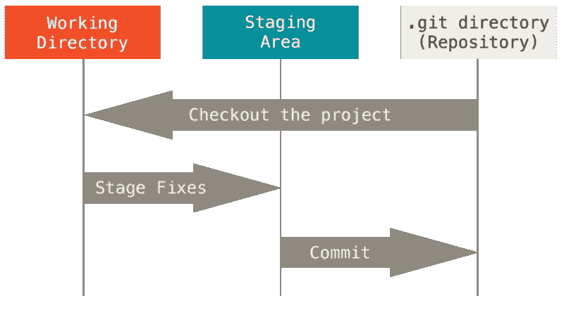

# Git 第 2 部分:三个世界系统

> 原文：<https://medium.com/analytics-vidhya/git-part-2-the-three-worlds-system-af756af2bf72?source=collection_archive---------19----------------------->

今天我们来看看 Git，以及为什么 staging area 非常有用。

菲尔·博塔在 [Unsplash](https://unsplash.com/?utm_source=unsplash&utm_medium=referral&utm_content=creditCopyText) 上的照片

今天有许多不同的版本控制系统。其中最著名的是 Git。但是原因是什么呢？Git 是如何脱颖而出的？今天将讨论一个重要的原因。

# 议程

*   三层系统
*   中转区的优势
*   结论

# 三层系统

Git 由三个部分组成。下面你可以看到他们的名字和顺序。首先，我们将尝试了解它们是如何工作的。

[https://git-scm.com/book/en/v2/images/areas.png](https://git-scm.com/book/en/v2/images/areas.png)

**工作目录** 在**工作目录**上，我们有一个单独的未压缩版本的项目。所以我们可以进行修改和添加新功能。此外，工作目录中的更改会被标记，但不会存储在 Git 数据库中。如果我们丢失了更改，就不可能恢复它们。下面是已标记的已更改文件的概述。

**暂存区** 第二层称为**暂存区**或**索引**。一旦我们将变更从工作树移动到临时区域，我们就将所有变更的快照存储到 Git 数据库中。我们不改变的文件只被引用。对应的命令是`git add filename`。或者如果您想保存所有的更改，您可以使用通配符。为此，您必须用点字符替换文件名。这些更改不会永久保存。垃圾收集器会删除在一定时间内没有提交到 git 目录的所有更改。要查看**中转区**的状态，以及**工作区**的状态，如上图所示，我们需要键入命令`git status`。

**Git 目录
最后一部分是 **Git 目录**。这是 Git 数据库中永久存储快照的地方。此外，所有保存的更改都将链接到项目历史记录。为此，我们必须从我们的**临时区域** - > `git commit -m "description"`提交变更。**

# 中转区的优势

大多数版本控制系统由两层系统组成。Git 脱颖而出的一个原因是它们之间的层。但是为什么呢？优势是什么？

在我看来，最大的好处是控制我们想要提交到 git 目录的内容。在其他版本控制系统中，我们简单地存储我们所做的所有更改。但是在 Git 中，就有点不一样了。在这里，我们可以进行更改，然后决定要存储哪些文件。我们有像`git reset`、`git stash`、`git commit -p`等更多的命令。所以我们可以完全自由地构建我们的提交。如果你有额外的好处，在评论里留下来就太好了。

# 结论

今天我们看了一下 Git 的三层系统。最后，你应该知道各层之间的区别以及它们的用途。我们还谈到了中转区的好处。如果你有任何问题或反馈，请在评论中告诉我。回头见。

在我的下一篇文章中，我们将通过。git 目录。系好安全带，我们走吧->探索。git 文件夹。