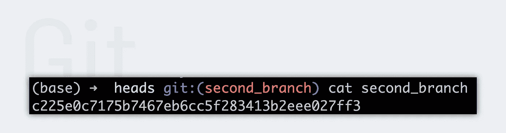

# Git 第 3 部分:探索。git 文件夹

> 原文：<https://medium.com/analytics-vidhya/git-part-3-discover-the-git-folder-ca3e828eab3d?source=collection_archive---------9----------------------->

你有没有想过？git 文件夹是干什么用的？你没有吗？没问题。今天我们将详细探讨一下这个问题！！


汤姆·霍尔姆斯在 [Unsplash](https://unsplash.com/s/photos/discover?utm_source=unsplash&utm_medium=referral&utm_content=creditCopyText) 上拍摄的照片

在此过程中，我们将对存储系统有一个总体了解，并理解为什么短语“*分支只是一个指针*”是有意义的。

# 议程

*   。吃什么？？？
*   的结构。git 文件夹
*   结论

# 。吃什么？？？

您可能已经知道，如果您想要创建一个 git 存储库，您必须在您的终端中键入 **git init** 。但是你也知道一个新的。git 文件夹是那一刻自动生成的？当您查看您的项目目录时，您会找到它们。


Git 把所有东西都储存在那里。如果我们往里面看，我们可以看到许多文件和文件夹。乍一看，这似乎令人困惑，但不要担心，我们将一步一步地检查一切。


# 的结构。git 文件夹

首先，您的文件夹可能包含一些附加文件和文件夹。这是因为除了上面显示的文件和文件夹之外，还有其他一些文件和文件夹。然而，在顶部，您可以看到所有那些通常在创建 git 存储库时出现的内容。所以让我们从对象目录开始。

## 目标

当我们打开它，我们只看到一个信息和包文件夹。但是以后会添加更多的目录。Git 将所有暂存文件存储在其中。


但这不是唯一的事情。稍后，我们将查看存储在 objects 文件夹中的另外两种类型。总的来说，我们可以说这些就是我们通常所说的**数据库存储**。回到我们的项目文件夹，在控制台中输入下面一行:

```
echo 'test' >> test.txt
git add test.txt
```

首先我们创建一个新文件 **test.txt** ，内容为 **test** 。接下来，我们将它添加到临时区域。

> 不确定集结地是哪里？休息一下，看看我之前的文章' [Git 三界体系](/analytics-vidhya/git-part-2-the-three-worlds-system-af756af2bf72)'。在那里，我将简要解释 Git 中的三个不同的区域。

现在我们可以回到*了。git/objects* 文件夹。


您将看到一个新目录。Git 将所有内容存储在 **160 位**哈希值中。杨帆看起来是一个 **40 位数**长的十六进制数。你可能在想，“**等一下。我只能看到两个十六进制数字。其余的在哪里？**”。Git 使用每个散列的前两个字符创建一个文件夹，其中包含一个名为的文件，最后 38 个字符。所以您只能看到每个哈希的前两个字符。Git 这样做是为了让内存系统更快。但是整个 40 位数字是密钥，文件的内容是值。要检查散列，我们可以键入:

```
git cat-file -p 9daeafb9864cf43055ae93beb0afd6c7d144bfa4
```

**-p** 允许我们看到所有的文件变化。在我们的例子中，您只看到“测试”。哈希取决于更改和元数据，因此您的哈希会有所不同。如果我们想将它链接到本地 git 历史，我们需要提交。就这么办吧。

```
git commit -m "feat: Create a test.txt file with the content test"
```

因此，我们创建了第一个提交。变回。git/objects 文件夹并键入 **ls -la** 。您应该拥有与下面相同数量的目录。


创建了两个新文件夹。但是为什么有两个新目录呢？我们只推送一个提交。我们来分析一下，看看每个对象是什么类型。为了获得对象的类型，我们在 **git cat-file** 命令中用 **-t** 替换 **-p** 。

```
**our tracked changes**
---------
git cat-file -t 9daeafb9864cf43055ae93beb0afd6c7d144bfa4
// blob**new commit**
-----------
git cat-file -t 2b297e643c551e76cfa1f93810c50811382f9117
// tree
git cat-file -t b9ca915ed5e9507d44dbfaebc8a64b0f2ba52649
// commit
```

现在我们可以看到， **2b…** 哈希存储了一个叫做 **tree** 的东西，而 **05…** 哈希存储了一个叫做 **commit** 的东西。为了获得更详细的理解，我们必须更深入地研究 git 的内存系统。但是我认为那太多了。我们将在我的下一篇文章中更详细地讨论这个问题。目前，为了获得更好的定位，我们可以说， **blob** 只存储内容。**树**存储附加信息，比如内容属于什么文件，是什么类型的文件，最后**提交**锚定历史中的更改。

## 参考文献

下面你可以看到**参考文件**文件夹的结构。在其中，我们找到两个子目录。heads 目录包含所有分支，tags 目录包含历史中的所有书签。


**磁头** 我们先从磁头目录开始。当我们看里面的时候，我们会发现一个叫做 master 的文件。它包含对上次提交的引用->**b9ca 915 ed 5 e 9507d 44 dbfaebc 8 a 64 b 0 F2 ba 52649。**

但这意味着什么呢？分支是 git 的重要组成部分。每个分支都完全独立于所有其他分支。

> 如果你想了解更多关于分支的知识，请阅读我的 [git 基础](/analytics-vidhya/git-fundamentals-5d9c29c3e448)文章。

一旦我们创建了一个名为 **second_branch** 的新分支，并查看了 **heads** 目录，我们将找到与我们的新分支同名的第二个文件。


该文件包含与文件母版完全相同的引用。现在，我们在 second_branch 中创建新的 commit，并再次显示这两个文件的内容。

```
**master**
---------
b9ca915ed5e9507d44dbfaebc8a64b0f2ba52649**second_branch** -----------
c225e0c7175b7467eb6cc5f283413b2eee027ff3
```

分支主机仍然有引用->**b9ca 915 ed 5 e 9507d 44 dbfaebc 8 a 64 b 0 F2 ba 52649，**，而 second_branch 现在有了对我们的**新提交**的引用。



我们可以说，当您创建一个分支时，在 heads 目录中会自动创建一个具有相同名称的新文件，引用来自当前提交。每次创建新的提交时，包含该文件的引用都会发生变化。

> 所以，分支只是指针*。*

**标签
标签**有两种不同类型的书签。它们中的每一个都存储在标记目录中。第一个被称为**轻量级标签**，它只是对一个提交的引用，比如 heads 目录中的文件。第二个称为**注释标签**，存储更多信息。以下是其中的一个简短列表:

*   标记者姓名
*   电子邮件
*   日期
*   标记邮件

在大多数情况下，建议使用带注释的标签，但这取决于具体情况。

## 头

负责人赶紧解释。这是对活动分支的引用。所以 git 知道当前使用的是哪个分支。看看我们的头文件包含什么类型的**猫头**。


## 信息

在 info 目录中，我们可以找到关于我们存储库的附加信息。最著名的文件之一是 exclude 文件。它决定了哪个模式将被忽略。为了定义被忽略的文件和文件夹，我们在项目中使用了一个名为. gitignore 的文件。

## 配置

顾名思义，配置文件存储了您的存储库的配置。您可以为所有存储库全局定义配置，也可以在本地定义配置。在这种情况下，它只用于本地存储库。以下是您可以在配置文件中设置的几种配置。要查看完整列表，请访问 [git 配置页面](https://git-scm.com/book/en/v2/Customizing-Git-Git-Configuration)。

*   名字
*   电子邮件
*   编辑
*   排除污染物
*   自动更正
*   …

## 描述

在这里，您可以创建对您的存储库的简短描述。但是如果你不使用 [gitweb](https://git.wiki.kernel.org/index.php/Gitweb) ，这就没什么关系了。

## 钩住

有一些预定义的 git 函数会在某些事件上执行。在 Hooks 目录中，我们可以看到其中的一些。事件的一个例子是整个提交过程是否完成。


以上是我的教程库中的钩子列表。它们的名字后面都有“样品”一词。这确保了所有挂钩在开始时都被禁用。如果你想启用一个功能，你只需要删除'样本'这个词。您也可以编辑或编写自己的 git 挂钩。更多信息，点击[此处](https://git-scm.com/book/pl/v2/Customizing-Git-Git-Hooks)。

# 结论

就是这样。今天我们发现了。把文件夹放在一起。最后，您应该知道在。git 目录和它们的作用。此外，我们了解了 git 存储的概况，并理解了为什么短语“**分支只是一个指针**”是有意义的。我希望这篇文章有助于更深入地理解 Git 和。git 文件夹。如果你有任何问题或反馈，请在评论中告诉我。

在我的下一篇文章中，我们将研究 git 的内存功能是如何工作的。好吧，那么很快再见。