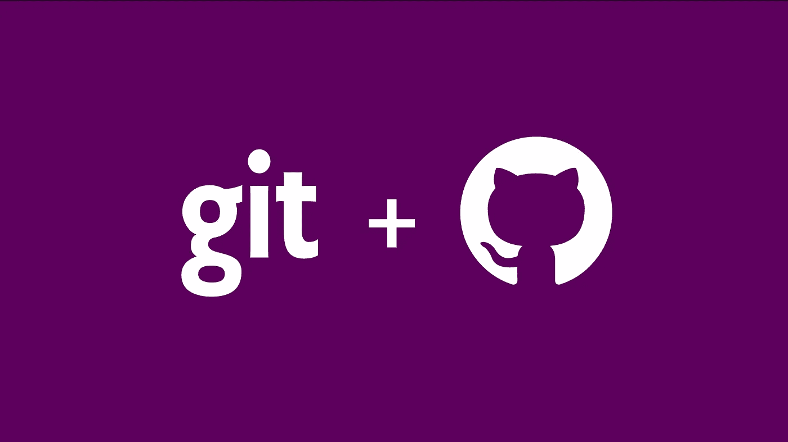

# Git 撤消更改

> 原文：<https://medium.com/analytics-vidhya/git-remove-changes-a6cd636ffe43?source=collection_archive---------22----------------------->



在很多情况下，您都希望从 GIT 中删除您的更改。在这篇文章中，我们将涵盖所有这些。

## 干净利落

clean 命令从您的工作目录开始，通过递归删除不受版本控制的文件来清理您的工作目录。

```
Removes untracked files from your working directory.
```

Git 为您提供了一个选项，让您可以进行一次预演，以了解该命令将删除哪些文件。

```
git clean -n (or) git clean --dry-run
```

一旦知道了将要删除的文件，就可以使用 git clean -f 强制删除这些文件。

```
git clean -f
```

如果您想删除未被跟踪的目录，您只需在命令中添加-d。

```
git clean -f -d
```

## GIT 重置

第二种情况是，当你已经做了一些改变，并且错误地进行了改变。现在，您希望删除这些暂存的更改，并返回到与遥控器匹配的版本。将简单地全面替换所有内容，而不进行检查。

```
git reset --hard
```

重置命令将重置工作目录中的所有文件，包括正确的文件和放错位置的文件。Git 为您提供了使用 *checkout* 命令重置单个文件的选项。

```
git checkout filename
```

如果您想从 staged 中删除文件，但不丢失您所做的更改，那么您需要使用命令`git reset HEAD`。此命令将从临时区域中删除您的文件，但这些更改仍可在您的本地工作区中使用。

## 恢复您上次提交的内容

第三种情况是当您已经提交了您的更改，但是您还没有推送它们。在这种情况下，你必须再次使用`reset`命令。

```
git reset --soft HEAD~1
```

如果您已经提交了不需要的提交，如果您需要保存历史，您需要运行一个`revert`命令。为此，您需要知道之前正确提交的 SHA 代码。在`git log`命令的帮助下，可以找到 SHA 代码。假设您的 SHA 代码是 123456，那么 revert 命令将是

```
git revert 123456
```

或者，如果您不需要保存历史，那么您可以使用`reset`命令。

```
git reset --hard 123456
```

一旦执行了 git 重置，就需要使用

```
git push --force
```

如果你喜欢这篇文章，请点击👏所以其他人会在媒体上看到它。