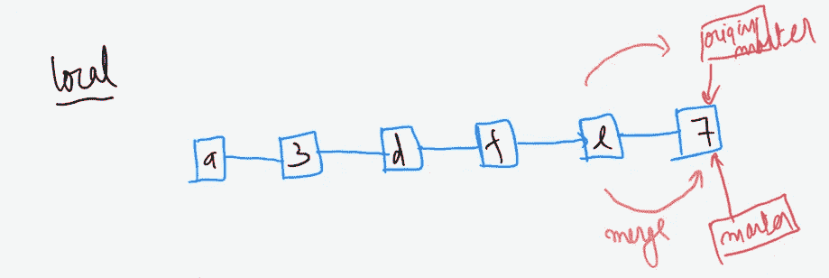

# 15 分钟后 Git 版本控制系统

> 原文：<https://medium.com/analytics-vidhya/git-version-control-system-in-15-minutes-ed60aa9e009a?source=collection_archive---------0----------------------->

在这篇文章中，我将谈论 Git，它是一个版本控制工具。现在发生的事情是，我们显然没有理解这个工具的基本原理，从而使 git 变得复杂。我们所做的就是拉和推。有时这很有效，但大多数时候我们会遇到合并冲突并陷入困境。至少对我来说是这样。所以我最终决定对这个神奇的工具有一个清晰的了解，这澄清了一切。所以让我们开始…

现在 Git 和 Github 是有区别的。Git 是一个版本控制工具，而 Github 是一个托管 Git 项目的服务，以便开发人员在处理项目时可以轻松协作。

版本控制系统分为两大类。一种是集中式模型，另一种是分布式模型。


在集中式模型中，有一台强大的中央计算机来管理项目，每个交互都必须通过它。看起来有点像电脑的盒子是开发人员在同一个项目上工作。而在分布式模型中，没有中央计算机，每个开发人员都有项目的完整副本。现在，在这种情况下，他们也可以在项目的某个特定功能上离线工作。

Git 是一个分布式版本控制系统，这里需要注意的重要一点是，每个开发人员都有一份完整的项目副本。

以下是 Git 行话中使用的一些关键术语。因此，在我们逐一讲解时，请继续回顾这些内容。你现在可以浏览一下。

**版本控制系统(VCS)或源代码管理器(SCM):**VCS 允许您:将文件恢复到以前的状态，将整个项目恢复到以前的状态，查看一段时间内所做的更改，查看谁最后修改了可能导致问题的内容，谁在何时引入了问题，等等。

**提交(快照):** Git 认为它的数据就像一组迷你文件系统的快照。每当您提交或者在 Git 中保存项目状态时，它基本上会拍摄一张当时所有文件的样子，并存储一个对该快照的引用。

**Repository(Repo)** :一个目录，包含你的项目工作，以及一些用于与 Git 通信的文件(在 Mac OS X 上默认隐藏)。存储库可以位于您的本地计算机上，也可以是另一台计算机上的单独远程副本。

**工作目录:**你在电脑文件系统中看到的文件。当您在代码编辑器中打开项目文件时，您正在处理工作目录中的文件。

这与已保存的文件(提交！)在存储库中。

当使用 Git 时，工作目录也不同于命令行的当前工作目录的概念，当前工作目录是您的 shell 现在正在“查看”的目录。

**签出:**当存储库中的内容被复制到工作目录时。从存储库中签出许多东西是可能的；文件、提交、分支等。

**Staging Area 或 Staging Index 或 Index:**Git 目录中的一个文件，它存储了关于下一次提交的内容的信息。您可以将一个临时区域想象成一个准备表，Git 将在这里进行下一次提交。暂存索引上的文件已准备好添加到存储库中。

**沙:**基本上是每次提交的 ID 号。它是一个 40 个字符的字符串，由字符(0–9 和 a-f)组成，根据 Git 中文件或目录结构的内容进行计算。“沙”是“沙哈希”的简称。阿沙可能看起来像这样:

e 2 ad 8 AE 3 e 2e 4 ed 40 add 75 cc 44 cf 9 d0a 869 afeb 6

分支:分支是当一个新的开发路线从主开发路线中分离出来的时候。这条可供选择的发展路线可以在不改变主线的情况下继续下去。

# Git 储存库

Git 存储库可以看作有三个主要区域——工作目录、暂存索引和保存所有提交的存储库。


现在假设我们在工作目录中创建了三个新文件。HTML，CSS 和 JS 文件。要保存这些文件的当前状态，我们必须首先将它们添加到暂存索引中。从暂存索引中，我们将它们添加到存储库，存储库保存文件的当前状态。我们将很快看到这样做的命令。

现在，我们再次更改 CSS 文件，暂存它并提交给 repo。


我们可以看到这些变更被记录在存储库中。因此，对于每次提交，git 都会获取已更改文件的快照，并将其存储在 repo 中。它为每个提交提供一个 7 位数的提交 Id，这是 40 位数 SHA 的前 7 个字符。提交 id 用于标识特定的提交。


# 创建 Git 存储库。

在本节中，我们将介绍三个命令。Git 初始化、Git 克隆和 Git 状态。

## **1) Git 初始化**

```
git init
```

在 shell 中，在您希望用 git 跟踪的工作目录中，该命令执行以下操作

1.  它设置了所有必要的文件和目录，Git 将使用它们来跟踪一切。
2.  所有这些文件都存储在一个名为**的目录中。饭桶。**
3.  的。git 目录就是我们一直在谈论的“回购”。这是 git 记录所有提交并跟踪一切的地方。

该目录的结构如下图所示。


## **2) Git 克隆**

```
git clone URL
```

当你需要做一些你电脑里没有的项目，或者你想为一个开源项目做贡献，你必须从网上克隆它。现在，当项目被托管在 Github 或 Bitbucket 上时，我们可以很容易地获得该项目的 URL。然后运行上面的命令，在您的计算机上获得该存储库的完整副本。


默认情况下，文件夹的名称是您从中克隆的名称。如果您想更改 Git 创建的文件夹的名称，您可以运行命令

```
git clone URL new-name
```

现在 git repo 已经在项目目录中被这个命令初始化了。我们不需要再次运行“git init”。

## 3) Git 状态

```
git status
```

这个命令用于检查我们所在的存储库的状态。让我们看看在我们之前克隆的项目上运行这个命令的输出。记住，你必须先用 cd 进入那个目录。


我将解释输出中的每一行。

**a)在主分支上—** 这告诉我们 Git 在主分支上(这是默认分支)。我将在本文稍后讨论分支。

**b)您的分支使用‘origin/master’是最新的—** 因为 git clone 用于从另一台计算机复制这个库，这告诉我们它使用我们从中克隆的那个是最新的。

**c)没有要提交的内容，工作目录干净—** 这告诉我们没有需要提交给本地回购的未决更改。

# 查看回购的历史记录。

在本节中，我们将看到两个命令— Git log 和 Git show。

## 1) Git 日志

它显示关于在回购中已进行的现有提交的信息。它显示了提交的 40 位 SHA、提交者、提交日期和时间。它还显示了提交消息。因此，给出有意义的提交消息是一个很好的实践。


您还可以通过编写以下命令在一行中获得提交 id 和消息—

```
git log --oneline
```


我们可以使用带有 git log 的 stat 标志来查看哪些文件发生了更改。

```
git log --stat
```


加号(+)告诉我们文件中插入的行数，减号(-)告诉我们文件中删除的内容。

这些变化到底是什么？使用“p”标志

```
git log -p
```


下面解释一下上面这几行是什么意思。(由 Udacity Git 课程提供)


# 向存储库添加提交。

这里我们将看到三个命令，分别是 git add、git commit 和 git diff。

## 1) Git 添加

```
git add
```

该命令将工作目录中的文件添加到临时索引中。我们已经创建了三个新文件，并希望使用版本控制来跟踪它们。


我们有一些新文件想开始追踪。Git 要跟踪一个文件，需要将它提交给一个存储库。对于要提交的文件，它需要在暂存索引中。git add 命令用于实现这一目的。

在工作目录中，键入命令..

```
git add .
```


圆点(。)在 add 命令之后，将每个已更改的文件添加到分段索引中。如果您特别想将文件添加到分段索引中，

```
git add <file-name>
```

## 2) Git 提交

```
git commit -m “Initial commit”
```

此命令用于将临时索引中的文件添加到存储库本身。请注意，只有在 git 添加过程中暂存的文件才会被提交到存储库中。


在上图中，我们可以看到这个提交被赋予了一个 7 位数的提交 Id。

## 3) Git 差异

```
git diff
```

该命令可用于查看已经完成但尚未提交的更改。


还有一个. gitignore 文件，您可以在其中写入不想用 git 跟踪的文件的名称。

# 标记、分支和合并。

在这一节中，我将向您展示如何创建分支以及如何将分支合并在一起。这部分有 4 个简单的命令，分别是 git 标签、git 分支、git 检验和 git 合并。

## 1) Git 标签

这个命令让我们向特定的提交添加标记。

```
git tag -a v1.0
```

上面的这个命令将允许您向当前提交添加标记。假设在提交之后，您将开始开发应用程序的 2.0 版本，并且您希望在这里添加一个标记或标签来让您记住它。


要向过去提交添加标签，

```
git tag -a v1.0 a87984b 
```

删除标签，

```
git tag -d v1.0
```

## 分支

如果你注意到了，到目前为止我们一直在做 master branch。那么什么是分支呢？如何创建一个以及如何在分支之间切换？

默认情况下，当我们初始化 git repo 时，它会为我们创建一个主分支，这是默认的分支名称。现在，您可以将一个分支视为一系列提交的发生。


在上图中，我们有三次提交。您可以在最近一次提交时看到主分支指针。我们还有一个特殊的 **HEAD** 指针，它指向我们当前工作的分支。它当前指向主分支指针。一个存储库中可以有 n 个分支。

为了创建一个名为**测试的分支，**我们可以运行命令—

```
git branch testing
```

这将在我们当前所在的提交位置创建一个新指针，如下图所示


要查看分支指针指向何处，请运行命令。

```
git log --oneline --decorate
```


为了切换到测试分支，

```
git checkout testing
```

这将指向测试分支。


现在，如果我们在这一点上提交，它将只移动测试指针，而主指针将保持在原来的位置。


如果我们通过键入以下命令再次切换到主模式—

```
git checkout master
```


**头**现在已经移到 master，我们在 master 分支。它会做两件事-

1.  它将头指针移回，指向主分支。
2.  它将工作目录中的文件还原到 master 指向的快照。也就是说，在测试分支的提交中所做的更改在编辑器中是不可见的。

让我们在主分支上再提交一次。


这就把我们带到了合并的概念。

同样，为了从特定的提交开始一个分支，我们可以运行命令—

```
git branch <name-of-branch> <commit-Id>
```

# 合并

将分支组合在一起称为合并。合并的原因是—

1.  要么你的特征分支的工作已经结束。或者，
2.  您完全想忽略这些更改，在这种情况下，您删除了分支。

合并有两种类型，**常规合并**和**快进合并。**


如果我们在主分支上，我们可以将侧栏合并为

```
git merge sidebar
```

这创建了新的提交，并且主指针向前移动到该提交。记住，我们可能会遇到合并冲突，我接下来会谈到这一点。


## 合并后删除分支

```
git branch -d sidebar
```

注意:-不能在一个分支上删除/合并该分支。

我们已经创建了一个新的分支社交链接，提交了一些，然后再次切换到 master。


如果我们通过运行命令合并社交链接分支—

```
git merge social-links
```

它被称为快速前进合并，因为**社交链接**在提交链上直接位于主链接之前。


# 合并冲突

Git 跟踪文件中的行。当完全相同的行在不同的分支上被改变并且我们合并它们时，合并冲突就发生了。(图片来自 www.udacity.com)


消除冲突后，保存、暂存并提交。

# 撤消更改

在本节中，我们将看到三个命令

```
git commit --amend
```

Amend 用于改变最近的提交。如果您在上一次提交时忘记添加文件，或者提交消息中有拼写错误，您可以使用它。[回顾历史](https://www.atlassian.com/git/tutorials/rewriting-history)。

```
git revert
```

Git revert 用于使用 SHA 反转提交。它不会删除任何提交，而是创建一个新的提交并撤消更改。

```
git reset
```

Git 重置实际上是危险的。它从回购中移除提交，并因此移除在这些提交中所做的更改。

# 使用遥控器(欢迎使用 github！)

现在我们正在讨论我们计算机中的本地存储库。但是在真实的场景中，许多开发人员会同时在不同的分支上工作。这些分支是特定于特定特征的。当这些特征准备好时，它们可以与主分支合并，并且可以被删除。这使得开发人员可以在一个项目上进行协作，远程甚至离线工作。

## 添加远程存储库

```
git remote add origin <URL>
```

在这里，我们给我们到存储库的远程连接起了一个名字 **origin** 。我们可以给它取任何名字。

```
git remote add origin https://github.com/user/repo.git
```

我们可以通过命令检查远程连接—

```
git remote -v
```


这个远程存储库也将是不同分支上的提交链。

当我们从远程获取提交到我们的本地存储库时，这是一个**拉。**顺便说一下 **fetch** 是另一个 git 命令，我将很快介绍它。


当我们将本地存储库中的提交迁移到我们连接的远程时，这被称为**推送**


```
git push <remote-shortname> <remote-branch-name>
```

示例-

```
git push origin master
```


让我们更仔细地看看 git clone 做什么，因为我们将在下一节中用到它。


git clone 所做的是，它将所有提交从 repo 拉入到我们在克隆时所在的本地主分支。它还创建了一个远程跟踪分支，即 **origin/master** ，它指向远程主分支上的最后一次提交。需要注意的重要一点是，尽管它是远程跟踪分支，但它不是远程主分支的实时表示。它只在推、拉和取时更新。现在提交时，只有主指针会移动。此外，如果其他合作者按下遥控器，也不会对我们的远程跟踪分支，即**源/主产生影响。**

# 拉取(区别！)

这是一个简单的公式—

**git pull = git fetch+git merge**

```
git fetch origin master
```

这个命令告诉 git 获取远程上的所有更改，但不要更改工作目录，即不要应用提交。

此外，合并将只有我们讨论过的两种类型— **常规**和**快速前进合并。**

让我们借助一个简单的例子来理解这一点，因为这是大多数合并冲突发生的地方。

**情况 1)** 您已从遥控器中拉出，更改仅存在于遥控器上。也就是说，其他人已经在远程提交了他们的提交，而您没有在本地提交任何提交。


当你运行这个命令时—

```
git pull origin master
```

在这种情况下，它会进行快进合并，而不会产生任何合并冲突。它执行以下操作:-

1.  将提交从远程拉入本地。
2.  在本地将源/主与主分支合并。



**案例 2)** 我们从远程拉数据，在本地提交，而其他人在远程提交


当我们现在做 git pull 时，它不起作用，因为两个回购不同步。

```
git pull origin master # this wont work 
```

我们首先要做的是—

```
git fetch origin master
```


这将从 repo 中获取远程提交，但不会合并它。它还将远程跟踪分支调整为远程上的最新提交。

现在，我们可以通过以下命令执行合并—

```
git merge origin/master
```

在这种情况下，它通过创建新的提交来执行常规合并。请注意，如果我们在 commit '7 '和' b '中更改了同一文件中的相同行，这里也会出现冲突。


现在，我们可以简单地将我们的更改推送到远程，假设没有人同时将他们的提交推送到远程。


现在远程和本地都同步了:-)

谢谢你们一直读到最后。分叉、重置基础等。仍然存在。我们下次会见到他们。希望这有所帮助！