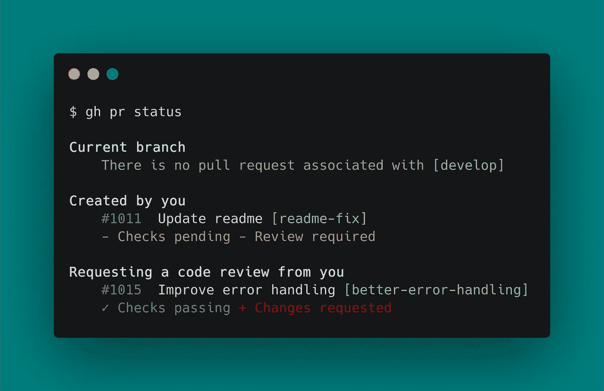

# GitHub CLI 将 GitHub 带到您的终端

> 原文：<https://medium.com/analytics-vidhya/github-cli-brings-github-to-your-terminal-809cea627d62?source=collection_archive---------6----------------------->

## GitHub CLI (gh)

## 再见，GitHub 中的上下文切换。你好，gh 航站楼

GitHub 是一个用于版本控制和协作的代码托管平台。它让你和其他人在任何地方一起工作。GitHub 是一个 Git 托管库，它为开发人员提供了通过…