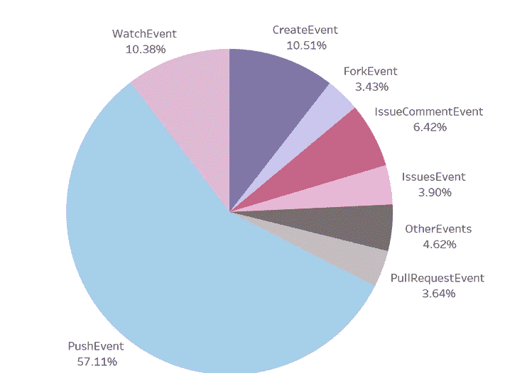

# 使用 Spark 的 GitHub 数据分析——有哪些流行的语言和存储库？

> 原文：<https://medium.com/analytics-vidhya/github-data-analysis-using-spark-what-are-the-popular-languages-and-repositories-c8fad5256d68?source=collection_archive---------14----------------------->

## 从非结构化、复杂的 JSON 数据到美丽的 Tableau 可视化和洞察，只需几分钟。

世界各地的开源开发者正在从事数百万个项目:编写代码和文档，修复和提交 bug，等等。 ***GitHub Archive*** 是一个记录公共 GitHub 时间轴的项目，将其存档，并使其易于访问以供进一步分析。

GitHub 上发生的所有事件都被捕获并汇总到最新的每小时存档中，并开放给任何人下载。请注意，只有公共存储库数据被归档，而非私有回购数据。

想知道 GitHub 开发者社区正在发生什么吗？最受欢迎的开源回购有哪些？GitHub 开发者大多使用哪些语言？请继续阅读。

# 步骤 1:下载存档数据

压缩 JSON 格式的 GitHub 档案数据可以从[这里](https://www.gharchive.org/)用任何 HTTP 客户端访问。用户可以根据需要使用以下命令下载一小时、一天、一周或一年的数据。


# 步骤 2:探索性数据分析

*   下载后，将数据提取到一个 JSON 文件中，并将 JSON 作为 Spark 数据帧加载，以便进行探索性分析。master_df 包含从 GitHub 档案下载的原始 JSON 数据。

```
file_path = “dbfs:/mnt/2015–01–01.json”
master_df = spark.read.format(“json”).load(file_path)
master_df.printSchema()
```


如您所见，JSON 文件嵌套很深，几乎有 10 层，有数百个嵌套字段。

所有字段都被加载到 master_df 中，但是我们只需要选择几个感兴趣的字段，清理它们，根据需要聚合数据，并为一组相关字段创建一个新的数据帧。

## 创建新的数据帧:main_df

*   main_df 是从 master_df 创建的，它只包含我们感兴趣的 6 列。参与者标识、组织标识、事件标识、创建时间、报告标识和事件类型。

```
main_df = master_df.select(F.col(“actor.id”).alias(“actor_id”), 
                           F.col(“org.id”).alias(“org_id”), 
                           F.col(“id”).alias(“event_id”), 
                           F.col(“created_at”), 
                           F.col(“repo.id”).alias(“repo_id”), 
                           F.col(“type”).alias(“event_type”))
main_df.show()
```


```
main_df.printSchema()
```


正如您所注意到的，所有字段都是字符串类型。您可以让它们保持原样，或者将它们转换为整数列。

```
main_df = main_df\
.withColumn("actor_id",main_df["actor_id"].cast(T.LongType()))\
.withColumn("org_id", main_df["org_id"].cast(T.LongType()))\
.withColumn("event_id", main_df["event_id"].cast(T.LongType()))\
.withColumn("repo_id", main_df["repo_id"].cast(T.LongType())))
```

org_id 字段中存在空值，可以将其设置为-1，而不是空值或 NaNs。

```
main_df = main_df.fillna({'actor_id': -1, 
                          'org_id': -1, 
                          'event_id': -1, 
                          'repo_id': -1, 
                          'event_type': "Missing", 
                          'created_at': -1})
```

根据所需的聚合级别，您可以将 *created_at* 列拆分为 date 或 hour 列。因为我只使用一天的数据，所以有一个日期字段是多余的，因此我只保留 created_hour。

```
main_df = main_df\
.withColumn("created_time",F.split(F.col("created_at"),"T")\
.getItem(1))main_df = main_df\
.withColumn("created_hour", F.split(F.col("created_time"),":")\
.getItem(0))\
.drop("created_at")\
.drop("created_time")main_df = main_df.withColumn("created_time",main_df["created_time"]\
.cast(T.IntegerType()))print(main_df.show())
print(main_df.printSchema())
```

## main_df 的汇总与分析

要了解一天中发生的参与者、组织、回购和事件的数量，我们可以查询 main_df 数据帧。

```
print(“Actors: “,main_df.select(‘actor_id’).distinct().count())
print(“Orgs: “,main_df.select(‘org_id’).distinct().count())
print(“Repos: “,main_df.select(‘repo_id’).distinct().count())event_types = 
[i for i in main_df.select(‘event_type’).distinct().collect()]
print(event_types)main_df.groupby("event_type")\
       .agg(F.count("event_id"))\
       .show()
```


```
# percentage of org_users out of total user baseprint((main_df.filter(main_df.org_id != -1).select('actor_id').distinct().count()/main_df.select('actor_id').distinct().count())*100)#percent of repos owned by organiazations out of total repos.print((main_df.filter(main_df.org_id != -1).select('repo_id').distinct().count()/main_df.select('repo_id').distinct().count())*100)
```

通过这种方式，可以查询 main_df 数据帧来对数据进行切片并生成见解。

## 创建数据框架 2: org_df

*   org_df 是从 master_df 创建的，只存储 GitHub repos 和用户的组织相关数据。它包含字段 org_id、名称和 org_url。
*   重复记录被删除，缺失值被替换为-1(对于整数列)和“缺失”(对于字符串列),如下面的代码片段所示。

```
org_df = master_df\
.select(F.col(“org.id”).alias(“org_id”),
        F.col(“org.login”).alias(“name”), 
        F.col(“org.url”).alias(“org_url”))\
.dropDuplicates([“org_id”])org_df = org_df.fillna({‘org_id’: -1,
                        ‘name’: “Missing”, 
                        ‘org_url’: “Missing”})
```

## 创建数据帧 3:有效载荷 _ 测向

*   payload_df 是最重要的数据帧，其中包含关于回购的数据，事件有效负载包含 19 个字段和数百个嵌套字段。

```
payload_df = master_df.select(F.col("id").alias("event_id"), 
                              F.col("payload.*"))
```

*   在提交、拉取请求、问题、forkee、评论、回购等所有领域中，我们对分析存储库感兴趣。

## 创建数据帧 4: repo_df

*   提取与存储库相关的所有数据，并将其存储为 repo_df，包含以下字段:event_id、repo_name、repo_id、watchers_count、forks_count、language、pull_req_id。

```
repo_df = payload_df.select(
F.col("event_id").alias("event_id"),                            F.col("pull_request.base.repo.name").alias("repo_name"),                        F.col("pull_request.base.repo.owner.organizations_url"),                            F.col("pull_request.base.repo.id").alias("repo_id"),                            F.col("pull_request.base.repo.watchers_count"),
F.col("pull_request.base.repo.forks_count"),                            F.col("pull_request.base.repo.language"),
F.col("pull_request.id").alias("pull_req_id")).dropna()repo_df = repo_df.withColumn("event_id", repo_df["event_id"]
                 .cast(T.LongType()))
```

删除空列，并根据需要转换 event_id 字段的类型。回购的 watchers_count 和 forks_count 字段是存储库受欢迎程度的指示器。

1.  查询 repo_df，提取 forks_count 和 watchers_count 最大的前 500 个回购，并将结果存储为 **top500_repos_df** 。
2.  查询 top500_repos_df 以确定拥有这些热门回购的前 10 家组织为 **top10_orgs_df** 。

# 步骤 3:数据可视化和洞察

下载上述步骤中创建的数据框作为 csv 文件，可用于可视化或进一步查询。

```
main_df.write.csv(‘/dbfs/mnt/main.csv’)
repo_df.write.csv(‘/dbfs/mnt/repo.csv’)
org_df.write.csv(‘/dbfs/mnt/org.csv’)
top500_repos_df.write.csv(‘/dbfs/mnt/top500_repos.csv’)
top10_orgs_df.write.csv(‘/dbfs/mnt/top10_orgs.csv’)
```

从 Tableau 连接到 csv 文件，并生成可视化效果，共享来自 GitHub 归档数据的见解。

你可以看看我从[这里](https://public.tableau.com/profile/vinodhini.sd#!/)创建的可视化画面。

## 即#1:事件总结

一天之内 ***50，000 个独立用户*** 处理 ***60，000 个独立存储库***
共触发 ***160，000 个 GitHub 事件。***



## Viz #2:按用户类型划分的事件数量

GitHub 有两种类型的用户——在 GitHub 上与其团队合作的组织用户，以及组织支付许可费用的用户。个人用户是学生和其他免费使用 GitHub 的用户。

***组织用户*** 触发最高数量的评论事件(IssueComment，
PullRequestReviewComment)，而 ***个人用户*** 触发最高数量的推送，创建&观看事件。


## 即#3:高度活跃的个人用户

前 100 名高度活跃的个人用户触发的推送事件数量远远超过所有其他事件。


## 即#4:十大热门回购。

具有最大 forks_count 和 watchers_count 的存储库是最受欢迎的存储库。这里列出了十大热门回购。


十大流行存储库

## viz # 5:GitHub 上的流行语言

GitHub 社区使用的前 15 种编程语言，按 GitHub 事件的数量排序。这是一种语言受欢迎程度的指标。


GitHub 上最流行的 15 种编程语言

Spark 和 Python 都在前 15，太好了。

## 即#6:十大组织

这些是拥有前 500 个最受欢迎的公共存储库的前 10 个组织。


拥有流行存储库的前 10 名组织

# 最终想法:

我用 Databricks 笔记本运行 Spark 作业。Databricks 笔记本仅类似于 Google Colab 笔记本或 Jupyter 笔记本。

*   如果你的系统上安装了 Spark，你可以简单地下载我的笔记本[到这里](https://github.com/vinodhini8694/GHArchive_Analysis)并按照步骤操作。
*   否则，请登录 Databricks 社区版。创建一个集群，创建一个新的笔记本，编写可以在集群上运行的 spark 代码——只需点击几下鼠标，无需创建自己的集群或安装 Spark。

# 感谢阅读！

如果你喜欢我的工作，想支持我…

1.  支持我的最好方式就是在[媒体](/@vinodhini-sd)上关注我。
2.  我在 [LinkedIn](https://www.linkedin.com/in/vinodhini-sd/) 上分享#数据工程#ml #mlops 的技巧、诀窍和见解。
3.  请随意鼓掌，这样我就知道这篇文章对你有多大帮助了。