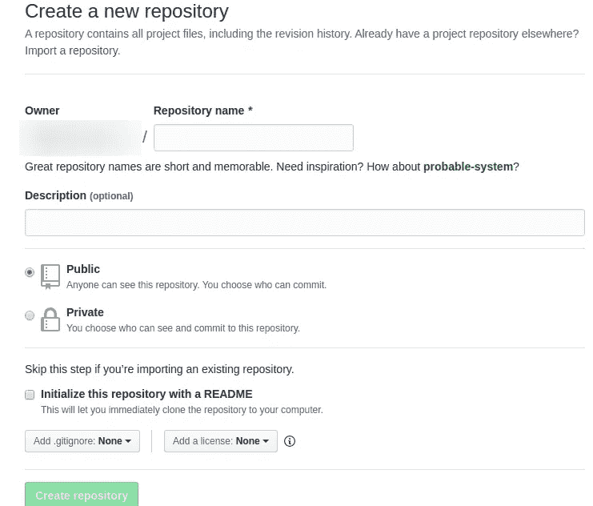
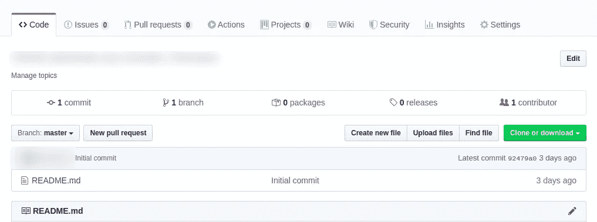
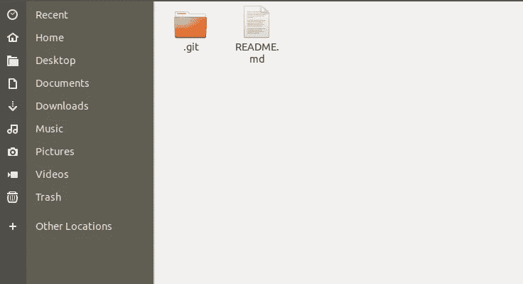

# 婴儿 GitHub

> 原文：<https://medium.com/analytics-vidhya/github-for-babies-99a2462ab74d?source=collection_archive---------15----------------------->

如果你不知道 git 是什么以及如何开始使用 git，那么这篇文章就是为你准备的。这篇文章的目的是让你像一个五年级学生一样理解 git 及其机制。警告！如果你想成为专家，那么我必须说你来错了地方。开始吧！


**来源-突发代码**

想象一下，一个由 3 名成员组成的团队被他们的课程教师分配了一项小组任务，要求他们合作完成。你怎么想呢?他们应该如何进行？假设，成员是利奥，拉杰和谢尔顿。现在，这些成员能做的就是在他们之间分配任务，坐在他们自己的电脑前开始编码。完成自己的任务后，他们可以使用闪存驱动器剪切和粘贴个人贡献，形成一个新的主项目，提交给他们的导师。对吗？

> 让我们做一些案例分析-
> **案例-1:**
> 如果在截止日期前 20 分钟 Raj 的编码出现错误，而 Raj 在亲戚家，谁将在 Raj 不在的情况下解决这个问题？即使 Raj 可以解决这个问题，因为他有笔记本电脑，但这将需要 1 个多小时来解决这个问题，然后做那些剪切，粘贴，替换主项目中的东西。但是他们只有 20 分钟。他们有什么解决办法吗？
> **案例二:**
> 想象 Raj 有设计任务要做。他实现了一个布局，并向他的团队成员展示，但他们告诉他改变 30%的布局。然后他做了相应的改变和实施。一段时间后，他的团队成员告诉他，他们发现很难匹配这种布局设计的后端编码。因此，如果他们切换回先前版本的布局设计，将会很方便。唉！他们没有以前版本的备份。
> **案例三:**
> 如果是独角戏呢？我是说如果整个项目都是谢尔顿做的，课程老师怎么核实？如果他们有实习机会，如何展示他们在大学生活中所做的团队工作？他们应该带着硬盘去所有的工作面试吗？版本控制系统是上述所有情况的一个很好的解决方案。事实上，使用 VCS(版本控制系统)有很多理由和优势。为了简单起见，我们只是提到了一些案例，可以吸引你理解为什么你需要使用 VCS 考虑到你是一个绝对的初学者。

有各种类型的 VCS-
**Github**
**bit bucket**
**git lab**
在这一系列的帖子中我们将尝试学习 git 和 Github 的基本概念和用法。
其中 GitHub 是 VCS git 是用于 GitHub 的命令行工具。使用 git 的 CLI(命令行界面),我们与 GitHub 交互，GitHub 是我们项目的在线仓库。

***深入一些真实的东西***
要使用 GitHub，我们需要先安装 git。因为它是一个独立于平台的工具，而且 YouTube 上有一些关于在你的机器上安装 git 的很好的教程，所以在本文中我们不会深入讨论。

首先，我们必须首先通过这个[链接](https://github.com/)创建一个 GitHub 帐户。然后，我们需要通过单击链接右上角的“+”图标来创建一个存储库。单击图标后，我们将从下拉列表中选择第一个项目，即“新存储库”。在创建存储库的过程中，我们需要选中名为“使用自述文件初始化该存储库”的复选框。我们将在后面讨论这个自述文件是什么以及如何使用它。



> **克隆现有存储库**

我们首先要了解的是**克隆**。克隆是指从 GitHub 下载一个存储库。在创建和初始化存储库之后，现在我们必须下载存储库。为此，我们可以创建一个新文件夹或导航到一个文件夹。然后我们必须打开终端。对于 windows，右键单击并找到一个选项“使用 git bash 打开”,对于 Linux，只需按 ctrl + shift + T 打开终端。当您打开终端后，现在您必须克隆或下载一个存储库。为了实现这一点，您必须访问您创建资源库的 GitHub acc。在存储库中，转到右侧并单击名为“克隆或下载”的绿色按钮，然后您将找到您的回购的 URL 链接。



现在，只要复制网址，然后回到你的电脑终端。在终端中键入以下命令来下载或克隆存储库

```
**git clone** [**https://github.com/Name500/project_Multimedia.git**](https://github.com/HabibRh26/CSE456_Multimedia_and_Animation_Techniques.git)
```

其中[https://github.com/Name26/CSE456_Multimedia.git](https://github.com/Name500/project_Multimedia.git)是我们从 GitHub 复制的链接。

当下载完成后，如果你进入文件夹，你会看到你已经成功地下载了你在 GitHub 站点创建的带有一个自述文件和一个 git 文件夹的库。



如果您在 windows 中并且启用了[隐藏文件视图选项](https://www.google.com/search?q=how+to+show+hidden+files+in+win10&oq=how+to+show+hidden+files+in+win10&aqs=chrome..69i57j0l7.7032j0j7&sourceid=chrome&ie=UTF-8)，那么您将会看到在存储库中有一个名为。git，它包含了你的文件历史的所有记录。对于 linux，按 ctrl+H 查看该文件夹。
由于我们克隆了 repo，所以(比方说)它们位于我们克隆存储库的目录中。现在转到终端，执行以下命令-

```
**git status**
```

你会有一个如下所示的窗口显示工作树干净:


[去婴儿 GitHub(Part:2](/@HabibRh26/github-for-babies-part-2-d84743b7fc55))

> 关注我:[推特](https://twitter.com/devHabib26) | [Linkedin](https://www.linkedin.com/in/habibrh26/)