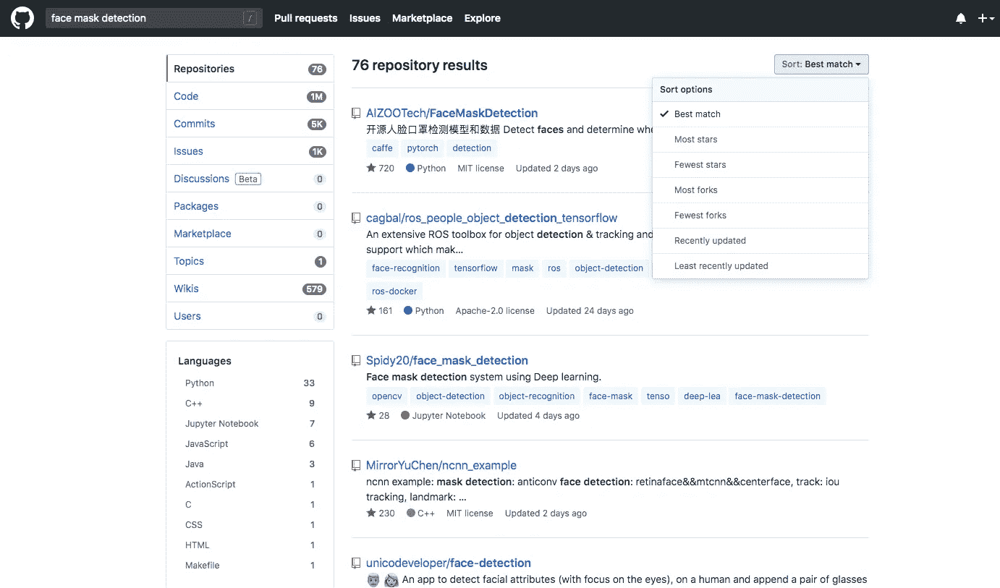

# 适合初学者的 GitHub

> 原文：<https://medium.com/analytics-vidhya/github-for-beginners-bb1b6d9911a4?source=collection_archive---------8----------------------->

为所有渴望探索 GitHub 并为开源做贡献但不了解 Git 的新手准备的帮助指南。

# 首先，GitHub 是什么？

**GitHub** 基本上是一个巨大的知识库集合，拥有基于网络的图形界面。对于初学者来说，他们仍然不清楚**库**是什么意思，你可以把它想象成一个大型的编码社区，在世界各地有许多贡献者。这些贡献者在这个名为 GitHub 的平台上合作进行各种项目。

# 为什么要用 GitHub？

除了仅有的编码爱好者之外，我想每一个对计算机、IT 领域、软件项目和许多这类事情有诀窍的个人，都必须了解 GitHub。

如果你想作为一个团队开发简单的网页，你需要几个在不同领域有专业知识的开发人员，如 HTML，CSS，Javascript，Bootstrap，Docker 等。GitHub 使团队能够同时工作，在更短的时间内轻松构建一个项目。开发人员只需登录，就可以在世界任何地方做出贡献。

> 除了探索上传到那里的几个开源项目之外，作为初学者，您还可以做各种事情。假设你已经注册了 GitHub，下面列出了一些图片参考。

# 探索 GitHub

使用**搜索**选项探索存储库。您还可以应用适当的过滤器，如更新时间、编程语言、stars、most forks 等。

在搜索面板中搜索了“面罩检测”

如果你喜欢一个项目，你可以给出你的个人贡献，也可以下载到你的系统上。要下载存储库，单击**克隆或下载**选项并选择**下载 zip** 。存储库将以 zip 文件夹的形式下载。取出来就跑！

您可以在右侧看到绿色的克隆或下载选项

# **创建自己的存储库**

转到[https://github.com/](https://github.com/)并点击左侧窗格中“存储库”右侧的**新建**选项。

从左侧窗格中选择新选项

给你的库一个简短的名字，描述和一个 **Readme** (参考这里的 Readme markdown 教程[https://guides.github.com/features/mastering-markdown/](https://guides.github.com/features/mastering-markdown/))，标签来描述它包含了什么。

作为一个初学者，你可以上传你做过的简单项目，上传你在在线编码平台如 HackerRank、CodeChef、GeeksforGeeks 等或在线课程网站如 Coursera、IBM CognitiveClass.ai 等提交的课程或编码解决方案。

点击**上传文件**，从您的计算机中选择您的本地文件，并选择**选项直接提交到主分支**。现在点击**提交更改**。它会将您的文件添加到各自的存储库中。

# 开源贡献

如果你想添加你的代码或者增强/bug 建议，你可以通过提出一个**问题**来完成。要打开一个问题，您需要转到**问题选项卡**并选择**新问题**。描述问题(建议/错误/等)。)您想要添加并点击**提交新问题**。

带有新问题选项的“问题”标签

现在，如果你看到一个你有能力解决的问题，那就试一试吧！您可以通过打开一个 **Pull 请求**来选择问题和评论，以请求存储库的作者做出贡献。Pull Request (PR)基本上是将您的代码推送到另一个存储库的请求。如果同意，您可以通过以下方式打开拉式请求。

1.  点击右上角的**叉**选项。
2.  通过使用**上传文件**选项将必要的文件上传到分叉的存储库中来添加您的代码。
3.  选择第二个选项创建一个**新分支**。这将确保存储库的原始作者是接受您的变更请求，还是轻松地放弃它。

上传文件选项(右侧)

为拉取请求创建新的分支

4.现在，转到您分叉的原始存储库。点击**比较和拉动请求**。

比较和提取请求选项

5.现在，就在最后一步，你需要填写一个**模板 PR** ，描述你刚刚解决的关联问题编号，以及你在你的分支 PR 中包含了哪些文件。你可以在这里看到我的公关例子。

现在，如果公关做得足够好，它就会得到**合并**(你可以看到上面紫色的部分)。否则，作者可以通过评论请求修改你的 PR。

你也可以使用免费的 **GitHub Pages** 制作吸引人的**作品集网站**，突出你的技能、项目和许多东西！。我将在我的下一个故事中讲述如何制作一个。

在那之前，你可以在这里浏览我的 GitHub 简介:[**https://github.com/chandrikadeb7**](https://github.com/chandrikadeb7)

*万事如意！
GitHub 现在不是和 ABC 一样容易吗？*