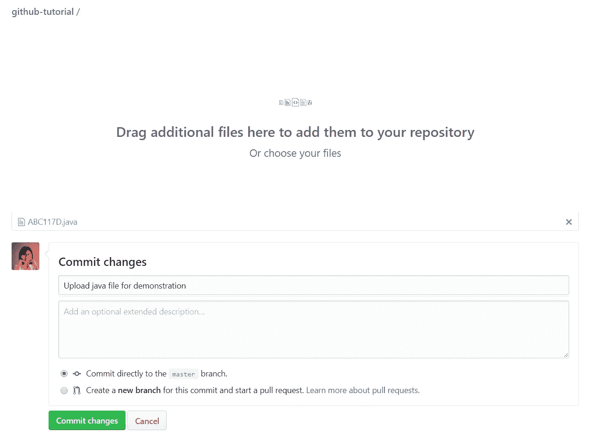

# GitHub 教程 1:安装 Git 和创建存储库👀

> 原文：<https://medium.com/analytics-vidhya/github-tutorial-1-installing-git-and-creating-a-repository-984dc0447684?source=collection_archive---------8----------------------->

许多低年级学生一直在向我寻求关于 [Git](https://git-scm.com/) 的帮助，所以我决定制作一系列教程来提供帮助。我将使用 [GitHub](https://github.com/) ，尽管有不同的地方使用 Git 来托管版本控制(比如 [GitLab](https://gitlab.com/) )。你可以为 Git 使用一个接口(比如 [GitHub Desktop](https://desktop.github.com/) 、 [Sourcetree](https://www.sourcetreeapp.com/) 或者 [GitKraken](https://www.gitkraken.com/) )，但是我将主要使用终端，因为我发现它更容易使用。

我不是专家，我可能会粗略地解释一些事情，因为我想让任何人都容易理解这篇教程。🤠

# Git 是什么？

Git 是软件开发的版本控制工具。简单来说，代码会发生很多变化，Git 可以帮助开发人员跟踪、监控和管理这些变化。

# 什么是 GitHub？

GitHub 是一个平台，开发者可以在这个平台上协作并对他们的软件进行版本控制。当你掌握了它的窍门，在团队项目中一起工作会更容易。你不需要使用 Google Drive 或者使用 Facebook Messenger 发送代码。

以下是 GitHub 帮助我做的一些事情:

1.  我们团队项目中的一个特性突然中断了，但是我们能够查看我们的代码历史并修复是什么中断了它。
2.  这使得跟踪我的团队成员的贡献变得更加容易。当您需要一种方法来量化每个成员的贡献时，这尤其有用。
3.  你曾经害怕在你的项目中改变代码吗？我搞砸了很多，但我可以很容易地重置我所做的任何改变。当我添加一个新特性时，我还会在一个项目的单独“副本”上工作。

# 安装 Git

要在 Windows 上安装 Git，请转到[https://git-scm.com/download/win](https://git-scm.com/download/win)。

您可以保留大多数默认设置，但我建议将默认编辑器更改为您更习惯的设置:


如果您更喜欢从命令行使用 Git 而不是 Git Bash，那么也允许从命令行使用 Git。


Git Bash 有点像命令行，但是对于 Git 来说。这是两者的对比。


左边是 Git Bash，右边是 Windows CMD

安装后，打开命令行(或 bash)并运行`git config --global user.name <your name>`来设置您的 Git 用户名。添加`--global`将应用您系统用户的电子邮件地址。如果您只想为您正在处理的特定存储库设置电子邮件，您可以将其更改为`--local`。

设置好您的 Git 用户名后，运行`git config --global user.email “your_email@example.com”`来设置 Git 使用您的电子邮件。

对于非 Windows 读者，可以在这里查看 Git 安装指南:[https://Git-SCM . com/book/en/v2/Getting-Started-Installing-Git](https://git-scm.com/book/en/v2/Getting-Started-Installing-Git)

# 在 GitHub 上创建存储库

我将假设您已经在 GitHub 上创建了一个帐户(这与在其他网站上创建帐户没有任何不同)。如果您是雅典耀的会员，您可以将您的 OBF 电子邮件添加到您的帐户中，成为专业帐户。

在 GitHub 中，项目被称为*库*。您可以将存储库想象成所有项目文件所在的“文件夹”。存储库是你做所有版本控制工作的地方。

首先，您需要创建一个存储库。您可以在主页中的存储库列表上方找到“新建”按钮，或者当您导航到您的个人资料并单击“存储库”时。


注意一个写着“新”的绿色按钮

您将被带到此页面:


根据您想要做的事情，有两种可能的前进方式:

## 1.“我想把我已经做好的代码放到 GitHub 上。”

因为您正在将一个已经存在的项目移入 GitHub 资源库，所以不要勾选“用一个自述文件初始化这个资源库”这个框。

您将被带到一个如下所示的页面:


若要将您已经拥有的项目转换为存储库，请打开终端并移到您的项目文件夹。为此，运行命令`cd <directory address>`。(CD 表示更改目录)


运行命令`git init`。这将*初始化*一个 Git 仓库。


运行命令`git add .`“意味着您正在将文件夹中所有创建、更改或删除的文件添加到您正在进行的提交中。你可以把提交想象成视频游戏中的保存状态。您更改了存储库中的一些内容，所以您想要保存它的状态，以便以后需要时可以返回到它。**注意，一次添加所有文件是不好的做法，但是因为我们正在学习如何首先创建存储库，所以我们现在可以让它顺其自然。**

接下来，运行命令`git commit -m "<your commit message>"`。让我们仔细分析一下。“Commit”告诉 Git 您正在提交。“-m”表示告诉 git 引号中的下一行是您的提交消息的消息。稍后我将解释提交，但是现在，只解释您更改或上传了什么。


这是它在我的终端中的样子！

复制“…或从命令行推送现有存储库”部分下的命令(这就是我们正在做的！)并在您的终端中运行它们。

```
git remote add origin <your repository's link>
git push origin -u master
```


这是它在我的终端中的样子！

如果你回到你在 GitHub 上的仓库，你最近的提交就在那里！


GitHub 还会建议你在项目中添加一个 README。当你做好一个的时候，它会看起来像这样。当人们访问您的存储库时，自述文件是他们将在您的文件之后看到的，因此最好在那里解释一些事情，例如您的项目的更详细描述或您的项目有哪些依赖项。(依赖是人们需要安装的东西，以使你的项目在他们的设备上运行，也就是你的项目*依赖的其他技术)*


## 2.“我正在从头开始一个项目，我希望它能出现在 GitHub 上。”

因为您是从零开始一个项目，所以您可以勾选“用自述文件初始化这个存储库”并创建一个存储库。


您将被带到一个如下所示的页面:


如果您想使用网站上传或创建文件，只需按“创建新文件”或“上传文件”按钮。无论哪种方式，之后都会要求您“提交更改”。

它还将让您选择提交到主分支还是创建一个新分支。您可以将分支想象成创建您的存储库的当前状态的副本，但是我稍后也会解释这一点。如果您只是使用一个实践存储库，那么现在您可以提交到主分支。**注意，我们通常不会提交给主分支，我们通常会先创建另一个分支。**



如果您想要在您的终端上工作，移动到您想要工作的文件夹并运行命令`git init`来初始化一个存储库。

在您做了一些更改之后，您可以运行我在#1 中讨论过的这些命令。

```
git add .
git commit -m <your commit message>
git remote add origin <your repository's link>
git push origin -u master
```

恭喜你！您已经创建了您的第一个 GitHub 存储库。下一次，我将解释提交、分支和一些我在本教程中略知一二的其他命令。


斯蒂芬·安德鲁斯在 [Unsplash](https://unsplash.com?utm_source=medium&utm_medium=referral) 上的照片