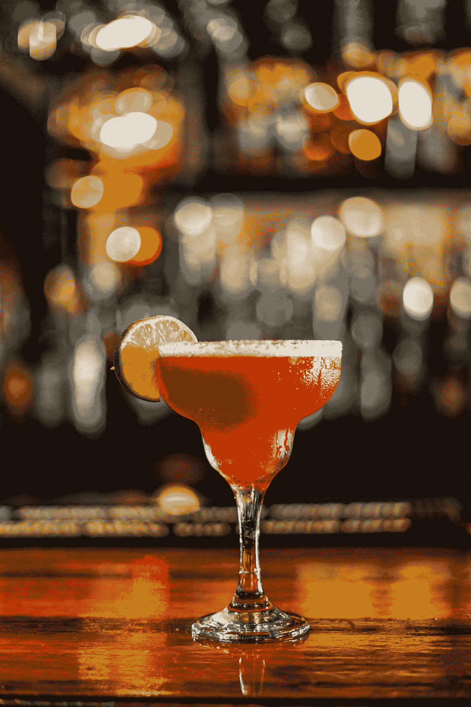
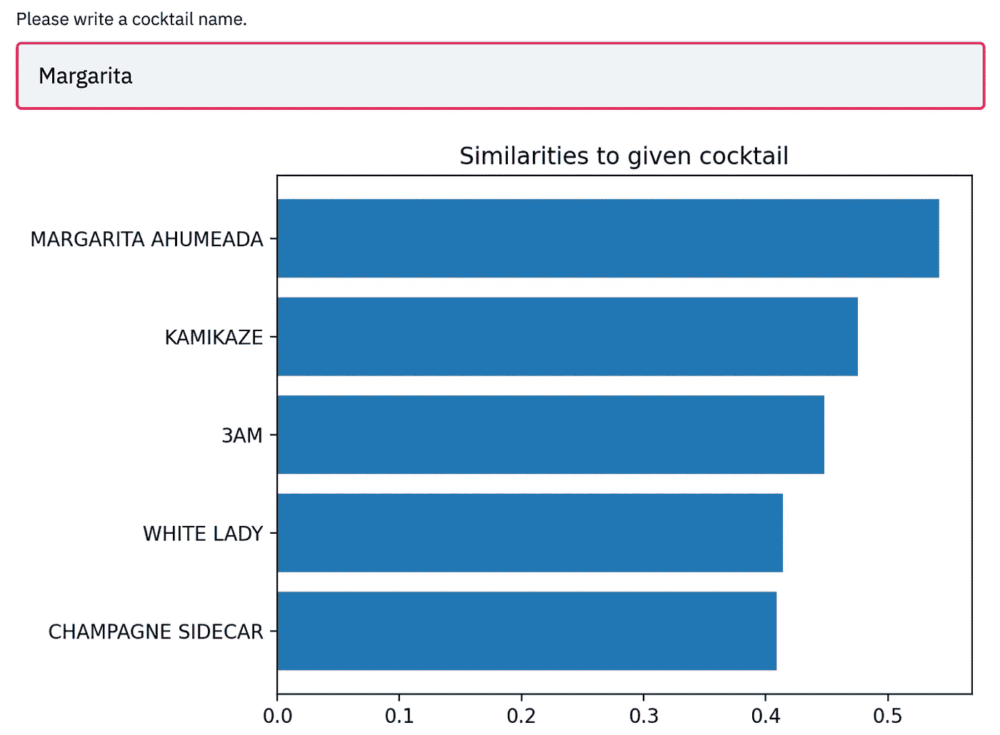
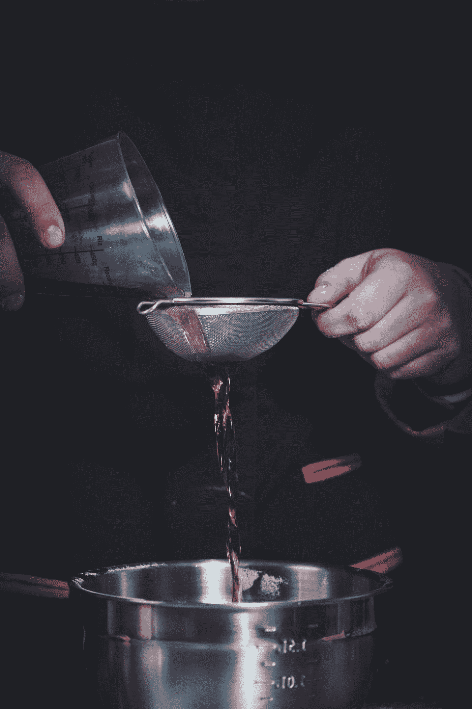
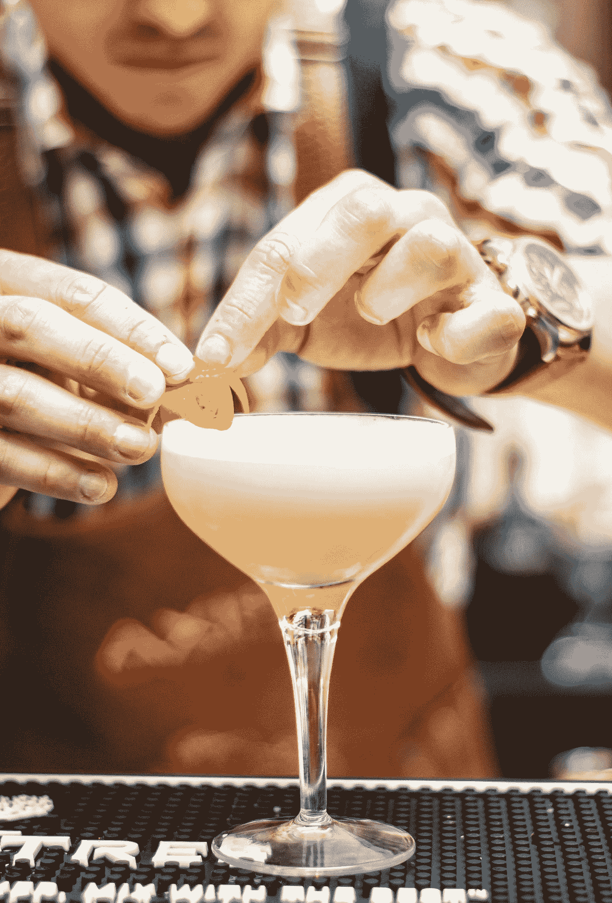
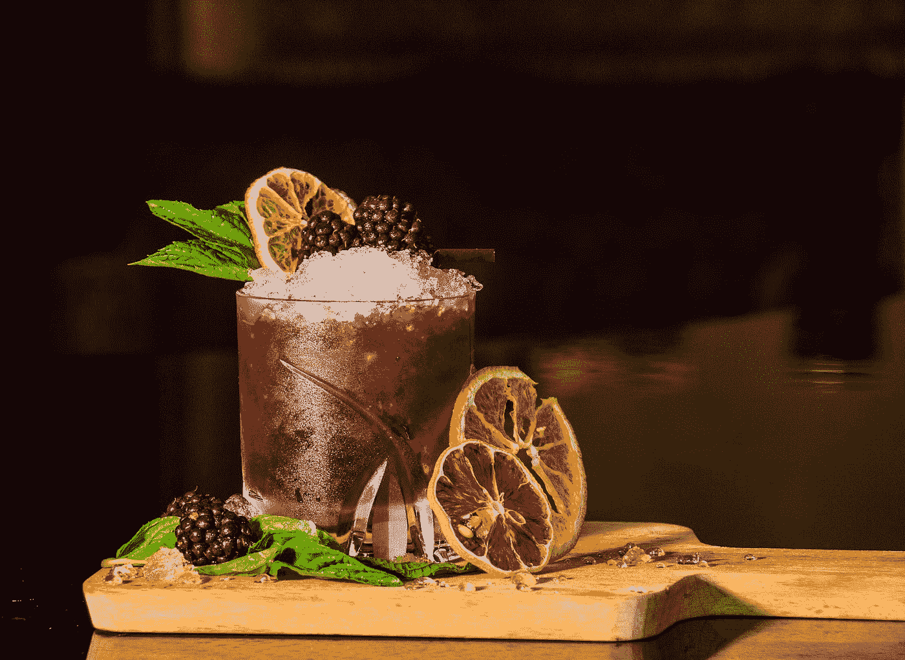

# 给我来一杯，鸡尾酒推荐者

> 原文：<https://medium.com/analytics-vidhya/give-me-a-drink-cocktail-recommender-eee628cf65be?source=collection_archive---------10----------------------->

> 每个人都应该有所信仰。我想我会再喝一杯。
> –**阿尔伯特·爱因斯坦**

照片由[泰在](https://unsplash.com/@taiscaptures?utm_source=medium&utm_medium=referral) [Unsplash](https://unsplash.com?utm_source=medium&utm_medium=referral) 上抓拍

我不确定阿尔伯特·爱因斯坦是否说过这些话，但我相信如果他有机会使用我们的鸡尾酒推荐器，他一定会说的。

鸡尾酒推荐器是一个在 1049 种独特的鸡尾酒中向用户推荐新鸡尾酒的系统。

使用 [Streamlit](https://www.streamlit.io/) 和 [Heroku](http://www.heroku.com) 部署在[https://cocktail-recommender.herokuapp.com/](https://cocktail-recommender.herokuapp.com/)上。

> 注意:网页可能需要几秒钟才能加载，因为它是使用 Heroku 的免费试用版部署的。

# 概观

有数百种鸡尾酒，但大多数人只知道那些著名的。此外，许多人很难尝试他们认为会喜欢的新鸡尾酒。当谈到鸡尾酒时，大多数人可能会犹豫尝试新的东西，因为有许多不同成分的选择。我们的鸡尾酒推荐系统通过利用数据科学和数据库中的各种鸡尾酒，鼓励人们尝试新的口味。

该网络应用程序根据两种类型的输入提供建议，即鸡尾酒名称或配料名称。如果用户给出鸡尾酒的名称，系统将推荐具有相似成分的鸡尾酒。

> 这里的假设是，如果人们喜欢鸡尾酒，他们也会喜欢类似的鸡尾酒。

当用户提供数据库中存在的鸡尾酒名称时，会出现一个条形图，显示具有相应相似性的鸡尾酒名称。

# 获取数据

使用两个不同的数据集来创建系统的数据库。

1.  Kaggle 上的 Hotaling & Co .鸡尾酒数据集该数据集包含 600 多种鸡尾酒，包括配料、配方、地点、调酒师姓名等。
2.  [TheCocktailDB](https://www.thecocktaildb.com/) 500+鸡尾酒的配料和配方通过他们的 API 进行了流式传输。流媒体的详细信息可以在 jupyter 笔记本上找到 [CocktailDbStreaming](https://github.com/OzanGenc/CocktailAnalysis/blob/main/CocktailDbStreaming.ipynb)

这两个数据集被合并，我们获得了一个包含 1049 种独特鸡尾酒及其配料和配方的数据集。

# 方法学

## Tf-idf 矢量器的预处理

在应用实际的 tf-idf 矢量化之前，已经做了一些预处理。

***停用词:*** 除了 ENGLISH_STOP_WORDS，还增加了 *'oz '，' simple '，' dash '，' bsp '，' drops'* 等词作为停用词。这些词出现在许多配料中，并没有提供太多关于鸡尾酒独特性的信息。

***标记模式:*** 标记化只对字母字符的元素进行。这样做是为了防止获得不必要的数字和符号标记。

照片由 Jordane Mathieu 在 Unsplash 上拍摄

## 履行

该系统基于成分的相似性做出推荐。每种鸡尾酒的成分都使用 scikit-learn 的`TfidfVectorizer`类进行矢量化。这种技术简单而强大。它将成分相似的鸡尾酒转化为相似的向量。该方法优于单词袋方法的一个主要优点是稀有标记可以获得高权重。通过这种方式，具有稀有成分的类似鸡尾酒可以更成功地关联。

使用`sklearn.metrics.pairwise.linear_kernel`类计算矢量化配料的余弦相似度。推荐系统的细节可以在[这个 python 文件](https://github.com/OzanGenc/CocktailAnalysis/blob/main/utils/utils.py)上找到。

*如果用户给出我们数据库中的鸡尾酒名称；*

向用户推荐与给定鸡尾酒具有最高相似值的鸡尾酒以及相应的配料和食谱。

*如果用户给出配料名称；*

给定的成分使用相同的矢量器进行矢量化。计算矢量化输入配料和鸡尾酒配料之间的余弦相似度。具有最高相似值的鸡尾酒被推荐给用户。

## 风雅

在系统的第一个版本中，只使用了 Kaggle 上的 Hotaling & Co. Cocktail 数据集。尽管这个数据集有许多原创鸡尾酒，但它缺乏一些流行的鸡尾酒。我们的数据库必须包括流行的鸡尾酒，因为大多数时候用户会提供这些。TheCocktailDB 是一个很棒的网站，有流行和稀有鸡尾酒的数据。因此，来自 CocktailDB 的数据已经通过使用它们的 API 被抓取并与初始数据集合并。

由 [Unsplash](https://unsplash.com?utm_source=medium&utm_medium=referral) 上的 [Louis Hansel @shotsoflouis](https://unsplash.com/@louishansel?utm_source=medium&utm_medium=referral) 拍摄的照片

另一个改进是将*、【oz】、【简单】、【破折号】、【bsp】、*等停用词添加到英语的默认停用词中。这些词存在于大多数成分中，并不能在推荐中提供有价值的信息。此外，观察到它们降低了系统的性能。比如两款鸡尾酒，如果有*‘drops’*和*‘oz’*的词很多，那么计算出来的两者之间的相似度就大于实际值。

最后的改进是使用一个标记模式来标记字母元素。

# 结论

将文本数据转换成向量并计算这些向量之间的余弦相似值有助于我们构建该系统。首先需要从不同的来源获取数据，将数据合并在一起并做一些预处理。

这个项目最具挑战性的部分是为它找到合适的数据。有许多很棒的鸡尾酒网站，上面有配料、配方和用户评论。然而，他们都禁止网络抓取。因此，寻找开源数据是挑战的一部分。

这个系统的另一个困难是很难客观地评估推荐的性能。因此，已经联系了许多用户来试用该系统，并收到了反馈。大多数用户表示，他们总体上对这些建议感到满意。

一个改进可能是利用用户对鸡尾酒的评论。这可能会提高性能，因为通过这种方式，我们还可以获得人类对鸡尾酒的感知，如*提神、果味等。*纳入考虑做推荐。

*   你对你得到的推荐有什么看法？
*   还有哪些技术或数据可以用来提高推荐性能？

所有的代码和数据都可以在 [Github](https://github.com/OzanGenc/CocktailAnalysis) 上找到。

希望你喜欢这篇文章！我很乐意收到您的反馈，您可以通过 [Linkedin](https://www.linkedin.com/in/ozan-genc/) 联系我。

干杯！

# 承认

我要感谢 Patryk Oleniuk 关于快速将 ML 模型部署到 web 的[有用帖子](https://towardsdatascience.com/show-your-ml-project-to-the-internet-in-minutes-2a7bc3167bd0)。我用过帖子里提到的[模板](https://github.com/patryk-oleniuk/streamlit-heroku-template)。