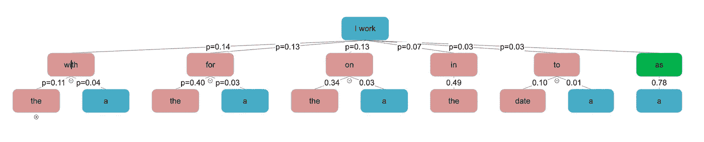
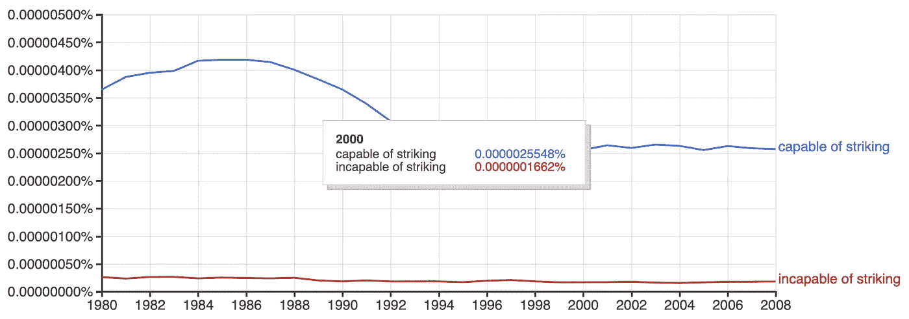
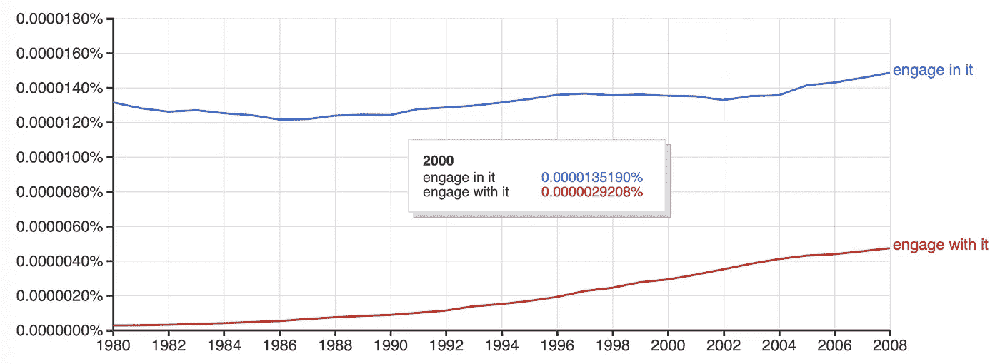
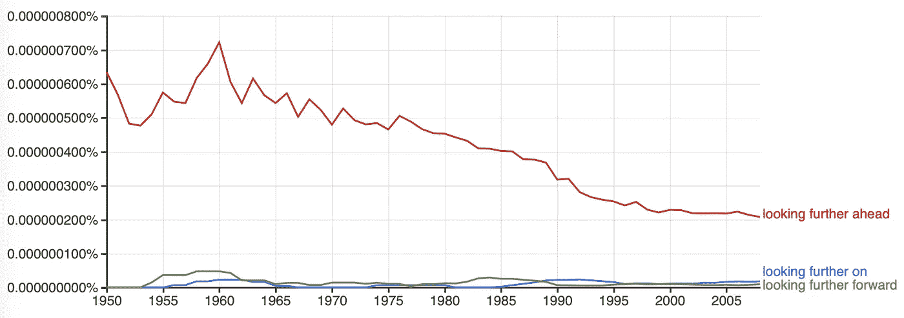
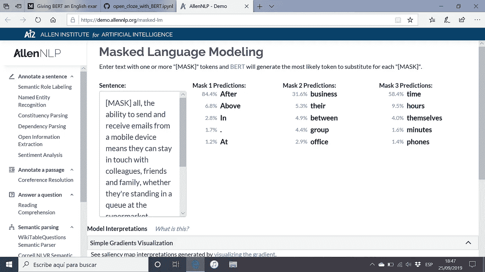

# 给伯特一次英语考试

> 原文：<https://medium.com/analytics-vidhya/giving-bert-an-english-exam-8b3a07a6ab7f?source=collection_archive---------11----------------------->

## 开放式完形填空练习

自然语言处理(NLP)在过去的几个月里进步如此之快，以至于现在只要运行一个简短的 Jupyter 笔记本你就可以在几秒钟内得到一个语法练习的答案。语言学习者的典型考试练习是开放式完形填空。在这里，学生必须找到缺失的单词来完成一个短语。这是语言模型的理想任务；毕竟你只需要正确预测下一个单词。剧透:你可以用人工智能完成 80%以上的练习。

## 剑桥英语资格证书

为了探索在开放式完形填空练习中使用自然语言处理，我使用了一些分级练习。欧洲通用语言参考框架(CEFR)是描述语言能力的国际标准。它将语言能力分为六个等级，从初学者的 A1 级到已经掌握一门语言的 C2 级。[剑桥英语资格](https://www.cambridgeenglish.org/exams-and-tests/qualifications/)提供学生准备考试的样卷和教师手册作为[资源](https://www.cambridgeenglish.org/teaching-english/resources-for-teachers/)。这些考试包括针对中上水平或更高水平学生的开放式完形填空练习(B2 优先、C1 高级和 C2 熟练)。这项任务对于英语水平较低的学生来说太难了；通常，学生不喜欢这个练习，因为他们会感到迷失，没有线索来帮助他们找到丢失的单词。当然，线索就在周围的文本中。

## 前视模型(来自 fast.ai 的 ULMFit)

假设语言模型预测可能的下一个单词。第一种方法是选择具有最高概率的预测的下一个单词。以第一次考试的样卷 1 的第一句话为例

我是一名摩托车特技骑手——也就是说，我在表演时在我的摩托车上表演特技。缺的字是*‘as’*。

对于*'我工作'*，语言模型预测最有可能的下一个单词是带有''的*(概率 p=0.14)，而*'是带有'*的只有 p=0.03，所以取预测概率最高的下一个单词，即使在这个简单的例子中也不能给出正确答案。*

“我工作 __ a”的决策树

如果我们向前看，看看对空白**加**之前的文本进行预测，为空白预测的单词是否给出下一个单词*‘a’*作为预测，结果如何？对于'*我与之共事'，*确实如此，但只是概率 p=0.04。*‘我作为’*有*‘a’*作为 p=0.78 的预测。应用在间隙之后取期望单词的最大概率出现的规则，提出*‘as’*作为答案。所以，在这个例子中，这种测试的方法，看看预测填补空白的单词是否可以跟在空白之后的单词后面，效果很好。

然而，这个决策树揭示了一个问题。虽然可能性较小，但*“我在……工作/我为……工作/我在……工作”*都是有效的回答。单纯看缺口前的文字和缺口后的第一个字是不够的。在样本试卷上测试这种方法只能得到大约 45%的正确率。看前面几个字和后面第一个字的差距不够；需要更多的背景知识。

## 左顾右盼

这就是伯特的切入点。来自变压器的双向编码器表示(BERT)是一种语言模型，它同时查看单词的左侧和右侧来预训练表示。所有繁重的工作已经为我们完成了，所以我们可以在英语考试练习中使用这个预先训练好重量的模型。开箱即用的预训练 BERT 可用于预测样本试卷上缺失的单词。

想要更好地解释伯特是什么，请听数据怀疑论者播客“[伯特有魔力](http://dataskeptic.libsyn.com/bert-is-magic)”。

对于每份样纸，都给出了一个例子，然后在一篇文章中有八个空白要填写。例如，对于第一次考试的样本试卷 1，每个方括号中的第一个单词是 BERT 预测的单词，冒号后的一个或多个单词是可接受的答案。第一个方括号是给学生的例子。

我是一名摩托车特技骑手——也就是说，我在表演时在我的摩托车上表演特技。法国勒芒赛道是我第一次看到一些人做摩托车特技的地方。我以前从未见过有人只用后轮骑摩托车，这给我留下了非常深刻的印象，我直接回家并自学了同样的方法。没过多久，我就开始靠表演自己的摩托车特技谋生。我有机械工程学位；这有助于我了解每个特技背后的物理原理。除了负责摩托车的设计变更之外，我还必须完成我做的每一个特技。人们经常认为我的工作非常危险，但是，除了在特技表演中偶尔发生一些小的机械故障之外，从来没有出过任何差错。我从不觉得有任何危险，因为我很有经验。

伯特完美地完成了这个练习。七份样卷的成绩分别是:B2 第一，例句短语 1/2，测试短语 16/16/C1 进阶，1/2，13/16 / C2 熟练度，3/3，17/24。模型做的这么好(51/63=81%)真是太棒了。

如果我们不是要求一个预测，而是要求模型为缺失的单词提供两个选择，并且我们希望学生选择正确的单词，那么结果会提高到 87% (55/63): B2 第一，1/2 关于示例短语，16/16 关于测试短语/ C1 高级，1/2，13/16 / C2 熟练，3/3，21/24。

下面是四个例子，伯特的第二个预测是正确的，都来自关于机器人的同一篇文章:

*1。虽然复杂的[ ['机器人'，'足够']:足够]组装汽车并在复杂的手术中提供协助，但现代机器人是
2。愚蠢的机器人，[ ['有能力'，'没有能力']:没有能力]与他们的人类操作员建立关系。
3。工程师们认为，随着机器人开始成为社会中更大的一部分，它们将需要一种与人类互动的方式。
4。一个大问题是:一个合成伴侣需要具备什么，才能让你想长期与之交往？*

即使没有明显的方法告诉学生有时选择伯特的第二个选择，有两个选择，并知道语言模型倾向于第一个选择，可能足以让学生确定正确的答案。

*‘虽然精密的机器人要组装’*没有意义，所以第二种选择更好。谈论*、【哑巴机器人】、*是一种负面情绪，所以*、*是更好的选择，尽管[谷歌 N-gram](https://books.google.com/ngrams) 浏览器显示*、*比*、【不能攻击】、*出现得更频繁。

可以说，*“让自己成为社会更大的一部分”*在语法上是正确的，但*“让自己成为社会更大的一部分”*更好。如果语言模型在大量剑桥文本上进行微调，它可能会获得对短语动词的强烈偏好(短语动词的定义:由一个动词和另一个元素组成的惯用短语，通常是副词，如*分解*，或介词，如*参见*，或两者的组合，如*向下看。)*

虽然谷歌 N-grams 显示*‘从事 it’*比*‘从事 it’*出现的频率更高，但这里正确的表达是将*与*‘T28’合成伴侣。

这就剩下六个测试例子，模型无法预测正确的单词。两个发生在一篇关于手机的课文中:

和[ ['为什么'，'什么']:为什么]他们应该想吗？[ ['after '，' above']:毕竟，通过移动设备收发电子邮件的能力意味着他们可以与同事、朋友和家人保持联系，无论他们是在 1 点钟排队。超级市场，在[ ['商业'，'规划'] : between ]
2。飞行前的会议或杀戮[ ['someone '，' people'] : time ]。

第一个错误是提议*‘在商务会议中’*，而不是*‘在会议间隙’*，这是一个甚至连以英语为母语的人都会犯的错误。在第二个错误中，我们可以看到为什么 AI 会得到这么坏的名声，而不是提出*‘杀人时间’*AI 建议的是’*杀人’*或者再推进一步的话’*杀人’*。这是人工智能给你的，给它一个英语考试，它鼓励谋杀！同样，这是训练数据的反映。如果该模型根据剑桥大学惯用的、短语动词丰富的、安全而温和的语言风格(这是国际考试所必需的)进行微调，它可能不会提出这一建议。

*手机和电脑已经表现出了[ ['extent '，' degree'] : ['extent '，' degree'] ]，人可以在这个范围内与无生命的电子物体发展关系。
3。看得更远[ ['上'，'更远'] :['前方'，'向前'] ]，*

在这里，我不知道为什么模型提出了“进一步看得更远”，这甚至没有出现在谷歌的 N-grams 中。*看得更远*，‘是最好的答案。

在 C1 高级样本纸上有三个错误:

1.  *那种生活有时会让人感到非常恐惧。*
2.  *显然，许多人面对[ ['社会'，'气候'] : ['with '，' by'] ]
    变化时会考虑两种可能的行动方案，*
3.  *简单的事情，[ ['or '，' and']:比如]
    走另一条路去上班*

这最后四个例子表明仍有改进的余地。

## 可能的使用案例

这个练习的目的是什么？我的主要动机是在我有经验的领域使用 NLP。看到 BERT 在这个任务上做得很好，表明这个代码可以帮助学生学习如何最好地准备这个练习。它还可以帮助人们为学生准备这种风格的练习，突出可能的答案中有歧义的地方。C2 熟练水平的模糊性是一个理想的特征，因为在这个水平上，学生应该能够权衡可能的答案并选择最佳答案，安全地知道他们是在英语考试的世界中，而不是用于训练 BERT 的语言示例的宇宙中。幸运的是，这一守则不会帮助学生在剑桥考试中作弊，因为所有的电子设备都被禁止。你甚至会被要求去掉塑料水瓶上的标签。

令人惊讶的是，现在可以在标准 PC 上使用深度神经网络来完成个人 NLP 项目。由于许多聪明人和大型处理单元的工作和计算，大量资源的开源可用性意味着现在每个人都可以实现这一点。

## 技术方面的东西

最初，我尝试使用 f [ast.ai](https://www.fast.ai/) 的 [ULMFit](https://docs.fast.ai/text.html) forwards 模型，对 [MultiNLI](https://www.nyu.edu/projects/bowman/multinli/) 句子进行微调。这个模型有很多优点，特别是在分类方面，但是不太适合预测文本。

雷切尔·托马斯的 [fast.ai NLP 课程](https://www.fast.ai/2019/07/08/fastai-nlp/)是对 NLP 的极好介绍，它使该领域更容易理解，并为你自己探索 NLP 的用途提供了良好的基础。

我在预训练的 BERT 模型中使用的代码可以在运行 Python 3 的单个简短的 [Jupyter 笔记本](https://gist.github.com/AlisonDavey/9c1060cc0c9d12ebd2a9042db054de6e)中获得。

[HuggingFace](https://huggingface.co/) 慷慨地提供了预先训练好的 BERT 模型以及如何部署该模型的建议。

[伯特:用于语言理解的深度双向转换器的预训练](https://arxiv.org/abs/1810.04805v2)

*编辑:2019 年 9 月 25 日随 AllenNLP 翻译* [*公布*](https://twitter.com/ai2_allennlp/status/1176891426602278912) *今天你可以在*[*https://demo.allennlp.org/masked-lm*](https://demo.allennlp.org/masked-lm)让伯特为你在线做这些练习

