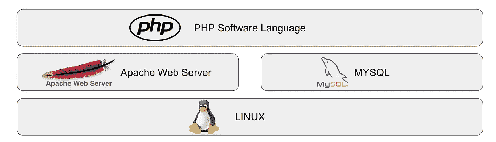
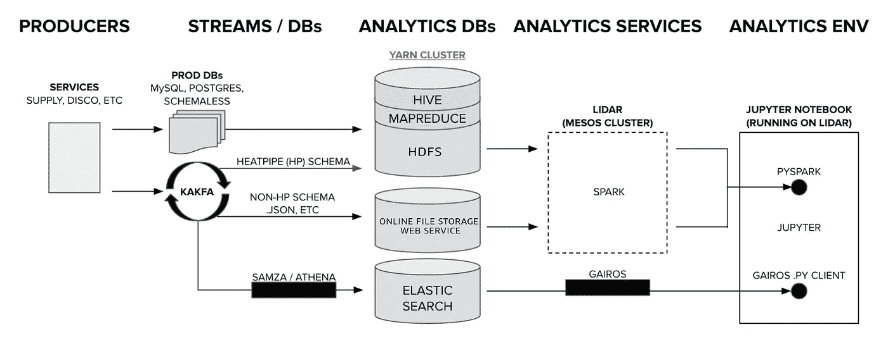
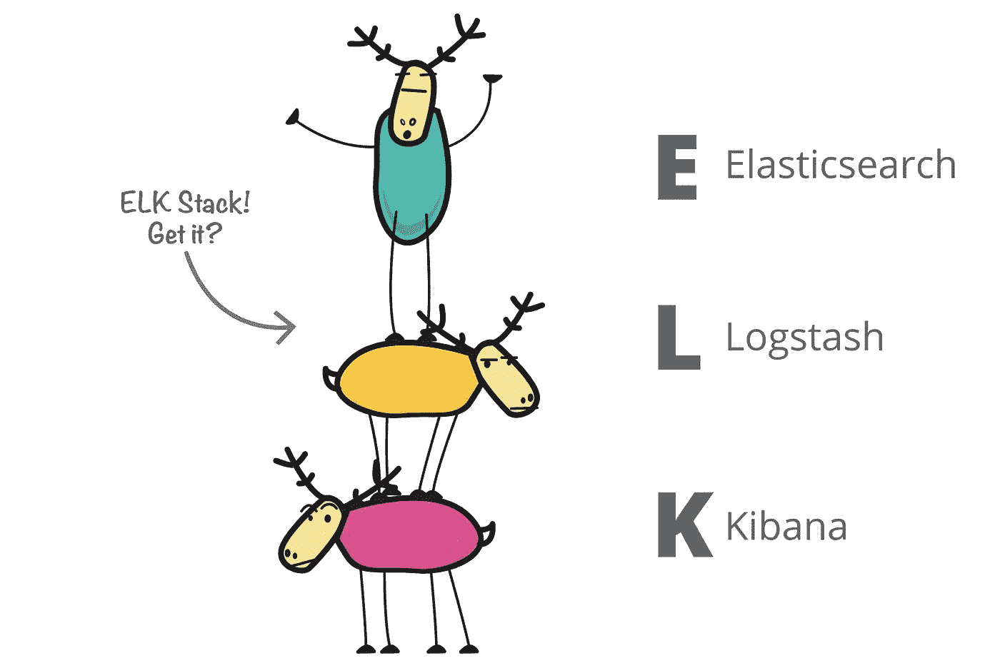
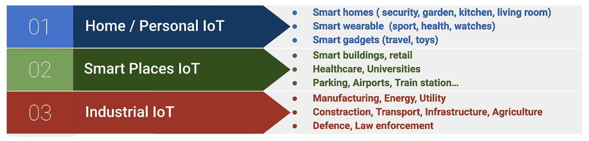
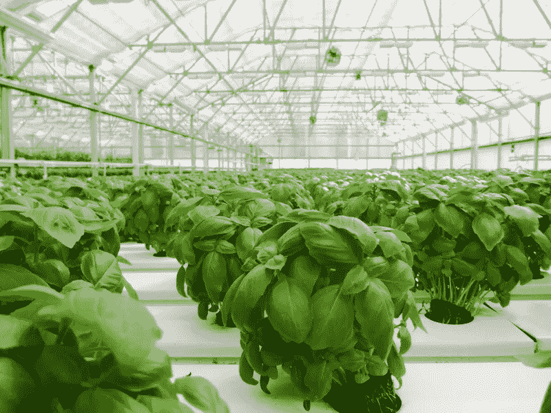
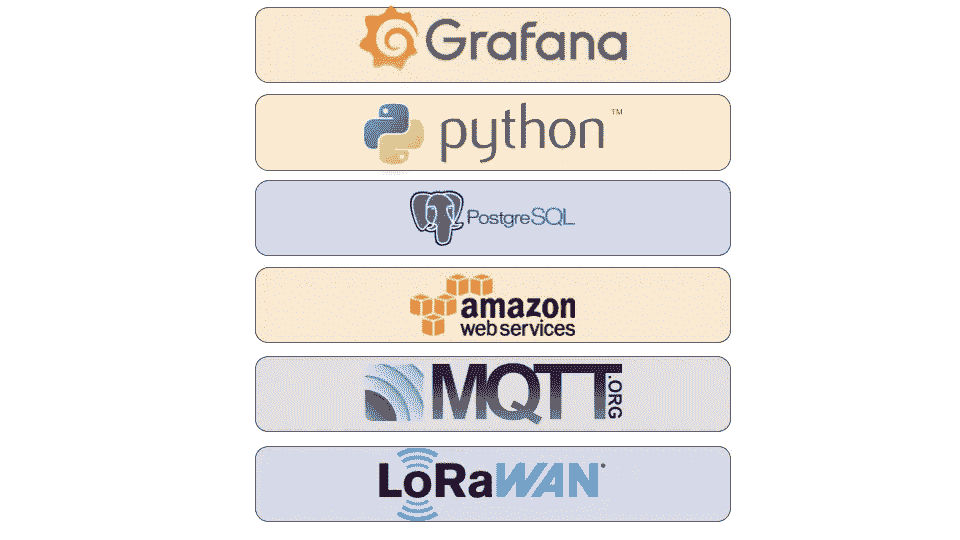
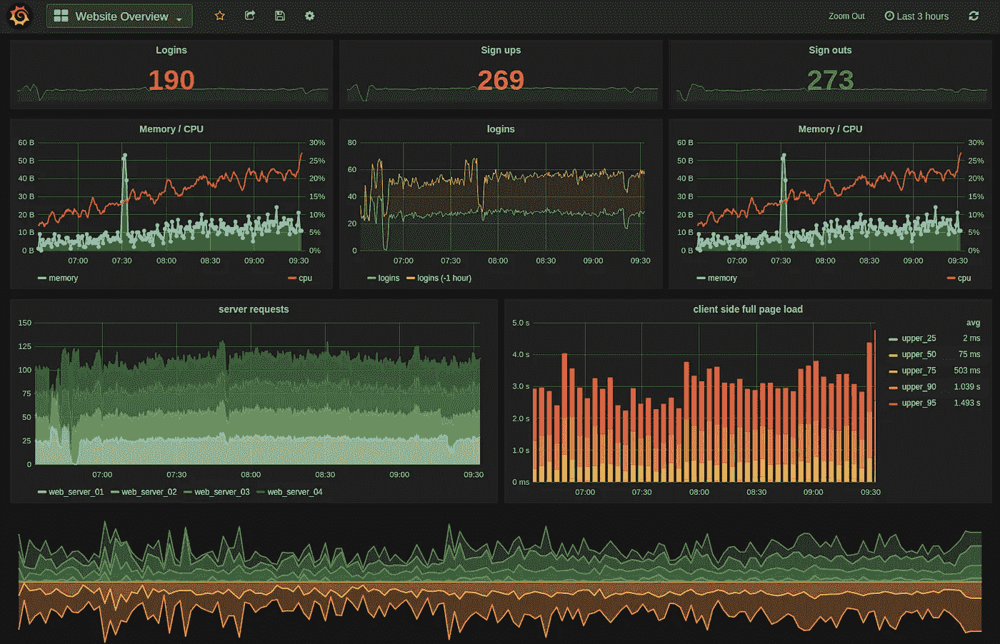

# GLAMPP (Grafana、LPWAN、AWS、MQTT、Python、Postgres):工业物联网社区的天然技术栈

> 原文：<https://medium.com/analytics-vidhya/glampp-grafana-lpwan-aws-mqtt-python-postgres-the-natural-tech-stack-for-industrial-iot-d032618b74bf?source=collection_archive---------7----------------------->

大约 15 年前，我第一次听说 LAMP💡瞬间。

*   inux:操作系统——灯堆栈的基础
*   **A**pache:HTTP 网络服务器——处理来自浏览器的请求
*   **M** YSQL:数据库——存储 web 应用数据
*   HP:软件语言——实现特定的 web 应用程序逻辑

然后嘣！你有自己的网络应用程序。

LAMP 技术堆栈

每家公司都有独特的技术组合，就像是其产品和服务的骨架。就像人的骨骼一样，技术堆栈是产品的内部结构。它由支撑和保护产品(身体)的多个刚性组件(骨骼)组成。例如，公司可能决定使用 Python 作为他们产品的底层软件语言(而不是 Java、C、JavaScript 等)..).蟒蛇只是骨架的一根骨头。用 Python 编写的实现产品功能的特定软件是肌肉、关节和组织，它们包裹着骨头，支撑着骨头，并将其他所有东西保持在适当的位置。类似地，MYSQL 数据库只是另一块骨头。如果不定义模式、索引、查询并加载它无法运行的数据……然而，相信我，当你的产品出现问题时，你会感到痛苦。

> 我骨架的壮美被我的肉的重量所掩盖。维拉·卡斯帕·劳拉

公司在其技术栈中包括工具、框架、数据库、硬件、软件语言和平台。然后，它们以堆栈(自上而下)或水平流程(左右)的形式说明了各个组件之间的层次关系。通常，对最终用户隐藏的技术，如操作系统和硬件，处于堆栈的底部。而面向用户的技术，如 web 平台，则位于堆栈的顶端。

> **“当你小心翼翼地把两块砖拼在一起时，建筑就开始了。从这里开始**。路德维希·密斯·凡·德罗。****

**你甚至可以找到像 [StackShare](https://stackshare.io) 这样的网站，在那里你可以分享你自己的技术栈，了解流行产品的技术栈以及它们是如何随着时间的推移而演变的(例如[本文展示了 Slack 的技术栈](https://stackshare.io/stack-history-timeline-slack-tech-stack-evolution))。**

****

**[优步的技术栈](https://eng.uber.com/tech-stack-part-two/)展示了一个典型的大数据操作**

**为了让开发新产品的公司生活更简单，多年来，业界提出了**强大且高度集成的通用技术堆栈，作为通用产品架构的起点**。例如，15 年前，当你想建立一个网站时，你会从 LAMP stack 开始，然后过几年可能会更换或升级某些组件。现在，如果您构建日志管理产品，您可能会决定使用 ELK 如果您构建网站，您可能会决定使用 Jamstack、MEAN、LAMP 或 full-stack。**

****

**麋鹿栈**

# **工业物联网技术堆栈**

**与 Alexa 和 Fitbit 等消费物联网不同，[工业物联网(IIOT 或工业 4.0)](https://en.wikipedia.org/wiki/Industrial_internet_of_things) 是指制造业、公用事业(石油、天然气、水、污水)、交通(汽车、火车)、建筑、农业甚至国防等工业环境中的互联传感器。IIOT 也可能指智能城市、智能建筑和医疗保健。**

****用例示例:****

1.  **移动性:使用一大群物联网传感器进行交通监控**
2.  **建筑:重型设备车队管理( [MachineMax](https://machinemax.com/) )**
3.  **农业:监测土壤质量**

****

**物联网的类型**

**与消费物联网相比，工业物联网更具挑战性:**

****工业环境:****

*   **部署在大型站点(区域、节点间距离、节点数量)**
*   **偏远地区**
*   **室外+室内**
*   **大部分是静态的东西，但有时资产和机器会移动。**
*   **恶劣的环境条件(温度、冲击、振动、湿度)**
*   **改造旧机器、设备和基础设施**
*   **缺少有线连接(以太网)和电源节点。**
*   **难以接近/安装(安全问题，高空作业)**

****

**智能农业**

****工业监控需求:****

*   **大数据:对数千个数据点的分析**
*   **安全性:数据窃取和设备/流程篡改**
*   **关键基础设施:高可靠性**
*   **实时流程:快速响应时间**
*   **长产品寿命**
*   **根据特定需求定制/可扩展的解决方案**

> **“在没有数据之前就建立理论是一个严重的错误。”，福尔摩斯**

**开发一个强大、高度集成的物联网技术堆栈来满足行业的所有需求非常困难。物联网堆栈通常由多个技术层组成，每个技术层都包括各种类型的技术:**

1.  **设备层(微控制器、传感器、无线通信)**
2.  **数据层(后端、数据库、机器学习)**
3.  **界面层(前端、车队管理、分析、可视化)**

> **伟大的事情是由一系列小事情组合在一起完成的文森特·范·高夫**

**物联网解决方案中使用了数十种无线技术。每种都提供不同的范围、功耗、数据速率和成本。**

*   **远程:4G(和 5G)，LPWAN (Lorawan，SigFox，NBIOT)**
*   **低功耗:BLE、RFID (NFC)、LPWAN、Zigbee、Z-Wave、Thread、6lowpan**
*   **高数据速率:4G、Wifi、蓝牙**

**同样，物联网解决方案中也经常使用多种数据层技术:**

*   **集成和消息传递:MQTT、Kafka、RabbitMQ、REST、NodeRed**
*   **数据库:TimeScaleDB、InfluxDB、Postgres、MongoDB 和 Redis**
*   **机器学习:Python + Numpy**

**最后，对于接口层，您可以找到以下技术:**

*   **分析平台:Grafana、Kibana**
*   **可视化工具:D3JS，Vega，**
*   **前端堆栈:反应，角度**
*   **BI 平台:PowerBI、Tableau、**

**尽管这些技术可能有数百种可能的组合，但只有少数组合能够开箱即用。**

# **GLAMPP (Grafana，LPWAN，AWS，MQTT，Python，Postgres)**

**在过去几年中，我参与了几个工业物联网项目，不知何故，它们都融合到了同一个技术堆栈中:**

*   **Grafana:一个开源的分析和监控解决方案**
*   **LPWAN:低功率广域网(LoraWan，Sigfox NBIoT)**
*   **MQTT:一种用于小型传感器的轻量级消息协议**
*   **AWS/Azure:存储和计算云平台**
*   **Python:一种高级通用编程语言**
*   **Postgres:一个开源的关系数据库**

**在这一点上，有必要再次提醒我们，在本文的上下文中，通用技术堆栈的含义是什么:**

> ****通用技术栈:一套强大且高度集成的技术，可以作为新产品的起点。****

**例如，假设我们想开发**新产品**来监控/控制/管理一个工业过程。我们可以从这些工具开始，更快地达到工作产品(MVP)。**

****

**GLAMPP 技术堆栈**

****为什么是 LPWAN？****

**工业监控需要长距离无线通信，100m → 5 Km。这一要求排除了几乎所有的中短程无线技术，如 Wifi、蓝牙和 Zigbee，只排除了 4G 和 LPWAN。虽然理论上网格技术，如 BLE 网格可以达到这些范围，但实际上它使解决方案变得复杂，并引入了可靠性问题。另一个具有挑战性的限制是对现有机器/基础设施的改造和电力基础设施的缺乏。4G 和 5G 使用大量电力，因此对于电池供电/能量收集解决方案来说不是可行的解决方案。**

**与 4G 相比，使用 LoRa 有更多优势:**

*   **建立自己的私人网络相当容易。工业站点通常位于 4G 覆盖不到的偏远地区，此外还面临着安全威胁，迫使他们在私有的隔离网络中工作。**
*   **有许多供应商，如 [Multitech](https://www.multitech.com/) 和 [Kerlink](https://www.kerlink.com/) ，他们提供将您自己的私有网络与现成的构建模块组装在一起所需的一切，价格不到 200 美元。**

****为什么 MQTT (** 消息队列遥测传输)？**

**与 HTTP 或 Kafka 等其他协议相比，MQTT 有几个独特的功能，使其对物联网应用程序具有吸引力:**

*   **它是轻量级的:非常容易实现，代码量很小。**
*   **它又快又实时！！:一旦建立了连接，每条消息的等待时间要比 HTTP 快得多**
*   **它实现了双向发布和订阅消息传递。与客户机只能发送消息或轮询新消息的 HTTP 不同，在 MQTT 中，客户机可以异步发送和接收消息。**
*   **它具有较小的数据开销(最小化的数据包、较低的网络使用率、较低的功耗)**
*   **几乎每个物联网网关(尤其是 LPWAN)都支持 MQTT**
*   **AWS 物联网核心包括一个受管理的、安全的和可扩展的 MQTT 代理，允许灵活的管理和与其他服务的集成。**
*   **最后，它非常强大**

**为什么是 Postgres？**

**尽管近年来 NoSQL 呈爆炸式增长，但考虑到物联网系统通常会生成大数据，关系数据库成功地找到了如此多的物联网应用程序，这是一个相当令人惊讶的事情。**

**那么，为什么我决定将 Postgres 包含在这个堆栈中呢？**

1.  **是 SQL！！SQL 是最通用的数据库查询语言，在数据操作方面特别有效。它的语法很直观，非常接近英语。几乎任何人都需要几个小时到几天的时间开始使用它并产生有价值的结果。**当使用 python 等其他语言时，数据科学家成为瓶颈**，您可以从数据中提取的价值和见解是有限的。我无法表达这一特性对公司发展的重要性。**物联网关乎数据！访问数据就是力量！当越来越多的人能够接触到数据，并能够查询和可视化时，创新就开始了。不要用 MongoDB 之类的数据库，屏蔽他们对它的访问。****
2.  **操纵时间序列数据真的很容易:物联网系统几乎总是会生成时间序列数据。带有[窗口函数](https://www.postgresql.org/docs/9.1/tutorial-window.html)和[时标数据库](https://www.timescale.com/)等扩展的原生 Postgres 使得分析时间序列数据以及汇总或比较当前值和历史值变得极其容易。**
3.  **它支持空间数据(GIS)和空间查询。任何工业物联网数据的另一个重要属性是它带有 GIS(位置)标签。当我们想要运行将结果限制为特定形状的空间查询，并且快速运行这些查询时，这就是 Postgres 及其 GIS 扩展 [PostGIS](https://postgis.net/) 擅长的地方。**
4.  **它支持分区。物联网数据通常被归类为**“仅附加”时序数据**，通常，历史数据会很快失去其价值。由于积累得相当快的数据会影响数据库的性能，所以数据库的可伸缩性问题变得很重要。Postgres 现在支持开箱即用的分区。从版本 10 开始，很容易建立一种机制，将数据存储在每日分区中，并归档/压缩旧分区。**
5.  **AWS RDS 本机支持 Postgres，具有设置高可用性集群、启动读取副本、PostGIS 支持、许多安全功能、监控、备份、恢复等功能。在像 AWS 和 Azure 这样的公共云上使用托管开源数据库是一个巨大的好处，因为它降低了供应商锁定的风险。**
6.  **这是开源的**

> ****“谁有数据谁就有力量”**。蒂姆·奥莱利**

****为什么是 Python？****

**物联网是关于数据的，而不是关于事物的。出于这个原因，我决定将 Python 作为栈中的主要语言，而不是 C/C++作为嵌入式(设备)编程的通用语言。Python 是目前最流行的语言之一，在 web 应用程序和数据科学中都有使用。它是高级的，简单易学，可移植，易于部署，支持函数式编程和面向对象编程。**

*   **Python 非常适合数据科学，包括诸如 NumPy、Pandas、SciKit-Learn、SciPy 和 Tensorflow 等库，这些库针对运行机器学习代码进行了优化。**
*   **Python 支持使用 Jupiter 和 Google Colab 笔记本等工具进行交互式、协作式和在线编程。**
*   **Python 允许数据科学家直接编写生产代码。避免代码翻译(Matlab → C，R → Java)，这是一个减慢开发过程并可能引入错误的过程。**
*   **使用 Flask 等轻量级平台和 Django 等更高级的平台轻松开发 web 应用程序。**
*   **AWS Lambda 本机支持 Python 作为一种编程语言，具有令人难以置信的加速时间，并包括通用层来简化部署包。**
*   **Python 包含了一些库，如 [Psycopg2](https://pypi.org/project/psycopg2/) ，它简化了与 Postgres 的连接**
*   **Python 是开源的，有大量的社区支持和扩展它。**

****为什么是格拉夫纳？****

**Grafana 是一款开源的高性能分析和交互式可视化软件。这是构建物联网前端、获得用户反馈以及与数据交互的最简单方式。**

****

**格拉夫纳截图**

*   **它支持许多数据源，其中包括 Postgres、AWS、TimescaleDB 和 InfluxDB。**
*   **您可以在 Grafana 中编写任何 SQL 查询，并将输出可视化为图形、表格、标尺、单个 stat，甚至在地图上显示出来。**
*   **易于安装、配置和管理**
*   **它包括一个内置的可配置警报引擎，可以通过 Slack、电子邮件和其他方法实时通知用户组**
*   **它包括一个 API，允许您配置、归档和编写仪表板脚本。**
*   **使用 AJAX 面板很容易集成来自其他网站的框架**
*   **它提供了多种安全功能**
*   **它包括手动和自动注释，用于记录事件和团队成员之间的协作。**

# **摘要**

**我希望这篇短文能让您相信 GLAMPP 技术堆栈为几乎所有工业物联网解决方案提供了最佳选择。5 年前，为这些环境构建监控解决方案几乎是一项不可能(或非常昂贵)的任务，但现在我们有了解决范围和功耗问题的 LPWANMQTT 将数据可靠地交付到云中，几乎没有开销；Postgres 和 Python 一起提供了一个简单而强大的数据平台，Grafana 将所有这些好处直接带给最终用户，这几乎是不需要动脑筋的，试试看吧，它是免费的。**