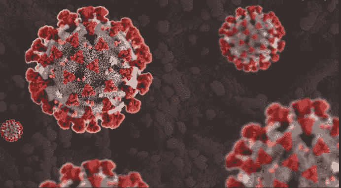

# 全球冠状病毒数据集

> 原文：<https://medium.com/analytics-vidhya/global-coronavirus-dataset-library-b3ba77b8cdd0?source=collection_archive---------29----------------------->

对于那些希望跟踪传播速度或进行其他病毒研究的人来说，许多数据集已通过公共和付费平台提供。这个故事将突出大多数广泛使用的冠状病毒数据集。

# 全球冠状病毒数据集

1.  [2019 年冠状病毒数据:](https://www.kaggle.com/brendaso/2019-coronavirus-dataset-01212020-01262020) -该数据集是将约翰·霍普斯金大学数据集简单地重新格式化为有组织的 CSV 文件。它由 9 个 CSV 文件组成，包含来自不同国家的数据，包括中国、美国和澳大利亚。
2.  [1.5 亿条新冠肺炎推文](https://zenodo.org/record/3738018#.Xw8MGSgzZPb):这是一个包含超过 1.5 亿条与新冠肺炎相关的推文的数据集，从 2020 年 3 月 11 日开始。这些推文是所有语言的混合体，其中英语、西班牙语和法语最为相关。
3.  [新冠肺炎案例集](https://www.tableau.com/covid-19-coronavirus-data-resources):-这份可下载的工作簿包括一个入门仪表盘以及一个到可信的新冠肺炎活动数据的嵌入式连接。该数据来源于欧洲疾病预防和控制中心以及纽约时报(世卫组织汇总了美国各州和地方政府以及卫生部门的数据)
4.  [新型冠状病毒数据](https://data.humdata.org/dataset/novel-coronavirus-2019-ncov-cases):该数据由约翰·霍普金斯大学系统科学与工程中心(JHU·CCSE)从包括世界卫生组织(世卫组织)在内的各种来源汇编而成。JHU·CCSE 在 Github 上维护 [2019 新型冠状病毒新冠肺炎(2019-nCoV)数据库](https://github.com/CSSEGISandData/COVID-19)上的数据。
5.  [冠状病毒基因组](https://www.kaggle.com/paultimothymooney/coronavirus-genome-sequence) :-这是一个简单的 TXT 文件，包含完整的新冠肺炎基因组序列。
6.  [全面的 COVID 数据集](https://www.kaggle.com/imdevskp/corona-virus-report):-包含全球冠状病毒病例数据的多个 CSV 文件，每 24 小时更新一次。有 6 个不同的 CSV 文件，包含各国的数据，包括总死亡数、总康复数、活跃病例、严重情况和进行的总检测数。
7.  [(新冠肺炎)全球病例](https://www.statista.com/statistics/1043366/novel-coronavirus-2019ncov-cases-worldwide-by-country/):-该数据集包含按国家划分的新型冠状病毒病例数。该数据集定期更新。
8.  [Dimensions COVID](https://dimensions.figshare.com/articles/Dimensions_COVID-19_publications_datasets_and_clinical_trials/11961063):-该知识库包含 Dimensions 学术研究数据库中与冠状病毒相关的所有临床试验、出版物和数据集。
9.  CORD-19:-来自艾伦人工智能研究所，CORD-19 是一个开放的数据集，包含超过 45，000 篇关于冠状病毒的学术文章。这是一个超过 29，000 篇学术文章的免费资源，包括超过 13，000 篇关于冠状病毒家族的全文。
10.  新冠肺炎推文:-该知识库包含一个与新型冠状病毒新冠肺炎(新型冠状病毒)相关的推文 ID 的持续收集。

# 印度冠状病毒数据集

1.  [新冠肺炎数据](https://www.kaggle.com/sudalairajkumar/covid19-in-india) :-该数据集包括个体患者数据、医院床位数和具有最近信息的病例。有 7 个不同的 CSV 文件，其中包含年龄详情、医院床位、州级测试详情和 ICMR 测试实验室的信息。
2.  [冠状病毒数据印度](https://www.kaggle.com/imdevskp/covid19-corona-virus-india-dataset) :-该数据集包含每日各邦的病例数、原始患者数据，最新数据也已更新。进行的各种州级测试、日间测试、国家级测试和地区级测试的数据也是可用的。

# 美国冠状病毒数据集

1.  [美国新冠肺炎每日病例](https://dataverse.harvard.edu/dataset.xhtml?persistentId=doi:10.7910/DVN/HIDLTK):-来自哈佛大学，该数据集包含每日新冠肺炎病例，带有包括州和县级数据的美国底图。
2.  [美国新冠肺炎](https://www.statista.com/statistics/1058775/coronavirus-covid19-case-number-us-americans/):-这包括美国确认的冠状病毒病例的信息。
3.  [追踪日冕](https://bnonews.com/index.php/2020/01/tracking-coronavirus-u-s-data/):-来自 BNO 新闻，该资源包含美国新冠肺炎病例的地图数据和时间线信息。各种状态的 COVID 数据可用，并定期更新，因此最新数据也很容易获得。
4.  [纽约数据集](https://www.nytimes.com/article/coronavirus-county-data-us.html):《纽约时报》应研究人员、科学家和政府官员的要求，公开了美国最全面的冠状病毒病例数据集之一。它正在发布一系列数据文件，其中包括美国各州和县一级的冠状病毒病例的累积数量。

# 意大利冠状病毒数据集

1.  [各地区病例](https://www.statista.com/statistics/1099375/coronavirus-cases-by-region-in-italy/)-这包括各地区冠状病毒病例的综合数据。
2.  [死亡病例](https://www.statista.com/statistics/1099389/coronavirus-deaths-by-region-in-italy/):-代表各地区冠状病毒死亡病例。
3.  [区域 COVID 数据](https://github.com/pcm-dpc/COVID-19/tree/master/dati-regioni):-它包括每个区域的累积新冠肺炎数据的数据集(有症状住院、重症监护、总住院、家庭隔离、总阳性、总变化阳性、新阳性、已治愈出院、死亡、总病例)。
4.  [哈佛数据集](https://dataverse.harvard.edu/dataset.xhtml?persistentId=doi:10.7910/DVN/KDFYZW) :-由最著名的美国大学发布，包括有症状的住院患者、家庭隔离、当前阳性病例总数、康复患者、死亡、阳性病例总数和进行的测试。

# 加拿大数据集

1.  [追踪日冕数据](https://bnonews.com/index.php/2020/01/tracking-coronavirus-canada-data/):-来自 BNO News，该数据集包括加拿大新冠肺炎病例的地图数据和时间线信息。它包括病例、新病例、死亡、康复、危重和重症患者的信息。

# 澳大利亚数据集

1.  [按地点分列的新冠肺炎病例:](https://data.gov.au/dataset/ds-nsw-aefcde60-3b0c-4bc0-9af1-6fe652944ec2/details?q=covid-19) -数据仅基于新冠肺炎确诊病例的常住地点，不一定是病毒感染的地点。
2.  [按地点划分的新冠肺炎测试](https://data.gov.au/dataset/ds-nsw-60616720-3c60-4c52-b499-751f31e3b132/details?q=covid-19) :-该数据是针对新冠肺炎测试的，基于一个人在测试时接受测试并接受公共卫生管理的地点。
3.  [按感染分类的新冠肺炎病例](https://data.gov.au/dataset/ds-nsw-c647a815-5eb7-4df6-8c88-f9c537a4f21e/details?q=covid-19) :-按可能传染源分类的新冠肺炎病例更新。该数据集每天更新，周末除外。

# 德国数据集

1.  德国新冠肺炎 :-该数据集涵盖了德国报告的冠状病毒病例数。提到了一些有日期记录的每日病例。

# 中国数据集

1.  [中国地区](https://www.kaggle.com/gpreda/china-regions-map):-这个简单的数据集包含中国各地区的 GeoJSON 数据。它可以用来帮助显示中国各地区的冠状病毒病例
2.  [中国死亡率](https://www.statista.com/statistics/1094999/china-wuhan-coronavirus-covid-19-fatality-rate-region/):一个小型数据集，显示了截至 2020 年 2 月新冠肺炎在中国的死亡率。
3.  [死亡和康复数据](https://www.statista.com/statistics/1090007/china-confirmed-and-suspected-wuhan-coronavirus-cases-region/):-该数据集可以 XLS 或 PPT 格式下载，包括中国各地区新型冠状病毒感染、死亡和康复病例数。它会定期更新。
4.  [病例年龄分布](https://www.statista.com/statistics/1095024/china-age-distribution-of-wuhan-coronavirus-covid-19-patients/):-该图显示了截至 2020 年 2 月中国冠状病毒患者的年龄分布。
5.  [病例性别分布](https://www.statista.com/statistics/1095039/china-gender-distribution-of-wuhan-coronavirus-covid-19-patients/):-显示截至 2020 年 2 月中国冠状病毒患者性别分布的简单数据集。