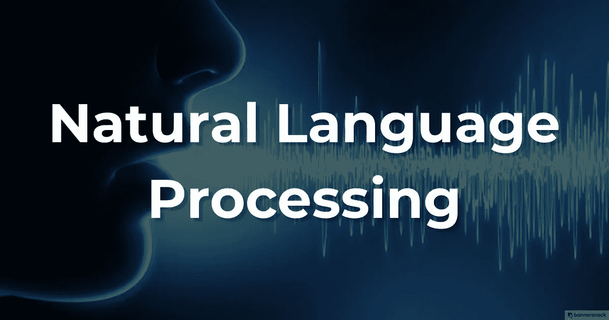
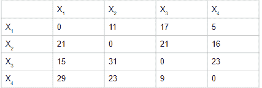
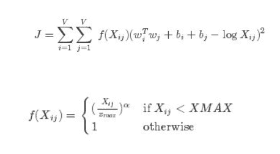
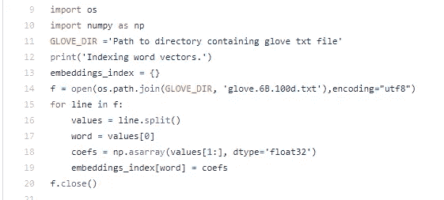
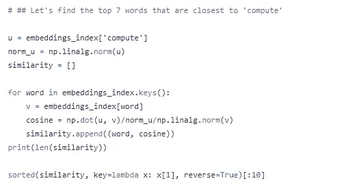

# 手套:理论和 Python 实现

> 原文：<https://medium.com/analytics-vidhya/glove-theory-and-python-implementation-b706aea28ac1?source=collection_archive---------3----------------------->

GloVe:单词表示的全局向量

在这篇文章中，我们将介绍构建手套模型的方法，并实现 python 代码来提取特定单词作为输入的嵌入。

从根本上说，所有开发的语言模型都致力于实现一个共同的目标，即在 NLP 中实现迁移学习的可能性。因此，不同的教育和商业组织寻求不同的方法来实现这一目标。

一个突出且被充分证明的方法是给定一个巨大的语料库，为单词建立一个共现矩阵。斯坦福大学的一组研究人员采用了这种方法，结果证明这是一种简单而有效的方法来提取给定单词的单词嵌入。

**内容:**

1.  **回顾单词嵌入**
2.  **共现矩阵介绍**
3.  **优化的成本函数**
4.  **Python 实现**

**回顾单词嵌入:**

单词嵌入是单词的向量表示，帮助我们提取线性子结构，并以模型更好理解的方式处理文本。通常，在定义的模型收敛于成本函数之后，单词嵌入是神经网络结构的隐藏层的权重。要深入了解这一点，请参考以下内容:

[Word 2 vec 中单词嵌入背后的理论](/analytics-vidhya/theory-behind-word-embeddings-in-word2vec-858b9350870b)

**同现矩阵介绍**

让我们从它的定义开始理解共生矩阵。共现矩阵主要给出两个词在庞大的语料库中同时出现的频率信息。考虑下面的截图，

这里，X1、X2 等是语料库中的特有词，而 Xij 表示 Xi 和 Xj 在整个语料库中一起出现的频率。虽然，这个矩阵作为一个整体不一定服务于我们的目的，它只是成为神经网络训练的目标。换句话说，给定特定单词的一个热嵌入向量的输入(与 Word2Vec 中相同)，模型被训练来预测共现矩阵。

因此，总的来说，一旦模型收敛，预测共现矩阵是为了提取单词嵌入而定义的伪任务。

**成本函数:**

对于任何要收敛的机器学习模型，它本质上需要一个可以优化的成本或误差函数。在这种情况下，成本函数是:

这里，J 是成本函数。因此，让我们一个一个地研究这些术语:

1.  Xij 是 Xi 和 Xj 在语料库中一起出现的频率
2.  Wi 和 Wj 分别是单词 I 和 j 的单词向量。
3.  bi 和 bj 对应于单词 I 和 j 的偏差。

在第二个等式中，Xmax 是最大同现频率的阈值，该参数被定义为防止隐藏层的权重被破坏。因此，函数 f(Xij)本质上是在模型上定义的约束。

一旦代价函数被优化，隐藏层的权重就变成了单词嵌入。根据我们选择的模型，来自手套模型的单词嵌入可以是 50，100 维向量。下面的链接提供了斯坦福大学发布的不同类型的手套模型，可供下载。

[手套型号:斯坦福集团](https://nlp.stanford.edu/projects/glove/)

**Python 实现**

令牌和词汇的数量越多，模型性能就越好。此外，我们需要考虑我们所拥有的架构，使用正确的模型来加快计算速度。我们将使用在维基百科数据上训练的 100 维手套模型来提取 python 中给定单词的单词嵌入。

从 100D 手套模型加载向量的代码片段

此外，print(embedding _ index[' banana '])命令给出了单词 banana 的单词嵌入向量，类似地，可以提取任何单词的嵌入向量。按照下面的代码片段查找每个单词的余弦相似性指数。

给出最接近计算结果的前 7 个单词的代码

此外，可以提取线性子结构，这在我以前的帖子中已经讨论过。

下面的链接将您重定向到代码文件，用于从预训练的手套模型中提取 python 中的单词嵌入。

[来自 GLoVE 100D 模型的单词嵌入](https://github.com/abhishekperambai/My_Dir)

请关注这个空间，获取更多关于嵌入式的内容，因为我计划撰写一系列关于 BERT 及其应用的文章。非常感谢对此的任何反馈。