# 用于单个图像去雾的通用模型不可知 CNN(GMAN)

> 原文：<https://medium.com/analytics-vidhya/gman-net-for-image-dehazing-65a2b3f679a5?source=collection_archive---------4----------------------->

论文说明:刘铮的“用于单个图像去雾的通用模型不可知卷积神经网络”及其在 [TensorFlow](https://medium.com/u/b1d410cb9700?source=post_page-----65a2b3f679a5--------------------------------) (版本 2+)中的实现。

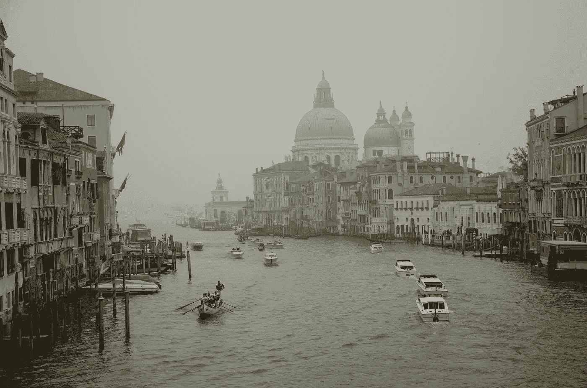

# 介绍

薄雾和烟雾是影响图像质量以及图像分析的最常见的环境因素。提出了一种端到端的图像去雾生成方法。它基于设计一个完全卷积的神经网络来识别输入图像中的霾结构，并恢复清晰、无霾的图像。

通用数据模型是对传统数据模型的推测。它们描述了规范化的通用连接类型，以及可能通过这种连接类型连接的各种事物。

> 为什么这个方法是“不可知论的”，我们来回答一下。
> 
> 到目前为止，所有提出的最新(SOTA)方法都探索了大气散射(解释如下)模型。GMAN 网络是不可知论的，因为它没有使用大气散射模型，却比所有使用该模型的论文产生了更好的结果。

你可以在这里获得[的研究论文。](https://arxiv.org/abs/1810.02862)

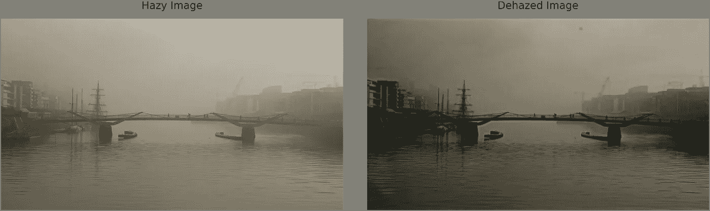

**左:**朦胧图像，**右:**使用 GMAN 的去雾图像

# 大气散射模型

用于表示 ASM 的等式为:

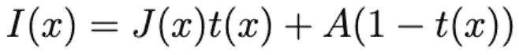

[形象信用](https://openaccess.thecvf.com/content_ICCV_2017/papers/Li_AOD-Net_All-In-One_Dehazing_ICCV_2017_paper.pdf)

其中，
I(x):观测到的雾天图像
J(x):原始图像
A:全球大气光照
t(x):传输矩阵

*A* 指整个场景中大气的自然光。
*t(x)* 代表从物体到达相机的光量。
计算如下:

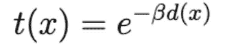

[形象信用](https://openaccess.thecvf.com/content_ICCV_2017/papers/Li_AOD-Net_All-In-One_Dehazing_ICCV_2017_paper.pdf)

在 GMAN 之前，所有的方法都致力于获得参数 A 和 t(x ),以从模糊的图像中恢复清晰的图像。但是原始图像的有损重建问题不太可能等价地转换成参数 A 和 t(x)(或它们的变型)的估计问题，至少当这两个问题服从相同的评估度量时是如此。除此之外，原始图像和模糊图像之间的复杂关系不能仅仅通过大气散射模型(ASM)来捕捉。此外，使用 ASM 可以在合成模糊图像上给出好的结果，但是它不能在自然模糊图像上产生期望的结果。GMAN 网络提出了一个解决方案。

# GMAN +并行网络架构

## 让我们从 GMAN 开始

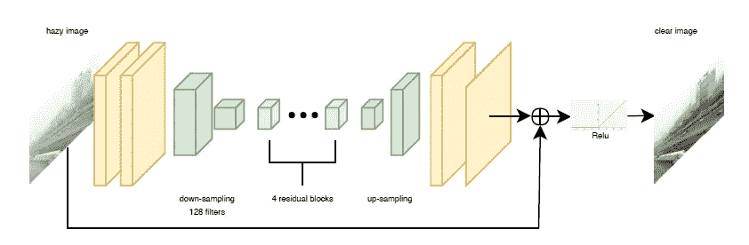

**GMAN 建筑(没有感性损失)**

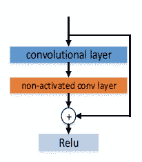

有快捷连接的 CNN。

从功能上来说，这种架构由端到端生成方法组成，该方法使用编码器-解码器方法来解决去雾问题。输入图像遇到的前两层是具有 64 个通道的卷积块。紧随其后的是跨距为 2 的 2 个下采样块(编码器)。然后，编码图像被馈送到具有 4 个残余块的层构建。每个块包含一个快捷连接(与 ResNets 相同)。这个残余层有助于理解霾结构。在这之后是上采样或去卷积(解码器)层，其重构剩余层的输出。最后两层是卷积块，用于将上采样的特征图转换为 3 通道 RGB 图像，最终添加到输入图像(全局残差层)，然后 ReLU 以给出去雾输出。这个全局剩余层有助于捕捉场景中具有不同深度的对象的边界细节。架构的编码器部分有助于降低图像的维度，然后将降采样后的图像馈送到残差层以提取图像特征，解码器部分预期学习并重新生成无霾图像的缺失数据。

在原始论文中，没有并行网络，但为了提高性能和均方损耗，也使用了感知损耗，但同一作者后来添加了该并行网络，其性能优于具有感知损耗的原始架构。所以我不会在这里失去知觉。

## 现在让我们来处理并行网络

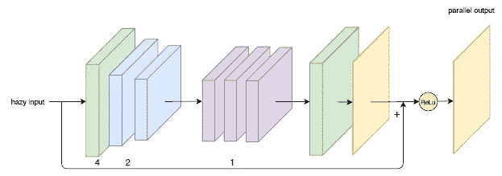

平行网络，这些方块的膨胀率是绿色:4，蓝色:2，紫色:1

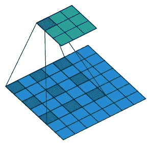

核大小为 3，膨胀率为 2 的膨胀卷积。

PN 架构比 GMAN 浅，但具有相同的编码器-解码器结构。但它的不同之处在于，它使用了[膨胀卷积](https://github.com/vdumoulin/conv_arithmetic/blob/master/README.md)(或带孔卷积)来代替传统卷积。具有较大接收场的卷积层不可学习以生成概化的特征地图。膨胀允许接收场的指数增长，而没有像素级的空间维度损失。简而言之，这个平行网络有助于捕捉被 GMAN 网络忽略的细节。前 3 层分别是膨胀率为 4、2、2 的编码器块。接下来的三层的膨胀率为 1。随后是膨胀率为 4 的去卷积块，以将特征图转换为它们的原始尺寸。之后是最终的卷积层，它将图像转换为 3 通道 RGB 图像。现在，除了最后一层，所有层都有 64 个通道。之后，与 GMAN 相同的输出与原始输入相加，并通过 ReLU 单元。

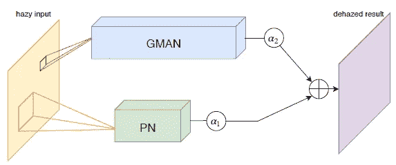

组合网络

现在，在所有这两个网络的输出相加后，得到最终的去雾图像。参数α1 和α2 应该由网络自己学习。理论讲够了，现在我们从代码开始。

# 代码在[张量流](https://medium.com/u/b1d410cb9700?source=post_page-----65a2b3f679a5--------------------------------) v2.3 中

## 你可以从我的 [GitHub](https://github.com/sanchitvj/Image-Dehazing-using-GMAN-net) 获得完整的代码。

## 预处理和加载数据

这个函数获取图像的路径，读取它并解码成一个 uint8 张量。然后，我们将其大小调整为 412x548，数据集中的图像大小为 413x550，但由于输入值为奇数，网络函数产生了问题。最后，我们将其归一化，并以归一化张量的形式返回图像。

此函数获取原始和模糊图像的路径，然后创建一个带有关键字的拆分字典:“train”、“val”，其中 90%为训练数据，10%为验证数据。如果你浏览数据集，那么原始图像具有类似“0011”的名称，并且对应的模糊图像具有类似“0011_0.85_0.2”的名称，因此每个原始图像都具有不止一个模糊图像，其中下划线之后的数字表示某种比率，其中模糊被添加到原始图像中。所以在函数下面，分组，原始图像，以及相应的朦胧图像并返回它们。

below 函数对训练集的原始图像路径和模糊图像路径应用 from_tensor_slices()函数，后跟加载图像的映射函数(load_image)。然后压缩两个训练数据集。对验证数据集进行类似的操作。最后返回两个数据集。

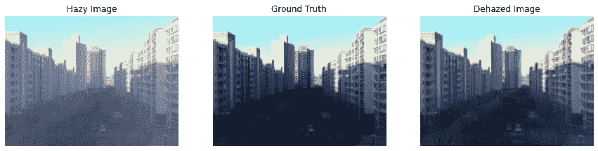

模糊、原始和去雾的图像。

我们使用下面的函数来显示单个历元训练后验证数据的输出。它以一个典型的、朦胧的、原始的图像作为论据。

## 网络函数

下面是网络功能。我们已经用 Conv2D，Conv2DTranspose 构造了这个函数。第一个是 GMAN 网络，其中除了编码层具有 128 个滤波器之外，所有层都具有几个滤波器，如 64 个，并且最终输出层具有 3 个通道(RGB)。在 GMAN 之后，并行网络(PN)已经扩展了卷积层，所有层都具有 64 个滤波器，除了最后一个具有 3 个通道(RGB)。我已经在上面详细解释了架构。

## 培养

我从这个项目中学到的最好的东西是如何定制训练一个模型。通常 fit，predict 看起来很吸引人，但真正的训练方式是这样的。下面的函数训练模型。在每个时期，我们都有一个训练循环和一个验证循环。在训练循环中，我们获取训练数据并计算梯度，然后应用它们来计算训练损失。在验证循环中，我们采用在该历元中计算的梯度，并将其应用于验证数据，以检查输出(使用 display_img 函数)和验证损失。最后，我们保存该时期的模型(权重、变量等)并重置损失指标。

现在，在我们训练模型之前，我们将定义一些超参数。我使用的批量大小为 8，因为超过这个数量，GPU 就会耗尽内存。我们没有将内核权重初始化为零，而是使用随机正态初始化来提供更好的结果。为了减少过拟合，使用了权重衰减为 1e-4 的 L2 正则化子。请注意，根据研究论文，每一层都没有相同的内核初始化。最后调用训练函数。

## 评估(测试)

现在我从谷歌上随机拍摄了一些模糊的(自然模糊的)图片，并对它们进行了测试，下面的函数就是用来测试的。

上面显示了一个测试输出，下面显示了其他输出。其余的[你可以查看这里的](https://github.com/sanchitvj/Image-Dehazing-using-GMAN-net/tree/master/results/test%20results) **。**您可以在这里查看确认输出[。](https://github.com/sanchitvj/Image-Dehazing-using-GMAN-net/tree/master/results/validation%20results)

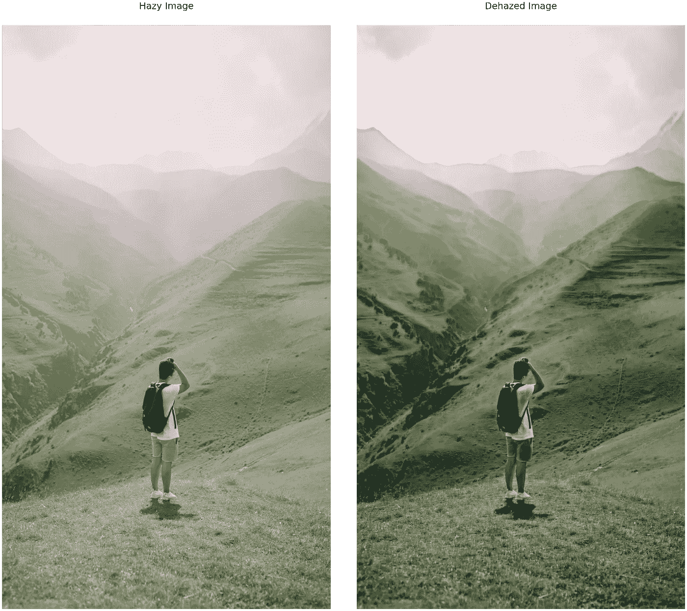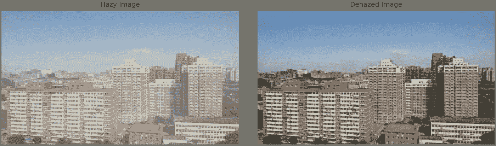

> V oila！！！我们完了。

# 结束思考

我们已经成功地设计了一个算法去模糊(恢复)一个模糊的图像。我们在这里学到的要点是:

*   去雾领域背后的 GMAN 建筑与研究。
*   如何在 [TensorFlow](https://medium.com/u/b1d410cb9700?source=post_page-----65a2b3f679a5--------------------------------) 中定制训练一个模型？
*   如何处理要素和标注都是图像的数据集？

## 参考资料:

*   [https://github.com/Seanforfun/GMAN_Net_Haze_Removal](https://github.com/Seanforfun/GMAN_Net_Haze_Removal)
*   你可以从这里得到数据集:【https://www.kaggle.com/wwwwwee/dehaze 
*   感谢[tensor flow](https://medium.com/u/b1d410cb9700?source=post_page-----65a2b3f679a5--------------------------------):[https://www . tensor flow . org/guide/keras/writing _ a _ training _ loop _ from _ scratch](https://www.tensorflow.org/guide/keras/writing_a_training_loop_from_scratch)

可以查看一下这个项目的 [Kaggle 笔记本](https://www.kaggle.com/sanchitvj/gman-net-for-image-dehazing-using-tf2)，输出最多 5 个历元。欢迎任何建议。在 [GitHub](http://github.com/sanchitvj) 上查看我的其他项目。

> 如果你觉得我的工作有用，请鼓掌。

## 享受学习！！！