# 在逻辑回归中从初学者到专家

> 原文：<https://medium.com/analytics-vidhya/go-from-beginner-to-pro-in-logistic-regression-8900af57fb35?source=collection_archive---------10----------------------->

演职员表:[https://pixabay.com/users/free-photos-242387/](https://pixabay.com/users/free-photos-242387/)

监督学习是机器学习的一部分，它处理附有输出标签的数据集。

给定数据集*d = yᵢ}{xᵢ*其中 xᵢ ∈ Rᵈ，yᵢ∈c₃,….{c₁、Cₙ}和查询点 xₚ，我们必须预测该点属于哪个类。

那么，我们开始吧。🚗

*逻辑回归的假设*:假设数据是线性可分或近似线性可分的。

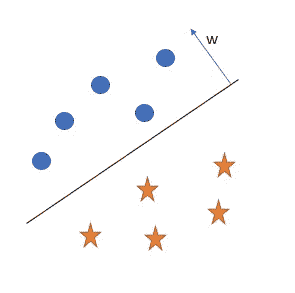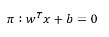

逻辑回归的目的是找到一个最好的分类超平面。

为了找到平面，我们需要找到 w 和 b，其中 w 垂直于平面，b 是截距项。

我们知道，一架飞机到 xᵢ一点的距离是:

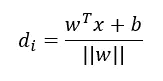

为简单起见，我们假设

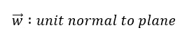

一个平面穿过原点。因此，

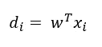

另一个假设:-

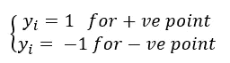

即正的点标记为+1，负的点标记为-1。

## 我们的分类器将如何分类一个点？

*   如果一个点属于 w 向量方向上的区域，那么这个点将被标记为正

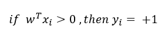

*   如果一个点属于 w 向量相反方向的区域，那么这个点将被标记为负。

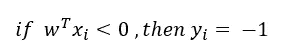

让我们考虑分类器的所有情况

情况 1 : yᵢ = 1(点是正的)，wᵀ xᵢ > 0(模型预测是正的)

在这种情况下，yᵢ wᵀ xᵢ > 0

案例二:yᵢ = -1(点数为负)，wᵀ xᵢ < 0 (model predicts negative)

In this case, yᵢ wᵀ xᵢ > 0

情况 3 : yᵢ = 1(点是正的)和 wᵀ xᵢ < 0 (model predicts negative)

In this case, yᵢ wᵀ xᵢ < 0

Case 4 : yᵢ = -1 (point is negative) and wᵀ xᵢ > 0(模型预测是正的)

在这种情况下，yᵢ wᵀ xᵢ < 0

We want more and more points to be classified correctly i.e. we want more points to belong to case 1 and case 2 rather than to case 3 and case 4.

## The Objective function of Logistic Regression

Suppose we have n data points, then we want a hyperplane

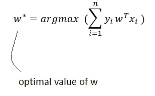

## Problem with the mathematical objective function of Logistic Regression

It is sensitive to outliers. How?

Let’s imagine a scenario like this-

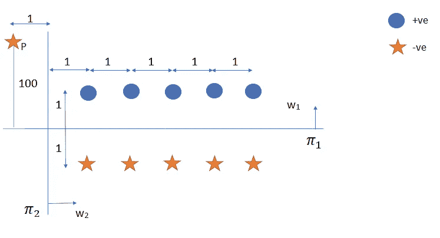

Here, point P is an outlier w.r.t plane π₁ which is at the distance of 100 units in the opposite direction.

Before moving forward, just by looking at the scenario, π₁ appears to be a better hyperplane than π₂, as π₁ has less misclassified points.

Now let’s see what out mathematical objective function has to say about this.

for π₁ :

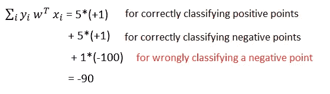

for π₂ :

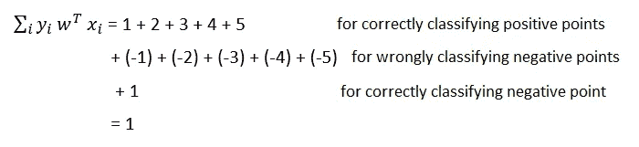

Even though π₁ appears to be a better option, just because of an outlier P, our objective function says π₂ to be the better one.

Moreover,

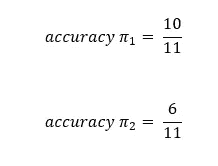

*那么，如何处理离群值呢？*

只有当异常值非常远时，这才是一个主要问题。

💡想法是，如果一个点到平面的距离很小，就按原样使用它，否则，如果距离很大，就最小化它。

这种使大距离最小化的过程被称为挤压。为我们完成这项工作的函数之一是最受欢迎的函数 *Sigmoid 函数*。

## Sigmoid 函数

对于较小的值，它呈线性增长，但当输入过大时，它会达到饱和。

学分:Towardsdatascience.com

*   sig(0) =σ(0) = 0.5
*   到平面的距离可以是(-∞，+∞)，但通过σ函数后，我们将在(0，1)中得到一个值。

*阈值:*

通常，在二元分类中，0.5 被作为阈值来决定查询点的类别标签。

如果σ(wᵀ x) ≥ 0.5，则预测+1，否则预测 0

*为什么使用 sigmoid 函数*？

*   容易微分。
*   它给出了一个概率解释。
*   小值时线性增长，大值时饱和。

所以，我们新的数学目标函数将是-

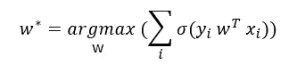

## 简化目标函数:

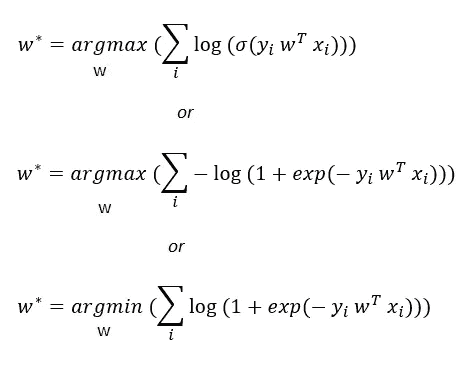

为什么我们取负对数？

*   使σ(yᵢ wᵀ xᵢ)成为凸函数，这样更容易优化。
*   我们可以使用另外两种方法来推导逻辑回归的目标函数:(1)概率方法(其中我们认为特征遵循高斯分布，输出标签遵循伯努利分布)，以及(2)最小化逻辑损失函数(这是对[0–1 损失函数](https://en.wikipedia.org/wiki/Loss_function#0-1_loss_function)的近似)。这两个都有一个对数项。由于 log 是单调函数，所以不会影响我们的优化问题。

## w 的解释

假设我们得到一个最优 w 值，那么

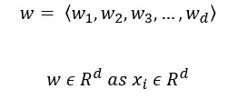

即对于每个特征 fᵢ，将有一个与之对应的权重。这就是为什么 w 也被称为权重向量。

案例 1:当 wᵢ为+ve 时

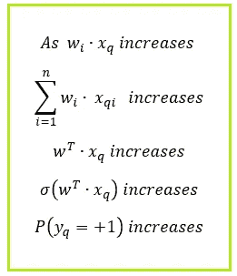

案例 2:当 wᵢ被-ve

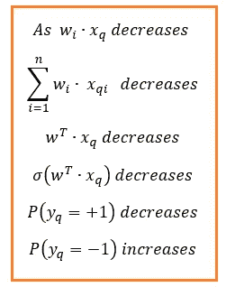

## 正规化

让 zᵢ = yᵢ wᵀ xᵢ

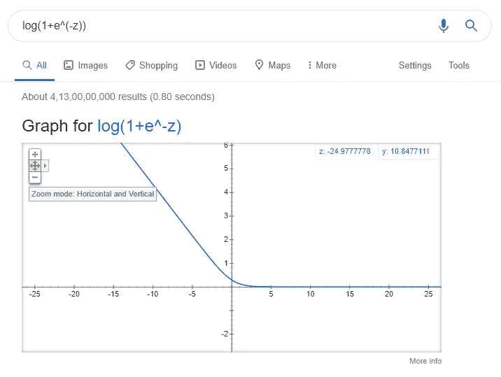

损失函数的最佳值在以下情况下获得:

每个 *log (1 + exp(-zᵢ))* 都是最小值，这发生在 zᵢ趋于+∞时

这意味着，所有的 zᵢ必须是正的，或者换句话说，所有的 yᵢ wᵀ xᵢ必须是正的(*这是我们之前讨论过的情形 1 和情形 2*)。
所有完全分类的训练数据有时会导致**数据过拟合**。

如何避免这种情况？

我们需要控制 w 的值，使它不会达到很高。

惩罚 w 值有三种方式:

1.  **L2 正规化**

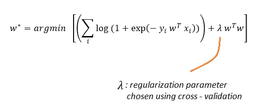

在逻辑损失和正则化项之间有一个折衷。

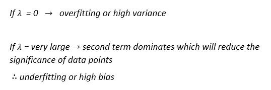

2. **L1 正规化**

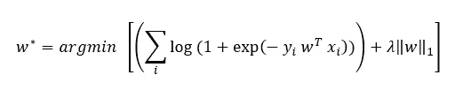

*要点*:

*   对于不太重要的特征 fᵢ，L1 正则化生成 wᵢ = 0(即，L1 正则化创建稀疏权重向量)，而 L2 正则化 wᵢ较小。
*   由于生成了稀疏向量，L1 正则化导致快速计算。

3.**弹力网**

它结合了 L1 正则化和 L2 正则化的优点。

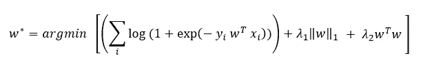

*   它将有两个超参数
*   耗时的
*   高性能

## 列标准化

*   因为它是基于距离的模型，所以需要标准化。
*   标准化也有助于我们优化问题的快速收敛。

## 特征重要性和模型可解释性

*   如果数据的要素不共线/多重共线，则对应于较高 wᵢ权重的要素 fᵢ会更重要。
*   然而，如果特征是共线的，可以切换到向前特征选择或向后特征消除，这是获得特征重要性的标准方式，并且不管模型如何都有效。
*   一旦知道了特征的重要性，模型就可以根据这些特征给出它已经预测了+1 或-1 的推理。

## 时间和空间的复杂性

*列车*:

*   逻辑回归的训练无非是利用 [SGD](https://towardsdatascience.com/stochastic-gradient-descent-clearly-explained-53d239905d31) 优化耗时 O(n*d)的损失函数。
*   我们需要存储所有的点，这需要 O(n*d)的空间。

*测试*:

*   我们只需要存储 d 维向量的权重向量，因此需要 O(d)空间
*   计算σ(wᵀxₚ)需要 d 次乘法，因此时间为 O(d)。

## 维度及其效应

*如果 d 很小:*

*   逻辑回归非常有效。
*   它可以集成到低延迟系统中。
*   时空复杂度更少。

*如果 d 很大:*

*   它受到[维度诅咒](/@anujshrivastav97/curse-of-dimensionality-the-curse-that-all-ml-engineers-need-to-deal-with-5d459d39dc8a)的影响。
*   可以使用 L1 正则化来移除不太重要的特征。然而，应仔细选择λ值，以处理偏差、方差和延迟。

## 处理不平衡的数据

让我们看看不平衡数据是如何影响逻辑回归的

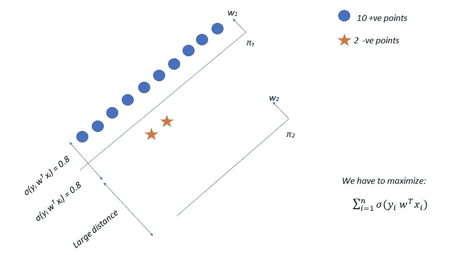

为了π₁:

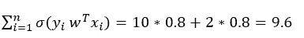

对于π₂:

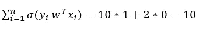

*   π₂给出了比π₁更好的结果，然而，通过观察超平面的位置，我们知道π₁是一个更好的选择

*怎么处理？*

处理不平衡数据的标准方法是执行上采样或下采样

1.  **上采样:**

*   给少数阶级更多的权利。
*   制造人为的小众阶层之分。

**SMOTE 或合成少数过采样技术:**

*   另一种上采样方式，使用最近邻生成新点。

**2。缩减采样:**

*   从多数班级中随机抽取样本。

## 处理多类分类

*   逻辑回归本身并不支持多类分类。
*   然而，人们可以使用[一对所有](http://mlwiki.org/index.php/One-vs-All_Classification)的策略来处理它。

暂时就这样吧！

恭喜你。您现在已经成功地将逻辑回归添加到您的武器库中。😎