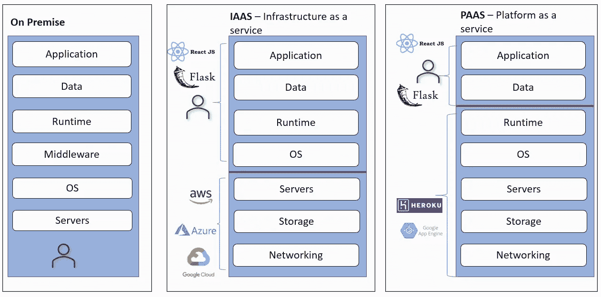
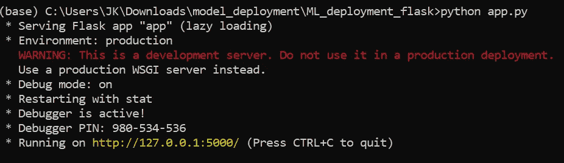
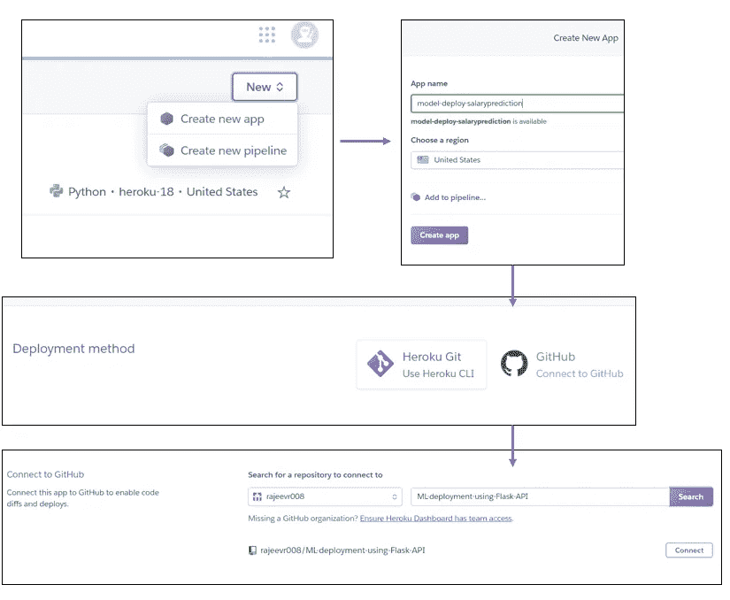

# 超越朱庇特

> 原文：<https://medium.com/analytics-vidhya/going-beyond-jupyter-c504b32eea2d?source=collection_archive---------20----------------------->

来源:谷歌

EDA —完成，数据可视化—完成，模型—完成，模型评估—完成。下一步是什么？

通常数据科学模型在 jupyter 笔记本中保留或消亡。模型部署是一个令人生畏的术语，以至于我们经常忽略它或通过 powerpoint 传达见解，而实际上我们希望将其发布为 web 应用程序，并通过 url 进行共享。

# ***可供部署型号*** 的解决方案

一个模型要在现实世界中使用，它需要在生产中。以下是一些最常见的可用解决方案:

# **使用 Flask 和 Heroku 进行模型部署**

在这篇文章中，我将分享一种使用 Flask API 将预测模型部署到 Heroku 的端到端方法。

1.  火车模型
2.  使用 Flask 创建一个 web 应用程序
3.  创建 github 存储库
4.  把 github 和 Heroku 联系起来
5.  将模型部署到 web

**火车型号** — model.py

pickle 的简单介绍 pickle 将对象转换成字节流，可以存储、传输并在以后转换回原始模型。

**使用 Flask** 创建一个 web API

API 是计算机系统通过互联网协议相互通信的方式。它们充当代理，将信息从用户传到服务器，然后再从服务器传到用户，并返回答案。**烧瓶**提供这种能力。Flask 将充当模型和 HTML 文件之间的 API。

API 将被创建为 app.py 文件

在这个阶段，使用我们的模型(model.py)、API(app.py)和 HTML 文件(index.html ),我们可以通过命令提示符在本地运行和测试我们的应用程序

## **将模型部署到 web:**

为了在 heroku 上部署它，我们需要确保:

1.  创建了所有必要的文件——requirements . txt 和 Procfile

**需求文件**

这是程序的第一个入口点。它将安装运行代码所需的所有依赖项。requirements.txt 将告诉 heroku 这个项目将需要所有这些库来成功运行应用程序。

**过程文件**

Heroku 要求 Procfile 存在于您的应用程序根目录中。它将告诉 Heroku 如何运行应用程序。确保它是一个没有扩展名的简单文件。Procfile.txt 无效。冒号左边的部分是流程类型，右边的部分是启动该流程所运行的命令。在这种情况下，我们可以判断应该在哪个端口上部署代码，并且您可以启动和停止这些进程。

2.创建 Githtub 存储库，将其与 Heroku 链接

在自动部署(CI —持续集成)或手动部署之间进行选择。

Taadddaaa heroku 将生成您的 web 应用程序的 URL，您可以与全世界共享它！！！—[https://mlprediction-api.herokuapp.com/](https://mlprediction-api.herokuapp.com/)

希望这个教程对你们有帮助！

下次你决定超越 jupyter，可以参考我的 github 做进一步参考——[https://github.com/rajeevr008](https://github.com/rajeevr008)