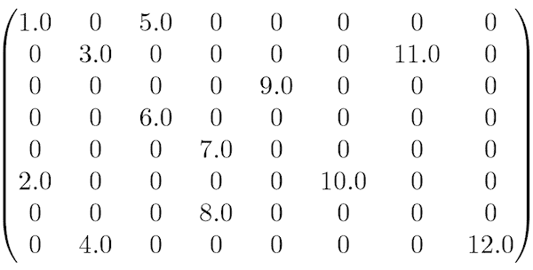
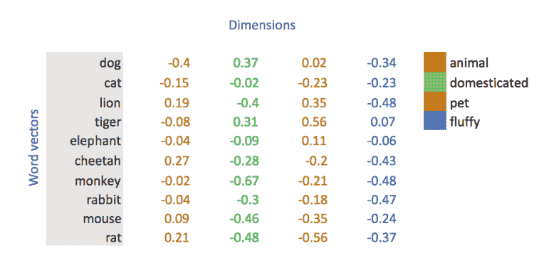
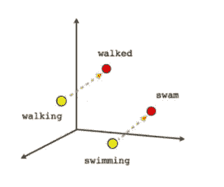
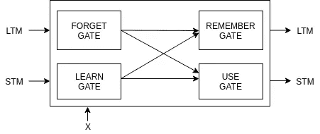
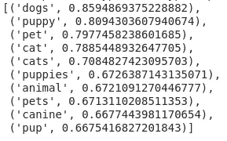
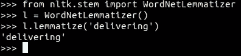
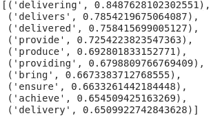

# 超越传统的情感分析技术

> 原文：<https://medium.com/analytics-vidhya/going-beyond-traditional-sentiment-analysis-technique-b9c91b313c07?source=collection_archive---------0----------------------->

## 传统的方法如 TF-IDF，CountVectorizer 等。失败？


丹尼尔·里卡洛斯在 [Unsplash](https://unsplash.com/search/photos/coding?utm_source=unsplash&utm_medium=referral&utm_content=creditCopyText) 上的照片

情感分析仍然是一个非常具有挑战性的任务，因为像讽刺性的反馈，主观反馈，客观反馈和更多的挑战。

首先，让我们看看 TF-IDF、计数矢量器或 BOW 等方法的失败之处。

为了训练任何 TF-IDF 模型，我们首先移除所有冗余单词。然后使用 TF-IDF 或计数矢量器将单词编码成数字。这些方法不太关心单词的顺序。那么，他们失败在哪里呢？

1.  **操控对比**

当我们谈论比较时，这些方法就失效了。

示例— *产品 XYZ 优于 ABC* 。

2.**处理否定**

像*不*、*不*和*从不*这样的词很难处理

产品还不错。

为了克服这些问题，我们将使用 Word2Vec 在 Keras 中嵌入 LSTM。我将展示的代码与 Keras 兼容得最好，因为它有一个预定义的函数，我保证这将是您可能见过的最简单的方法。

**这篇文章的独特之处在于，我们将通过一个简单的函数**使用 Word2Vec 在 Keras 中的嵌入。

简而言之，这些是我们将要讨论的内容:

1.  嵌入以及为什么它们更好
2.  了解 LSTM 是如何运作的
3.  了解 Keras 中的嵌入层
4.  编写情感分析程序。

## 了解 Word2Vec 模型

让我们从理解 Word2Vec 模型开始。

将任何文本转换为数字形式的需求是因为计算机以及我们的机器学习模型只能理解数字。

像术语频率-逆文档频率(TF-IDF)、计数矢量器或一键编码这样的方法创建了一个不是很有效的稀疏矩阵。



来源- [ganto.github.io](https://www.google.com/url?sa=i&source=images&cd=&cad=rja&uact=8&ved=2ahUKEwiukPvM45jjAhXIV30KHaG6CMQQjB16BAgBEAQ&url=https%3A%2F%2Fdziganto.github.io%2FSparse-Matrices-For-Efficient-Machine-Learning%2F&psig=AOvVaw39qY29_Lc7VXw1z8mMX2xa&ust=1562244277181520)

为了克服这个问题并创建单词之间的关系，使用了单词嵌入。



来源-https://www . medium . com/jayeshbahire

上面你可以看到我们有一个 4 维向量来表示单词。嵌入的最大优点是它在单词之间建立了一种联系



来源: [https://mc.ai](https://www.google.co.in/url?sa=i&source=images&cd=&cad=rja&uact=8&ved=2ahUKEwj43NPfzJ3jAhXL6Y8KHYzKBqQQjB16BAgBEAQ&url=https%3A%2F%2Fmc.ai%2Fhow-to-get-same-word2vec-doc2vec-paragraph-vectors-in-every-time-of-training%2F&psig=AOvVaw1JRjAtpCEwtuKExSymFuK-&ust=1562409939423397)

当你在训练你的网络时，这种嵌入非常有效。我现在不想谈太多细节。当我们学习在 Keras 中使用嵌入时，我们会讨论更多。

## 了解 LSTM 是如何运作的

LSTM 代表长期短期记忆。它是 RNN(递归神经网络)的升级版本，没有消失梯度的问题(当有许多隐藏层时会发生)。



LSTM 细胞

LSTM 有 4 个门:

1.  **遗忘之门**:使用先前的 LTM 来遗忘不必要的东西。
2.  **学习门**:使用当前 i/p(x)使用以前的 STM 进行学习。
3.  **记住门**:使用忘记门和学习门来计算新 LTM 需要记住什么。
4.  **使用门**:使用 LTM、STM 和 i/p(x)创建将被进一步使用的新 STM。

现在的问题是，为什么有必要搬到 LSTM 进行情绪分析？

长短期网络在模型中有记忆。在网络中有一个存储器是很有用的，因为当处理像文本这样的有序数据时，一个单词的意思取决于先前文本的上下文。这些依赖性对文档的含义和整体极性有很大的影响。你可以在这里阅读更多关于它的[。](https://beta.vu.nl/nl/Images/werkstuk-miedema_tcm235-895557.pdf)

**了解 Keras 中的嵌入层**

嵌入是可以被训练的固定长度的向量，或者也可以使用预训练的嵌入。

让我们写一些代码来更好地理解

我已经创建了一个 [Google Colab 文件](https://colab.research.google.com/drive/19Ghc_Q21-k3n4ma8UuoRGXzGFeRN4qKB)。您可以在本地计算机上执行所有步骤，也可以创建 Colab 文件的副本。我们要用的预训练嵌入比较大，所以我会推荐用 Colab。

1.  从 nlp.stanform.edu 下载手套模型

```
!wget [http://nlp.stanford.edu/data/glove.42B.300d.zip](http://nlp.stanford.edu/data/glove.42B.300d.zip)
!apt install unzip
!unzip "glove.420B.300d.zip"
```

这个预训练的嵌入具有 300d 向量表示。

2.接下来的任务是将手套嵌入转换为 Word2vec 嵌入。转换并加载文件需要一段时间。

将手套嵌入转换为 Word2Vec 嵌入

3.现在，让我们看看它能做什么



和狗最相似的词

Word2Vec 基于向量位置定位与 dog 最相似的单词。

现在，让我们了解它在情感分析中是如何有用的。

如果单词“dog”和“dogs”在训练时出现，模型将知道它们有 85%的相似性。

那么，为什么我们不使用一个自动将*狗*转换成*狗*的分类器呢？嗯，*送*和*送*这两个差不多的就不行了。



现在，您已经看到了嵌入可以做什么。我们可以在情感分析中利用它的力量。

在 Keras 中使用嵌入有两种方式。

1.  创建一个新的数组，并从 glove_model 中复制嵌入值。这可能不是一个好主意，因为它消耗了太多的内存。
2.  使用 word2vec 的 get_keras_embedding 函数。这个函数非常容易使用，可以直接在嵌入层内部使用。

# 情感分析代码

**让我们开始编码** —

1.  打开这个 [Google Colab](https://colab.research.google.com/drive/19Ghc_Q21-k3n4ma8UuoRGXzGFeRN4qKB) 笔记本或者在你的本地系统上使用 Jupyter 笔记本。
2.  下载预先训练好的手套模型。

```
!wget [http://nlp.stanford.edu/data/glove.42B.300d.zip](http://nlp.stanford.edu/data/glove.42B.300d.zip)
!apt install unzip
!unzip "glove.42B.300d.zip"
```

3.将手套嵌入转换为 Word2Vec 嵌入

4.现在，让我们准备好数据集。

```
!pip install nlppreprocess
```

> 以上套餐可选。我们将使用它来清理数据。

4.a)导入所有包

4.b)下载数据集

```
!wget !wget [https://archive.ics.uci.edu/ml/machine-learning-databases/00462/drugsCom_raw.zip](https://archive.ics.uci.edu/ml/machine-learning-databases/00462/drugsCom_raw.zip)!unzip 'drugsCom_raw.zip'
```

4.c)导入训练集

4.d)我这里用的是二元分类法。所有高于 5 的评分都转换为 1，低于 5 的则转换为 0。

> 以上步骤是完全可选的

4.e)将我们的标签转换成稀疏矩阵形式

5.查找出现频率最高的单词，在训练集和填充序列中替换它。

5.a) max_features-可以出现的唯一单词的数量。越多越好。

5.b) max_len =句子的最大长度。它将在填充过程中用来填充较长的短句。

> 如果你仔细观察，我们正在做一些预处理。这种预处理删除所有的停用词，数字，HTML 标签和标点符号。这一点很重要，因为您正在为数据集选择重要的要素，并且您不希望它是一些无用的随机单词。

我们为什么要做句子的填充？

> 不是所有的句子都是等长的，这可能是个问题。为了避免这种情况，所有句子的开头或结尾都用零填充(取决于实现)。

6.建筑模型

> 我们使用 glove _ model . get _ keras _ embedding()在 keras 中创建嵌入层。

7.让我们编译模型。

现在，等待模型训练

训练后，您可以使用其预测功能来生成预测

如果你已经做到了这一步，干得好！！

> 一切都有瑕疵

到目前为止，我们只讨论了这个模型的优点，以及为什么它优于传统的情感分析技术。让我们看一个失败的例子

1.  word2vec 的嵌入是静态的。我们将通过一个例子来理解为什么动态嵌入很重要。

例 1 — *劫匪抢劫了* ***银行*** *。*

例 2 — *看到渔民在河流的* ***岸边*** *抓鱼。*

银行这个词在两个句子中有不同的意思。静态嵌入有固定的嵌入，不会因周围的词而改变词义。这就是为什么我们需要动态嵌入，它可以根据周围的文字而变化。你可以在这里阅读更多关于动态嵌入[的内容。](https://arxiv.org/abs/1702.08359)

**结论**

对于情感分析，如果你有足够的数据，单词嵌入比 TF-IDF 和 CountVectorizer 要好得多。在单词嵌入的帮助下训练神经网络可以产生最先进的准确度。如果你在现有的系统或模型中寻找更高的精确度，那么转向神经网络可能是个好主意。

谢谢大家！

**参考文献**

1.  [http://ka vita-ganesan . com/gensim-word 2 vec-tutorial-starter-code/# . xsl 483 uz bix](http://kavita-ganesan.com/gensim-word2vec-tutorial-starter-code/#.XSL483Uzbix)
2.  [https://machine learning mastery . com/what-are-word-embedding/](https://machinelearningmastery.com/what-are-word-embeddings/)
3.  [https://adventuresinmachine learning . com/keras-lstm-tutorial/](https://adventuresinmachinelearning.com/keras-lstm-tutorial/)
4.  [https://skymind.ai/wiki/word2vec](https://skymind.ai/wiki/word2vec)