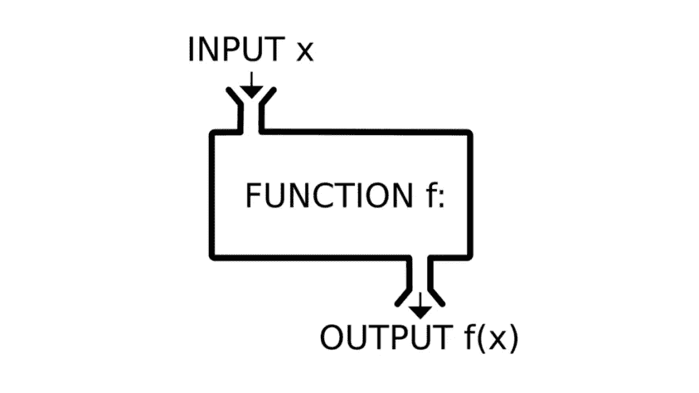

# 用 Python 实现功能(带代码)

> 原文：<https://medium.com/analytics-vidhya/going-functional-in-python-with-code-b50ba7742469?source=collection_archive---------0----------------------->

功能:有东西进来，有东西出去

听说过函数式编程，但不理解它和/或不知道从哪里开始？或者您可能想快速复习一下 Python 中的工作原理？那你来对地方了！

## 编程范例

Python 是一种被解释的通用、高级、动态类型和垃圾收集的编程语言。现在…