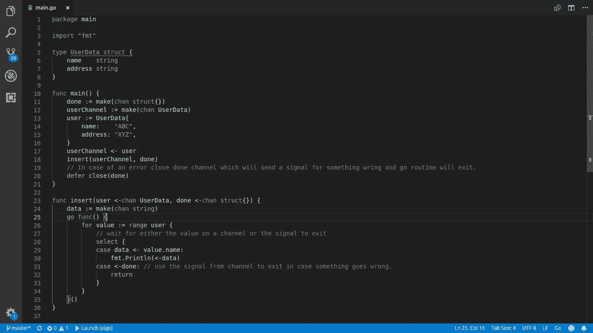

# 管道中使用的 Golang 渠道

> 原文：<https://medium.com/analytics-vidhya/golang-channels-use-in-pipeline-36edd8e107ae?source=collection_archive---------8----------------------->

通道可以以不同的方式使用，包括向 go 例程发送值或 go 例程之间的通信，这是核心功能。

通道的一个重要用途是控制管道级的流动。管道被用作具有多个下行流和上行流的阶段，其中数据通过通道流动。

golang 内部有一个关于管道及其使用的漂亮博客。

 [## Go 博客

### same er aj mani 2014 年 3 月 13 日简介 Go 的并发原语使构建流数据管道变得很容易…

blog.golang.org](https://blog.golang.org/pipelines) 

在 go 例程中，通道是控制管道阶段中的流的一个很好的工具，其中每个阶段对通过通道发送的值进行一些处理，并在出站通道上返回值，这些值可以根据需要进一步处理。

对于在流水线阶段内定义的 go 例程中处理来自多个通道的数据，使用*选择*，它提供了一种退出或处理来自通道的数据的方法。

让我们来看一个例子，当你和 golang 频道一起工作时，将会有什么样的方法，以及如何使用它们作为你最强有力的工具。

如果我们继续上面的例子，我们可以看到通道被用来控制通过 go 例程的数据流。在 golang 工作了 4 年后，我从通道中学到的一个概念是，通道不仅可以用于向其他 go 例程发送信号，还可以用于控制它们(何时退出处理)。

当我们谈论使用通道控制 go 例程时，我们需要将同一个通道传递给所有 go 例程，我们可以使用该通道来控制这些 go 例程。因此，如果我们关闭共享通道并使用*选择*检查通道状态，它将发送共享相同信号通道的所有 go 例程的关闭状态值。这种使用单一通道向所有围棋程序发送信号的概念可以相应地用在不同的场景中。

在上面的例子中，我们使用 done channel 发送信号作为空结构来通知所有的 go 例程。

**举例:**

假设我们想将一个用户数据插入数据库，如果插入，我们需要在 api 上获取值，或者使用多个 go 例程对相同的值执行其他相同的操作。

但是，如果用户没有被插入，并且有一个错误，那么发送该值到所有的 go 例程，这些例程正在等待输入通道上的值，因为有一个错误而不等待。通道来了，你可以通知其他功能出问题了。使用*选择*，它将等待一个值或一个信号，该值或信号将告诉 go 程序在父 go 程序出错时退出。

在上面的例子中，我通过关闭频道发送了一个信号，并使用*选择*等待用户频道或完成频道。

**结论:**

这些通道可用于控制多个 go 程序，条件是如果 go 程序在数据上相互链接，则相同的通道作为信号通道传递给所有 go 程序。