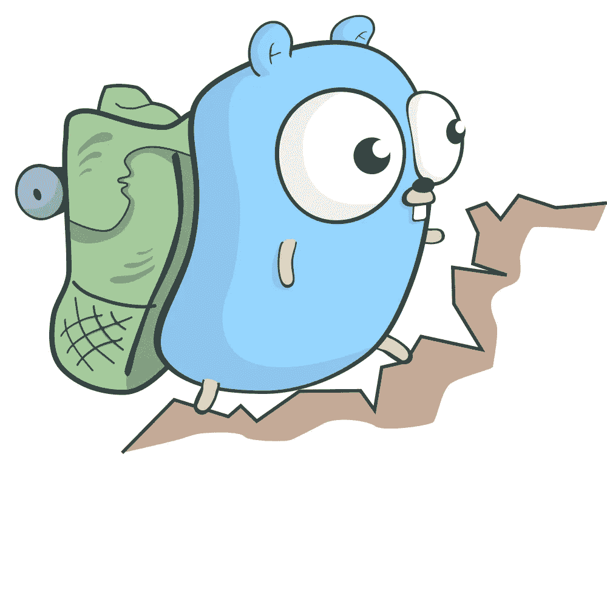

# Golang 命令行 Git 解析器

> 原文：<https://medium.com/analytics-vidhya/golang-command-line-git-parser-2f4e85ac8fc6?source=collection_archive---------9----------------------->



来源:[https://github.com/egonelbre/gophers](https://github.com/egonelbre/gophers)

每天早上 10 点，我的团队都有一个虚拟的每日站立，每个成员都写下他们昨天完成了什么，并希望他们今天继续工作。

其中一个挑战是，在任何一天，我都可能在做多个项目，而试图在 24 小时后记住我在一个工作日所做的一切可能很难。

这就是为什么我在 Go 中构建了一个命令行工具，它将遍历每个项目目录，并显示我在过去 24 小时内提交的所有内容。让我们投入进去吧！

要获得最终代码:

```
cd $GOPATH/github.com
git clone [https://github.com/Lebonesco/daily-standup-cli](https://github.com/Lebonesco/daily-standup-cli)
```

# 一些 CLI 样板文件

我们将使用两个第三方软件包。`cli`将是我们构建项目的客户端库，`go-homedir`提供了一些有用的文件系统方法。

```
mkdir daily-standup-cli
cd daily-standup-cli
touch main.go
go get [https://github.com/urfave/cli](https://github.com/urfave/cli)
go get github.com/mitchellh/go-homedir
```

如果你有兴趣了解更多关于这个项目使用的`cli`包的信息，那么[回购](https://github.com/urfave/cli)中的文档是广泛的。

在上面的代码中，我们已经设置了启动客户端并传入各种标志的功能。现在，我们保持它的简单，只有三个标志，但你可以很容易地扩展这个项目的功能，能够做的事情，如指定你的输出到一个电子邮件，slack 频道，或文件。

下面的代码块指定了一个名为`user`或`u`的标志，没有默认值。

```
...
cli.StringFlag{   
    Name:  "user, u",
    Value: "",
    Usage: "git user name",  
},
...
```

`app.Action`是我们运行程序时执行核心代码的地方。`c.String("flag")`返回一个标志值。`dir`标志默认为您的系统主目录，`after`设置为从当前时间起 24 小时。唯一没有默认值的标志是`user`，它是您的 git 用户名。

要查看我们的客户详情:

```
go run main.go --helpNAME:
   Daily Standup Helper CLI - Reports git historyUSAGE:
   main [global options] command [command options] [arguments...]VERSION:
   1.0.0AUTHOR:
   github.com/LebonescoCOMMANDS:
   help, h  Shows a list of commands or help for one commandGLOBAL OPTIONS:
   --user value, -u value   git user name
   --dir value, -d value    parent directory to start recursively searching for *.git files (default: "/Users/josephlivni")
   --after value, -a value  when to start looking at commit history (default: "2019-10-18T14:21:17")
   --help, -h               show help
   --version, -v            print the version
```

# 应用程序的核心

是时候进入有趣的部分了！

下一节将包括遍历文件夹、捕获 git 日志、将它们临时存储在内存中，然后将它们保存为格式化的 JSON 文件的代码。

## 捕获 Git 日志

下面的代码接受我们想要执行的`git log`命令的路径、我们关心其提交的用户以及我们想要开始过滤的日期。

如果你只是运行`git log`,你会在你的终端上得到大量的非结构化数据。幸运的是，git 为我们提供了一个`--pretty=format`选项，允许我们将结果输出到格式化的 XML 中。`%an`会给我们作者的名字，`%cd`提交日期，`%B`提交消息。如果你想了解更多关于 git 日志格式的信息，请查看官方文档。

## 在目录中爬行

这里的想法是，我们将在文件系统中爬行，当我们找到一个`.git`文件时，我们将执行上面刚刚编写的代码并捕获日志。

幸运的是，Go 有一个方法`filepath.Walk()`，给定一个起始目录，它将向下递归遍历。

代码相当简单。当我们用`info.Name() == .git`点击一个文件时，我们从那个项目中获得提交日志。然后，我们获取 XML 字节，将它们转换成一个`commit`结构，并将结果附加到`commits`。

注意:*我们不能使用* `*xml.Umarshal(b, &commit)*` *将字节转换为结构的原因是，我们从 git 接收的结果是一个没有包装标签的 XML 对象数组。因此，* `*xml.Umarshal*` *只会给我们第一个结果。* `*d.Decode*` *足够聪明，可以遍历数组，直到命中末端。*

## 将所有东西整合在一起

我们最后将编写`runClient`，它将把我们所有的代码结合在一起，并将我们的结果保存到一个本地文件中。

下面的代码将运行`getGitHistory()`并将结果保存为一个格式良好的 JSON 文件。

最后，如果您对能够从任何地方运行它感兴趣，请运行:

```
cp main /usr/local/bin/<whatever-you-want-to-call-it>
```

全部完成！

感谢你阅读这篇文章。我希望它是有趣的。