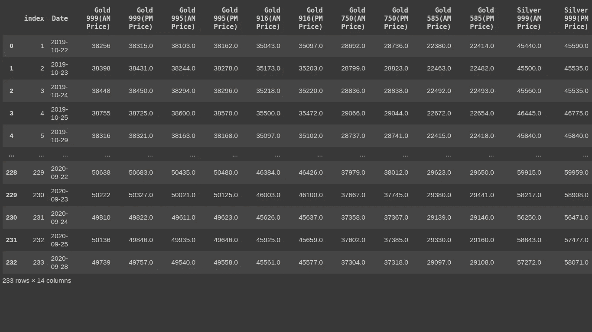
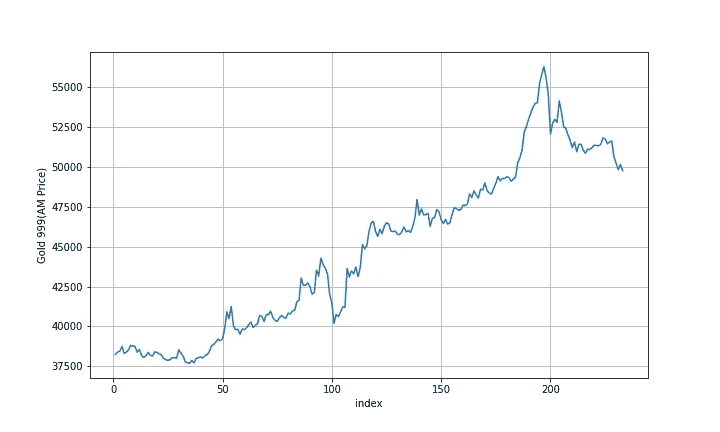
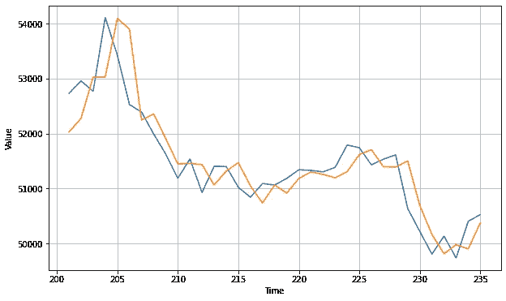
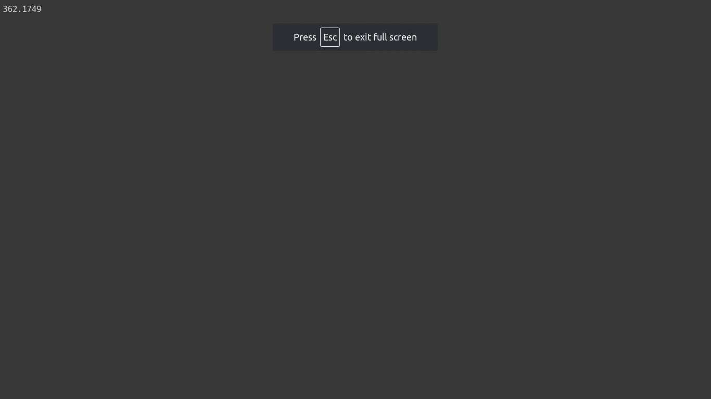

# 基于神经网络的黄金价格预测

> 原文：<https://medium.com/analytics-vidhya/gold-price-forecast-using-neural-networks-37ac4e6600c1?source=collection_archive---------10----------------------->

> 步骤 1:-关于数据集和基本操作的信息
> 
> 步骤 2:-数据集的可视化。
> 
> 步骤 3:-制作用于预测的窗口数据集
> 
> 步骤 4:-建立神经网络并在窗口数据集上训练和验证

ipynb 笔记本文件和数据集的链接如下

[](https://github.com/akshayardeshana/Gold-forecasting) [## akshayardeshana/黄金预测

### 通过在 GitHub 上创建帐户，为 akshayardeshana/黄金预测发展做出贡献。

github.com](https://github.com/akshayardeshana/Gold-forecasting) 

> 步骤 1:-关于数据集和基本操作的信息

该数据集包含有关黄金和白银价格的信息。

```
import pandas as pdgold_data=pd.read_csv('/content/drive/MyDrive/dataset/Goldsorted_final.csv')gold_data
```



黄金数据集

在这个数据集中，价格是从 2019 年 8 月 22 日到 2020 年 9 月 28 日。

> 步骤 2:-数据集的可视化

**我们使用的是 TensorFlow 2.3.0 版本。**

```
import tensorflow as tfimport numpy as npimport matplotlib.pyplot as pltprint(tf.__version__)
```

为这个情节写一个函数。

```
def plot_series(time, series, format="-", start=0, end=None): plt.plot(time[start:end], series[start:end], format) plt.xlabel("index") plt.ylabel("Gold 999(AM Price)") plt.grid(True)
```

为可视化绘制图表。

```
import csvtime_step = []goldinfo = []with open('/content/drive/My Drive/dataset/Goldsorted_final.csv') as csvfile:reader = csv.reader(csvfile, delimiter=',') next(reader) for row in reader: goldinfo.append(float(row[2])) time_step.append(int(row[0]))series = np.array(goldinfo)time = np.array(time_step)plt.figure(figsize=(10, 6))plot_series(time, series)
```



上面我们用一个指数作为时间，用黄金 999(AM 价格)列作为值。

> 步骤 3:-制作用于预测的窗口数据集

我们使用窗口数据集的概念来制作这个数据集。

有关窗口数据集的更多信息，您可以参考下面的链接…

 [## TF . data . dataset | tensor flow Core v 2 . 3 . 0

### 表示一个潜在的大型元素集。

www.tensorflow.org](https://www.tensorflow.org/api_docs/python/tf/data/Dataset#window) 

在这种情况下，我们使用窗口大小为 10，这意味着 1 到 10 的索引用作输入值 X，11 的值用作标签 y。使用 TensorFlow，我们可以很容易地做到这一点。

```
split_time = 200time_train = time[:split_time]x_train = series[:split_time]time_valid = time[split_time:]x_valid = series[split_time:]window_size = 10batch_size = 4shuffle_buffer_size = 77def windowed_dataset(series, window_size, batch_size, shuffle_buffer): dataset = tf.data.Dataset.from_tensor_slices(series) dataset = dataset.window(window_size + 1, shift=1,      drop_remainder=True) dataset = dataset.flat_map(lambda window: window.batch(window_size + 1)) dataset = dataset.shuffle(shuffle_buffer).map(lambda window: (window[:-1], window[-1])) dataset = dataset.batch(batch_size).prefetch(1) return dataset
```

上面代码片段中的 windowed_dataset 函数用于创建一个窗口数据集。

让我们调用 windowed_dataset 函数…

```
dataset = windowed_dataset(x_train, window_size, batch_size, shuffle_buffer_size)
```

> 步骤 4:-建立神经网络并在窗口数据集上训练和验证

我们正在使用 ***密集层*** 和 ***整流线性单元*** 激活功能。

这个项目中使用的优化器是 ***Adam*** 。Adam 是一种优化算法，可用于根据训练数据迭代更新网络权重。

本项目使用的损失函数为[***MSE***](https://peltarion.com/knowledge-center/documentation/modeling-view/build-an-ai-model/loss-functions/mean-squared-error)。

```
model = tf.keras.models.Sequential([tf.keras.layers.Dense(64, input_shape=[window_size], activation="relu"),tf.keras.layers.Dense(32, input_shape=[window_size], activation="relu"),tf.keras.layers.Dense(16, input_shape=[window_size], activation="relu"),tf.keras.layers.Dense(8, activation="relu"),tf.keras.layers.Dense(1)])model.compile(loss="mse", optimizer=tf.keras.optimizers.Adam())model1=model.fit(dataset,epochs=1000)
```

```
forecast=[]for time in range(len(series) - window_size): forecast.append(model.predict(series[time:time + window_size][np.newaxis]))forecast = forecast[split_time-window_size:]results = np.array(forecast)[:, 0, 0]plt.figure(figsize=(10, 6))plot_series(time_valid, x_valid)plot_series(time_valid, results)
```



```
tf.keras.metrics.mean_absolute_error(x_valid, results).numpy()
```



太棒了。😜