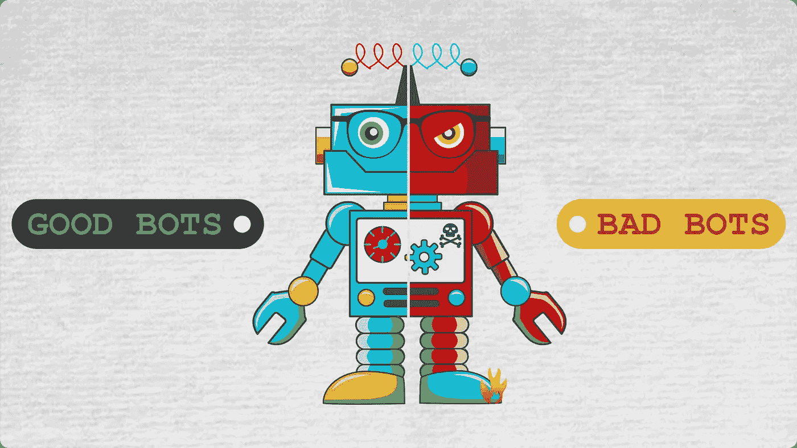
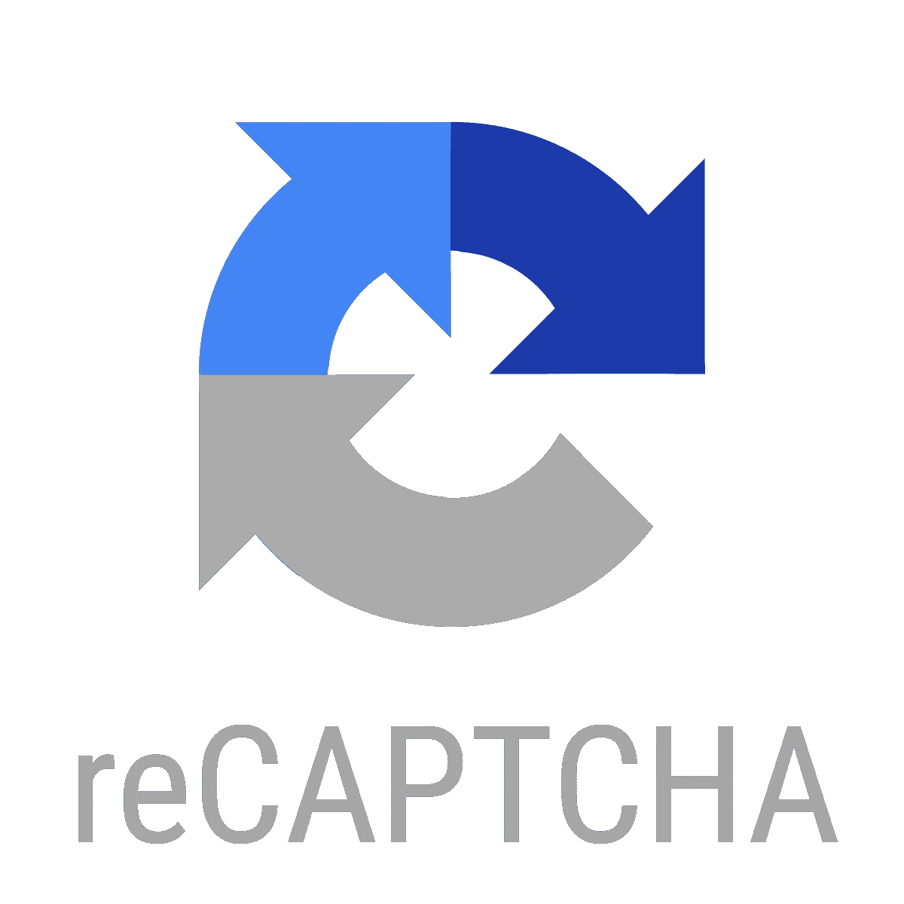
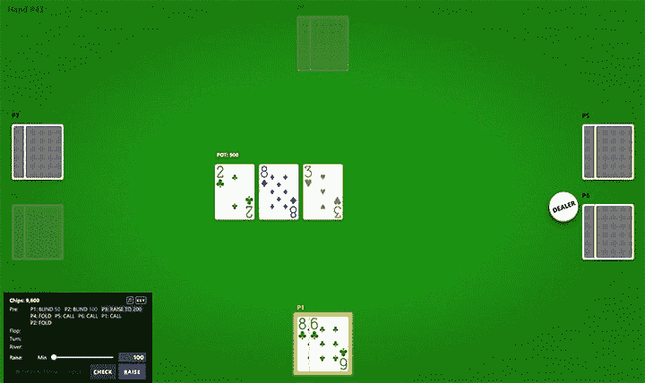

# 好机器人，坏机器人

> 原文：<https://medium.com/analytics-vidhya/good-bot-bad-bot-c4d868bfe349?source=collection_archive---------9----------------------->

## 机器人如何摧毁扑克平台并建立人工智能创新

来源:ShieldSquare

## 两个机器人的尾巴

最近几年，扑克机器人已经成为人工智能发展和创新的基准。对于像行业领导者 PokerStars 这样的扑克网站来说，机器人已经成为一个噩梦，大量的机器人涌入他们的网站，殴打人类玩家，并破坏在线扑克生态系统。在其他情况下，脸书和谷歌等公司正在使用扑克机器人作为创新自己的人工智能程序的一种方式。为什么这两个实体对待扑克机器人的方式如此不同？

## Bot 共谋和形成 Bot Rinks

在线扑克已经成为机器人的聚集地，机器人是预编程的软件，有能力胜过人类玩家。在过去的几年里，机器人慢慢成长并接管了世界上最大的在线扑克网站。大多数高级机器人可以在扑克中轻松击败中低级玩家。在某些情况下，他们甚至能够在最高级别的扑克比赛中竞争。为了应对机器人的崛起，许多扑克网站正在实施新的措施来打击所有的机器人活动。

尽管机器人本身可能具有破坏性，但对抗机器人的最大挑战是阻止它们一起工作。同一张桌子上的机器人可以被编程来识别彼此，并相互设置以获得最佳成功。通过相互勾结，成群的机器人可以创造出统治任何桌子的溜冰场。随着时间的推移，机器人溜冰场可以积累数千美元，有时甚至数百万美元。直到最近，检测共谋和机器人赌场可能是极其困难的，在许多情况下对在线扑克行业极具破坏性。

## 在线扑克中的机器人溜冰场

仅在过去几年中，世界上一些最大的扑克网站上就发现了许多机器人溜冰场的案例。席卷行业的一个案例是 2015 年与扑克之星的 bot 勾结案，该行业领导者拥有超过 70%的市场份额。该案涉及一个起源于东欧的大型赌场，该赌场通过玩低注额的 PLO(底池限注奥马哈)赌桌积累了超过 150 万美元。在发现机器人溜冰场后，扑克明星们不得不支付并退还每一个受到机器人溜冰场影响的受害者。作为业内最大的玩家，如果扑克明星都不安全，那就没人安全了。

自 2015 年那次事件以来，其他网站上出现了新的机器人溜冰场案例，并且一直没有停止。仅在今年，就有三个大型扑克网站受到了扑克机器人的影响。2019 年 3 月，有报道称 Zynga Poker 遭到机器人的攻击，影响了数百万玩家。尽管 Zynga 知道它已经被入侵超过 12 个月，但该公司未能解决任何有关机器人的问题。2018 年底，该网站的活动量激增，但一直无法区分哪些玩家是人类还是机器人。这些机器人也非常复杂，使得在网站上识别机器人变得更加困难。最近，Zynga Poker 的活跃度有所下降，许多人将其归咎于平台上机器人的活跃度增加和不公平，使人类玩家更难享受在线扑克。

另一个在线扑克网站 Partypoker 最近开始实施反机器人计划，仅在 3 月份就发现了 270 多个机器人。在第一次机器人突袭后，他们在 2019 年 7 月又有了一个巨大的发现，当时他们发现了另外 120 个机器人。所有这些机器人都分散在他们的平台上，包括他们的北美和欧盟服务器。从那时起，他们已经确定并禁止了 600 多个机器人账户，并没收了超过 100 万美元的奖金。

在听说他们的竞争对手 Partypoker 之后，Americas Cardroom 也开始了他们的反机器人工作。2019 年 4 月，美洲 Cardroom 能够实施新技术，能够在其平台上检测超过 270 个机器人。通过累积这些机器人的奖金，Americas Cardroom 将这些奖金退还给 4000 多名玩家，估计金额约为 176000 美元。

## 新的反机器人倡议和机器人检测技术

资料来源:reCAPTCHA

许多平台已经能够加大努力来阻止他们平台上的僵尸程序，并且通常都获得了广泛的成功。在某些情况下，像扑克之星这样的平台已经创建了检测软件，在识别机器人勾结方面有近 90%的成功率，在检测所有机器人方面有 89%的成功率。甚至像 Partypoker 和 Americas Cardroom 这样的小型扑克网站也已经实现了在某种程度上取得成功的系统。如果我们看到这种趋势继续下去，机器人被禁止出现在每个扑克平台上，那么机器人玩家的下一步是什么？

## 脸书和他们的人工智能项目

与扑克网站不同，像脸书这样的公司从相反的角度接触扑克机器人:机会。当许多扑克网站试图摆脱机器人时，其他公司正在使用扑克机器人作为一种创建更复杂和自我学习的人工智能程序的方式。2019 年，脸书与卡耐基梅隆大学的一个团队合作，创建了一个名为 Pluribus 的扑克机器人。虽然进入扑克世界可能看起来很奇怪，但扑克为 AI 发展提供了一个必不可少的因素:不完善的信息。与玩国际象棋或跳棋等游戏不同，扑克提供了许多未知的信息。在像国际象棋这样的游戏中，机器人在一个封闭的系统中进行游戏，在这个系统中它们可以访问游戏的所有信息。在一个封闭的系统中，机器人可以看到自己的棋子和对手，从而计算出不同的策略并预测对手会做什么。因此，人工智能机器人可以在玩几个小时后变成神。与封闭系统相比，扑克机器人只对自己的手牌和桌上的牌有视觉，但对对手一无所知，因此很难制定合理的获胜策略。

资料来源:艾脸书

在隐藏信息的情况下，机器人和人工智能必须更加努力地工作，增加时间和资源，并将其全部用于计算能力。对于脸书这样的公司来说，他们创建 Pluribus 的目标是开发一种可以用不完整数据创建复杂战略的机器人。Pluribus 不是测试机器人与人类的对抗，而是强迫自己玩，让机器人磨练自己的技能，完善不同的策略。Pluribus 没有使用不同的输入，而是能够自我学习，发展其核心战略，变得越来越好。当它面对人类时，它很容易横扫。

Pluribus 比以往任何时候都更先进，与其他 5 名玩家一起玩扑克游戏。这一壮举是前所未有的，幸运的是，对于 Pluribus 来说，这是一个很容易克服的障碍。在 10，000 手牌和 12 天的过程中，Pluribus 横扫了 15 名不同的玩家**。它平均每手赢 5 美元，每小时赚 1，000 多美元。它不仅更智能，而且使用的计算能力也比它的前辈更少。Pluribus 无疑是世界上最聪明的人工智能机器人。**

## **这对 AI 发展的未来意味着什么？**

**人工智能开发和扑克只是触及了其真正潜力的表面。2019 年初，一款较老的人工智能扑克机器人 Libratus 与美国陆军签署了一份 1000 万美元的合同。人工智能利用不完整信息制定战略的能力可以应用于从军事到营销的任何行业。随着通过扑克在人工智能开发方面取得的进展，你可以期待看到扑克成为人工智能未来形式的标准。**