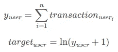
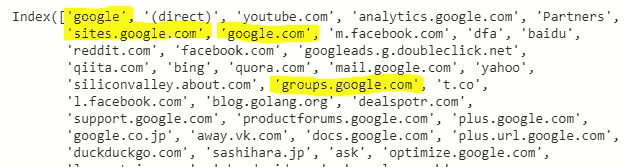

# 谷歌分析客户收入预测

> 原文：<https://medium.com/analytics-vidhya/google-analytics-customer-revenue-prediction-a1098cd0cbed?source=collection_archive---------8----------------------->

GStore

# 业务问题:

对于每个企业来说，产生收入的客户数量将远远少于企业与之互动的客户总数。因此，对于每个企业来说，理解、分析和预测其创收领域非常重要。

# Kaggle 挑战描述:

访问: [Google Analytics 客户收入预测](https://www.kaggle.com/c/ga-customer-revenue-prediction/overview)80/20 法则已被证明适用于许多企业——只有一小部分客户创造了大部分收入。因此，营销团队面临着对促销策略进行适当投资的挑战。

‌RStudio 是 r 和企业级产品的免费开放工具开发商，这些产品用于团队扩展和共享工作，他与谷歌云和 Kaggle 合作，展示了彻底的数据分析可能产生的商业影响。

‌In:在这次比赛中，你要分析谷歌商品商店(也称为 GStore，出售谷歌纪念品的地方)的客户数据集，以预测每个客户的收入。我们希望，对于那些选择在 GA 数据基础上使用数据分析的公司来说，结果将是更可操作的运营变化和更好地利用营销预算。

# 数据和方法的来源:

## 机器学习方法:

在这个挑战中，我们的任务是通过使用从 2016 年 8 月 1 日*到 2018 年 10 月 15 日的历史数据来预测从 2018 年 12 月 1 日**到 2019 年 1 月 31 日*期间每个人产生的收入。请注意，对于我们预测的时间段，我们没有任何数据。****

## ****‌Data:****

****我们已经被提供了`train_v2.csv`和`test_v.csv`。`train_v2.csv`——更新后的训练集——包含从*2016 年 8 月 1 日*到*2018 年 4 月 30 日*的用户交易。`test_v2.csv`——更新后的测试集——包含从*2018 年 5 月 1 日*到*2018 年 10 月 15 日*的用户交易。****

## ****‌Objective:****

****`sample_submission_v2.csv` -正确格式的更新样本提交文件。包含 test *v2.csv 中的所有 fullVisitorIds。我们必须预测 LogRevenue 列应该对这些 _fullVisitorIds* **中的每一个进行前瞻性预测，预测时间范围为 2018 年 12 月 1 日**到 2019 年 1 月 31 日**之间的******

## ******提供的‌File 描述和功能:******

****每个。csv 文件包含商店访问量的交易数据**full visitorid**—Google 商品商店每个用户的唯一标识符。我们的最终提交将取决于此，并将用于汇总。****

******渠道分组** —用户来到商店的渠道。****

****‌ **日期** —用户访问商店的日期。****

****‌ **设备** —用于访问商店的设备的规格。( *json 列*)****

****‌ **地理网络** —这个部分包含关于用户的地理位置的信息。( *json 列*)****

****‌ **社交管理类型** —参与类型，可以是“社交参与”或“非社交参与”。****

****‌ **总计** —此部分包含整个会话的总计值。( *json 列*)****

****‌ **流量源** —此部分包含有关发起会话的流量源的信息。( *json 列*)****

****‌ **visitId** —该会话的标识符。这是通常存储为 _utmb cookie 的值的一部分。这对用户来说是唯一的。对于完全唯一的 ID，应该使用 fullVisitorId 和 visitId 的组合。****

****‌ **访问号** —该用户的会话号。如果这是第一个会话，则将其设置为 1。****

****‌ **visitStartTime** —时间戳(表示为 POSIX 时间)。****

****‌ **命中** —该行和嵌套字段被填充用于任何和所有类型的命中。提供所有页面访问的记录。****

****‌ **自定义尺寸** —此部分包含为会话设置的任何用户级或会话级自定义尺寸。这是一个重复的字段，每个设置的维度都有一个条目。( *json 列*)****

****‌ ***json 列* :** 正如我们所看到的，json 格式压缩的列很少，我们将对其进行归一化并转换为正常特征。****

******评估指标和目标变量:******

********

****公制的****

****对于每个用户，我们必须找出在测试数据期间所有交易的总和，它将是值的日志。****

****‌ **为什么使用登录目标变量？******

****我们被要求对目标变量使用 log:****

********

****从这张图中我们可以看出，数据非常不准确。极少数客户实际上产生了收入。只有 1.2193%的客户在创造收入。所以我们的任务是对目标变量使用 log。[来源](http://onlinestatbook.com/2/transformations/log.html#:~:text=The%20log%20transformation%20can%20be,the%20assumptions%20of%20inferential%20statistics.)****

****让我们看看在展平所有 json 列后我们得到的所有特性。****

********

****功能详情****

## ****探索性数据分析和数据预处理:****

## ****totals.transactionRevenue:****

******totals . transaction revue**是我们的目标变量。我们在训练数据中有 1，708，337 个数据点。让我们看看目标变量的单叶图****

********

****目标变量 PDF****

****右边的图是实际目标变量的 PDF。左边的图是 log(target_variable)的 PDF。****

****观察:totals.transactionRevenue 的 PDF 几乎是正常的，平均值为 17.5。****

## ****频道分组:****

********

****这是显示 y 轴计数的**通道分组**的条形图。我们可以看到在这个特性中有合理数量的独特类别。****

## ****‌device.browsers:****

****但有些功能包含大约 100 多个独特的类别。对于例如:设备.浏览器****

********

****正如我们所见，有许多类别。对于这个功能，我们有 129 个类别。正如我们在图中看到的。只有少数类别重复了合理的次数，其余的都像离群值。大部分都是复读不到十遍。所以我们可以理解，重复几次的品类并不是创收的原因。****

****由于所有不产生收入的数据点都被认为是零，我们的模型预计只能预测大于等于 **0** 。让我们看看每个浏览器的客户百分比。****

********

****正如我们之后看到的，Opera 已经被很多客户使用了。因此，我们只保留最流行的浏览器。****

****通过此代码，我们限制了此功能中类别的数量。经过预处理后，我们将得到下面的浏览器计数柱状图。现在我们可以看到独特浏览器的数量已经大大减少。****

********

****请注意，进行这种预处理的目标不是使用一种热编码，而是在数据预处理阶段去除异常值。这只是为了减少一些特性的基数。****

****当我们有许多独特的类别时，‌This 将特别有帮助。很少有特征的唯一类别超过 500 个类别。在这种情况下，我们可以通过查看类别值计数的分布来限制类别的数量。****

## ****‌geoNetwork.city:****

****此要素包含源城市的名称。我们有和上面一样的问题。大概有 950 多个独特的城市。所以凭直觉手动选择几个城市是不可能的。****

****‌Let's 看看所有城市的 PDF 值统计。****

********

******观察**:我们可以从左边的百分位图中观察到，与第 90 到第 100 百分位的城市相比，许多城市重复出现的频率非常低。右边的图是相同的图，但只是在第 0 和第 90 百分位之间。****

****正如我们从这些图中看到的，只有在城市重复超过 250 的第 80 个百分位数之后，我们才会将所有频率较低的城市归为一类。通过这样做，我们不会丢失太多信息，因为 250 只是我们总训练数据的一小部分。****

******代号**:****

****在执行这个预处理之后，我们仍然得到大约 185 个独特的城市。****

****‌There 是少数有类似问题的城市。我们已经执行了与上面相同的预处理方法。**多类别栏目** — geoNetwork.country，geoNetwork.city，geoNetwork.city****

## ****总数.点击次数:****

******totals.hits** totals.hits 显示交易前商店(或)产品页面 URL 被访问的次数。****

********

****‌ **观察:******

*   ****大多数交易发生在点击数= 150 以下。****
*   ****正如我们所看到的，数据中很少有异常值，但由于异常值的百分比非常小，我们将继续保持数据不变。****

## ****流量来源。来源:****

****此功能将保存源的值，例如，它被重定向的网站。但问题是，我们有类别，这意味着相同的来源名称，但措辞是不一样的。请看下面的例子。正如上面强调的谷歌，sites.google.com 和 group.google.com 都来自同一个母网站，但它被称为不同的。因此，我们将把它们全部归入“谷歌”。各大网站也进行了类似的分组。****

********

****使用这个脚本，我们根据父网站将所有源网站分组到一个组中。****

## ****‌Year:****

********

****年度收入****

******观察:******

****这些年来产生的收入相当稳定。但请注意，2018 年的数据只到 2018 年 4 月。****

## ****‌Month:****

********

****月收入****

******观察:******

*   ****从这个图中我们可以看出，几个月来收入的分配方式是有规律的。****
*   ****收入在六月和八月达到高峰，一般来说，我们可以预期在夏季销售期间会有更多的销售。****
*   ****我们还可以注意到，销售在秋季大幅减少，表明商店中的产品不适合秋季假期。****

## ****天数:****

********

****每日收入****

*   ****这是日期与交易收入的关系图****
*   ****除了第一周的第一部分之外，销售额几乎平均分配在所有的日子里****

## ****培训方法:****

****所有包含分类数据的要素都将经历上述的一些数据预处理技术。现在让我们来了解一下为建立模型所提供的数据。我们提供了从`August 2016`到`October 2018`的数据，作为一个整体，包括训练和测试数据，但我们预测的是从`December 2018`到`January 2019`。这意味着，对于那些提交期，我们没有数据。因此，即使我们有测试数据，目标变量也是未来的，所以为测试数据提供的交易收入是那个时期的。****

****因为我们预测未来，所以我们必须通过固定`X`的特定训练窗口和 ***响应变量*** ( `totals.transactionRevenue`)的未来训练窗口来多次训练模型。****

## ****窗口聚合:****

****该表将显示所有列车和休息窗口。因此，培训阶段将在每个阶段进行，但测试将在所有培训阶段保持不变。****

********

****工时戳记****

## ****我们为什么要这么做？****

****目标是预测每个客户的总交易收入，而不是每个会话或访问的收入。****

****我们根据时间分割数据，因为如果一个人在 2016 年购买了一些东西，并且是多年来的重复访问者。他将在 2019 年花费更高金额的概率将比 2018 年第一次访问该商店的人小得多。****

****‌That 是我们在不同时间框架内训练模型并在每个时间框架内预测测试数据收入的原因。****

****‌We 将在我们最终预测的最后对所有的观测值进行平均。****

## ****模型培训:****

****我们将首先尝试三个高级 ML 模型，然后尝试堆叠以获得更好的结果。****

****我们尝试了 **XGBOOST、lightbgm 和 catboost** 。****

****这是我从 [kaggle](https://kaggle.com/) 提交的结果。****

********

****各种模型的结果****

****从结果中我们得出结论,`xgboostregressor`是性能最好的型号。****

## ****‌Future 作品:****

****正如您所看到的，我们已经根据时间将整个数据分成了多个部分。但是我们取了从不同时间段得到的所有测试预测的平均值，我们取了平均值，这意味着我们对所有时间段给予了同等的重视。****

****如果我们得到了实际的`totals.transactionRevenue`，那么我们可以通过将不同时间范围的测试预测放入一个向量(本例中为 10)并将实际的`totals.transactionRevenue`作为目标变量来训练一个模型。****

## ****‌References:****

1.  ****Konstantin Nikolaev 的测试分数(Test _ score)——这是 Apache 2.0 的书面版本，但他基于时间的训练方法对我帮助很大。****
2.  ****[简单探索+基线——GA 客户收入](https://www.kaggle.com/sudalairajkumar/simple-exploration-baseline-ga-customer-revenue) —获得了 EDA 部分的直觉，并帮助建立了我的第一个切割方法的模型，这是对当前日期的预测****
3.  ****[招募餐厅访客预测](/analytics-vidhya/recruit-restaurant-visitor-forecasting-f9ef87ba1073)——这也有与此次 kaggle 挑战类似的问题陈述)****
4.  ****[应用人工智能](https://www.appliedaicourse.com/course/11/Applied-Machine-learning-course):****

****LinkedIn:[Harsha vard Han Maagalam](http://www.linkedin.com/in/mharsha-vardhan)****

****‌****

****‌****

****‌****

****‌****

****‌****

****‌****

****‌****

****‌****

****‌****

****‌****