# 谷歌分析客户收入预测

> 原文：<https://medium.com/analytics-vidhya/google-analytics-customer-revenue-prediction-e41da071d942?source=collection_archive---------1----------------------->

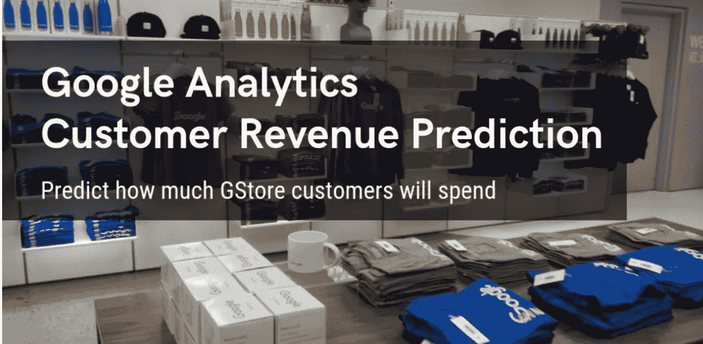

谷歌商品商店

## 预测 GStore 客户的消费金额

# 目录:

1.  商业问题
2.  关于数据
3.  关于功能
4.  问题的性能指标
5.  机器学习问题公式
6.  数据加载和预处理
7.  数据清理
8.  探索性数据分析
9.  特征工程
10.  时间序列特征化
11.  附加功能
12.  准备训练和测试数据集
13.  机器学习模型
14.  分类模型的超参数调整
15.  回归模型的超参数调整
16.  最终模型
17.  结果
18.  特征重要性
19.  用 bagging 尝试集合模型
20.  未来的工作
21.  GitHub、LinkedIn 个人资料链接
22.  参考

1.  **业务问题:**

*   在每一个行业中，都证明了 80-20 法则。这条规则告诉我们，80%的收入将由 20%的潜在客户创造。因此，我们的目标是预测这些潜在客户在近期特性中产生的收入。以便营销团队在促销策略上投入适当的资金来吸引潜在客户。
*   简而言之，我们获得了用户过去的数据和交易(当他们登录 G-store 时)。因此，通过使用这些数据，我们需要预测这些客户将创造的未来收入。
*   因此，谷歌提供了商品客户数据集和每个客户的交易数量。我们将使用 G-store 数据集建立一个预测模型，以预测每个客户的总收入，这有助于更好地利用营销预算，我们还将使用不同的模型解释对总收入预测影响最大的因素。

**2。关于数据:**

我们已经从下面的 Kaggle 链接下载了数据:

[](https://www.kaggle.com/c/ga-customer-revenue-prediction/data) [## 谷歌分析客户收入预测

### 预测 GStore 客户的消费金额

www.kaggle.com](https://www.kaggle.com/c/ga-customer-revenue-prediction/data) 

*   我们需要下载 train_v2.csv 和 test_v2.csv。
*   我们将预测发布的测试集中所有用户的目标:test_v2.csv，用于他们在 2018 年 12 月 1 日至 2019 年 1 月 31 日期间的交易。
*   数据集中的每一行都是对商店的一次访问。因为我们预测的是每个用户的总收入的日志，所以 test.csv 中的所有行都不会对应于提交中的一行，但是所有唯一的 **fullVisitorIds** 都会对应于提交中的一行。
*   一些功能已经包含在。json 格式，所以我们需要解析这些 json 列。关于这一点，我们将在数据读取时简要介绍。

**3。关于特征/列/自变量:**

*   *full visitorid:*Google 商品商店每个用户的唯一标识符。
*   *渠道分组:*用户来商店的渠道。
*   *日期:*用户访问商店的日期。
*   *设备:*用于访问商店的设备的规格。
*   *地理网络*:此部分包含用户的地理信息。
*   *sessionId :* 这次访问商店的唯一标识符。
*   *社交管理类型:*参与类型，可以是“社交参与”或“非社交参与”。
*   *总计:*此部分包含整个会话的总计值。
*   *trafficSource :* 此部分包含有关发起会话的流量源的信息。
*   *visitId :* 该会话的标识符。这是通常存储为 utmb cookie 的值的一部分。这对用户来说是唯一的。对于完全唯一的 ID，应该使用 fullVisitorId 和 visitId 的组合。
*   *visitNumber :* 该用户的会话号。如果这是第一个会话，则将其设置为 1。
*   *visitStartTime :* 时间戳(表示为 POSIX 时间)。

> *关于特性描述的更多细节:*[*https://support.google.com/analytics/answer/3437719?hl=en*](https://support.google.com/analytics/answer/3437719?hl=en)

**4。问题的性能指标:**

*   根据均方根误差对提交的内容进行评分。
*   RMSE 被定义为:

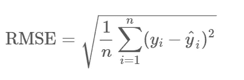

其中 y hat 是客户预测收入的自然对数，y 是实际总收入值加 1 的自然对数。

**5。机器学习问题公式化:**

*   因此，我们将预测顾客光顾商店时产生的收入(以美元计)。，所以我们可以把这个问题提出来作为回归问题
*   通过关注一些 kaggle 讨论和赢家解决方案。，他们正在用这种方法解决这个问题。
*   他们正在建立一个分类模型，该模型将预测用户是否会在测试期间访问商店，然后假设如果他有机会访问商店，那么通过使用回归模型，我们将预测客户将产生的收入。

作为分类+回归的解题动机是 [**跨栏模型**](https://seananderson.ca/2014/05/18/gamma-hurdle/) 。

**跨栏模式:-**

*   这种模型是解决目标变量中零的数量多于一个值的问题的首选方法。

    推荐使用:
    *分类值是否趋向非零
    *然后预测金额。
    针对此次挑战实施的解决方案基于上述模型。
*   无论如何，我们将在特征化和模型构建时对此进行更多的讨论。

**6。数据加载和预处理:**

数据加载和解析 json 列

*   训练数据集形状为:(1708337，60)
*   测试数据集形状为:(401589，59)
*   这里，每条记录对应一次商店访问。

**注意:我使用的是更高配置的虚拟机，因此在读取大量数据时不会出现任何内存问题。但是，如果您的系统配置较低，那么您可以使用**[**【dask 数据帧】**](https://examples.dask.org/dataframes/01-data-access.html) **来避免内存问题，并且您可以加快操作速度。**

**7。数据清理:**

*   我们将检查每列数据中有多少个唯一值:

```
column_names = train_df.columns.to_list()unique_value_columns=[]for column in column_names:
    count = train_df[column].nunique()
    if count==1:
        del train_df[column]
        unique_value_columns.append(column)
```

在上面的代码片段中，我们检查每一列有多少唯一值。如果 count 为 1，这意味着该特征在整个数据集中存在相同的值。所以这个特殊的特征对我们的任何预测都没有帮助。所以我们要删除这些列。

*   ***缺失数据分析:***

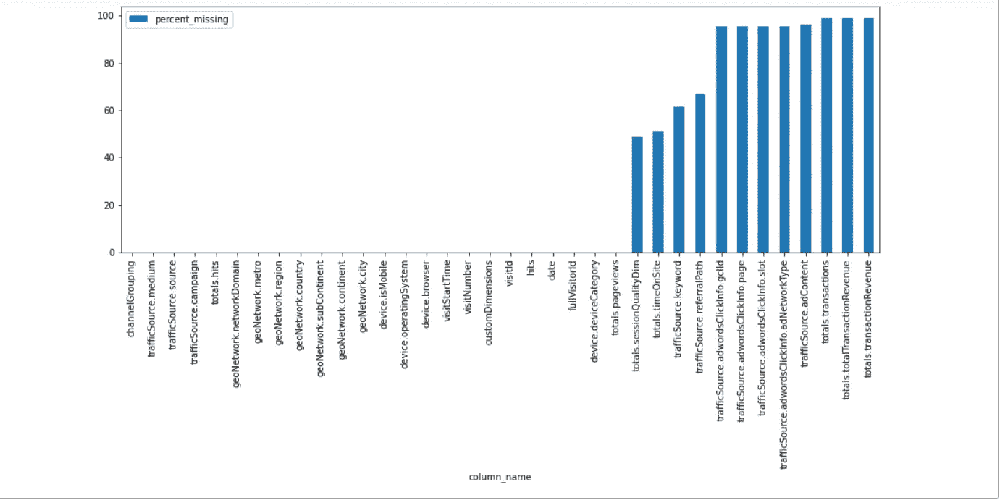

缺失数据百分比的条形图

现在我们将分析每一个缺失的有价值的特征，不管它是否有用。如果有用，我们将分析如何估算缺失值。

**8。探索性数据分析:**

***a)目标特征分析:***

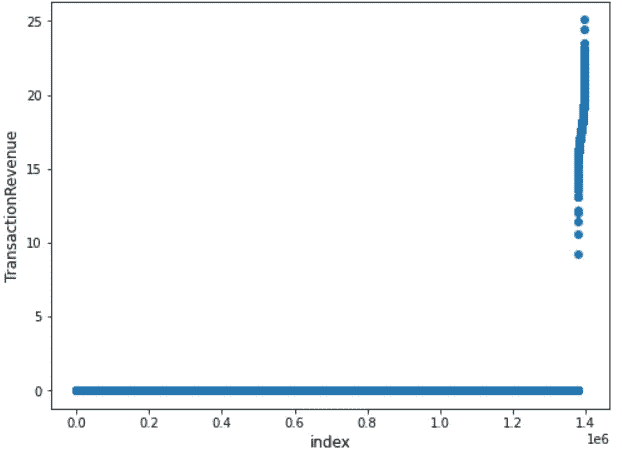

交易收入分析

在上面的图中，x 轴是用户指数，y 轴是每个用户记录的交易收入值。

正如我们已经讨论过的 80/20 法则。通过观察这个图表可以证明。大多数交易产生了零收入，但只有少数交易没有零收入。

***b)趋势分析:***

现在，我们将了解随着时间的推移，访问和交易的数量是如何变化的:

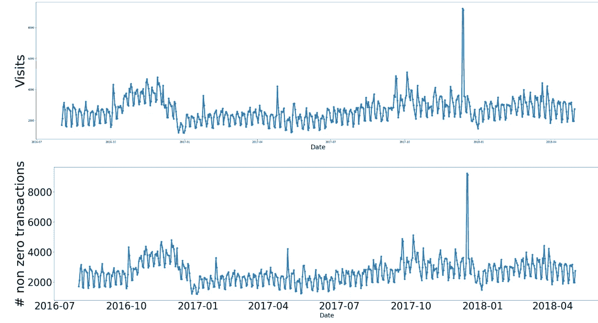

访问和交易趋势分析

*   如果我们观察 2017 年 12 月-2017 年 12 月的上述图表，访问量和收入会大幅增加。
*   因此，这是对促销团队有用的见解之一。，这样他们就可以在 12 月的促销活动中投入更多的资金。

***c)渠道分组分析:***

现在，我们将看到通过每个渠道发生的访问和交易数量:

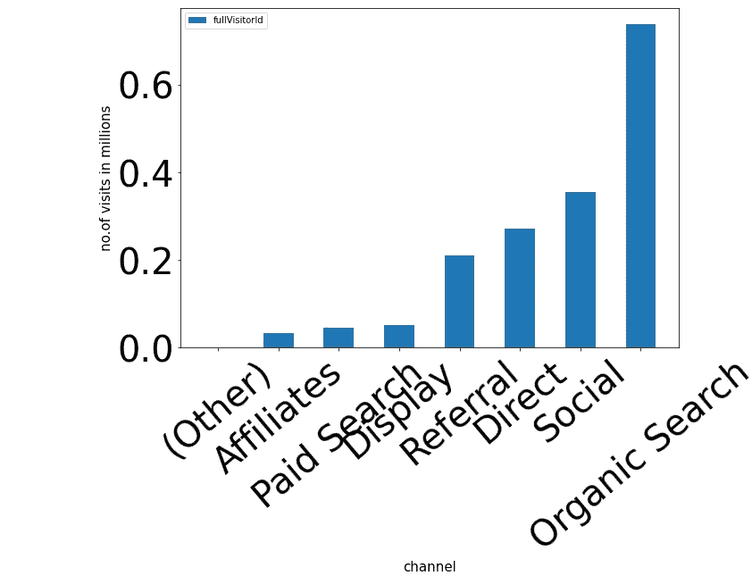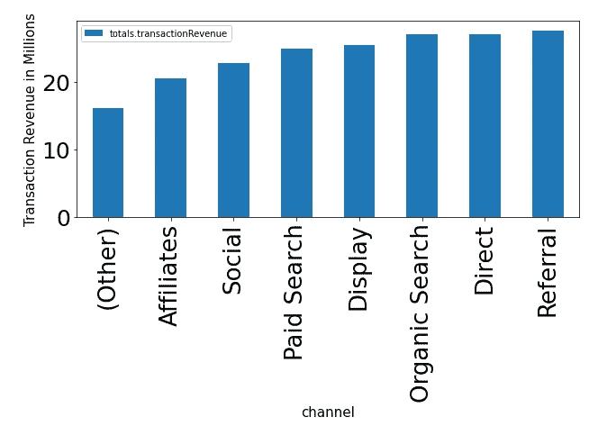

每个渠道的访问量和收入

*   最大的收入来自“有机搜索”、“直接搜索”、“推荐”..，但“直接”和“推荐”的访问次数非常少。
*   因此，这里的结论是，分析团队可以在“直接”、“推荐”渠道上投入更少的资金(因为从这个渠道访问的用户更少)，并可以产生最多的收入。

***d)网络浏览器分析:***

现在，我们将看到通过每个网络浏览器进行的访问和交易数量:

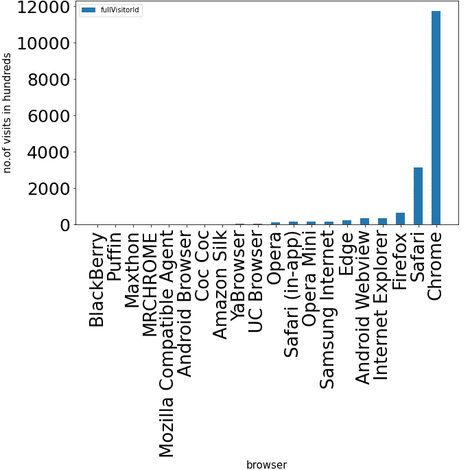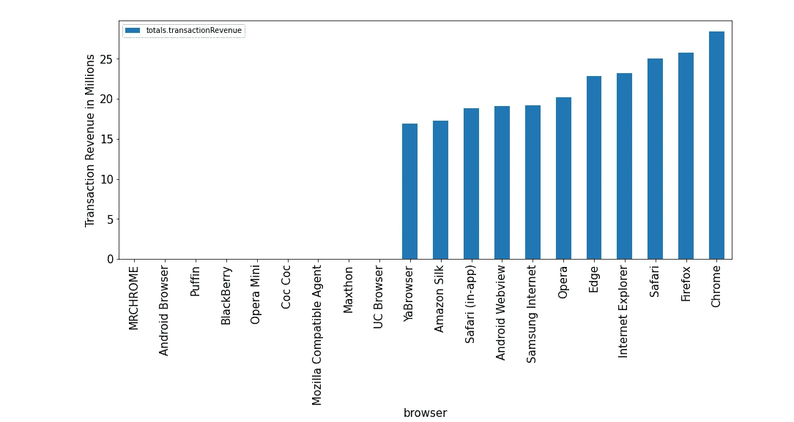

通过网络浏览器的访问量和收入

*   与所有浏览器相比，chrome 浏览器的访问量非常大。
*   最大的收入来自“chrome”、“Firefox”、“safari”、“Internet explorer”、“edge”、“opera”、“Samsung internet”、“android web view”、“safari”、“amazon silk”、“Ya-browser”..,
*   因此，这里的结论是，分析团队可以在通过除 chrome 之外的浏览器(如 safari、Firefox、opera、edge)访问商店的用户身上投入更少的资金，并可以产生最多的收入。

***e)操作系统分析:***

现在，我们将看到通过每个操作系统发生的访问和交易数量:

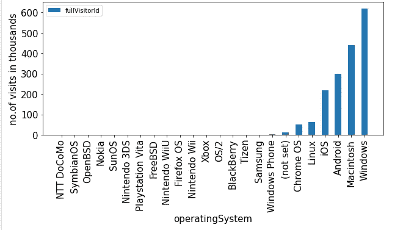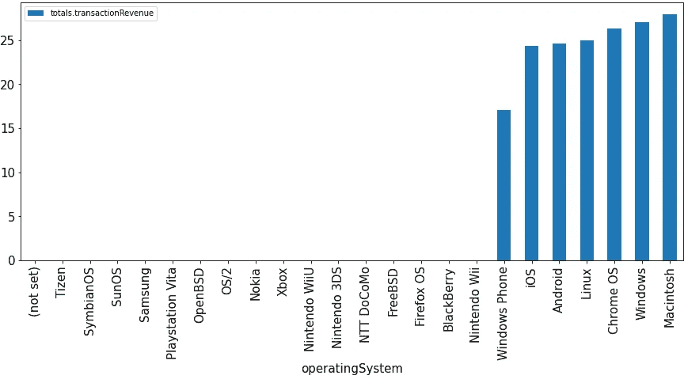

每个操作系统的访问量和收入

*   大多数用户都是通过 windows、Macintosh 来访问商店，而大部分收入都来自 Windows 和 Macintosh。
*   如果我们仔细观察，通过 Linux 和 chrome OS 访问的人非常少(不到 10 万)。，因此业务团队可以在这两个操作系统平台上投入很少的促销资金，并可以产生最多的收入。
*   非常重要的是，不到 2000 人通过 windows phone 访问商品网站，但他们也产生了大量的收入。因此，分析团队可以在 windows phone 操作系统上投入更少的资金，并产生良好的收入。

***f)设备类别分析:***

现在，我们将看到通过每个设备类别发生的访问和交易数量:

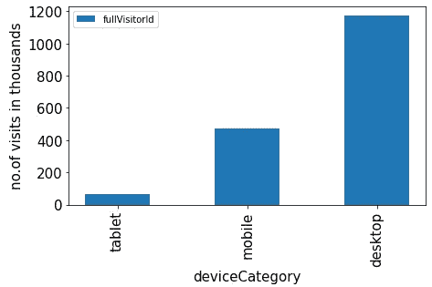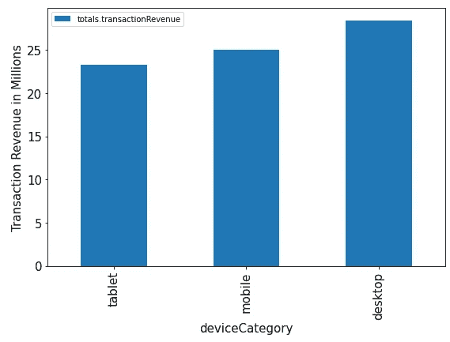

每台设备的访问量和收入

*   大多数用户是通过桌面访问的。
*   这里非常重要的观察结果是，通过平板设备访问的人不到 6.8 万(与其他设备相比明显较少)，但他们产生的收入明显更高。
*   因此，分析团队可以在通过“平板设备”访问商店的用户的促销活动上投入更少的资金，并可以产生显著更高的收入。

***g)移动 vs 非移动分析:***

现在，我们将看到通过移动和非移动设备进行的访问和交易数量:

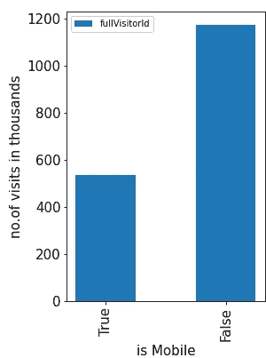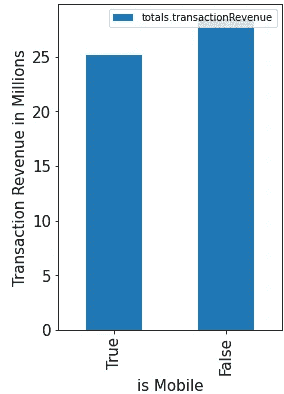

移动与非移动的访问量和收入

*   如此多的用户通过非移动设备获得收入，而更多的收入来自非移动设备。
*   移动用户中的访客数量相对较少，但与非移动用户相比，他们也创造了可观的收入。

***h)大陆分析:***

现在，我们将看到各大洲发生的访问和交易数量:

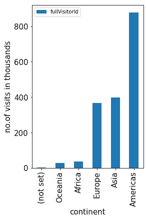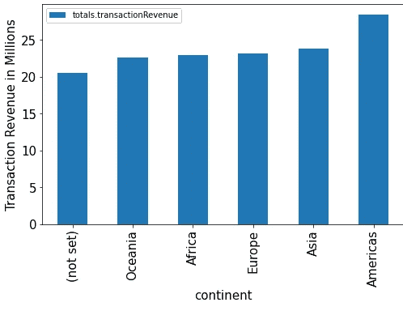

各大洲的访问量和收入

*   来自美国的游客数量明显多于其他大陆。
*   甚至来自“大洋洲”和“非洲”的访问数量也更少。但是这些大陆也产生了大量的收入。所以最好在这两个大陆投资。

**9。特征工程:**

***a)估算缺失值:***

这里，我们将对目标特征中缺失的值进行零插补。因为我们已经知道大约 98%的交易没有产生任何金钱

```
train_df['totals.transactionRevenue'].fillna(0,inplace=True)
```

***b)转换布尔特征:***

是一个布尔特性

```
# here we are converting the "device.isMobile" data type from string to boolean.train_df['device.isMobile']=   train_df['device.isMobile'].astype(bool)test_df['device.isMobile']  = test_df['device.isMobile'].astype(bool)
```

***c)将数值特征转换为浮点数:***

```
# here we defining list of all the numerical features and we are converting each numeric feature to float.numeric_features = [
'visitNumber','visitStartTime','totals.hits','totals.pageviews',               'totals.timeOnSite','totals.transactions','totals.transactionRevenu']for col in numeric_feat:
    train_df[col].fillna(0,inplace=True)
    train_df[col] = train_df[col].astype('float')

    test_df[col].fillna(0,inplace=True)
    test_df[col] = test_df[col].astype('float')
```

***d)分类特征的标签编码:***

这里我们对分类特征执行 [**标签编码**](https://scikit-learn.org/stable/modules/generated/sklearn.preprocessing.LabelEncoder.html) 。因为我们没有使用一次性编码，因为它会增加我们的数据维度。

```
categorical_feat = ['channelGrouping','device.browser','device.operatingSystem',
'device.deviceCategory','geoNetwork.continent',
'geoNetwork.subContinent','geoNetwork.country','geoNetwork.region','geoNetwork.metro','geoNetwork.city','geoNetwork.networkDomain',
'totals.sessionQualityDim','trafficSource.campaign',
'trafficSource.source','trafficSource.medium',
'trafficSource.keyword','trafficSource.referralPath', 'trafficSource.adContent']for feature in categorical_feat:

    label_encoder = preprocessing.LabelEncoder() # initializing        label encoder object

    label_encoder.fit(list(train_df[feature].values.astype('str')) + list(test_df[feature].values.astype('str')))

# fit with list of variables in that feature

    train_df[feature] = label_encoder.transform(list(train_df[feature].values.astype('str'))) 
# transforming that feature test_df[feature]  = label_encoder.transform(list(test_df[feature].values.astype('str'))) print("for this feature : {0} label-encoding was done succesfully".format(feature))
```

**10。时间序列特征:**

这个问题最重要的任务是时间序列特征化:

*   学分:"[https://www . ka ggle . com/c/ga-customer-revenue-prediction/discussion/82614](https://www.kaggle.com/c/ga-customer-revenue-prediction/discussion/82614)"
*   因为这是一个回归问题，大多数值为零。，所以我们要用 [**跨栏模型**](https://seananderson.ca/2014/05/18/gamma-hurdle/) 来解决这类问题。
*   在这里，我将讨论这个想法的整个方法论。
*   基本上 kaggle 给定:
    *列车数据时间段范围为:2016 年 8 月 1 日至 2018 年 4 月 30 日= >共 638 天。
    *测试数据时间段范围为:2018 年 5 月 1 日至 2018 年 10 月 15 日= >共 168 天。
    *预测数据时间段范围为:2018 年 12 月 1 日至 2019 年 1 月 31 日= >共 62 天。
*   所以这里我们需要用给我们的训练和测试数据来预测用户在 2018 年 12 月 1 日到 2019 年 1 月 31 日期间的收入。
*   因此，我们拥有截至 2018 年 10 月 15 日的数据，预测数据开始日期为 2018 年 12 月 1 日。，所以中间的这段时间称为“**冷却期**，为 46 天。
*   因此，这里的想法是，首先我们需要预测在 46 天的“冷却期”(或测试期)后，用户是否会来商店。为此，我们将使用分类模型。
*   假设他会来商店，那么我们将通过使用带有用户数据(特征)的回归模型来预测该用户的收入。
*   因此，下一步是我们需要建立分类模型的数据，这样它将复制真实世界的场景。

**真实世界场景？**
这意味着训练数据将由 168 天的数据组成，测试数据将由 62 天的数据组成，我们将保持训练数据结束日期和测试数据开始日期之间的间隔为 46 天。

> 因此，通过使用这些训练数据，我们需要预测用户是否会存储我们准备的测试数据。
> 例如:
> 训练数据= 2016 年 8 月 1 日至 2017 年 1 月 15 日(168 天)
> 测试数据= 2017 年 3 月 2 日至 2017 年 5 月 3 日(62 天)
> 训练与测试数据之间的差距为 46 天。
> 
> 因此，通过使用我们拥有的数据，我们可以制作 4 组训练和测试帧。
> 
> **数据集-1:**
> *列车数据= 2016 年 8 月 1 日至 2017 年 1 月 15 日(168 天)
> *测试数据= 2017 年 3 月 2 日至 2017 年 5 月 3 日(62 天)
> **数据集-2:**
> *列车数据= 2017 年 1 月 16 日至 2017 年 7 月 2 日(168 天)
> *测试数据= 2017 年 8 月 17 日
> *测试数据= 2018 年 2 月 1 日至 2018 年 4 月 4 日(62 天)
> **数据集-4:**
> *训练数据= 2017 年 12 月 18 日至 2018 年 6 月 4 日(168 天)
> *测试数据= 2018 年 7 月 20 日至 2018 年 9 月 20 日(62 天)
> 
> #因此从上述用户在训练和测试中常见的数据集(即冷却后返回 对于未返回的用户，我们将“is_returned”设置为 0。
> 
> #我们将为“训练数据”中的每个用户创建一些新功能，最后我们将合并所有这些数据帧。

*   所以现在我们的目标特性是“ **is_returned** ”和“ **revenue** ”。
*   其中“is_returned”将表示用户在测试期间是否会来商店。
*   其中“收入”将表示由用户产生的收入。

> 注:我第一次知道这很难理解。因此，在这里，我将用较少的几行给出时间序列特征的简要总结。
> 
> **我们决定建立分类模型和回归模型。这里分类模型的任务是预测用户是否会来商店。如果他不来商店，那么来自该用户的收入为零。直到这里我们都清楚了。**
> 
> 但是对于构建分类模型，我们没有任何带标签的数据。因此，我们试图为分类模型生成数据。因此，根据我们手头的数据，我们通过复制真实世界场景(冷却期间隙)将其分为训练框架和测试框架。如果用户同时出现在训练帧和测试帧中，则意味着他将前来存储，并且为该用户标记为“1”。如果他不在测试框中，那么我们将用“0”标记该用户。我希望现在你清楚了。

```
train_test_data = pd.concat([train_df, test_df], axis=0).reset_index()%time train_frame_1 = get_time_series_features(train_test_data,1)
train_frame_1.to_pickle('train_frame_1')%time train_frame_2 = get_time_series_features(train_test_data,2)
train_frame_2.to_pickle('train_frame_2')%time train_frame_3 = get_time_series_features(train_test_data,3)
train_frame_3.to_pickle('train_frame_3')%time train_frame_4 = get_time_series_features(train_test_data,4)
train_frame_4.to_pickle('train_frame_4')#concatenating all our featurized frames:final_featurized_data = pd.concat([tr1, tr2, tr3, tr4], axis=0, sort=False).reset_index(drop=True)
```

**11。附加功能:**

我们将计算每个数据点的特征。

我们将按访问者 ID 对数据点进行分组，然后我们将计算这个新特征。

*   网络域的最大值
*   城市的最大价值
*   设备操作系统的最大值
*   Geo 网络城域网的最大值
*   地理网络区域的最大值
*   频道分组的最大值
*   推荐路径的最大值
*   国家的最大值
*   源的最大值
*   介质的最大值
*   关键字的最大值
*   浏览器的最大值
*   设备类别的最大值
*   洲的最大值
*   现场时间总和
*   现场时间的最小值
*   现场时间的最大值
*   现场时间的平均值
*   页面浏览量总和
*   页面浏览量的最小值
*   页面访问量的最大值
*   页面浏览量的平均值
*   命中总和
*   点击的最小值
*   命中的最大值
*   命中的平均值
*   访问开始时间计数
*   会话质量尺寸的最大值
*   isMobile 的最大值
*   最大访问次数
*   所有交易金额的总和
*   所有交易计数的总和
*   从期间开始日期起，客户第一次购物会话的天数
*   在期间开始日期之前，客户最后一次购物会话的天数
*   间隔天数-当前框架中客户第一次和最后一次购物会话之间的差异
*   客户访问的唯一日期数

同样，我们也将对测试数据进行特征化，我们将用(空)“np.nan”值填充目标特性“ **is_returned** ”和“ **revenue** ”。

**12。准备训练和测试数据集:**

*   我们将合并由“fullvisitorid”生成的所有数据。
*   现在，具有“is_returned”和“revenue”特征值的数据点为空，这些数据点是我们的测试数据点。(因为在特征化测试数据时，我们为目标特征附加了空值)

```
# for all our test records we already fill the 'revenue' column with 'null' values., 
# so here we are separating our train and test recordstrain_df = final_featurized_data[final_featurized_data['revenue'].notnull()]test_df  = final_featurized_data[final_featurized_data['revenue'].isnull()]
```

13。机器学习模型:

这里，我们使用两个模型来构建预测收入的 final

*   预测客户是否会在测试窗口返回的分类模型。
*   预测交易金额的回归模型。

所以最终值是:-

预测收入=分类模型输出(概率)*回归模型输出(真实值)

**注意:如果预测收入为负数，我们会将其视为零。因为收入不是负数。**

**14。分类模型的超参数调整:**

在这里，我们采用 Light-GBM 作为分类任务的 bse 模型。因此，通过使用随机搜索，我们将找到超参数值。

```
# initializing grid parameters:gridParams = {
    'learning_rate': [0.005,0.01,0.015],    
    'n_estimators': [40,100,200],           
    'num_leaves': [6,8,12,15,16],           
    'boosting_type' : ['gbdt'],
    'objective' : ['binary'],               
    'metric' : ['binary_logloss'],          
    'colsample_bytree' : [0.6, 0.8, 1],     
    'subsample' : [0.7,0.9, 1],             
    'reg_alpha' : [0,1],                    
    'reg_lambda' : [0,1],                   
    'max_leaves': [128,256,512],               
    'min_child_samples' : [1,20]            
              }#initializing the model object:
model = lgb.LGBMClassifier()target_columns = ['is_returned', 'revenue', 'fullVisitorId']# RandomizedSearchCV to tuning the parametersgrid = RandomizedSearchCV(model, 
                          gridParams,
                          cv=3)# Run the Randomsearch cv on the train dataset to find tuned hyper-parameters:%time grid.fit(train_df.drop(target_columns, axis=1) , train_df['is_returned'])
```

在上面的代码片段执行之后，我们得到了下面的 Light-GBM 分类模型的最佳超参数。

```
{'subsample': 0.9, 'reg_lambda': 1, 'reg_alpha': 0, 'objective': 'binary', 'num_leaves': 16, 'n_estimators': 200, 'min_child_samples': 20, 'metric': 'binary_logloss', 'max_leaves': 128, 'learning_rate': 0.015, 'colsample_bytree': 1, 'boosting_type': 'gbdt'}
```

**15。回归模型的超参数调整:**

这里，我们将 Light-GBM 作为回归任务的 bse 模型。因此，通过使用随机搜索，我们将找到超参数值。

```
#defining grid parameters:gridParams = {
    'learning_rate': [0.005,0.01,0.015],   
    'n_estimators': [40,100,200],          
    'num_leaves': [6,8,12,15,16],          
    'boosting_type' : ['gbdt'],
    'objective' : ['regression'],          
    'metric' : ['rmse'],                   
    'colsample_bytree' : [0.6, 0.8, 1],    
    'subsample' : [0.7,0.9, 1],            
    'reg_alpha' : [0,1],                   
    'reg_lambda' : [0,1],                  
    'max_leaves': [128,256,512],           
    'min_child_samples' : [1,20]           
            }# Define Light-GBM Regressor modelmodel = lgb.LGBMRegressor()# RandomizedSearchCV to tune the parametersrandom_search = RandomizedSearchCV(model,
                                   gridParams,
                                   cv=3)# Run the Randomsearch cv on the train dataset to find tuned hyper -parameters%time random_search.fit(train_df.drop(target_columns, axis=1)[train_df['is_returned']==1], train_df['revenue'][train_df['is_returned']==1])
```

在上面的代码片段执行之后，我们得到了下面的 Light-GBM 分类模型的最佳超参数。

```
{'subsample': 0.9, 'reg_lambda': 0, 'reg_alpha': 1, 'objective': 'regression', 'num_leaves': 8, 'n_estimators': 100, 'min_child_samples': 20, 'metric': 'rmse', 'max_leaves': 128, 'learning_rate': 0.015, 'colsample_bytree': 1, 'boosting_type': 'gbdt'}
```

**16。最终型号:**

*   将数据转换为 LGB 数据集对象以便于操作:

```
# Define dataset for Classification model to determine whether customer would return during test time window.dtrain_returned = lgb.Dataset(train_df.drop(target_columns, axis=1), label = train_df['is_returned'])# Define dataset for Regression model, picking only the customers who returned during test time window.dtrain_revenue = lgb.Dataset(train_df.drop(target_columns, axis=1)[train_df['is_returned']==1], 
                         label=train_df['revenue'][train_df['is_returned']==1])
```

*   最终型号:
*   我们根据获得的最佳超参数值构建分类模型和回归模型，并运行多次(比如 10 次)，我们取每次迭代中生成的所有预测的平均值。

```
#Running Light-GBM model for 10 iterations and took average of those.
#Source :- [https://www.kaggle.com/kostoglot/winning-solution](https://www.kaggle.com/kostoglot/winning-solution)pr_lgb_sum = 0    #Variable to store predictions.print('Training and predictions')for i in range(10):     
    print('Interation number ', i)

    #Classification model to predict whether customer will return in test window.

    classification_model = lgb.train(params_classification, dtrain_returned)pr_lgb     = classification_model.predict(test_df.drop(target_columns, axis=1))
    classification_model.save_model('lgb_model1_itr_' + str(i) + '.txt' )

    #Regression model to predict the transaction amount for the customers who returned in that time window.

    regression_model = lgb.train(params_lgb2, dtrain_revenue) pr_lgb_ret = regression_model.predict(test_df.drop(target_columns, axis=1)) pr_lgb_ret.save_model('lgb_model2_itr_' + str(i) + '.txt' )

    #Calculating final prediction as product of above two amounts.
    pr_lgb_sum = pr_lgb_sum + pr_lgb*pr_lgb_ret#Taking average value from above iterations the model was run.
pr_final2 = pr_lgb_sum/10
```

现在，我们将创建以“fullvisitorID”和“PredictedLogRevenue”为列的最终提交. csv 文件。

```
# creating a data frame for predictions that we made for test data users:pred_df = pd.DataFrame({"fullVisitorId":test_df["fullVisitorId"].values})
pred_df["PredictedLogRevenue"] = pr_final2
pred_df.columns = ["fullVisitorId", "PredictedLogRevenue"]
```

**17。结果:**

上述模型在私人排行榜上的得分为 0.8848，最终在排行榜上排名第 5。

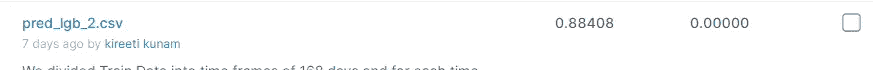

kaggle 领导委员会提交

*   我们可以多重组合模型 ex:逻辑回归+线性回归，随机森林(分类)+随机森林(回归)，XGB(分类)+XGB(回归)。

18。特征重要性:

*   现在我们将做一些实验。我们先从 [**特征重要性**](https://en.wikipedia.org/wiki/Feature_selection) 说起。
*   在这里我们将看到哪些功能是真正有用的。，所以我们将只使用那些特征，这样我们可以减少数据的维数和计算时间。
*   所以对于这一点我们使用的是' [**【递归特征消除】'**](https://www.scikit-yb.org/en/latest/api/model_selection/rfecv.html) **。**

[***递归特征消除***](https://www.scikit-yb.org/en/latest/api/model_selection/rfecv.html)***:***

*   递归特征消除的思想类似于反向特征选择。
*   首先，我们需要指定基本模型(这里基本模型必须返回特性的重要性)。因此算法首先在数据集的所有特征上训练模型。
*   现在它将考虑所有特征的特征重要性。现在，通过移除最不重要的特征，它将在新的特征集上重新训练模型。，因此该操作将针对不同的特征集迭代运行。
*   最后选择那些特征中准确率最高的特征集作为最终特征。

```
# Define Light-GBM Regressor model as our base model:estimator = lgb.LGBMRegressor(objective = "regression",metric= "rmse",max_leaves=128,num_leaves = 8,min_child_samples = 20 , learning_rate = 0.015,subsample = 0.9,colsample_bytree =1,bagging_frequency = 1,n_estimators = 100, reg_alpha = 1,reg_lambda = 0,boosting_type = "gbdt")rfecv = RFECV(estimator, step=1) # here step denotes at a time how many features do you want to drop.%time rfecv.fit(train_df.drop(target_columns, axis=1)[train_df['is_returned']==1], train_df['revenue'][train_df['is_returned']==1])
```

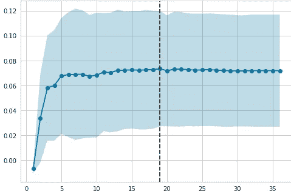

特征重要性

```
print('Optimal number of features: {}'.format(rfecv.n_features_))Optimal number of features: 19
```

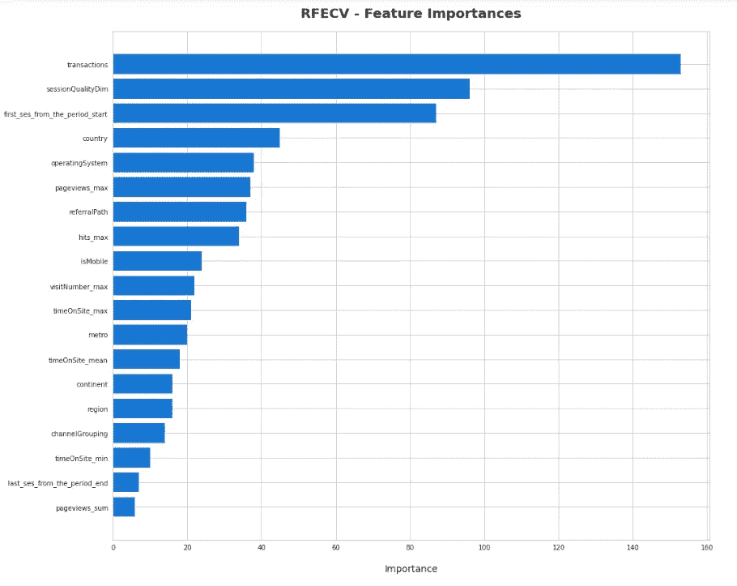

特征重要性

*   现在，我们可以构建与之前构建的模型相同的模型。我试了一下，结果没有明显的改善，但是我观察到最终模型的性能有轻微的变化。

19。用 bagging 尝试集合模型:

*   **集成学习**通过组合几个模型**帮助提高机器学习结果。集成**方法是将几种机器学习技术结合到一个预测模型中以减少方差的元算法( [**Bagging**](https://en.wikipedia.org/wiki/Bootstrap_aggregating) )
*   **装袋:**又称助推捆绑式聚集。在这里，我们将采取样品替换。在我们的集成架构中，我们将把数据的子集传递给每个模型，而不是把整个数据传递给每个模型。这里，通过从整个训练数据中抽取样本(替换)来形成子集。因此，通过使用这种技术，我们可以减少模型中的差异。
*   这是我的整体架构:

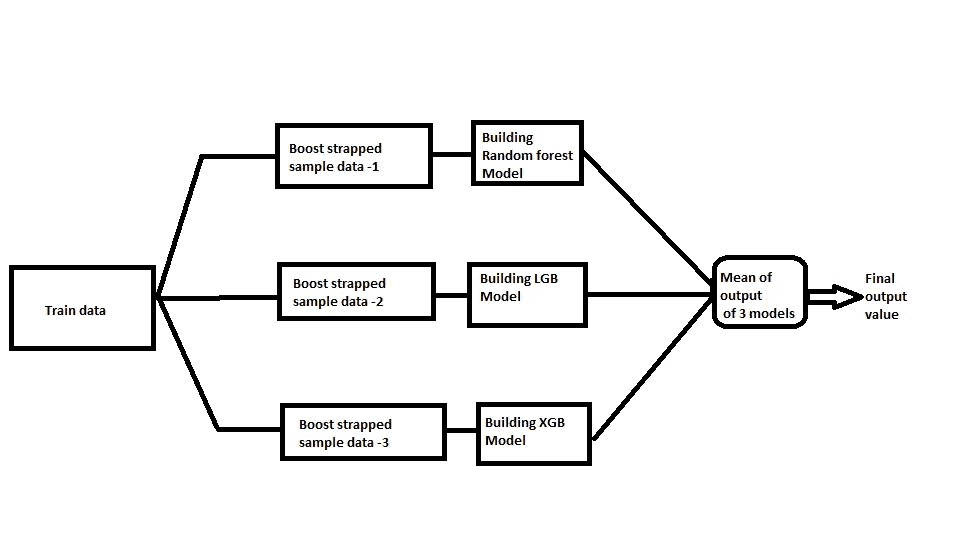

集合模型

*   这里我没有使用分类模型。我只用回归模型来预测用户的收入。

**注意:这里我只使用了 3 个模型，但在现实世界中，人们会使用 100 个基础模型来改善结果。**

这是我用系综法得出的结果:

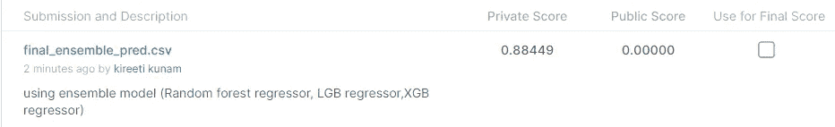

集合模型结果

**20。** **未来工作:**

*深度学习模型:*

*   我们可以尝试具有 conv1D 层和 max- pool 层的各种 cnn 模型架构，并且我们可以尝试 LSTM 模型(因为给定的数据随时间变化，所以我们知道对于时间序列问题，LSTM 模型将做得很好)。
*   在描述部分，你可以找到我的 GitHub 简介，在那里你可以找到整个项目和未来工作的代码。

**21。简介:**

[](https://github.com/kireeti-kunam) [## 基里提-库纳姆-概述

### 在 tcs 工作了快 2 年。目前在寻找机器学习方面的机会。帮我接通…

github.com](https://github.com/kireeti-kunam) [](https://www.linkedin.com/in/kireeti-kunam/) [## 印度特伦甘纳邦 kireeti Kunam-Hyderabad |职业简介| LinkedIn

### 查看 Kireeti Kunam 在 LinkedIn(全球最大的职业社区)上的个人资料。Kireeti 有一个工作列在他们的…

www.linkedin.com](https://www.linkedin.com/in/kireeti-kunam/) 

**22。参考文献:**

*   [https://www . ka ggle . com/c/ga-customer-revenue-prediction/data](https://www.kaggle.com/c/ga-customer-revenue-prediction/data)
*   [https://support.google.com/analytics/answer/3437719?hl=en](https://support.google.com/analytics/answer/3437719?hl=en)
*   [https://seananderson.ca/2014/05/18/gamma-hurdle/](https://seananderson.ca/2014/05/18/gamma-hurdle/)
*   [https://sci kit-learn . org/stable/modules/generated/sk learn . preprocessing . label encoder . html](https://scikit-learn.org/stable/modules/generated/sklearn.preprocessing.LabelEncoder.html)
*   [https://www . ka ggle . com/c/ga-customer-revenue-prediction/discussion/82614](https://www.kaggle.com/c/ga-customer-revenue-prediction/discussion/82614)
*   [https://www.kaggle.com/kostoglot/winning-solution](https://www.kaggle.com/kostoglot/winning-solution)
*   [https://www . sci kit-Yb . org/en/latest/API/model _ selection/RF ecv . html](https://www.scikit-yb.org/en/latest/api/model_selection/rfecv.html)
*   https://en.wikipedia.org/wiki/Bootstrap_aggregating