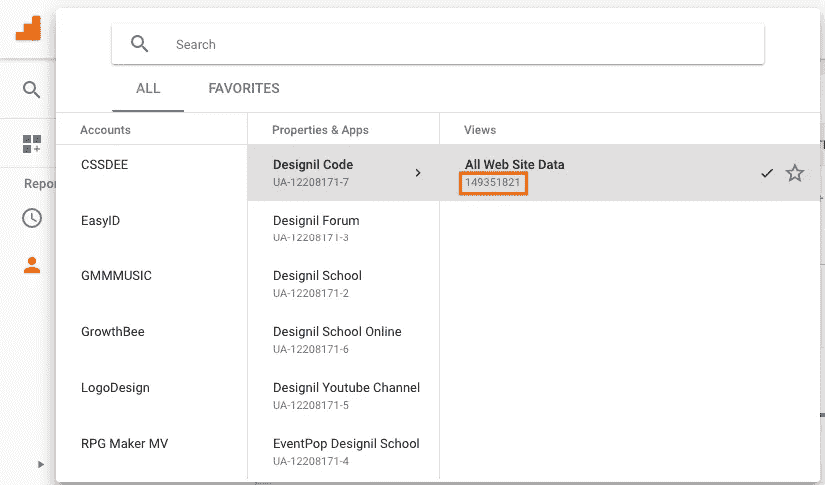
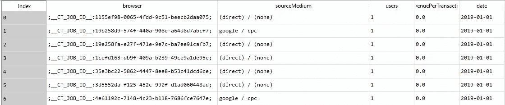
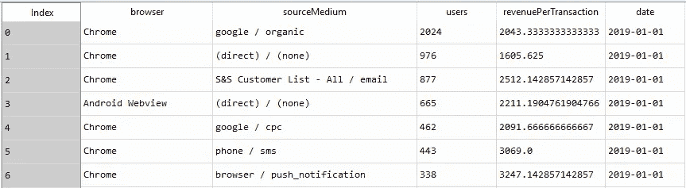
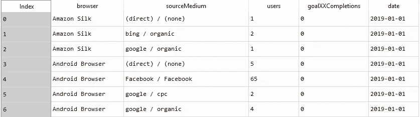
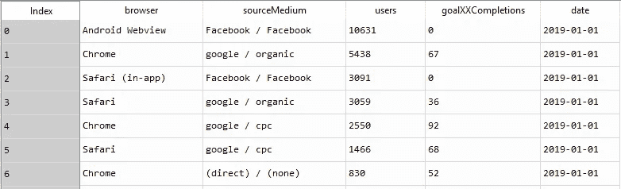

# 使用 Python 中的 API 提取 Google Analytics 数据

> 原文：<https://medium.com/analytics-vidhya/google-analytics-data-extraction-using-api-in-r-and-python-e0e5dcc5be88?source=collection_archive---------2----------------------->


[***视频链接演示如何使用 Python 提取谷歌分析数据***](https://rb.gy/x52cle)

如今，数据科学家和数据分析师使用的一种通用语言是“Python”和“R ”,这两种语言用于转换可用数据，以获得关于扩展业务的宝贵见解。Google Analytics 是数字营销领域用于查看报告的主要资源之一，但是，如果您需要深度分析(机器学习、深度学习、时间序列模型等。)R 或 Python 可以用来提取 Google Analytics 中的数据

今天我将讲述通过 Python 中的 API 从 Google Analytics 中提取数据的步骤。

第一步是在 google 开发者控制台中创建一个项目，获取**客户端 id** 、**客户端机密**，并启用 **Google 分析报告 API** 和**分析 API** 。

*演示如何创建项目的视频链接* ( [在开发人员控制台](https://youtu.be/533nliQZWEg)中创建项目)

获得客户端 id 和客户端密码后的下一步是身份验证。这一步包括从有权访问谷歌分析账户的 gmail 账户获得许可。此后，谷歌将提供一个独特的刷新令牌。使用唯一的刷新令牌，可以获得属于 gmail 帐户的 Google analytics 数据。

*导入以下库*

```
from oauth2client.client import OAuth2WebServerFlow
from oauth2client.tools import run_flow
from oauth2client.file import Storage
import json
import os
import re
import httplib2 
from oauth2client import GOOGLE_REVOKE_URI, GOOGLE_TOKEN_URI, client
import requests
import pandas as pd
```

*以下函数用于检查目录*中是否存在该文件

```
'''function check whether file exist in the path or not'''

def where_json(file_name):return os.path.exists(file_name)
```

*以下函数用于获取刷新令牌*

```
''' function return the refresh token '''

def get_refresh_token(client_id,client_secret):
    CLIENT_ID = client_id
    CLIENT_SECRET = client_secret
    SCOPE = 'https://www.googleapis.com/auth/analytics.readonly'
    REDIRECT_URI = 'http:localhost:8080'

    flow = OAuth2WebServerFlow(client_id=CLIENT_ID,client_secret=CLIENT_SECRET,scope=SCOPE,redirect_uri=REDIRECT_URI)
    if where_json('credential.json')==False:
       storage = Storage('credential.json') 
       credentials = run_flow(flow, storage)
       refresh_token=credentials.refresh_token

    elif where_json('credential.json')==True:
       with open('credential.json') as json_file:  
           data         = json.load(json_file)
       refresh_token=data['refresh_token']

    return(refresh_token)
```

执行上述函数后，我们可以通过调用以下代码来获得刷新令牌。这里我们使用客户机 id 和客户机秘密，它们是在创建时从项目中获得的

```
client_id = 'XXXXXXXXXXXXXXXXXXXXXXXXXXXXXXXXXXXXXXXXXXXX'
client_secret = 'XXXXXXXXXXXXXX'refresh_token=get_refresh_token(client_id,client_secret)
```

现在我们有了访问 google analytics 数据的刷新令牌。然而，要访问这些数据，我们还需要一个参数，即特定 google analytics 帐户的视图 id。



现在我们有了客户机 id、客户机密码、刷新令牌和视图 id。谷歌分析数据可以通过使用以下函数获得

```
''' function return the google analytics data for given dimension, metrics, start data, end data access token, type,goal number, condition'''

def google_analytics_reporting_api_data_extraction(viewID,dim,met,start_date,end_date,refresh_token,transaction_type,goal_number,condition):

    viewID=viewID;dim=dim;met=met;start_date=start_date;end_date=end_date;refresh_token=refresh_token;transaction_type=transaction_type;condition=condition
    goal_number=goal_number
    viewID="".join(['ga%3A',viewID])

    if transaction_type=="Goal":
        met1="%2C".join([re.sub(":","%3A",i) for i in met]).replace("XX",str(goal_number))
    elif transaction_type=="Transaction":
        met1="%2C".join([re.sub(":","%3A",i) for i in met])

    dim1="%2C".join([re.sub(":","%3A",i) for i in dim])

    if where_json('credential.json')==True:
       with open('credential.json') as json_file:  
           storage_data = json.load(json_file)

       client_id=storage_data['client_id']
       client_secret=storage_data['client_secret']
       credentials = client.OAuth2Credentials(
                access_token=None, client_id=client_id, client_secret=client_secret, refresh_token=refresh_token,
                token_expiry=3600,token_uri=GOOGLE_TOKEN_URI,user_agent='my-user-agent/1.0',revoke_uri=GOOGLE_REVOKE_URI)

       credentials.refresh(httplib2.Http())
       rt=(json.loads(credentials.to_json()))['access_token']

       api_url="https://www.googleapis.com/analytics/v3/data/ga?ids="

       url="".join([api_url,viewID,'&start-date=',start_date,'&end-date=',end_date,'&metrics=',met1,'&dimensions=',dim1,'&max-results=1000000',condition,'&access_token=',rt])

       data=pd.DataFrame()

       try:
         r = requests.get(url)

         try:
            data=pd.DataFrame(list((r.json())['rows']),columns=[re.sub("ga:","",i) for i in dim+met])
            data['date']=start_date
            print("data extraction is successfully completed")

            return data
         except:
            print((r.json()))
       except:
         print((r.json()))
         print("error occured in the google analytics reporting api data extraction")
```

现在我们有了提取数据的所有参数。这里我们需要记住，在传递维度(dim)和度量(met)时，你必须将它们作为一个列表来传递。

有两个事务类型值，即事务或目标。如果交易类型为交易，则目标编号为“”(空白引号)。如果交易类型是目标，则目标编号是一个数值(例如:1，2，3，…，20)。因此，该条件按度量排序[例如: *& sort=-ga%3Ausers(按用户降序排序)，& sort=-ga%3Ausers(按用户升序排序)，等等]*

*   场景 1:当交易类型为“交易”且无条件时

```
viewID='XXXXXXXX'
dim=['ga:browser','ga:sourceMedium']
met=['ga:users','ga:revenuePerTransaction']
start_date='2019-01-01'
end_date='2019-01-10'
transaction_type='Transaction'
goal_number=''
refresh_token=refresh_token
condition=''

data=google_analytics_reporting_api_data_extraction(viewID,dim,met,start_date,end_date,refresh_token,transaction_type,goal_number,condition)
```

输出如下所示



*   场景 2:当交易类型为“交易”且有条件时

```
viewID='XXXXXXXX'
dim=['ga:browser','ga:sourceMedium']
met=['ga:users','ga:revenuePerTransaction']
start_date='2019-01-01'
end_date='2019-01-10'
transaction_type='Transaction'
goal_number=''
refresh_token=refresh_token
condition='&sort=-ga%3Ausers' *# sort the data set by users in descending order*

data=google_analytics_reporting_api_data_extraction(viewID,dim,met,start_date,end_date,refresh_token,transaction_type,goal_number,condition)
```

输出如下所示



*   场景 3:当交易类型为“目标”且无条件时

如果您已经在 google analytics 帐户中设置了目标，您可以访问。

```
viewID='XXXXXXXX'
dim=['ga:browser','ga:sourceMedium']
met=['ga:users','ga:goalXXCompletions']
start_date='2019-01-01'
end_date='2019-01-10'
transaction_type='Goal'
goal_number=''
refresh_token=refresh_token
condition=''

data=google_analytics_reporting_api_data_extraction(viewID,dim,met,start_date,end_date,refresh_token,transaction_type,goal_number,condition)
```

输出如下所示



*   场景 4:当交易类型为“目标”且有条件时

```
viewID='XXXXXXXX'
dim=['ga:browser','ga:sourceMedium']
met=['ga:users','ga:goalXXCompletions']
start_date='2019-01-01'
end_date='2019-01-10'
transaction_type='Goal'
goal_number='1'
refresh_token=refresh_token
condition='&sort=-ga%3Ausers' 
*# sort the data set by users in descending order*

data=google_analytics_reporting_api_data_extraction(viewID,dim,met,start_date,end_date,refresh_token,transaction_type,goal_number,condition)
```

输出将如下



请点击链接浏览通过谷歌分析提取数据的指南。[如何用 Python 提取谷歌分析数据](https://www.youtube.com/watch?v=UVxkn8Ynbbs)