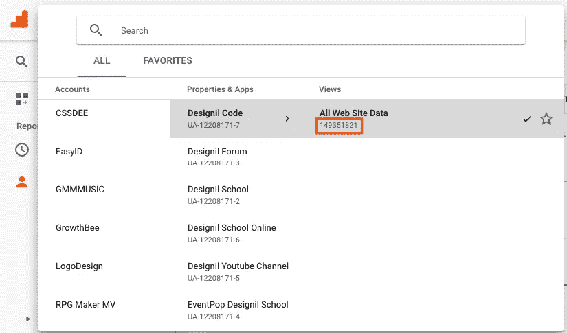
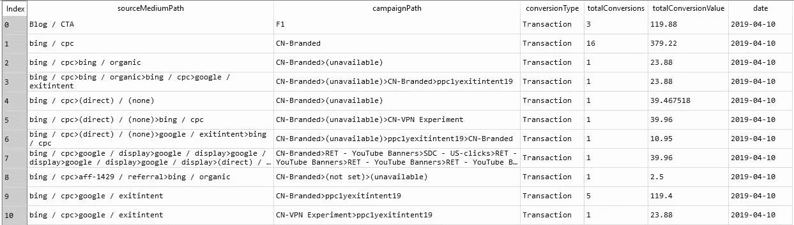
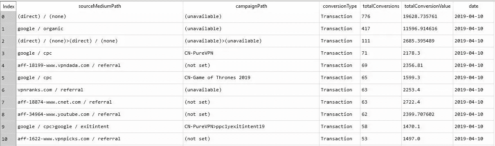
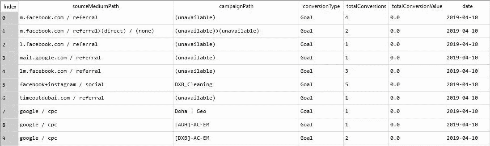
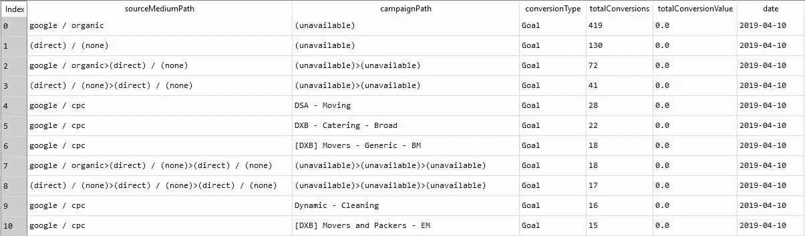

# 使用 Python 中的 API 进行 Google Analytics 多渠道漏斗数据提取

> 原文：<https://medium.com/analytics-vidhya/google-analytics-multi-channel-funnel-data-extraction-using-api-in-python-bb8ed137b39f?source=collection_archive---------8----------------------->


在上一篇文章中，我在[上解释了如何使用 python](https://www.linkedin.com/pulse/google-analytics-data-extraction-using-api-inpython-sheranga-gamwasam/) 提取谷歌分析数据，因为谷歌分析被数字营销人员、数据分析师和数字分析师用来通过查看报告来获得一些洞察力，从而发展他们的业务。

谷歌分析标准报告是基于最后一个 cookie 的基础上，这意味着他们给信贷的最后一个渠道，用户已经转换。但是一个典型的网站访问者在转化之前会经历多种渠道(有机的、付费搜索、社交媒体、横幅广告等)。因此，要查看网站访问者的旅程，我们使用多渠道漏斗报告。

今天，我将讲述通过 Python 中的 API 从多渠道漏斗中提取数据的步骤。

第一步是在谷歌开发者控制台中创建一个项目，获取**客户端 id、客户端机密**，并启用**谷歌分析报告 API** 和**分析 API** 。

*演示如何创建项目的视频链接* ( [在开发人员控制台](https://youtu.be/533nliQZWEg)中创建项目)

获得客户端 id 和客户端密码后的下一步是身份验证。这一步包括从有权访问谷歌分析账户的 gmail 账户获得许可。此后，谷歌将提供一个独特的刷新令牌。使用唯一的刷新令牌，可以获得属于 gmail 帐户的 Google analytics 数据。

*导入以下库*

```
from oauth2client.client import OAuth2WebServerFlow
from oauth2client.tools import run_flow
from oauth2client.file import Storage
import json
import os
import re
import httplib2 
from oauth2client import GOOGLE_REVOKE_URI, GOOGLE_TOKEN_URI, client
import requests
import pandas as pd
```

*以下函数用于检查目录*中是否存在该文件

```
'''function check whether file exist in the path or not'''

def where_json(file_name):return os.path.exists(file_name)
```

*以下函数用于获取刷新令牌*

```
''' function return the refresh token '''

def get_refresh_token(client_id,client_secret):
    CLIENT_ID = client_id
    CLIENT_SECRET = client_secret
    SCOPE = 'https://www.googleapis.com/auth/analytics.readonly'
    REDIRECT_URI = 'http:localhost:8080'

    flow = OAuth2WebServerFlow(client_id=CLIENT_ID,client_secret=CLIENT_SECRET,scope=SCOPE,redirect_uri=REDIRECT_URI)
    if where_json('credential.json')==False:
       storage = Storage('credential.json') 
       credentials = run_flow(flow, storage)
       refresh_token=credentials.refresh_token

    elif where_json('credential.json')==True:
       with open('credential.json') as json_file:  
           refresh_token=json.load(json_file)['refresh_token']

    return(refresh_token)
```

执行上述函数后，我们可以通过调用以下代码来获得刷新令牌。这里我们使用客户机 id 和客户机秘密，它们是在创建时从项目中获得的

```
client_id = 'XXXXXXXXXXXXXXXXXXXXXXXXXXXXXXXXXXXXXXXXXXXX'
client_secret = 'XXXXXXXXXXXXXX'
refresh_token=get_refresh_token(client_id,client_secret)
```

现在我们有了访问 google analytics 数据的刷新令牌。然而，要访问这些数据，我们还需要一个参数，即特定 google analytics 帐户的视图 id。



现在我们有了客户机 id、客户机密码、刷新令牌和视图 id。通过使用下面给出的函数，可以获得多通道漏斗数据

```
''' function return the multi channel data for given dimension, metrics, start data, end data access token, transaction_type, condition'''

def google_analytics_multi_channel_funnel_reporting_api_data_extraction(
viewID,dim,met,start_date,end_date,refresh_token,transaction_type,condition):

    metric="%2C".join([re.sub(":","%3A",i) for i in met])
    dimension="%2C".join([re.sub(":","%3A",i) for i in dim])

    dimension=dimension+"&filters=mcf%3AconversionType%3D%3D"+transaction_type+"&samplingLevel=HIGHER_PRECISION&max-results=8000"

    if where_json('credential.json')==True:
        with open('credential.json') as json_file:  
            storage_data = json.load(json_file)

        client_id=storage_data['client_id']
        client_secret=storage_data['client_secret']
        credentials = client.OAuth2Credentials(
                access_token=None, client_id=client_id, client_secret=client_secret, refresh_token=refresh_token,
                token_expiry=3600,token_uri=GOOGLE_TOKEN_URI,user_agent='my-user-agent/1.0',revoke_uri=GOOGLE_REVOKE_URI)

        credentials.refresh(httplib2.Http())
        rt=(json.loads(credentials.to_json()))['access_token']

        api_url="https://www.googleapis.com/analytics/v3/data/mcf?access_token="

        url="".join([api_url,rt,'&ids=ga:',viewID,'&start-date=',start_date,'&end-date=',end_date,'&metrics=',metric,'&dimensions=',dimension,condition])

        try:
            r = requests.get(url)
            try:
                data=pd.DataFrame(list((r.json())['rows']))
                print("data extraction is successfully completed")

                table=pd.DataFrame()
                if data.shape[0]!=0:
                    for i in range(0,data.shape[0]):

                        #print(i)
                        data1=pd.DataFrame()
                        data1=(data.iloc[i,:]).tolist()

                        for k in range(0,len(data1)):
                            if 'conversionPathValue' in data1[k]:
                                value_list=[]
                                for k1 in range(0,len(data1[k]['conversionPathValue'])):
                                    value_list.append(data1[k]['conversionPathValue'][k1]['nodeValue'])
                                table.loc[i,k]=('>').join(value_list)
                            elif 'primitiveValue' in data1[k]:
                                table.loc[i,k]=data1[k]['primitiveValue']

                    if table.shape[0]!=0:   

                        table.columns=[re.sub("mcf:","",i) for i in dim+met]
                        table['date']=start_date
                        return(table) 

            except:
                print(r.json())

        except:
            print(r.json())
```

现在我们有了提取数据的所有参数。这里我们需要记住，在传递维度(dim)和度量(met)时，你必须将它们作为一个列表来传递。

有两个事务类型值，即事务或目标。因此，该条件按度量排序[例如:& sort =-mcf % 3a total conversions*(按* totalConversions *降序排序)，*&sort = mcf % 3a total conversions*(按* totalConversions *升序排序)，等等]*

*   场景 1:当交易类型为“交易”且无条件时

```
viewID='XXXXXXXX'
dim=['mcf:sourceMediumPath','mcf:campaignPath','mcf:conversionType']
met=['mcf:totalConversions', 'mcf:totalConversionValue']
start_date='2019-04-10'
end_date='2019-04-20'
transaction_type='Transaction'
refresh_token=refresh_token
condition=''

data=google_analytics_multi_channel_funnel_reporting_api_data_extraction(viewID,dim,met,start_date,end_date,refresh_token,transaction_type,condition)
```

输出如下所示



*   场景 2:当交易类型为“交易”且有条件时

```
viewID='XXXXXXXX'
dim=['mcf:sourceMediumPath','mcf:campaignPath','mcf:conversionType']
met=['mcf:totalConversions', 'mcf:totalConversionValue']
start_date='2019-04-10'
end_date='2019-04-20'
transaction_type='Transaction'
refresh_token=refresh_token
condition='&sort=-mcf%3AtotalConversions'

data=google_analytics_multi_channel_funnel_reporting_api_data_extraction(viewID,dim,met,start_date,end_date,refresh_token,transaction_type,condition)
```

输出如下所示



*   场景 3:当交易类型为“目标”且无条件时

如果您已经在 google analytics 帐户中设置了目标，您可以访问。

```
viewID='XXXXXXXX'
dim=['mcf:sourceMediumPath','mcf:campaignPath','mcf:conversionType']
met=['mcf:totalConversions', 'mcf:totalConversionValue']
start_date='2019-04-10'
end_date='2019-04-20'
transaction_type='Goal'
refresh_token=refresh_token
condition=''

data=google_analytics_multi_channel_funnel_reporting_api_data_extraction(viewID,dim,met,start_date,end_date,refresh_token,transaction_type,condition)
```

输出如下所示



*   场景 4:当交易类型为“目标”且有条件时

```
viewID='XXXXXXXX'
dim=['mcf:sourceMediumPath','mcf:campaignPath','mcf:conversionType']
met=['mcf:totalConversions', 'mcf:totalConversionValue']
start_date='2019-04-10'
end_date='2019-04-20'
transaction_type='Goal'
refresh_token=refresh_token
condition='&sort=-mcf%3AtotalConversions'

data=google_analytics_multi_channel_funnel_reporting_api_data_extraction(viewID,dim,met,start_date,end_date,refresh_token,transaction_type,condition)
```

输出如下所示

