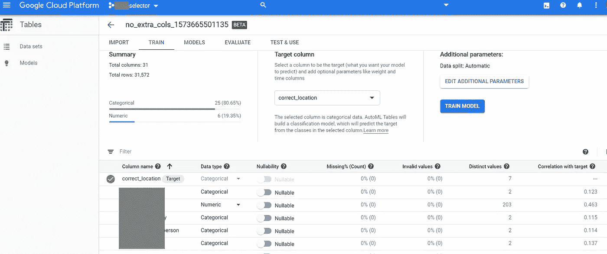
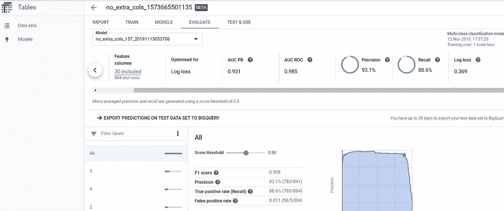
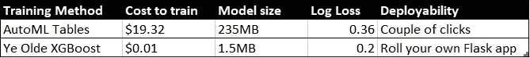

# Google AutoML 表格 vs XGBoost

> 原文：<https://medium.com/analytics-vidhya/google-automl-tables-a-first-taste-f25b3728e1a7?source=collection_archive---------11----------------------->

谷歌是典型的机器学习公司。作为一家年轻而饥渴的初创公司，他们首先使用“统计建模”来纠正搜索词的拼写，而且他们从未回头。这些天，他们甚至使用机器学习来发明新的机器学习，机械化新的深度神经网络拓扑结构的发明，在准确性方面达到最先进的结果，同时经常*减少*总模型大小。如果你曾经训练过任何深度神经网络，你很可能使用过谷歌的 Tensorflow 框架——这对广告公司来说还不错！

所以，当机器学习领域的一个传奇力量宣布一个新产品——AutoML——这不是一个关于*我是否会尝试的问题，而是什么时候的问题。当我的团队在我们为一个非营利组织开发的基于机器学习的微服务上达到我们的“功能完整”里程碑时，我的第一个机会来了。*

该项目的训练集是结构化的或者表格化的数据——类似于数据库中以表格形式存储的那种数据。由于我已经有了使用训练有效模型的代码，这是一个比较“传统”(来自开源库的使用网格搜索调优的模型)和“前沿”(Google 的 AutoML 表[)的绝佳机会。](https://cloud.google.com/automl-tables/)

开始非常简单——只需将我的数据的 CSV 文件上传到 Google Cloud bucket，AutoML Tables 有 UI 支持，保持工作流程简单。

新导入的数据在 AutoML 表中汇总

数据导入流畅而准确，数字和类别列被自动处理。我所要做的就是选择目标列(“correct_location”)，然后我就可以点击诱人的蓝色“火车模型”按钮了。如果你已经在使用 GCP，数据导入会更容易。

模型培训以 1 小时为增量，在撰写本文时，[每小时花费 19.32 美元](https://cloud.google.com/automl-tables/) —这是为 92 个虚拟机(n1-standard-4)的集群支付的费用，这些虚拟机将合作一个小时以获得可能的最佳结果。

训练结果—精确度不错，AUC 看起来可用

一个小时后，我的模型准备好了，一个非常像样的仪表板上满是好消息——可接受的 F1 分数、AUC、log loss。该模型本身的大小为相对较大的 235MB。

当我的 92 节点集群在进行 Google-Fu 时，我还租用了一个小型虚拟机来运行我们传统的手工制作的非贝叶斯优化训练代码——一台 n1-standard-1 机器，它是一个 Haswell 内核，内存不到 4GB，每小时租金仅为 0.04 美元。我们的代码加载了相同的 CSV，然后运行网格搜索，我们的强力超参数调整，训练 108 [XGBoost](https://xgboost.readthedocs.io/en/latest/) 模型(强烈建议将梯度提升树用于结构化或表格数据)。我们的单核 minnow 在大约 15 分钟内完成了工作，比集群提前了 45 分钟到达终点，并且只花费了我们 0.01 美元的计算成本。完成的模型大小约为 1.3MB，对数损失分数约为 0.2，明显优于 AutoML 表结果 0.36(对于对数损失，分数越大越差，表明分类概率越不准确)。

Google AutoML 表格与 XGBoost +网格搜索

当然，训练一个模型没有多大用处，除非您部署它。AutoML 表在这一领域大放异彩——只需点击几下，您就可以批量处理来自 Google Bucket 的数据，或者将您的模型部署为 REST 服务。这和我们手工制作的人工编制的 Flask 应用程序之间肯定有很大的不同。

对于机器学习工程来说，这是一个激动人心的时刻。对于我们的特定客户，云部署不是我们将部署的地方，但看到我们可以如此轻松地完成这一点令人振奋。然而，AutoML 表，至少对于这个数据集来说，在模型质量、模型大小和时间序列方面肯定令人失望，所有这些都明显比我们的基本基线差。